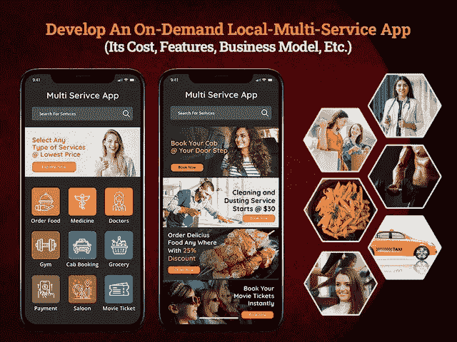
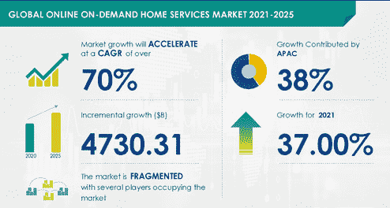

# 创建一个本地多服务应用程序需要多少成本

> 原文：<https://javascript.plainenglish.io/how-much-does-it-cost-to-create-a-local-multi-services-app-e1299497775d?source=collection_archive---------7----------------------->

## **开发按需本地多服务应用程序:其成本、功能、商业模式和市场范围**

你是那些没有受到数字化影响的企业家之一吗？你是那些用实体企业管理多种服务的企业家之一吗？如果是的话，你就错过了太多的潜在商业机会，因为你没有一个多服务的移动应用程序。

通过为每个服务创建单独的应用程序来处理多个服务对于企业来说始终是一种具有挑战性的方法。这就是按需超级服务应用程序占据中心舞台的地方，它为您提供了一种智能的方式来处理一个屋檐下的多种服务。如果你从未想象过在一个应用程序中提供多种服务，如出租车预订、食品订购、药房、汽车清洗等，那么这个博客就是为你准备的。

像 Gojek 这样的超级服务应用程序已经在市场上引入了这一概念，并见证了暴涨的成功。他们的成功故事激发了商业爱好者的想法，即推出一款应用程序，提供多种服务，并通过单一解决方案满足人们的各种需求。像 Gojek 这样的应用程序已经脱颖而出，成为对用户和投资者最友好的应用程序创意，只需点击一下就可以提供一系列服务。

随着各个商业垂直领域对数字化的宣传越来越多，我相信你一定想过创建一个移动应用程序。尽管如此，你确实处于一个两难的境地:创建一个本地多服务商业应用需要多少成本…

计算构建应用程序的成本无疑是一项具有挑战性的任务，因为几个因素会影响应用程序开发的每个阶段。但是为了方便您的工作，我们准备了一份全面的指南，通过考虑这一应用概念的每一个细节，帮助您计算应用开发的总成本。

**博客重点:**

*   *为什么企业家希望开发像 Gojek 这样的多服务应用？*
*   *市场统计说明递进经营范围*
*   *如何在按需多服务市场取得成功？*
*   *做一个 Gojek 这样的本地多服务 App 的成功口头禅？*
*   *多服务应用理念将如何让您的企业受益？*
*   *开发 Grab 这样的本地超级服务 App 的好处？*
*   *在单个应用程序中提供 63 种以上的服务(您可以在多服务应用程序中包含的服务/类别)*
*   *如何将您的多服务应用解决方案货币化？*
*   *多服务应用的潜在盈利策略*
*   *你的多服务应用需要具备哪些特性和功能？*
*   *创建一个像 Gojek 这样的多服务 App 需要多少成本？*
*   *结论:与市场领导者一起做好准备！*

> 让我们深入了解每一点的细节，以便深入理解…

## **为什么企业家希望开发像 Gojek 这样的多服务应用程序？**

随着被称为按需服务的趋势在全世界迅速流行，传统的商业机构正在迅速关闭。根据统计数据，按需经济带来了意想不到的收入增长，并成功地改变了企业为人们服务的方式。在你直接去雇佣一家 [**移动应用开发公司**](https://www.xicom.biz/services/mobile-app-development/) 之前，你需要了解按需经济是如何快速改变事物的。事实上，随着客户心理的变化，按需经济已经成为美国最有前途的未来。

> 你不需要相信我们的话。下面是统计数据:

*   调查报告显示，8650 万成年美国人使用过按需服务。
*   51%的美国人同意按需服务改善了他们的金融服务这一事实。
*   在 2021 年至 2025 年期间，按需服务市场有望以 70%的 CAGR 增长[47303.1 亿美元。](https://www.researchandmarkets.com/reports/4871415/global-online-on-demand-home-services-market-2021)
*   根据调查报告，按需经济每年吸引超过 2240 万消费者和 576 亿美元的支出。
*   1630 万消费者在易贝和 Etsy 等电子商务应用上花费了近 360 亿美元。
*   每月有 730 万消费者在优步、Lyft 等交通应用上花费 56 亿美元。
*   550 万客户每年在 Instacart 等食品配送应用上花费近 46 亿美元。
*   81 亿客户在各种服务上消费，如健康、美容、自由职业服务等，创造了 38 亿美元的收入。

[Image Source](https://www.prnewswire.com/news-releases/global-online-on-demand-home-services-market-to-witness-over--4-730-billion-growth-during-2021-2025--technavio-301307207.html)

这些来自各种可信来源的关键数据清楚地表明了对按需服务的需求在不断增长。因此，为你的业务雇佣一个按需移动 [**应用程序开发公司**](https://www.xicom.biz/services/mobile-app-development/) 的需求是不可避免的，你越早意识到这一点，对你的业务越有利。因此，如果你有足够的信心创建一个移动应用程序，但不确定如何在竞争激烈的市场中取得成功，那么你需要阅读下面的内容。

## **如何在欣欣向荣的点播 App 服务市场取得成功？**

将所有的按需服务组合在一个应用程序中总是一个压倒性的决定，但同时，它也提高了应用程序开发复杂性的门槛。因此，如果你真的对 Grab 或 Gojek 这样的多功能应用程序印象深刻，并想知道到底是什么让它像一台运转良好的机器一样工作，那么在创建 Gojek 这样的超级服务应用程序时，你也需要记住一些事情…

> 以下是 Gojek 取得成功的重要因素:

*   **市场调查:**按需服务的需求逐年上升。每个点播应用类别都在以自己的速度扩大规模。但是你怎么知道哪一类应用值得包含在你的应用中呢？

*深入的市场调查是你问题的完美答案！*

根据您的地理位置，您可以确定需要哪些服务。您可以搜索竞争对手，分析他们的商业见解，并创建一个应用程序来帮助您的移动应用程序增加优势。

*   **实现正确的功能:**如果你曾经使用过 Gojek，你一定熟悉它的用户友好的导航。在单个应用程序中管理 63 个以上的服务时，重要的是要有一个完善的系统来正确地组织您的服务。确保你在页面之间的导航清晰、简单、容易。

克服这些挑战的简单方法是 [**雇用一名移动应用程序开发人员**](https://www.xicom.biz/offerings/hire-mobile-developers/) ，他在行业领域拥有丰富的知识和专业技能，能够帮助您创建一个产生更好收入的解决方案。但问题是它将如何使您的业务受益…

## **开发像 Gojek 这样的多服务应用程序会给你的企业带来什么好处？**

还在想推出多服务应用对你的企业来说是否是一个有价值的决定？它会帮助你成为蓬勃发展的按需移动应用程序开发行业的一员吗？

当然啦！

***它将如何帮助你的业务:***

*   **节省成本和时间的解决方案**

平均而言，一个智能手机用户一个月会访问 30 到 40 个关于送餐、交通、汽车服务等的应用。想象一下，访问一个应用程序获得所有解决方案将是多么简单、容易和省时？多服务应用程序开发解决方案不会帮你节省开发单个应用程序的数千美元，但也会让用户免于为多种服务使用不同的应用程序。你所需要的只是维护一个应用程序代码！

*   **增加创收**

一个多服务应用程序将拥有更多的受众，尽管这意味着你将有更好的机会产生高收入和利润。你会惊讶地发现，像 Gojek 这样受欢迎的多服务应用程序已经以 110 亿美元的收入突破了 1.08 亿次应用程序下载。

*   **更高的用户留存率**

开发一个随需应变的多服务应用程序将允许你立即提供定制的和可扩展的服务，尽管用户更喜欢重复使用你的应用程序。

*   **高效管理你的日常任务**

处理和管理不同应用程序中的操作是一个可怕的挑战。但是，拥有一个提供 63 种以上服务的动态应用仪表板，将使您更加轻松地管理和维护运营。您可以毫不费力地应对渴望获得不同服务的大量客户。

*在阅读了推出多服务应用程序的所有这些有利可图的好处后，你们中的许多人陷入了两难境地。你的应用可以包含哪些服务/类别？*

# ***您可以在多服务应用中包含的服务类型和类别***

多服务应用程序在不同的细分市场下运行，因此推出这款选择正确服务的应用程序将会在市场上大受欢迎。

> **运输服务**

*   乘车预订
*   拼车；共乘；共享出行
*   拿起和放下
*   汽车清洗
*   自行车共享
*   燃料输送
*   汽车维修
*   自行车维修

> **餐饮服务**

*   点餐
*   杂货店购物
*   按需配方
*   食品餐饮

> **健康和医疗服务**

*   药物输送
*   远距离医学
*   在线医疗咨询
*   按需医疗交付

> **杂项服务**

*   酒吧管理和预订服务
*   沙龙和美容服务
*   酒水配送服务
*   壁画服务
*   房屋清洁服务

无论你是在你的应用程序中添加 65+服务还是 100+服务，作为一个企业主，你最终关心的是如何将你的商业投资货币化并获得利润。

*让我们了解赚钱的潜在策略……*

# 如何将你的多服务移动应用货币化？

在你开始任何生意之前，最重要的是要有正确的赚钱策略，确保你的投资获得最佳回报。由于超级应用程序由多种服务组成，因此有更好的机会采用各种策略从 Grab 或 Gojek 等多服务应用程序中获利。此外，你可以选择 [**雇佣一名移动应用开发者**](https://www.xicom.biz/offerings/hire-mobile-developers/) ，因为他们会带来最好的商业盈利机会。然而，这里我们列出了一些像 Grab 或 Gojek 这样的行业巨头采用的潜在创收方法。

*   **佣金或交易费用**

多服务应用程序通常与每个服务类别下的不同供应商和品牌合作。你可以从合作品牌的每笔销售中收取一定的交易费，并考虑为业务合作设定一个价格。

*   **认购计划**

由于超级移动应用程序提供多种服务，因此肯定会有经常使用它的用户。在这种情况下，您可以按月、按季度或按年提供订阅计划，并允许客户访问您的应用程序的特殊功能，如 24 小时交付、当天产品交换、特殊会员优惠或折扣等。

*   **应用内广告**

将应用程序中的空间提供给企业用于推广和广告是创收的最佳方式之一。它以两种方式工作，帮助你保持你的用户参与应用程序，并允许其他企业获得一些业务作为回报。

了解了商业盈利策略后，你一定很想知道你的应用需要包含哪些特性和功能才能成功…

*答案来了！*

# **您的多服务应用需要具备哪些特性和功能？**

开发像 Gojeck 或 Grab 这样的多服务应用程序是一项复杂的任务，因为有大量的特性和功能可供选择，使其成为最终的一体化平台。如果你打算 [**雇佣一个应用开发者**](https://www.xicom.biz/solutions/hire-developers/) 来创建一个像 Grab 或 Gojek 这样的应用，那么确保这个应用包含简单、快速和容易的导航。用户界面/UX 设计可以改变游戏规则。以下是创建用户、管理员和驱动程序面板所需的特性和功能…

> **功能创建用户面板**

*   **轻松登录:**允许用户使用电子邮件 ID 或联系方式登录应用程序，开始使用您的应用程序。此外，为了使它更快更容易，你可以让你的用户在社交登录的帮助下连接到应用程序，并允许他们立即访问服务。
*   **浏览服务:**确保用户可以方便地从多服务应用程序上的点播服务池中浏览和选择服务。
*   **多语言支持:**您的应用程序中的多语言功能可以为用户简化和简化事情，并帮助他们以本地语言访问应用程序。
*   **计划交付:**根据用户的方便和要求，增加选择或提及交付日期、时间和地点的灵活性。
*   **推送通知:**通过这些功能，用户可以通过短信不断了解最新优惠、订单确认、送货详情等信息。
*   **查看服务提供商的详细信息:**订单确认后，用户有权查看司机或服务提供商的完整信息。用户可以访问他们的评级、评论、联系方式等等。
*   **实时跟踪:**增加跟踪产品发货状态的选项。你可以考虑雇佣一个移动应用程序开发人员来定制这个功能，并允许用户通过应用程序内的地图集成来访问服务提供商的实时位置。
*   **成本估算:**根据预期的交付估算，有必要提供费用估算，以避免用户在计费结束时感到惊讶。
*   **多种支付方式**:不同用户使用不同的支付方式，如信用卡/借记卡、网上银行、网上转账、内置钱包等。因此，请确保您有一个多支付集成的功能。
*   **忠诚度积分**:每一次购买，您都可以为客户提供可兑换的积分和推荐奖励。这将让你的用户更长时间地使用这款应用。
*   **审查和评级**:允许用户通过使用此功能表达他们的体验、意见并分享对服务的反馈，并对服务提供商进行评级。

> **服务提供商的特点**

*   **司机即时入职:**通过司机或服务提供商的电话号码、电子邮件地址或社交媒体凭证，为他们提供快捷的登录流程，并使其变得超级容易访问。
*   **可用性状态:**应用程序中有一个功能，允许司机和服务提供商标记他们的可用性，并根据请求接收服务。
*   **接受/拒绝订单:**根据产品的可用性，允许服务提供商接受或拒绝订单，并通知用户。
*   **即时通话:**除了应用内聊天，应用内通话功能还将帮助司机或服务提供商快速与客户取得联系，解决他们的顾虑。
*   **应用内导航:**借助谷歌地图、苹果地图等应用内导航集成，司机可以更轻松地优化路线并确保准时交付。
*   **绩效跟踪:**通过应用内的这一功能，服务提供商可以通过访问一天内完成的乘坐次数或一天内处理的订单数等指标来监控他们的整体效率。
*   **银行详情:**这是 app 的一个关键功能，可以想到雇佣一家 [**软件开发公司**](https://www.xicom.biz/) 来定制这个功能，避免在 app 中留下安全漏洞。为了获得佣金的直接存款，允许司机或服务提供商添加或编辑与应用程序关联的银行详细信息。
*   **客户评价和评级:**通过访问司机的反馈和客户给出的评级，对司机的服务进行微调和评级。

> **创建管理面板的功能**

*   **无缝仪表板:**管理员应获得仪表板功能，确保在整个流程中轻松管理多项服务。
*   **管理多重预订:**多重服务应用程序通常会被用户登录和预订的最终数量所淹没。因此，管理员可以快速处理订单和服务请求的最终数量。
*   **订单管理:**通过此功能，管理员可以访问完整的订单详细信息，如付款、交付信息、联系信息等，并确保无缝处理，以确保产品按时交付。
*   **驱动程序管理:**管理员有权通过此功能监控服务提供商及其产品的完整列表。
*   **路线优化:**在您的应用程序中添加此功能，并允许管理员优化最快的路线，并为驾驶员提供一组约束较少的好路线。

这些是基本的特性和功能，你可以选择创建一个像 Gojek 这样的多服务商店应用程序，这将需要大约 4 个多月的时间来开发。但是如果你是在和 Gojek 竞争，建议通过超越基本功能来冲击市场。

# 创建一个像 GoJek 这样的多服务应用程序需要多少成本？

无论你是初创公司还是商业爱好者，你经常关心的问题是创建一个多服务应用程序需要多少成本？然而，用标准开发成本来回答这个问题是相当具有挑战性的，因为有许多因素会影响整体定价和开发时间。

因此，如果你很想知道 [**创建一个多服务应用**](https://www.xicom.biz/services/mobile-app-development/) 的成本是多少，那么你应该知道实际上有助于你理解估算的成本影响因素。

**平台选择:**你决定在哪个操作平台上发布你的应用可能是最重要的成本驱动因素。为 Android 和 iOS 开发一个原生应用程序需要专门的编程语言和团队来创建一个应用程序。如果考虑具有上述功能的基本应用版本，创建一个单独的原生应用的平均成本约为 20，000 美元。然而，如果你计划同时开发两个平台，理想的选择是进行跨平台应用开发，比开发原生应用节省高达 40%的成本。

**应用程序的大小和复杂程度:**通常应用程序的复杂程度由特性和功能的选择决定，分为基本、中等和高级三类。你的功能越复杂，应用开发成本就越高。

**应用程序开发团队:**如果你打算创建一个像 Gojek 一样的成熟的多服务应用程序，那么你需要一个由业务分析师、项目经理、应用程序开发人员、UI/UX 设计人员和应用程序测试人员组成的团队。应用程序开发人员的每小时成本取决于他们的位置，这可能会导致应用程序开发总成本的巨大差异。

如果我们分析所有这些因素，并尝试根据上述功能总结平均成本，创建一个基本应用程序的平均成本将为 20，000 美元，而一个中等至高级版本的应用程序可能需要 25，000 至 35，000 美元。

然而，在你决定之前，建议你预约一次免费的专家咨询，讨论你的项目细节。

# **最终想法**

在这篇博客的结尾，可以有把握地说，在一个屋檐下提供 63+的按需服务将是一个压倒性的决定。但是，如果你想知道定制这种复杂的应用程序结构所需的技术困难和开发专业知识，那么建议你聘请一家 [**移动应用程序开发公司**](https://www.xicom.biz/services/mobile-app-development/) ，它将提供最好的服务，并使你能够以无缝的解决方案打入市场。他们有一个专家团队，在定制解决方案以满足不断变化的市场需求方面经验丰富。因此，他们能够更好地为您提供特性和功能方面的帮助，并确保您获得最佳质量的解决方案。

因此，如果您有任何想法，或者正在寻找一个专家团队来将您的想法实施为一个稳健的解决方案，那么您可以 [**联系我们**](https://www.xicom.biz/contact/) 并获得您的免费评估，或者在下面提出疑问。

*更多内容请看*[***plain English . io***](http://plainenglish.io/)