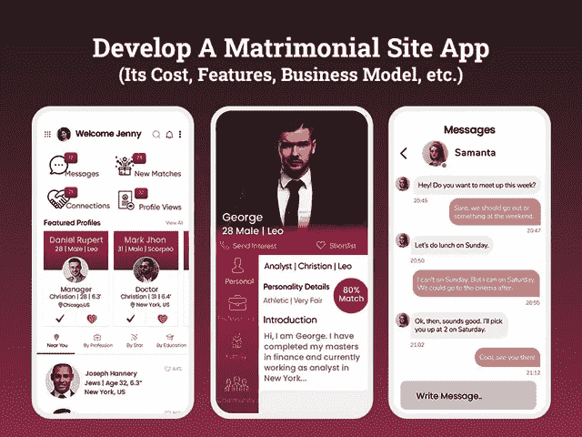

# 创建一个婚姻网站应用程序需要多少钱

> 原文：<https://javascript.plainenglish.io/how-much-does-it-cost-to-create-a-matrimonial-site-app-f26ee2f24902?source=collection_archive---------9----------------------->

## **开发一个婚姻网站应用程序:它的成本、特点和商业模式**

在数字化时代，一切都围绕着技术，通过移动应用程序找到你的灵魂伴侣已经成为一种新常态。过去，父母们常常雇佣中介或通过婚姻官僚机构来为他们的儿子或女儿寻找合适的伴侣，这样的日子已经一去不复返了。

现在有了征婚网站和征婚手机应用，你就不需要浪费时间和金钱去追逐这样的经纪人了。婚姻手机应用程序打开了成千上万的在线选项，让你足不出户就能在你选择的地点选择完美的伴侣。

然而，婚姻应用程序让那些不太爱社交的人的生活变得简单了。说到为婚礼寻找生活伴侣，不同的人对他们未来的配偶有不同的期望。请记住，这些结婚应用程序的设计允许你按照你的规格筛选选项。此外，有些应用程序允许你免费使用，而有些则要求你在试用期后选择一个订阅计划，并允许你了解新娘或新郎的每个细节。

*听起来很有趣！*

这就是为什么很大一部分新一代父母倾向于在线婚姻应用程序和网站服务来寻找合适的伴侣。随着人们心理的变化，越来越多的人注册了婚恋网站和手机应用。

> **但是，如果你想知道推出一个结婚应用程序会是一个多么好的机会，那么你需要看看目录……**

*   *结婚手机应用的迫切性日益增加:其市场洞察力和业务范围*
*   *为你的婚介业务开发婚介应用的显著优势*
*   *如何从你的婚恋手机 App 中获利？
    -商业投资创收的货币化战略*
*   *创建婚姻应用或网站解决方案的首要特性和功能
    -创建婚姻应用 MVP 的基本特性和功能
    -让你的应用成为赢家的高级特性*
*   *为什么选择最好的移动应用开发公司很重要？*
*   *构建婚姻手机应用或婚姻网站所需的技术堆栈*
*   *为 Android 和 iOS 开发一个结婚手机应用需要多少钱？*
*   *结论:准备推出你的结婚应用*

> 让我们深入了解这些要点，以便更好地理解…

## **市场统计数据显示，结婚手机应用越来越紧迫**

为什么投资结婚手机应用是一个诱人的选择？还是，问自己这个问题？

无论你是一家计划在婚姻行业建立品牌的初创公司，还是一位对市场有着深刻了解并正在寻找扩大业务的代理人，开发一款婚姻手机应用程序都是一个潜在的选择。

想知道怎么做？

*根据数字市场展望，2019 年美国在线婚介和约会服务的在线收入为*[*4890 万美元*](https://www.statista.com/forecasts/891155/eservices-dating-services-online-revenues-for-selected-countries) *。*

最近的调查显示，71%的情侣在网上约会超过两年，大约 30%的准情侣是通过网上婚介服务认识的。

*在线婚姻应用业务正在快速增长，预计到 2022 年将达到 2.6 亿。*

这些统计数据足以吸引正在为这一领域铺平道路的企业的注意力。由于在线婚姻应用程序服务变得如此苛刻，因此聘请一家 [**移动应用程序开发公司**](https://www.xicom.biz/services/mobile-app-development/) 帮助您定制无缝适应市场需求变化的解决方案是有意义的。

## **为你的婚介业务开发婚介应用的显著优势**

让人们从他们的智能手机上找到合适的匹配，许多企业都陷入了两难的境地，即这个应用程序的想法将如何为他们带来成效。如果你也在追寻同样的问题，那么这里是答案…

开发一个婚姻手机应用程序将让你的观众找到他们的伴侣，只需简单地注册一个应用程序，并填写详细的个人资料创建表格。根据收集的信息，该应用程序将开始运行，并将相关匹配项添加到您的个人资料中。

> 因此，以下是使用移动应用开展相亲业务的一些好处:

*   因为它更容易，更快，更快地访问和方便地找到他们选择的社区或种姓的匹配配置文件，因此企业可以有一个不可动摇的用户基础。
*   拥有一个商业应用程序意味着在全球范围内扩展你的业务，吸引更多的受众，因为他们将能够在任何地点一次浏览如此多的个人资料。
*   可能增加隐私和安全层的个人资料，并允许用户把他们的个人资料图片没有任何障碍。
*   婚姻手机 app 可以成为更好的营销和业务推广平台。

由于所有这些原因，人们更喜欢使用在线婚介服务，而不是求助于代理。如果你曾经使用过任何婚姻应用程序，你会明白这个概念被过多的特性和功能所包裹，这使得它的需求激增。

因此，如果你最终决定投资婚姻应用程序开发，那么你一定很想知道如何将这个应用程序的想法货币化，以及你需要寻找什么类型的特性和功能…

*答案来了……*

## **如何将你的婚姻手机应用或网站货币化？**

无论你是开发一个婚姻手机应用程序还是婚姻网站，每个企业都关心如何将他们的商业投资货币化。无论你的项目有多简单或复杂，从中获得最大收益是最大的挑战。因此，在你直接去雇佣一家 [**移动应用开发公司**](https://www.xicom.biz/services/mobile-app-development/) 了解开发一个婚姻应用需要多少成本之前，你肯定会对阅读这些应用解决方案提供的赚钱机会感兴趣。

> 让我们深入细节。

*   **订阅/会员计划**

在婚姻应用程序上，有很多功能可以帮助用户找到他们生活中渴望的伴侣。但是要过滤真正的个人资料，我们总是推荐付费订阅。虽然这是一种常见的创收技术，但企业可以获得最大的利润。要使其完美运行，您可以提供基于每月、每季度或每年的灵活订阅计划。

*   **婚庆商务促销**

从应用内广告和商业促销中获得收入是一种卓有成效的方法。你可以在婚礼网站上推广婚礼供应商、婚礼请柬公司、餐饮服务商，作为回报，你可以收取一大笔费用。这种盈利方式既有利于供应商获得业务，也有助于你让你的用户参与到应用中。

*   **免费增值会员**

大多数婚姻应用程序都是免费下载和访问的，但要获得特殊功能，如查看联系方式、发送消息、使用高级过滤器等，用户需要付费会员。这样商家就可以从婚恋 app 或网站上获利。

因此，这些是从你的应用程序中获利的最有效的方法，但现在的问题是，你需要给应用程序添加什么功能…

# **创建婚姻应用或网站解决方案的首要特性和功能**

这是你的应用程序中最关键和最重要的部分之一，它决定着你的业务的成功。将功能添加到应用程序中并不像在其中填充大量功能。有时，一个功能丰富的成熟应用程序无法在市场上获得人气，而有时一个简单的应用程序会引起轰动。所以要看你挑的手机 [**app 开发公司**](https://www.xicom.biz/services/mobile-app-development/) 打造婚嫁 app。他们在应用程序开发项目中投入了什么样的专业知识，以及他们有多熟练，这些都很重要。最重要的是，应用程序的用户界面最重要。

*这些功能可以为您的企业带来大量流量和高额利润。*

> **用户面板婚嫁 App 功能**

*   **登录:**允许用户通过使用自己的电子邮件 ID 和电话号码注册来开始使用应用程序。否则，您可以允许他们使用社交网络凭据登录应用程序。
*   **创建个人资料:**添加此功能，通过提及所有个人和学历信息(如身高、年龄、肤色、姓氏、职业、资格等)来创建个人资料。
*   **设置兼容性偏好:**允许用户从合作伙伴的个人资料中设置期望，如您想要什么资格、年龄、位置、职业、家庭等。有了这些细节，应用程序就可以更容易地找到相关的概要文件。
*   **上传您的照片:**添加您的个人资料图片，让您的个人资料更有趣。根据用户的选择，可以是一张个人资料照片或多张照片。
*   **添加星座:**有很多占星信徒可能会根据你的星座入围简介。因此，请确保您有一个在个人资料中添加星座的功能。
*   **浏览简介:**搜索框允许用户按类别或子类别查找简介，点击几下就能更容易地找到相关简介。
*   **高级搜索选项:**在寻找人生伴侣的时候，有成百上千的事情需要你去核实。允许用户使用高级搜索过滤器/字段搜索简档，并对更喜欢的简档进行排序。
*   **发送兴趣:**为了方便地连接到排序后的个人资料，允许用户向其他用户发送兴趣。
*   **查看联系方式:**根据他们的订阅计划，确保您拥有查看其他用户联系方式的功能。
*   **添加到收藏列表:**每天有成千上万的档案被注册，所以在你的应用程序中有一个功能，允许用户将档案添加到他们的收藏列表，并能够在以后查看它。
*   **实时聊天:**通过该功能，用户可以与其他用户联系并开始互动，而无需分享他们的联系方式。
*   **会员选项:**确保您提供不同条款的各种会员计划，并相应地访问应用程序功能。为了让它顺利运行，你可以考虑 [**雇佣移动应用开发者**](https://www.xicom.biz/offerings/hire-mobile-developers/) 来方便用户导航。此外，他们将创建一种方式，用户可以快速区分不同的会员计划。
*   **通知:**通过提供关于新个人资料访问者、新兴趣或收到的消息等的所有更新，让您的用户参与到您的应用中。
*   **查看成功案例:**在主屏幕上突出显示成功案例，以获得用户的信任，并提供分享成功案例的选项。
*   **活动状态:**当您在个人资料上处于活动状态或标记为最后一次显示时，让其他人知道。
*   **管理个人资料:**根据选择和偏好，确保用户可以选择共享、阻止或报告其他用户的个人资料。
*   **客户支持:**将客户支持添加到您的应用程序中，让用户快速解决他们的问题。

> **创建管理面板的功能**

*   **登录:**像一个用户面板，允许管理员使用他们的联系方式和电子邮件 ID 登录到应用程序。
*   **创建客户配置文件:**允许管理员管理多个配置文件，根据提供的详细信息，用户将获得相关的配置文件建议。
*   **仪表板:**通过该功能，管理员可以访问应用程序的完整信息，如用户行为、个人资料创建数量、每天发送的兴趣、一个月内的项目拒绝、订阅计划的收益等。
*   **管理客户:**根据他们的订阅计划管理简档，因为免费简档只能访问有限的功能，而付费简档可以访问高级功能。
*   **管理成功案例:**通过跟踪用户行为，允许管理员管理应用程序上的成功案例。
*   **会员包:**允许管理员向用户发送会员包通知，并促使他们开始使用付费服务。
*   **安全支付网关:**允许管理员在不影响安全性的情况下管理多个支付网关的支付。

以上是创建婚恋 app 的基本特征。但是如果你打算使用一个成熟的应用程序解决方案，那么你可以考虑 [**雇佣一个应用程序开发人员**](https://www.xicom.biz/solutions/hire-developers/) 来开发应用程序。随着市场上多种配对应用的出现，让你的应用成为焦点是一项艰巨的任务。因此，在这种情况下，考虑在你的应用程序中集成高级功能将有助于你增加竞争优势。

> **让您的应用成为赢家的高级功能**

在了解了用于创建用户和管理面板的功能后，让我们直接进入一些高级功能，这些功能不仅可以让你的应用程序与现代需求兼容，还可以让你的应用程序在拥挤的市场中脱颖而出。

*   **用户隐私和阻止功能:**允许用户自定义隐私设置，并根据需要阻止其他用户及其活动。它将帮助您保护您的应用程序免受不必要的干扰。
*   **生物数据创建:**许多第一次结婚的人不知道如何创建婚姻生物数据，也不知道他们需要在个人资料中包含哪些重要内容。因此，确保你雇佣了一个移动应用程序开发者，使你能够定制各种需要信息的字段，并帮助他们创建结构良好的数据。
*   **文档扫描仪:**大多数婚介应用程序都要求用户通过上传与他们的身份、星座等相关的文档来验证自己。在这种情况下，这个功能将非常重要，并为婚姻应用程序增加额外的价值。
*   **第三方集成:**如果应用程序包含任何第三方集成，如支持多种货币的多种支付选项、应用内聊天等，从而为您的应用程序带来竞争优势。
*   **图片上传:**对于用户来说，可以直接从图库中添加/分享图片。
*   **聊天集成:**聊天 API 将允许用户在你真正开始分享你的个人资料之前，互相交流，建立一些信任。

列表中的上述功能并不具有排他性，但有时企业会跳过将其集成到基础应用版本中，以将应用开发成本控制在预算之内。但是选择软件开发公司，会把这些高级功能完美的融合在一起，帮你走几里路。

## **为什么选择最好的移动应用开发公司很重要？**

在激烈的市场竞争中，推出新产品并使其在市场领导者中生存下来是一项具有挑战性的工作。在许多企业中，有一个关于推出婚姻应用程序的常见神话，就是让它功能丰富。但尽管如此，它更多的是关于用户导航以及如何实现使其顺利工作的技术。这就是你需要与婚姻的最佳选择 [**应用程序开发公司**](https://www.xicom.biz/services/mobile-app-development/) 合作的地方，该公司配备了由业务分析师、项目经理、应用程序开发人员、UI/UX 设计师、应用程序测试人员等组成的专家团队。

*现在，这给我们带来了一个问题:你需要什么技术来构建婚姻地图？*

## **构建婚姻手机应用或婚姻网站所需的技术支持**

技术是应用程序开发的支柱，因此正确的技术选择会对应用程序的性能和成功产生重大影响。因此，如果谈论婚姻应用程序的开发，主要是由机器学习，深度学习和人工智能技术支持，让用户找到完美的匹配。

*为了应用程序的平稳运行，你可以考虑使用这些技术:*

*   短信、语音和电话验证:Nexmo、Twilio
*   婚姻图标支付:Braintree & PayPal、Stripe、电子钱包、网上银行
*   婚姻图标数据库:MongoDB，Hbase，Cassandra，Postgress，Mail Chimp 集成
*   婚姻图标手机:安卓，iOS
*   婚姻图标推送通知:Twilio，Push.io
*   婚姻图标云环境:AWS，谷歌，Azure
*   婚姻图标实时分析:Hadoop，Spark，BigData，Apache Flink，Cisco，IBM

*看了这么多开发征婚 app 的细节，你一定很好奇，想知道做一个 app 要多少钱？..让我们在这里找到答案……*

## **做一个安卓和 iOS 的婚恋手机 App 要多少钱？**

作为一名企业主，如果你仍然处于如何创建一个高效的婚姻移动应用程序或网站以及最终必须花费多少成本的两难境地，那么你需要深入了解这些影响婚姻 iOS 和 Android 应用程序开发服务成本的要点。

因此，所有那些寻找标准应用程序开发成本来创建婚姻应用程序的人必须明白，其成本受以下因素的影响很大:

*   **选择合适的操作平台:**操作平台的选择会影响 app 开发和流程的成本。比方说，如果你想要一个移动应用程序，那么通常情况下，企业必须在 Android 和 iOS 平台之间做出选择。这两种本地应用都需要专用的编程语言和应用开发团队，因此需要昂贵的预算。但是，如果你希望通过同时开发两个平台来扩大用户群，那么你可以使用跨平台应用开发服务，其成本比开发两个原生应用低 40%。
*   **UI/UX 设计:**无论是婚恋 app 还是网站开发，都需要让用户觉得有吸引力、引人注目。如果谈及结婚应用程序的设计成本，那么它不会高于网站设计成本，因此，企业可以在他们的预算内轻松获得引人注目而又用户友好的设计。此外，UI/UX 设计的成本取决于特性和功能的复杂程度。
*   **应用程序的复杂性和大小:**成本主要受应用程序的复杂性和大小的影响，这是由特性和功能的选择决定的。因此，企业必须仔细选择这些方面，以保持总体定价在控制之下。
*   **应用程序开发团队:**要开发一个成熟的婚姻手机应用程序，你需要雇佣一个能带来经验和专业知识的手机应用程序开发公司。在原生应用开发的情况下，你需要雇佣 Android 或者 iOS 的应用开发者。但是跨平台应用程序开发解决方案需要一个团队语言专家。他们的小时价格主要取决于地点、经验、技能和知识，这些都会影响应用程序开发的成本。

如果总结所有这些因素，那么创建一个基本应用程序的成本将在 20，000 美元左右，而中级到高级应用程序版本的成本将在 25，000 美元到 35，000 美元之间，需要 4 到 9 个多月的开发时间。但是对于精准的 app 开发费用，我们一直建议预约免费咨询。

# **结论**

希望这篇博客提供了为 Android 和 iOS 创建一个婚姻手机应用程序的详细见解，以及所需的成本和功能。随着约会应用或婚介应用的需求越来越大，考虑开发婚姻应用是一个完美的决定。但是，为了给你的应用程序增加竞争优势，雇佣一家 [**移动应用程序开发公司**](https://www.xicom.biz/services/mobile-app-development/) 是值得的，他们了解你的婚姻应用程序开发想法，并能够将其转化为完美的解决方案。应用程序开发成本的最终数字将取决于企业和你雇佣的团队。

因此，如果你心中有任何想法，或者你想要一个专家团队来进行开发、设计、应用测试、部署和推广，那么你可以 [**联系我们**](https://www.xicom.biz/contact/) 并获得你的免费评估，或者在下面提出疑问！

— — — — — — — — — — — — — — — — — — — — — — — — — — — — —

*更多内容尽在*[***plain English . io***](http://plainenglish.io/)