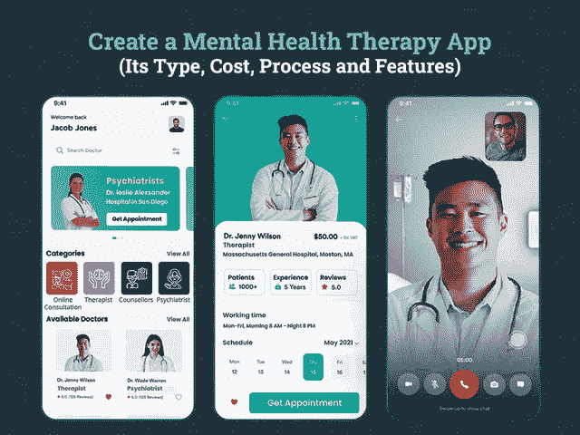
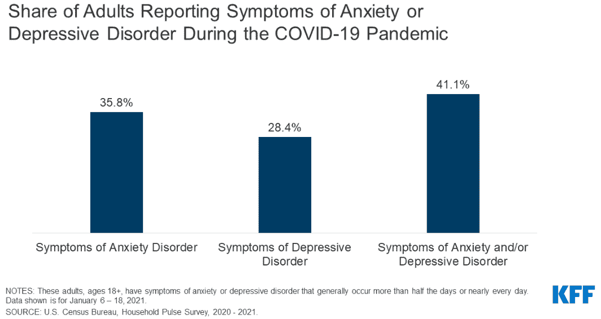

# 创建一个心理治疗应用程序需要多少钱

> 原文：<https://javascript.plainenglish.io/how-much-does-it-cost-to-create-a-mental-therapy-app-1b79d34df8aa?source=collection_archive---------4----------------------->

## 开发心理健康治疗应用程序:类型、成本、流程和特点

疫情迫使人们呆在家里的四面墙内，从生活中摒弃社交会议，让孩子们对设备上瘾，不幸的是，隔离生活实际上在每个人周围创造了一种压力氛围。事实上，随着现代生活方式的出现，心理健康被完全忽视，这实际上导致了很大一部分人的焦虑问题、抑郁和精神疾病。最令人惊讶的是，人们不愿去看治疗师来解决他们糟糕的心理健康问题。

*据调查报告显示，有近 10 亿人患有精神障碍，* [*75%的患有精神障碍的人*](https://www.who.int/news/item/27-08-2020-world-mental-health-day-an-opportunity-to-kick-start-a-massive-scale-up-in-investment-in-mental-health#:~:text=Mental%20health%20is%20one%20of,every%2040%20seconds%20by%20suicide.) *没有接受治疗。*

*有人说* [*50%的精神障碍*](https://www.who.int/activities/Improving-the-mental-and-brain-health-of-children-and-adolescents#:~:text=Half%20of%20all%20mental%20health,15%2D19%20year%2Dolds.) *始于 14 岁。*

*此外，在美国，人们注意到 46.4%的成年人***在他们的一生中面临精神疾病，许多成年人在疫情期间经历焦虑或抑郁的迹象，但如果他们继续忽视治疗，他们将继续遭受更长时间的痛苦。**

**

*[Image Source](https://www.kff.org/wp-content/uploads/2021/02/9440-03-Figure-2.png)*

*在这样一个充满挑战的场景中，心理治疗应用程序已经成为医疗保健行业的福音。但是，为心理健康患者设计或开发心理治疗应用程序似乎是医疗保健服务提供商面临的一大挑战。首先，它需要仔细和深入地了解应用程序的 UX 设计，这有助于你对不同心理的人产生更大的影响，并激发他们研究为他们设计的疗法。*

*如果你能轻松地创建一个心理治疗应用程序，但不知道从哪里开始，在应用程序中寻找什么，那么你就在正确的地方。*

*以下是这篇博客的主要亮点*

*   **市场概述:创建心理健康应用的理由**
*   **推出心理健康 App 的原因及其发展**
*   **如何创建心理健康 App？
    -你能开发什么类型的心理治疗 App？
    ——什么样的功能会让一个应用程序有效地治疗人们的心理健康疾病？
    -精神健康移动应用的隐私和保密性
    -如何将你的精神疾病应用货币化？**
*   **做一个心理健康手机 App 要多少钱？**
*   **结论**

*为了更好的理解，让我们深入挖掘这些要点…*

## ***市场概述:创建心理健康应用的理由？***

*近年来，美国的心理健康问题已经到了令人担忧的阶段。事实上，全球各地的人们都在遭受精神健康问题的困扰，包括行为障碍、精神疾病、恐慌症、抑郁症等。*

*   **根据美国心理健康协会的数据，美国有超过 1000 万* [*成年人需要心理健康治疗，但目前尚未得到治疗。*](https://www.mhanational.org/issues/state-mental-health-america)*
*   *[*70%的青年*](https://www.mhanational.org/issues/state-mental-health-america) *需要治疗抑郁症。**
*   **有一种* [*严重程度增加了 4.35%*](https://www.mhanational.org/issues/state-mental-health-america) *在过去的六年中严重抑郁的严重程度。**
*   *根据美国焦虑和抑郁协会的统计，美国有 4000 万成年人患有焦虑症。*
*   *调查报告显示，在发展中国家，近 75%的精神障碍患者没有得到治疗。*
*   **根据这些统计数据，很明显，行为软件市场的需求持续增长，精神健康解决方案在 2018 年 5.88 亿美元的估计值* [*中约占 30%。*](https://onefourzerogroup.com/health-tech-report/)*
*   **Acumen Research and Consulting 最近的一项研究预测，到 2027 年，精神健康应用市场的价值将达到 37 亿美元。**
*   **事实上，统计数据显示，2019 年至 2027 年* *之间，精神健康应用程序的开发收入将增长* [*23.7%。*](https://www.prnewswire.com/news-releases/mental-health-apps-market-accounted-for-us-587-9-mn-in-2018-and-is-expected-to-generate-a-revenue-of-us-3-918-40-mn-by-2027--at-a-growth-rate-of-23-7-from-2019--2027--300997559.html)*

*简而言之:根据这些统计数据，很明显，对心理治疗应用的需求逐年增加。疫情就像蛋糕上的樱桃，将个人推入了一个更大的心理健康危机。在你直接雇佣一家 [**移动应用程序开发公司**](https://www.xicom.biz/services/mobile-app-development/) 来构建一个解决方案之前，你们中的许多人都在想，为什么人们更喜欢寻找稳健的治疗方案，而不是亲自拜访治疗师？下面列出了几个主要原因…*

# ***为什么精神健康应用程序如今变得如此流行？***

*心理健康问题已经到了一个令人担忧的阶段，人们需要寻找治疗方法来保持他们的心理健康平衡。人们更喜欢隐藏自己的情绪，控制自己的行为，而不是去看专业人士，却不知道这样做会让他们的状况变得更糟。疫情已经加剧了人们的焦虑。*

*这就是心理治疗应用和心理健康会议在全球变得越来越重要并占据中心舞台的原因。你们中的许多人仍然想知道为什么数字治疗现在如此受欢迎？*

***这里有几个原因:***

*   **很大一部分精神疾病患者无力支付长期治疗费用。**
*   *在线心理治疗应用在这种快节奏的生活中派上了用场，因为人们没有时间去做常规治疗。*
*   *一个精神健康疾病应用程序有一个治疗师和顾问的列表，以及描述和评级。因此，患者不需要浪费时间去看治疗师进行常规治疗。*
*   *它增加了根据您的时间表和空闲情况预约会议的灵活性。*
*   *向任何国家的治疗师预约世界任何角落的治疗。*
*   *它减少了人们对知道你的治疗并嘲笑它的恐惧。事实上，会议和你的个人资料将被高度保密。*

*按需心理治疗应用程序是所有此类治疗中心的完美解决方案，增加了按照自己的节奏获得治疗的灵活性，而不必考虑成本。你所需要的就是 [**雇佣一个移动应用开发者**](https://www.xicom.biz/offerings/hire-mobile-developers/) 来设计一个真正符合用户需求的移动应用。但是，在我们进入 app 开发的过程之前，你需要了解如何从零开始创建？如果你仍然不确定如何继续，那么请继续阅读…*

# ***如何创建一个心理健康 App？***

*当谈到开发移动应用程序时，许多企业认为这很简单，只要有一个价值百万美元的应用程序想法和一个移动应用程序开发团队来帮助你营销它。但是，事实是它不仅仅是编写一个应用程序。如果你已经准备好创建一个精神健康应用程序，那么检查一下你需要考虑什么:*

## ***需要创建什么类型的精神疾病 App？***

*在构建医疗健康 app 的时候，你首先需要决定的是你的 app 应该关注什么。了解你的目标受众的需求实际上会影响你的应用程序的逻辑，并且对精神健康解决方案至关重要。由于这些治疗应用程序是为不同的年龄组、性别、人口统计数据和严重程度开发的，因此针对不同群体的不同心理特征量身定制解决方案是值得的。因此，为了让你更容易理解，我们将精神健康应用程序分为不同的类别，如下所述:*

*   ***精神障碍应用***

*虽然市场上有成千上万的精神障碍应用程序可以帮助人们应对抑郁症。一些人正在接受交换信息或让治疗师打电话来开发应用程序的原则。而另一些则旨在提供改善心理健康的建议、自我指导的情绪训练计划或游戏化元素。这些精神疾病应用程序的基本作用是治疗精神分裂症和精神病等疾病。*

*为了使这种应用模式取得成功，你可以聘请一家为心理障碍患者设计的软件开发公司，作为传统疗法的补充。在这种专业的应用程序中，有心理障碍的用户将全天候拥有医生，并为用户带来最大的利益。为了使它成功，它需要包括月亮监测、认知技能训练以及认知行为治疗等功能。20 多岁的人可以放心使用这款应用。*

*   ***自我提升应用***

*顾名思义，自我提升 app 就是为了自我提升而打造的。像自助这样的应用程序旨在打破坏习惯，培养积极的思维，焦虑管理，自我监控，跟踪情绪波动等。如果你的目标是为自我提高提供治疗，那么提供冥想和呼吸技巧、音频放松等等将会很棒。*

*   ***戒毒应用***

*无论是饮酒、吸烟还是吸毒，这些类型的应用程序解决方案都可以提供很大的帮助。此外，通过这些应用程序解决方案，人们可以跟踪他们与毒瘾斗争的时间。此外，你可以向用户发送这样的激励性报价或发送书籍建议，表明他们的灵感很高，并最终帮助他们摆脱坏习惯。*

*   ***压力和焦虑应用***

*这些应用程序是专门为那些在压力和焦虑中挣扎或者面临严重恐慌发作的人设计的。通过不断监控他们的情绪波动、脉搏率，或者在应用程序中设置 24 小时焦虑工具包或日记，你可以帮助用户利用更好的解决方案。事实上，有了这些专家提出的改善情绪的建议和技巧，你可以对他们的思维模式和行为做出持久的改变。*

*无论你是打算创建一个专门治疗任何精神健康障碍的应用程序，还是喜欢建立不同类别的组合，你都需要实现正确的特性和功能集，才能使它成为赢家。你也可以考虑雇佣一家 [**应用开发公司**](https://www.xicom.biz/services/mobile-app-development/) 来帮助你将你的应用想法转化为一个完美的解决方案。因此，每当你考虑开发一个心理治疗应用程序时，你都需要寻找这些功能来包含在心理健康应用程序中…*

## ***什么样的功能会让应用程序有效地治疗人们的心理健康疾病？***

*有许多功能、工具和技术可以在现代心理健康应用程序中实现，如认知行为、承诺治疗、情绪训练计划、游戏化、定制设置等。因此，在你对你需要在应用程序中包含什么感到困惑之前，这里我们已经确定了创建精神健康应用程序的顶级功能*

*让我们直接进入从顶级精神健康应用程序中提取的这些不错的功能，这些功能可以帮助你创建一个杀手级的精神健康应用程序。*

*   ***Onboarding:** 一旦应用程序被下载，让你的用户通过应用程序清楚地解释所有这些服务、功能和特性是很重要的。你也可以考虑雇佣一个应用程序开发人员来添加一些情感动画辅助，以用户感到满意的方式呈现指令。*
*   ***创建用户档案:**通过使用电子邮件凭据或电话号码，用户可以注册该应用程序并创建档案。*
*   ***设置:**患有精神健康疾病的用户需要定制这些应用的设置，以获得最佳体验。例如，允许用户调整音量、通知频率、选择主题、设置会话提醒等。*
*   ***音频/视频通话:**与任何其他消息应用程序一样，音频和视频通话是进行无缝通信的主要元素，同样，该功能在远程医疗精神健康应用程序的背景下高度相关。通过这一功能，用户可以与医生或治疗师进行音频或视频通话，并获得无口吃的体验。*
*   ***通知:**推送通知可以是你的心理治疗应用程序中最重要的元素，因为它们可以提醒用户预定的任务，或者它们可以温和地要求用户分享他们的一天。此外，这将有助于你的情况下，你宣布任何折扣或交易的服务。*
*   ***情绪跟踪:**患有抑郁症、双相情感障碍或情绪障碍的人可以在精神疾病应用程序中访问该功能。通过跟踪情绪，用户可以更好地了解到底是什么触发了他们的情绪，并能够对他们的障碍进行一些自我控制，并可能解决改变情绪的触发因素。*
*   ***分享数据:**通过该功能，用户可以在社交网站上分享应用，以获得朋友和家人、护理人员、医疗保健提供商等的支持。事实上，该功能将有助于应用内推广和提高知名度。*
*   ***建立志同道合的群体:**当你周围的人也在处理同样的问题时，与一些人打交道会变得更舒服、更容易。要包含此功能，您可以 [**雇佣一名移动应用程序开发人员**](https://www.xicom.biz/offerings/hire-mobile-developers/) ，他会帮助在您的应用程序中创建一组社区，并提供文本、视频聊天或进行小组讨论的功能，让人们分享他们的成就，共同设定目标等等。*
*   ***放松技巧:**细心是给日常生活带来积极变化的好方法。有了这个功能，你可以建议一些呼吸技巧，引导和非引导冥想会议，发送积极的报价和更多有助于放松心情。*
*   ***寻找治疗师:**基于不同的医疗需求，允许用户在应用中浏览治疗师。此外，通过访问用户的医疗数据，心理健康应用程序可以实践一种算法，以建议一些最相关的治疗师。*

> ***创建心理治疗应用的高级功能***

*   ***自我监测:**在精神健康应用的高级应用版本中，你可以添加这一功能，并使其在可穿戴设备的支持下工作。此外，该功能将需要用户定义的不同变量的插入。通常，自我监测功能将有助于跟踪压力水平，分析情绪模式，睡眠模式等。*
*   ***仪表板:**仪表板将提供检查和管理患者进展的洞察力。仪表板显示用户收集的信息的分析报告。考虑到这些见解，治疗师就更容易分析你的健康记录，并能够相应地安排疗程。*
*   ***AI 和 ML:** 在处理数据库和进行预测时，人工智能和机器学习携手并进。有了这些基于技术的应用功能，应用可以更好地跟踪用户行为。*
*   ***游戏化:**为了保持吸引用户，让他们从疾病中转移注意力，你可以考虑加入游戏化。有各种各样的心理健康游戏，但迷你游戏有助于人们磨练认知技能，并足以成功平静他们的感官。*

## ***精神健康移动应用的隐私和保密性***

*你的精神疾病应用对用户来说足够安全可靠吗？如果不是，那怎么做呢？*

*好吧，可靠性是开发一个成功的精神应用的关键因素。人们考虑从安全的平台上寻求治疗或心理健康改善会议。该应用程序的隐私有助于个人最大限度地减少他们对因医疗疾病而暴露在他人面前的恐惧。*

*然而，当谈到增强心理治疗应用程序的隐私时，雇佣 [**应用程序开发公司**](https://www.xicom.biz/services/mobile-app-development/) 是值得的，它使你能够整合所有这些政策和法规，帮助你建立可靠的声誉。现在摆在我们面前的主要问题是，不同国家的移动精神卫生服务提供商有不同的监管指南来保护用户的隐私。*

> *让我们来看看如何让你的应用看起来安全:*

*   ***HIPAA 合规:**这是一项基于美国的健康保险便携性和责任法案，旨在确保应用程序中提供的所有信息都得到保护。*
*   ***GDPR:** 如果一家公司总部位于美国，并且拥有欧盟客户，那么遵守一般数据保护规则以避免数据保护处罚是非常重要的。*
*   ***数据加密:**这是企业为避免任何数据泄露而必须遵循的基本数据保护实践之一。确保存储和共享的数据在所有阶段都将被加密。*

# ***如何利用你的精神疾病应用赚钱？***

*对于所有处理心理疾病问题的人来说，心理健康解决方案并不陌生。因此，通过在应用程序中实现上述功能，推出心理治疗应用程序将是一个有利可图的决定。在你急着雇佣一个移动应用开发者之前，你必须对盈利策略有所顾虑。但问题是，它将如何帮助你的商业投资赚钱？大多数企业都非常关心精神疾病应用程序对你的企业有利可图这一事实。*

**以下是最有潜力的应用赚钱策略，可以帮助你通过心理健康应用赚钱:**

*   ***应用内购买***

*这是通过精神疾病应用创收的最有效方式之一，它允许用户购买额外的产品，如治疗精油、芳香蜡烛、改善情绪的药物等。*

*   ***订阅计划***

*允许用户通过选择基于月费、季费或年费的订阅计划获得额外的服务优惠。通过这些计划，用户可以节省治疗套餐，并成为该应用程序的高级会员。*

*   ***应用内广告***

*通过在你的应用程序中向第三方企业提供广告空间，你可以产生巨大的收入。这种货币化模式以两种方式运作。*

*   ***付费下载***

*通过付费下载，用户实际上可以下载治疗疗程或类似的技术，他们甚至可以离线练习。*

## ***做一个心理健康 app 要多少钱？***

*在不了解业务需求和应用程序结构的情况下估计应用程序开发成本是最可怕的预测之一。因为应用程序开发成本主要取决于复杂性、应用程序设计、特性和功能、开发时间以及开发人员的每小时成本，尽管对于任何开发人员来说，得出标准的应用程序开发成本都是一项挑战。*

*如果你很想知道基于上述功能创建一个心理治疗应用程序需要多少钱，那么应该是这样的:*

*   ***基本应用程序开发成本:**拥有基本功能和应用程序结构将更像是一个 MVP 解决方案，成本在 17，000 到 20，000 美元之间，开发可能需要大约 4 到 6 个月。*
*   ***中等程度的应用开发成本:**中等程度的应用拥有满足用户需求的所有功能，如应用内聊天、通话、预约治疗、寻找治疗师等。它将花费 25，000 到 30，000 美元之间，可能需要 7 个多月的开发时间。*
*   ***高级应用开发成本:**这是一个成熟的应用版本，由 AI、ML、大数据等先进技术支持，使您的应用为满足未来需求做好准备。其应用程序开发成本可能超过 35，000 美元，开发可能需要 9 个月以上的时间。*

*这些估计基于上述特性和功能，但是，我们始终建议您预约一个咨询时段来讨论您的项目细节并获得准确的预测。*

# ***结论:***

*随着不确定性的出现，在人们经历如此紧张的情况下，保持心理健康平衡已成为全球大多数人的一项挑战性任务。治疗应用程序通过提供高效的在线治疗会话、心理健康问题咨询等方式发挥作用。因此，雇佣一家 [**移动应用程序开发公司**](https://www.xicom.biz/services/mobile-app-development/) 来开发一款心理治疗应用程序可能是一个值得做的决定，因为它可以帮助他们放松，缓解日常挑战带来的压力。随着在线治疗预约的灵活性，选择自己的治疗师和治疗，人们发现这些应用程序比传统诊所更方便。*

*因此，如果您正在寻找任何治疗应用程序开发理念或移动应用程序开发商，可以帮助您推出一款提供有效心理健康治疗的应用程序，那么您可以 [**联系我们**](https://www.xicom.biz/contact/) 或在下面提出疑问。*

*=====================================*

**更多内容看* [***说白了就是***](http://plainenglish.io/) ***。*** *报名参加我们的**[***免费每周简讯在这里***](http://newsletter.plainenglish.io/) ***。*****