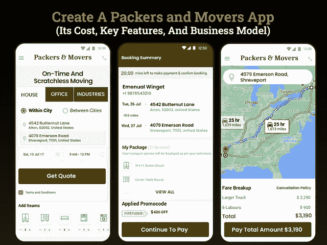

# 创建一个包装和搬运应用程序需要多少成本

> 原文：<https://javascript.plainenglish.io/how-much-does-it-cost-to-create-a-packers-and-movers-app-9d4d1c03870?source=collection_archive---------14----------------------->

## **开发一款包装和搬运应用程序:其关键特性、成本和商业模式**

事实上，每年有 3100 万美国人流动，为经济贡献了 860 亿美元，可以说物流业随着时间的推移已经发生了巨大的转变。

从家庭到单身汉到学生，从农村到大都市的人们都在迁移。在搬运工和包装工的帮助下，搬出他们的家已经变得如此正常和方便。不管是因为学习、工作还是婚姻，人们都在不停地变化。

事实上，随着核心家庭数量的增加，在搬迁的时候，帮忙的人越来越少。这是越来越多的人寻求专业援助，以确保安全和安全的事情，并确保无障碍搬迁。

如果考虑统计数据，每年大约有 300 万美国人进行州际搬运，这最终解释了对专业包装和搬运服务需求的增长。

无论你是那些初创公司之一，真正受到搬运工和包装工日益增长的需求的影响，还是一个期待扩大物流业务的商业爱好者-接近推出按需包装工和搬运工移动应用程序是在 2021 年取得成功的完美方式。

如果你仍然想知道如何开始使用一个应用程序，以及构建按需包装和移动应用程序需要多少成本，那么这个博客就是为你准备的。

**以下是这个博客的主要组成部分:**

*   *为什么要投资包装和搬运按需应用程序开发解决方案？
    -搬家行业的市场洞察*
*   *您可以通过 Packers and Movers 移动应用程序提供什么样的服务？*
*   *2021 年如何打造一款按需移动的手机 App？
    -创建基本按需搬运应用程序的主要功能
    -可以全面改变包装和搬运应用程序成本的高级功能*
*   *将您的包装商和搬运工移动应用货币化*
*   *构建按需搬运应用程序需要什么样的团队结构？*
*   *开发一个搬运工和包装工手机 App 要多少钱？*
*   *结论:准备推出按需搬运和包装移动应用*

让我们深入挖掘每一点，以便更好地理解…

## **为什么要投资包装和搬运按需应用程序开发解决方案？**

毫无疑问，包装工和搬运工行业已经成为镇上的流行语，并创造了高额收入。一个简单的概念是在网上开展业务，通过小心地移动物品来获得更多收入，这是一种蓬勃发展的商业方法。

如果你打算通过推出一个按需应用程序进入包装和搬家行业，但仍然怀疑这是否是一个值得的决定，那么在雇佣一家 [**移动应用程序开发公司**](https://www.xicom.biz/services/mobile-app-development/) 之前，你需要先睹为快。这些统计数据将清晰地描绘出搬家行业是如何被炒作的。

**包装和搬运行业的市场洞察**

*   据统计，46%的人因工作原因与包装工和搬运工一起搬迁，而超过 32%的居民退休后会改变地址。
*   该研究表明，在包装和搬运行业中，短距离搬迁率很高。
*   美国人一生中平均移动 11.7 次。
*   根据新的人口普查数据，2019 年近 3100 万人移居美国，每年有 9.8%的美国人移居美国。
*   平均每年大约有 300 万家庭规模为 2.3 人的美国人，也就是 1530 万美国家庭搬家。
*   夏季是美国最繁忙的时候，每年 60%的迁移发生在这里。

***简而言之*** *:根据这些数据和事实，可以说对包装工和搬运工的需求在未来将会继续增长。但为了在竞争中保持乐观，各种包装商和搬运工已经用高质量的按需应用程序开发解决方案铺平了道路。*

那么，你会如何为你的企业增加优势呢？

在进入开发包装商和搬运工移动应用程序的详细指南之前，投资者和企业家必须了解他们如何简化移动复杂性，并能够满足运输要求。

## **您可以通过 Packers and Movers 移动应用程序提供什么样的服务？**

随着时间的推移，各类人群对包装工和搬运工的需求不断增加。根据调查报告，人们注意到，无论是工业还是居民，每个人都需要专业人士的专业协助。搬迁总是令人兴奋，而且往往是一个压力极大的过程，可能会带走搬到一个新地方的魅力。这就是按需包装商和搬运工移动应用程序作为必要的救援工具出现的原因。

因此，如果你计划推出一款按需移动应用，请确保它提供以下服务，并允许人们毫无损伤地移动东西。

*   **货运代理服务**

有了快递员、包装工和搬运工的移动应用程序，企业可以轻松地将任何东西从这里搬到那里。在进入物流行业时，确保你 [**雇佣移动应用开发者**](https://www.xicom.biz/offerings/hire-mobile-developers/) 使你能够增加对行业的支持，并允许他们移动任何东西，从制造起重机、重型设备、像汽车这样的重量级货物等等。按需包装和搬运应用程序允许企业在应用程序上点击几下，将货物从一个地方转移到另一个地方。

*   **办公室搬迁服务**

与住宅搬迁一样，办公室搬迁也需要安全可靠地进行。从转移 PC、处理器、小工具到其他与办公室相关的产品，办公室搬迁服务旨在负责任和安全地转移一切。此外，他们由熟练的专业人员支持，可以简化移动过程，并能够协调活动。

*   **住宅搬迁**

搬家总是一件令人伤脑筋的事情。无论你在搬迁时有多少帮手，没有什么能取代专业的包装工和搬运工。从家具到衣服到书籍，他们的团队有足够的技能以合适的方式处理一切。

这些是你可以考虑在应用程序中包含的几个基本服务，但这里出现的主要问题是如何创建一个按需移动的应用程序，使你能够满足你的需求。

## **如何创建按需包装和搬运应用程序？**

利用最新技术的优势，许多包装和搬运企业主正在通过投资数字解决方案来改善他们的服务。如果你已经准备好发布你的应用，那么在直接进入 [**雇佣一个应用开发者**](https://www.xicom.biz/solutions/hire-developers/) 之前，有必要从市场调查开始，评估你的应用想法，以了解它是否有助于你实现业务目标和满足最终用户的需求。

一旦您对目标用户有了全面的了解，您需要考虑与包装和搬运应用程序开发概念相关的主要特性和功能。在我们开始讨论应用程序开发的功能之前，你需要了解包装和移动应用程序与三个面板-用户，司机和管理员。

如果你不知道创建一个基本应用程序版本的主要功能是什么，那么它就是:

> **创建一个基本的按需移动应用的主要特点——用户面板**

*   **注册:**app 下载后，与用户互动的 app 第一页就是注册页面。允许用户使用此类凭证登录应用程序，或者考虑使用社交媒体集成来使其简单、快速、快捷地访问。
*   **查看或编辑个人资料:**通过此功能，允许用户编辑个人资料，用姓名、照片更新信息，或进行隐私设置。
*   **查看服务:**为了保持他们提供的移动服务类型的清晰性，让用户查看所有的服务。这给了他们一个清晰的想法，关于什么项目或商品，他们进入转移。
*   **条款和条件:**在访问服务之前，让您的包装商和搬运商应用程序使用户能够完成他们的条款和条件。双方通过签署协议开始舒适的时刻，然后服务将被执行。
*   **设置取货或卸货地点:**通过应用程序中的这一功能，让客户选择他们希望货物送达的地点。为了进一步扩展便利性，他可以共享他的放置位置的地址。因为这是这个应用程序的一个关键特性，尽管你可以雇佣一个 [**应用程序开发公司**](https://www.xicom.biz/services/mobile-app-development/) 来使整个打包和转移过程变得简单。
*   **发送服务请求:**一旦用户完成所有这些手续，允许他们发送请求，以获得包装商和搬运商的服务。用户还可以与服务提供商沟通，以明确程序或条件。
*   **推送通知:**为了让应用程序用户及时了解所有重要信息，如收到的订单、付款流程、指定司机、车队到达时间等，您可以使用该功能。此外，通知将帮助您让您的用户了解交易和优惠。
*   **支付流程:**确保您的应用集成了多种支付方式，以便使用他们选择的支付方式进行安全的支付交易。
*   **分享驱动程序信息:**一旦你的请求被接受，付款完成，让应用程序将驱动程序分配给用户。允许用户检查司机的个人资料，并能够跟踪位置和车辆号码。
*   **订单历史:**为了跟踪服务，值得在您的应用程序中添加该功能，让用户查看订单历史并跟踪所需信息。
*   **评级和评论:**允许用户根据服务质量和驾驶员行为对服务提供商进行评级和评论。

> **创建基本按需移动 App- Driver 面板的主要功能**

*   **授权:**作为用户，司机在 app 上也有一个面板，只能通过授权流程访问。允许司机使用其电子邮件 ID 或联系信息登录应用程序。
*   **验证:**为了确保用户的可信性和可靠性，请确保您在驾驶员面板中有一个部分来提交此类有助于获得用户信任的相关文件。
*   **查看和编辑个人资料:**让驾驶员通过添加全名、联系方式、设定车辆编号、车辆类型等自定义个人资料信息。
*   **历史记录:**通过该功能，司机可以查看已接收订单、已处理请求、待处理请求、取货和卸货位置等的历史记录。
*   **接受付款:**允许司机通过多种付款方式接受付款，包括信用卡/借记卡、电子钱包等。

> **创建基本按需移动应用程序的主要功能-管理面板**

*   **仪表板和应用洞察:**添加此功能可让管理员全面洞察应用，并能够管理驱动程序和用户相关活动，从而在规定时间内轻松完成请求。
*   **管理客户:**为了让你的应用程序顺利工作，避免这种服务崩溃，请确保你聘请了一家 [**软件开发公司**](https://www.xicom.biz/) 来定制这一功能，并允许管理员根据客户转移的目的来管理客户，跟踪账户活动并监控执行情况。
*   **驱动程序管理:**通过应用程序中的这一功能，您可以为管理员提供在面板中添加驱动程序的便利，查看所有值班和下班的驱动程序，并能够根据工作流程提前分配任务。
*   **燃油跟踪系统:**管理员拥有所有权限来核实所有车辆的燃油消耗率。
*   **付款管理器:**通过应用程序中的这一功能，管理员可以跟踪通过各种付款模式收取的所有付款。
*   **实时追踪:**作为管理员，时刻关注每一个舰队是很重要的。管理员应该知道司机走什么路线，并跟踪停靠点，以确保准时交货。

这些是您在开始使用 MVP 解决方案时可以考虑的几个基本特性。但如果你准备好与行业领先的包装和搬运应用程序竞争，那么你可以考虑加入高级功能。

## **能够全面改变包装商和搬运工应用成本的高级功能**

packers 和 movers 移动应用程序中的高级功能的实施肯定会帮助您与市场竞争对手站在一起。因此，为你的应用程序添加更多的属性将有助于使按需包装和移动应用程序胜出。因此，让我们直接深入了解有助于您获得成功的特性:

*   **应用内发票生成**

为了避免给用户带来不便，请确保所有成功移动和交付的商品和物品都可以通过应用程序轻松生成发票。发票将包含所有详细信息，如发送的物品数量、物品重量、消耗的时间、平均行程、付款方式等。

*   **车费计算器**

这可以说是你的包装工和搬运工移动应用程序的最大补充，它将计算乘坐的费用。它允许计算司机将物品从一个地点转移到另一个地点的费用。

*   **提前安排调查**

无论是办公室搬迁还是住所迁移，搬运沉重或大量的货物都是一项单调乏味的任务。这不仅需要包装工和搬运工的专业支持，还需要提前计划。这是你的应用程序的一个关键功能，所以为了让它简单易用，你可以 [**雇佣一个移动应用程序开发者**](https://www.xicom.biz/offerings/hire-mobile-developers/) 。还有，在处理给任何人移动物品的任务之前，你需要检查服务提供商的身份证明。然而，应用程序中的这一功能将有助于用户根据您的方便提前与专业人士确定日期，并明确所有规格、条款和条件。

*   **应用内聊天/通话**

为了确保客户和服务提供商之间的无缝沟通，提供应用内聊天或通话功能是值得的。使用此功能，用户或司机可以立即澄清他们对货物的收取和交付的疑问。

*   **上好保险**

这可能是你的应用程序最受欢迎的功能，因为它允许用户确保所有正在运输的货物，并涵盖损坏的风险。此功能使用户能够添加正在移动并在保险范围内的产品列表。

这份清单还没有结束。根据预算和你雇佣的移动应用程序开发公司，你可以根据市场需求集成一些功能。但问题是如何从你的包装工和搬运工应用程序中获利？

# **将您的包装和搬运移动应用货币化**

有几种方法可以将你的商业投资货币化，但当涉及到从按需包装和移动应用程序中获利时，这里有一些最受欢迎的货币化策略，你可以为你的应用程序考虑:

*   **收取交易费用**

这是最传统的赚钱方式之一。包装商和搬运工的应用程序所有者可以通过应用程序对每个订单收取特定金额的费用。这种类型的商业模式通常应用于聚合应用程序，并允许企业所有者产生更多的收入。

*   **特色列表**

这是你的应用程序的另一种流行的赚钱方式，允许你在主页上列出或展示一些顶级服务提供商时收取一定的费用。你可以考虑雇佣一个 [**应用程序开发公司**](https://www.xicom.biz/services/mobile-app-development/) ，让你可以定制这个应用程序，在你的应用程序上突出特色的包装工和搬运工。许多服务提供商选择这个选项来最大化他们的销售，并在特定的时间段内进行功能列表。

这两种盈利策略都可以从包装商和搬运工应用程序中获得收入，但你们中的许多人都很好奇，开发一个包装商和搬运工应用程序需要什么团队，开发一个搬运应用程序需要多少成本？

让我们一起来寻找答案吧！

## **构建按需搬运应用程序需要什么样的团队结构？**

无论你脑海中有一个多么出色的应用程序想法，要将其转化为一个强大的解决方案，你需要一个拥有正确技能和专业知识的专业团队，来处理应用程序的复杂性。

因此，要构建一个卓越的、功能集成的应用程序，你需要雇佣一家移动应用程序开发公司，该公司包括:

*   **业务分析师:**一位经验丰富的业务分析师将根据市场需求评估你的移动应用创意，并帮助你了解应用创意的可行性，以及接触目标受众的最佳途径。
*   项目经理:一个熟练的项目经理全权负责处理开发项目，并带来一个完美的解决方案来克服所有这些开发障碍。
*   **UI/UX 设计师:**无论你的应用程序想法有多复杂，都要确保你的应用程序拥有简单、容易和快速的屏幕间导航，并且有一个初始设计。
*   **开发者:**应用开发者的技能取决于你计划发布应用的平台选择。它可以是一个 Android 应用程序开发人员或 iOS 应用程序开发人员的团队，或者你可以雇用跨平台的应用程序开发人员，他们在 React Native、Flutter 等平台上工作。
*   **质量保证:**一旦你构建了一个 app，你会要求一个 app 测试人员在各个平台进行 app 测试，使用多个测试模块来保证无 bug 应用。

想知道 [**雇用移动应用程序开发人员**](https://www.xicom.biz/offerings/hire-mobile-developers/) 为您的企业创建按需打包和搬运应用程序要花多少钱？嗯，应用程序开发者的价格取决于各种因素..让我们进一步讨论…

## **为 Android 和 iOS 创建一个 Packers and Movers 应用程序需要多少钱？**

如果你关注开发一个应用程序的标准成本，那么你可能会在这一点上犯错误，因为创建包装和搬运应用程序的总成本将基于几个方面进行评估。影响应用程序开发成本的因素包括选择最佳操作平台、雇佣专门的应用程序开发团队、应用程序的特性和功能、技术等等。

因此，如果考虑所有这些参数来计算创建包装和搬运应用程序的所有成本，那么为单个平台创建一个基本的应用程序版本大约需要 20，000 美元。另一方面，如果您计划超越基本应用程序版本，并希望集成高级功能，则每个平台的平均应用程序开发成本将在 25，000 美元至 35，000 美元之间。

然而，最好的方法是寻找跨平台的应用程序开发解决方案，让您在应用程序开发上节省高达 40%的开发成本。跨平台应用程序是用单一代码库开发的，支持多个平台，尽管它可以帮助你快速推广应用程序，而不会在你的口袋里留下一个窟窿。

尽管如此，对于准确的应用程序开发成本估算，您可以与专家预约免费咨询时段！

## **结论:准备推出按需搬运和包装移动应用**

随着这篇博客的结束，希望你已经获得了创建按需包装和移动应用程序的所有见解。因为每个行业都有一些入门级的障碍和挑战，以应对行业竞争。因此，雇佣一家 [**移动应用开发公司**](https://www.xicom.biz/services/mobile-app-development/) 是克服这种障碍的完美方法。开发一个搬运工和包装工应用程序是一个有益的商业想法，广泛采用新的趋势。这就是移动应用开发公司可以轻松推动你进入市场的地方。

如果您最终做出了决定，并且正在寻找包装商和搬运工应用程序开发人员，那么您来对地方了，可以 [**联系我们**](https://www.xicom.biz/contact/) 或在下面提出疑问！

=======================================

*更多内容请看*[***plain English . io***](http://plainenglish.io/)