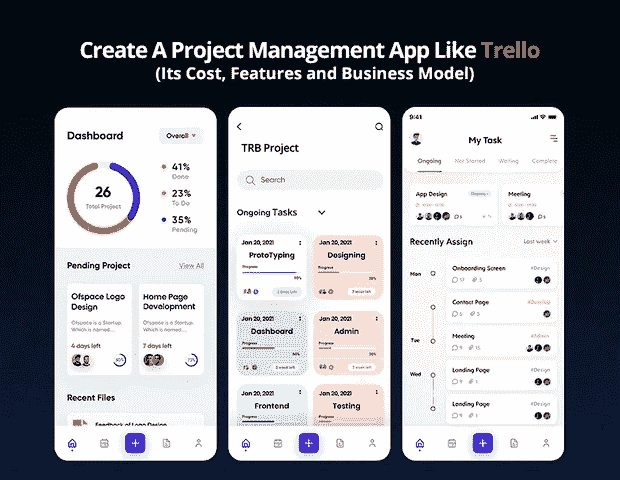
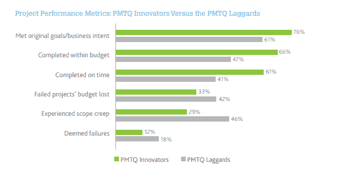
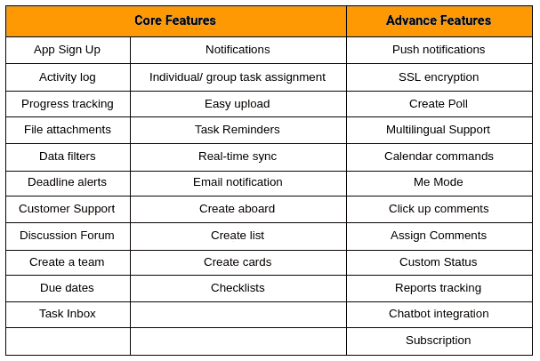

# 创建一个像 Trello 这样的项目管理 App 需要多少成本？

> 原文：<https://javascript.plainenglish.io/how-much-does-it-cost-to-create-a-project-management-app-like-trello-f3acb8f9f74f?source=collection_archive---------9----------------------->

如果有人问你们中有多少人正在使用并计划实施项目管理应用程序来简化日常业务运营，那么毫无疑问，20 人中有 15 人会回答这是组织工作场所的最佳方式。有了项目管理应用程序，不仅项目的执行变得更加容易，而且管理多项任务、会议和报告也变得非常快捷，不那么累人。

由于更有可能提供广泛的好处，全球各地的企业都倾向于项目管理软件，以提高他们的劳动力和标准化项目管理系统的效率。

然而，随着技术和企业需求的模式转变，Trello 作为一款独立的任务和项目管理应用程序而广为人知，它可以无缝满足个人和中小型企业的需求，在某些情况下也可以满足企业的需求。

此外，Trello 的特性和功能旨在通过创建项目时间表来改善内部和外部工作场所的沟通。

*无论你是初创企业还是领先的企业家，沟通都是成功的关键。*

[根据调查报告](https://www.shrm.org/resourcesandtools/hr-topics/behavioral-competencies/communication/pages/the-cost-of-poor-communications.aspx?utm_source=TheBriefLab&utm_medium=blog&utm_campaign=08102017)，员工不足 100 人的小企业因沟通不畅而损失 42 万美元，员工超过 10 万美元的公司将损失约 6200 万美元。

此外，新冠肺炎疫情和由此产生的 2020 年初的社交距离已经彻底改变了整个通信系统。因此，无论是被迫还是自愿，企业都开始寻找有效的解决方案来帮助管理远程员工。

**你不需要把我们的话，这里有一个市场统计一瞥:**

*   [*88%的远程工作者*](https://workplaceinsight.net/remote-workers-endure-poor-communications-and-working-practices/) *面临领导不一致和与其他团队成员沟通不畅的问题。*
*   **83%的员工表示被大量的电子邮件搞得精疲力尽。**
*   ***20%的员工认为难以应付的工作量是导致工作倦怠的头号原因。***

**因此，如果你怀疑雇佣一家 [**移动应用开发公司**](https://www.xicom.biz/services/mobile-app-development/) 来推出像 Trello 这样的项目管理应用是否值得，那么你需要知道 Trello 已经拥有来自世界各地的 2500 万用户，而 2019 年只有 1900 万用户，这使它成为团队互动、产品和项目开发最成功的应用之一。**

## **下面的统计数据说明了为什么它的需求量越来越大:**

*   **[66%使用项目管理软件的企业](https://www.pmi.org/-/media/pmi/documents/public/pdf/learning/thought-leadership/pulse/pulse-of-the-profession-2017.pdf)已经意识到他们已经在规定的预算内完成了项目。**

****

**[Image Source](https://www.pmi.org/-/media/pmi/documents/public/pdf/learning/thought-leadership/pulse/pulse-of-the-profession-2019.pdf)**

*   **项目管理工具和实践比手动管理一切节省 28 倍的资金。**
*   **47%使用项目管理软件的公司发现它对项目成本估算的准确性有积极的影响。**

**随着世界各地对项目管理解决方案的需求迅速增长，开发项目管理解决方案对于初创公司和爱好者来说是一个绝佳的机会。**

## **以下是目录:**

*   ***特雷罗到底是什么:深度评论***
*   ***在工作场所使用项目管理应用的好处***
*   ***项目管理 App 的目标受众:哪些人可以使用？***
*   ***如何开发像 Trello 这样的 App？***
*   ***做一个 Trello 这样的 App 要多少钱？***
*   ***如何从 Trello 这样的项目管理 App 中赚钱？***

**让我们深入了解每一点的细节，以深入理解好处、成本、流程、货币化战略等…**

## ****1。特雷罗到底是什么:一篇深度评论****

**在进入开发流程之前，您需要了解各种各样的应用程序开发。所以，让我们从基础开始…**

**Trello 最初是一个基于 web 的任务和项目管理应用程序，但如今随着各种技术和框架的出现，它也可以在桌面和移动设备上运行。这个特性使它很受欢迎，并鼓励企业开始使用这个有效的工具来创建待办任务，以便在承诺的时间框架内执行各种任务。**

**它是 60 年前引入的，基于看板方法，在零售和营销领域非常流行。这项技术实际上属于日本的“招牌”，这是该应用程序在电路板上提供详细和直观的工作流程的关键之处。**

**由于其丰富的特性和功能，它已经被从软件开发、市场营销到广告等各种商业领域的大量用户所采用。**

**为了让你知道如何有效地使用这个工具，Trello 展示了一些用例的例子，包括假期计划、健康饮食计划、会议计划、组织博客文章的想法等等。**

**如果你正在寻找一个类似 Trello 的任务管理应用程序如何为你和你的公司带来好处的灵感，那么请阅读下一部分！**

## ****2。在工作场所使用 Trello 这样的项目管理应用程序的好处****

**开始使用像 Trello 这样的项目管理应用程序将是一个合理的考虑，因为它为您提供了下面提到的众多好处:**

> ****商业利益****

*   **与团队无缝协作，让您与员工保持联系。**
*   **使您能够记录任务并使其成为可搜索的数据库。**
*   **增强的数据安全性和集成。**
*   **易于在一个地方组织和管理一切。**
*   **轻松跟踪您的工作效率和工作人员的生产力，因为所有任务都很容易找到何时分配以及完成的早或晚。**
*   **易于组织您的待办事项列表，并能够营销优先级。**
*   **用这些任务来计划你的一天、一周甚至一个月。**
*   **100%准确地管理您的资金和项目预算。**
*   **借助基于云的数据存储，随时随地管理您的公司和业务。**
*   **易于记录公司和员工的里程碑，并相应地跟踪公司的绩效。**
*   **在一个仪表板上规划您的所有媒体。**

> ***除了确保这些好处，它还能帮助你消除工作场所的问题，例如:***

> ****解决问题的方法****

*   **活动管理**
*   **产品管理**
*   **公司管理**
*   **消除管理重复性任务的麻烦。**

**到目前为止，您必须对 Trello 到底是什么以及它如何为您的业务带来好处有所了解。但是还有一个重要的问题没有得到回答——潜在的受众和目标市场是什么？**

## ****3。项目管理 App 的目标受众:谁会用？****

**毫无疑问，项目管理解决方案已经成为行业中的一个流行词，但在您 [**雇佣应用程序开发人员**](https://www.xicom.biz/solutions/hire-developers/) 来构建它并投入巨额预算之前，有必要了解您想要针对的是谁。**

**如果你没有瞄准正确的受众，即使推出一个有广泛功能选择的现代应用程序也是一种浪费。对潜在市场的深入了解将保证您获得更加满意的结果，并引导您朝着正确的方向前进。**

> **而 Trello like app 开发解决方案也不例外！**

**如上所述，像 Trello 这样的项目管理应用程序适用于中小型企业，甚至是各行各业的企业。正在寻找工具或解决方案来标准化其业务管理系统的企业可以使用该应用程序。**

**例如，Trello 的主要用例是——纽约时报、猫途鹰、童子军书籍等等。**

**现在的问题是如何开始应用程序开发流程？**

## ****4。如何开发一个像 Trello 这样的 App？****

**和其他应用一样，Trello 这样的项目管理应用也涉及一些基本步骤。因此，让我们从它们开始，并深入了解它:**

> ****A .了解推出 App 的目的****

**你是不是真的对 Trello 的成功率印象深刻，想尽快上手自己的商业解决方案？你对 [**雇佣一个移动应用开发者**](https://www.xicom.biz/offerings/hire-mobile-developers/) 的兴奋，如果你没有任何计划就直接进入应用开发的过程，很快就会变成一个大错。**

**应用程序开发是一个漫长而耗时的过程，需要大量资金来构建应用程序。但是如果你不清楚你的目标，不确定你想要达到什么，那么你就很难获得任何好处。**

**因此，基本上，一个成功的应用程序将有助于公司和企业，如它如何帮助您提高投资回报率，更强的效率，增强社会存在，以及更好的品牌认知度。**

****为了对自己的目标有一个清晰的认识，问自己以下问题很重要:****

*   **您企业的哪个部分需要改进？**
*   **应用程序如何帮助您解决问题？**
*   **你对申请有什么期望？**

**这些问题的答案将帮助您构建应用程序开发的进一步阶段。**

> ****B .做市场调查，分析竞争对手****

**不是直接用一个 app 打市场，重要的是进行市场调研，评估你的 app 创意，了解业务范围。永远不要低估测试和寻求对应用想法的洞察力的重要性。**

***这里有几个问题可以帮助你更好地进行市场调查:***

*   **推出一款应用的目的是什么？**
*   **你的目标是谁？**
*   **市场需要你计划推出的应用吗？**
*   **谁是你的竞争对手？**
*   **其他人在他们的解决方案中使用了哪些技术？**

**尽管这将帮助你了解你正在创建的应用程序的市场，并帮助你填补竞争对手留下的空白。**

> ****C .了解 Trello 等项目管理应用的特性和功能****

**不管你的应用想法有多独特或有用，你的解决方案的成功取决于它为用户提供的特性和功能。对项目管理解决方案的需求激增为爱好者抓住这一机会打开了大门，因此用户有各种应用程序可供选择。**

**但是，通过在您的应用中实现这种独特的创新功能，您可以脱颖而出，并能够在行业中树立标杆。因此，在这里，你选择与之合作的 [**应用开发公司**](https://www.xicom.biz/services/mobile-app-development/) 将发挥至关重要的作用，因为他们将每个功能转化为现实的方式，可以成就或摧毁你的业务成功。**

## **因此，我们在这里提到了一些核心和高级功能，以构建像 Trello 这样的应用程序。**

****

> ****D. UI/UX 设计****

**应用程序设计是你的应用程序的支柱，因为它帮助你抓住用户的注意力，漂亮的用户界面将帮助你让用户与应用程序保持更长时间的接触。那么，你的应用程序设计将会是什么样的呢？为了更容易理解，最好聘请一家软件开发公司来帮助制作线框。这是理解你的屏幕最终如何呈现多种视觉元素的最佳策略。**

**在你开始应用程序开发过程之前，重要的是要考虑线框图和原型来连接你的原始想法和最终产品。**

> ****E .选择正确的技术****

**这是你的应用程序开发过程中最关键的部分之一，以拥有正确的技术堆栈。由于根据开发平台选择合适的技术从来都不是一件容易的事情，因此 [**雇佣一名移动应用开发者**](https://www.xicom.biz/offerings/hire-mobile-developers/) 来处理这项任务是值得的。但是如果你了解这个应用的标准、预算和目标用户，那么继续下去就不会那么困难。**

**以下是针对项目管理应用程序开发的最佳技术堆栈建议:**

*   **对于 Android: Java，Kotlin**
*   **对于 iOS: swift**
*   **数据库:MySQL，MongoDB，Redis**
*   **支付网关:PayPal，Stripe，Braintree，Mangopay**
*   **云:AWS，Azure 女士**
*   **推送通知:Twilio、亚马逊社交网络、地图**
*   **分析:Gleam IO、谷歌分析、Spark**
*   **其他:RSpec，Phantom JS，PUMA server，PhoneGap，C++，Xcode**

> ****F .雇佣应用开发者团队****

**选择最好的功能和正确的技术并不意味着你赢得了比赛。独自开发一个像 Trello 这样的应用程序将是一项复杂的任务，所以你需要一个专业团队来处理这个复杂的项目。**

**因此，要开发像 Trello 这样的应用程序，你需要一个由以下人员组成的团队:**

*   **商业分析员**
*   **项目管理人**
*   **UI/UX 设计器**
*   **前端开发人员**
*   **后端开发人员**
*   **质量保证工程师**

**有了应用开发团队的正确选择，您可以轻松地将您的应用发布到应用商店，而没有任何被拒绝的风险，因为他们在开发应用时会遵守相应商店的指南。**

# ****5。做一个 Trello 这样的 App 要多少钱？****

**开发像 Trello 这样的应用程序的成本是企业最关心的问题，但不幸的是，构建应用程序没有标准成本，因为有多种成本影响因素会导致预算的巨大变化。**

***以下是深刻影响应用开发成本的几个主要参数:***

*   **你的应用想法有多复杂？**
*   **您选择哪个平台来启动您的应用程序？**
*   **您计划在您的应用中添加哪些特性和功能？**
*   **从哪里招聘应用程序开发团队？**
*   **你的项目投入了多少时间？**
*   **应用程序开发人员的每小时成本是多少？**

**请记住所有这些因素，开发一个具有基本功能的应用程序的平均成本在 25，000 美元之间，具有高级功能的成本可以达到 35，000 美元。**

**由于每个企业都有自己的要求，定制具有符合其需求的功能的应用程序将是一个很好的选择，但你在应用程序中添加的功能越多，成本就越高。但是，为了给你的业务增加优势，通过与应用程序开发公司合作来获得最佳功能和模式是很重要的。**

## ****6。如何从 Trello 这样的项目管理 App 上赚钱？****

**有各种各样的方法可以让你的应用程序赚钱，但是你正在构建的应用程序类型将决定哪种赚钱策略最适合你的应用程序类型。**

**在你开始雇佣一个移动应用程序开发者来定制其功能以赚钱之前，了解一下 Trello 过去是如何赚钱的是有意义的。**

**而 Trello 是一个遵循免费增值商业模式的网络应用。在这种货币化模式下，它免费提供服务和基本功能。但是所有的高级功能和服务都可以被订阅高级版本的人使用。**

**既然你也计划开发一款类似 Trello 的应用，那么你也可以利用 Trello 提供的这些盈利模式**

*   ****黄金款****

**Trello Gold 提供的大多数功能与基本功能相似。但为了提高工作效率和乐趣，用户可以在网络应用上使用一些附加功能。除了这些有趣的插件，用户还可以找到 800 多个表情符号、酷酷的背景和黄金会员贴纸，这些都能全面提升用户体验。**

*   ****商务舱****

**通过这种模式的订阅，多达 100 人可以访问该应用程序，并将成为多用户团队的理想选择。该选项主要关注协作、通信和更安全地共享信息。除此之外，业务模型还提供了对团队中私有和公共董事会的管理控制，并提供了管理和创建新董事会的机会。您还可以限制来自团队外部人员的邀请，并限制外部观察员。**

*   ****企业模式****

**除了业务模式之外，Trello 企业模式在团队成员通过新设备登录时，通过双因素身份验证(2FA)为您提供高级别的安全功能。通过订阅这种模式，企业可以为整个团队增加一层额外的安全保障。**

# ****结论****

**当计算像 Trello 这样的任务管理应用程序的最终成本时，重要的是要考虑到你计划在应用程序中包括的所有功能都会极大地影响估计。每个功能的定制都需要一定的时间。**

**此外，还有不同的专家参与到开发项目中，包括项目经理、软件开发人员、DevOps 工程师和 QA 专家等。但是通过雇佣一个 [**移动应用程序开发公司**](https://www.xicom.biz/services/mobile-app-development/) ，你将得到一个屋檐下的完整的应用程序开发团队，他们共同的目标是在有限的时间框架内提供无与伦比的高质量解决方案。此外，要建立一个像 Trello 这样的应用程序，你需要开发一个强大的应用程序后端和前端，使其在多个平台上无缝运行。**

**简而言之，如果你的品牌需要一个新的应用程序来帮助你在竞争激烈的市场中获得动力，那么是时候建立一个应用程序并扰乱市场以满足用户不断增长的需求了。在这种情况下，如果您需要一位 IT 顾问或一个团队来帮助您从规划、设计到开发，那么您可以 [***联系我们***](https://www.xicom.biz/contact/) 或在下面提出疑问。**

**========================================**

***更多内容请看*[***plain English . io***](http://plainenglish.io/)**