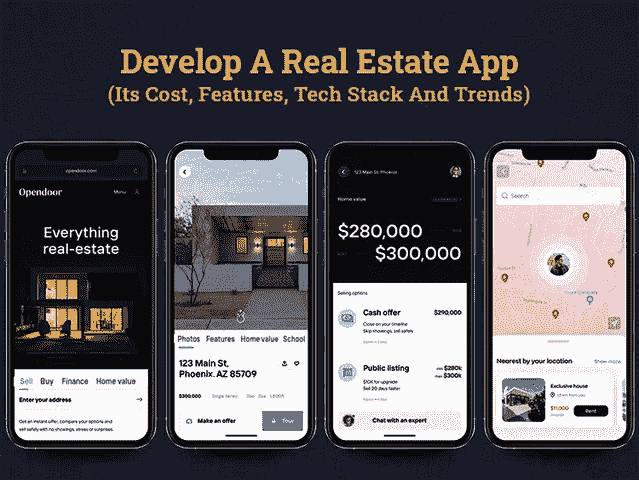
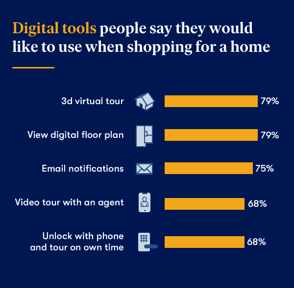
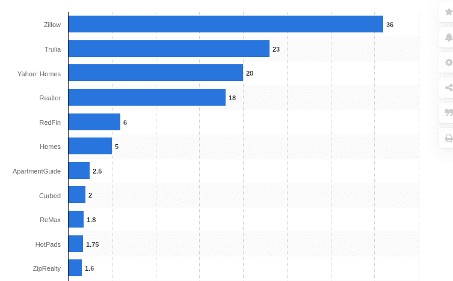

# 创建一个房地产应用程序需要多少钱

> 原文：<https://javascript.plainenglish.io/how-much-does-it-cost-to-create-a-real-estate-mobile-app-23f1cebe562b?source=collection_archive---------9----------------------->

## 创建一个房地产应用程序:它的成本，功能，技术栈和趋势

[dribbble](https://dribbble.com/shots/15242972-Font-and-layout-test/attachments/6991968?mode=media) by [Nicolas Solerieu](https://dribbble.com/SLRNCL) and [dribbble](https://dribbble.com/shots/15916819/attachments/7747340?mode=media) by [Dmitry Lauretsky](https://dribbble.com/dlauretsky)

无论是购买住宅还是商业地产，2021 年价格都在飙升，在预算内找到合适的住宿选择已经成为人们真正的斗争。

但那是过去的日子，人们想买卖他们的财产必须通过传统而复杂的程序。在数字化和新冠肺炎疫情大受欢迎之后，房地产应用已经成为行业的热门词汇。它已经成功地取代了所有的房地产经纪人，并使网上买卖房产的整个过程更加快捷、透明和方便。

**调查显示，2020 年超过 60%的房屋买卖双方对电子文件签署感到满意。**

**此外，* [*79%的美国人*](https://www.zillow.com/research/digital-tools-millennials-29101/) *表达了他们对使用 3D 虚拟家庭游览和数字平面图的兴趣，68%的人更愿意通过代理人进行视频家庭游览，而不是浪费时间亲自查看房产。**

**

*[Image Source](https://www.zillow.com/research/digital-tools-millennials-29101/)*

*世界各地的人们已经开始对在手机、iPad、平板电脑、笔记本电脑或其他设备上安装房地产应用程序表现出兴趣。*

*过去只能通过房地产代理商或经纪人获得的房产信息，现在可以通过搜索引擎和房地产移动应用程序轻松获得。*

*[90%的房地产公司](https://www.nar.realtor/sites/default/files/documents/2018-real-estate-in-a-digital-world-12-12-2018.pdf)都有自己的网站，上面有不同类别的房产列表，而 [97%的买家](https://cdn.nar.realtor/sites/default/files/documents/2021-home-buyers-and-sellers-generational-trends-03-16-2021.pdf)使用互联网搜索房产。在这种情况下，如果你还在用传统的传统方式管理你的房地产业务，那么你就直接把你的客户转给了你的竞争对手。*

*因为我们已经进入了这样一个时代，人们很乐意通过在移动应用程序上简单的滑动或点击来买卖一切，房地产行业也不例外。*

*因此，无论你是初创公司还是领先的房地产企业家，开发像 Zillow 和 Trulia 这样的移动房地产应用程序已经成为在 2021 年取得成功的当务之急。*

## ***创业公司为什么要开发 Zillow 或 Trulia 这样的房地产移动 App？***

**

*[Image Source](https://www.statista.com/statistics/381468/most-popular-real-estate-websites-by-monthly-visits-usa/)*

*谈到开发移动房地产应用，Zillow 和 Trulia 是房地产和房产领域的领跑者。虽然他们不是专门出售房屋，但他们通过使买卖过程更容易访问、更透明和更有洞察力的在线服务，为这一领域增加了巨大的价值。随着他们的应用程序采用最新的现代功能，他们真正改变了房地产的工作方式。*

## ***构建像 Zillow 和 Trulia 这样的房地产移动应用的好处***

*管理房地产业务始终是一项艰巨的任务，因为有几件事情要处理。但房地产应用程序开发可以完美解决所有这些麻烦。你所需要的就是雇佣一个移动应用开发者来利用下面列出的优势:*

*   ***品牌认知度:**开发优秀的房地产应用程序的最大好处是有助于提高品牌在访客、代理商和购房者中的知名度。*
*   ***改善沟通:**一款提供大量房源选择和出色沟通支持手段的应用将提高成功转化的几率。*
*   ***简化买卖过程:**一个精心设计的房地产应用程序可以让买卖双方的整个买卖过程变得更加简单快捷。尤其是当 [**软件开发公司**](https://www.xicom.biz/) 可以根据用户需求定制类似高级搜索过滤器、安排通话、定价、物业位置等核心功能的东西。*
*   ***客户支持:**用户总是喜欢在房地产等应用上获得 24*7 的客户支持，以获得关于代理的联系方式、物业位置、物业面积等所有必要信息。在房地产应用程序中实现聊天机器人将有助于你为用户提供无缝的客户支持。*

*如果你真的想让你的房地产业务更上一层楼，开发一个移动应用程序是一个完美的方法。你所需要的就是在你的移动应用程序开发中吸收新兴的数字趋势。*

## ***房地产行业最大的数字化趋势是什么？***

*毫无疑问，房地产应用的需求每天都在激增，移动应用给了你一个强大的工具来营销你的服务。然而，如何让你的应用程序在房地产市场上获得竞争优势是企业主要关注的问题之一。只要让你的应用程序跟上房地产行业的最新趋势，你就可以轻松避开你的竞争对手。*

*   ***使用人工智能算法***

*在当今时代，人工智能已经成为决定客户行为和提供卓越用户体验的重要因素。在房地产应用中使用人工智能工具将是一个有价值的决定。它可以让你存储用户的偏好，个性化的应用内提醒，并发送有针对性的通知，以提高你的转化率。领先的房地产应用程序 Trulia 也在使用同样的技术，将客户对其房源的需求增加一倍。要在你的应用程序中添加这一功能，建议聘请一家拥有人工智能定制应用程序专业知识的 [**应用程序开发公司**](https://www.xicom.biz/services/mobile-app-development/) 。*

*   ***360 虚拟家园之旅***

*根据研究，一旦买家登陆网站，他们会更喜欢通过虚拟家庭游览。这些家庭之旅帮助购房者获得一种感觉，这是他们一生中最昂贵的一次购买。Zillow 在 2019 年首次使用了 3D home 功能，为用户提供了无缝的房地产购买体验。*

*   ***利用大数据技术***

*通过在您的房地产移动应用程序中实现这一技术，您可以允许用户从不同角度比较属性，并让他们做出最佳决定。大数据算法可以为您提供其他属性的准确估计，并允许用户访问基于大数据算法的属性值。*

**现在，我们来了解一下这些新兴技术如何为行业参与者提供支持，并让他们统治房地产移动应用行业。接下来，是时候看看让您的应用程序无缝运行的房地产移动应用程序功能了。**

# ***2021 年一个房产移动 App 的成功，有哪些特性在起作用？***

*当你计划开发像 Zillow 或 Trulia 这样的顶级房地产移动应用程序时，你需要了解这些应用程序成功背后的秘密。有各种各样的因素，如品牌形象、应用程序界面等等，都有助于它的成功。但最重要的是，以客户为中心的功能集是吸引客户的最佳因素，有助于你的应用程序在市场上获得巨大成功。*

> ***那么我们来看看房产 App 开发必备功能和成本估算:***

*   ***轻松登录或注册:**这是您的应用程序的基本功能，所以请确保您集成了多个登录程序，以便用户更容易访问该应用程序。这意味着您可以通过使用电话号码、电子邮件地址、社交媒体帐户、谷歌帐户等来增加访问登录页面的灵活性，以确保无压力登录，并提高用户保留率。此外，通过在用户手机上发送验证码来确保双向认证过程，以使您的应用程序更加可靠和可信。*
*   ***数据库:**与应用成功或核心功能相关的一切都主要取决于将数据库集成到您的房地产移动应用开发过程中。它越全面、更新，就越有可能让你的用户对这个应用保持兴趣。*
*   ***搜索和过滤:**这是你的应用的基本特征之一。一旦用户登陆应用程序的主屏幕，属性识别和过滤是他们可能在你的应用程序上做的第一件事。您可以 [**雇佣移动应用开发者**](https://www.xicom.biz/offerings/hire-mobile-developers/) 定制该功能，并向平台添加任意数量的入围功能或过滤器。这将使您的最终用户对您的平台的可靠性有更大的了解。*
*   ***地理位置/地图:**要使您的应用程序正常运行，重要的是要有适当的地图集成，以帮助用户在首选位置找到房产。这是确保购房者能够在正确的时间到达正确的地点的唯一方法。为了让您的应用程序无缝工作，您还可以考虑在应用程序中集成一个智能地图功能，它可以快速帮助发现与学校、银行、医院等关系密切的地方。*
*   ***房产照片:**没有发布高分辨率房产图像的房产应用或房产列表应用不完整。确保卖家或业主会用最少的照片来展示房子或商业空间的内部和外部。*
*   ***虚拟视频:**另一个重要特点是，你不能冒险在你的房地产应用程序中跳过。建筑物的虚拟视频有助于企业将客户转化为潜在客户。最好的房地产移动应用程序开发人员会为您提供具有高级 3D 房产视图功能的一流房地产应用程序。*
*   ***添加房产详情:**每个人都希望从当地政府或邻居那里购买一处没有争议或义务的房产。领先的房地产应用程序提供完整的物业详细信息，包括最近的空间、学校、地标、便利设施等。有了这些细节，顾客可以挑选符合他们需求和文化的合适的酒店。*
*   ***多物业列表:**多物业列表功能的集成将允许客户从各种类别中找到一系列的物业。代理商可以展示不同类型的各种建筑或公寓，这些建筑或公寓拥有满足用户需求的世界级设施。*
*   ***推送通知:**这个功能的正确实现可以为你提供太多的增长，所以值得考虑人工智能来跟踪客户行为，并相应地使用有针对性的通知。通过在应用程序中加入推送通知功能，您可以让用户随时了解消息服务，并让他们随时了解新的列表或任何其他优惠。*
*   ***日历:**该功能非常方便，尤其是对于利益相关方的房地产代理方，因为它将帮助他们跟踪房地产买方/卖方会议。*
*   ***保存搜索和收藏列表:**为了留住用户，应该允许他们创建一个可以返回的属性和搜索列表。这也有助于代理确定用户的兴趣，以便他们可以提供类似的选项。返回到他们最喜欢的列表的功能应该很容易在用户的个人资料上访问。*
*   ***应用内消息**:要想与代理商、中介和购房者即时沟通，应用内消息功能是必不可少的。他们不仅可以互相发短信和电子邮件，甚至还可以发送文件和附件。此外，您可以要求您的 [**移动应用程序开发公司**](https://www.xicom.biz/services/mobile-app-development/) 实现语音和视频通话，以及添加多种通信模式。*
*   ***评级和评论:**添加提交评论或评级的选项，以便其他用户可以建立对该应用的信任。*

*这些是构建一个房地产移动应用程序的几个基本功能，需要 1600 多个小时，可能需要 35，000 到 40，000 多美元。但是，假设你正虎视眈眈地想要开发一个可以征服世界并为你的企业增加竞争优势的应用程序。在这种情况下，您可以将预算增加到 50，000 美元以上，并考虑实施以下提到的高级功能。*

> ****高级功能打造房地产移动应用****

*   ***房产成本和抵押贷款计算器:**房产买卖涉及复杂的计算，以确定它们是否符合你的预算。有了内置计算器，用户可以更容易地了解首付、税收、利息，而抵押贷款可以包括每月付款、税收和保险。*
*   ***聊天机器人:**通过聊天机器人的集成和在线聊天，用户可以得到他们问题的即时回答。常见问题可以用自动消息来回答，用户将能够毫不费力地了解更多关于该应用程序的功能。*
*   ***管理面板:**这个功能对代理商、物业经理和房东非常有用，因为它可以帮助各方监控他们的收入流。借助该功能，租赁机构可以从租赁应用程序中访问信用报告，并查看其租户的租赁历史。*
*   ***趋势属性列表:**该功能将帮助用户确定哪些建筑是流行的，哪些区域需求高。*
*   ***奖励和忠诚度计划:**这是一个可选功能，但总能吸引用户的注意力，并加强与应用程序的联系。房地产公司可以在每次购买时提供奖励，并允许客户在需要时兑换奖励。*
*   ***快速社交分享:**该功能允许用户与朋友和其他家庭成员分享房产。除了推广你的品牌或房产，社交分享功能还能帮助企业聪明地创收。*

*这些是您可以选择实现的附加功能，以扩展您的房地产应用程序的功能，并使您的用户乐于访问您的应用程序。*

*现在的问题是如何搭建一个房产 App？如果你梦想拥有一个像 Zillow 或 Trulia 这样的房地产或财产列表应用程序，那么你需要考虑一个技术堆栈，使软件开发公司能够构建 power-pack 后端，并使你的应用程序平稳运行。*

## ***如何开发像 Zillow 这样成功的房地产应用:背后的技术支持***

*所以你最终决定建立一个类似 Zillow 或 Trulia 的房地产应用程序。在你向下滚动以确定它最终花费你多少钱之前，有一个关于创建一个具有强大后端的房地产应用程序的想法是有意义的。*

> **这里列出了在房地产应用程序开发过程中可以使用的有价值的工具:**

*   **首选编程语言:原生 Android 用 Java 和 Kotlin，原生 iOS apps 用 Swift 或 Objective C，跨平台 app 开发用 React Native 或 Flutter。**
*   **数据管理:Real 和 CoreData，用于管理 app 中保存的属性列表**
*   **亚马逊 S3:云存储**
*   **脸书 SDK:用于集成脸书登录选项**
*   **SimpleRets，iHomeFinder，Spark APIs:标准化 MLS 数据流**
*   **Mapbox 或谷歌地图 API:构建自定义地图**
*   **Google Places API:为用户提供当地的详细信息**

*如果你选择 [**雇佣一个应用程序开发人员**](https://www.xicom.biz/solutions/hire-developers/) ，那么确保你让你的专家使用这些技术来创建一个强大的应用程序后端，并让它在多个平台上运行。*

# ***做一个房产移动应用需要多少钱？***

*至此，你一定很好奇房地产 app 开发要花你多少钱？但不幸的是，这个问题没有明确的答案，因为有多种因素影响着成本。如果不深入研究这些因素，获取现实生活中的应用程序开发评估是很复杂的。*

*一些重要的成本影响因素包括产品复杂性、特性和功能的数量、开发成本的大小、您选择启动应用程序的平台、您用于应用程序开发的技术、UI/UX 设计等等，这些都被认为是一些典型的成本影响因素。*

*如果您想要创建一个运行上述功能的房地产应用程序，并使用与上述相同的技术堆栈构建，应用程序开发成本将为 50，000 美元以上。*

*在分析了上面列出的技术堆栈和我们在上面分享的功能后，我们确定了这个基本范围。尽管如此，上述设置中的任何修改都会带来成本和时间的变化。因此，我们始终建议，咨询跨平台 [**应用程序开发公司**](https://www.xicom.biz/services/mobile-app-development/) 将是评估准确项目评估的良好开端。*

> ***要求团队构建 Zillow 或 Trulia 等房地产移动应用***

*无论你的应用想法有多棒，你选择实现什么特性和功能，你的移动应用技术有多先进。你的应用程序的成功很大程度上取决于你雇佣的开发团队以及他们为你的项目投入的专业知识和技能水平。*

*因此，要构建一个成熟的房地产移动应用程序，你需要一个拥有相关行业经验的专家团队，并拥有将这种类型的应用程序创意转化为业务增长产品的技能。在这里，您可以了解构建房地产移动应用程序所需的专家团队:*

*   **项目经理**
*   **前端开发者**
*   **后端开发者**
*   **商业分析师**
*   **UI/UX 设计师**
*   **QA 专业人员**

*根据专家所在的地区或地点，雇佣一个专门的应用程序开发团队的成本会有很大差异。此外，他们在领先技术、处理项目复杂性的知识和能力方面的专长也很重要。*

*在印度，应用程序开发人员的每小时成本从 15 到 20 多美元不等，而欧洲是雇佣应用程序开发人员最昂贵的地方，因为他们的每小时成本在 100 到 150 多美元之间。所以在你雇佣一个移动应用开发者之前，有必要弄清楚他们的小时成本以及他们为你提供的服务水平。*

# ***结论***

*房地产市场正在快速繁荣，没有任何下降的迹象。通过房地产移动应用程序，代理机构可以在线销售、租赁或出租住宅或商业建筑。因此，如果你是一家房地产公司，并最终决定建立一个房地产移动应用程序，你需要聘请一家 [**应用程序开发公司**](https://www.xicom.biz/services/mobile-app-development/) 来推动你的在线业务增长。它可以提升您的品牌，帮助代理商直接与潜在客户沟通，扩大市场覆盖范围，提高客户保留率，等等。*

*希望通过这篇博客，你对有价值的特性、技术和应用程序开发成本有所了解。但是如果你已经准备好成为这个蓬勃发展的行业的一员并保持竞争力，那么请联系我们并在下面留下你的疑问。*

**更多内容请看*[***plain English . io***](http://plainenglish.io/)*