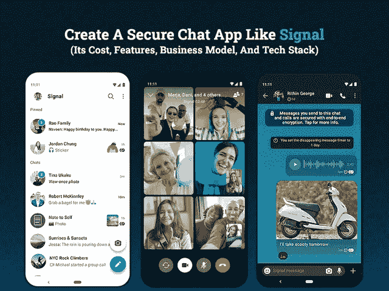

# 创建一个像 Signal 这样的安全聊天应用程序需要多少成本

> 原文：<https://javascript.plainenglish.io/how-much-does-it-cost-to-create-a-secure-chat-app-like-signal-919172c940ff?source=collection_archive---------9----------------------->

## **创建一个类似 Signal 的安全聊天应用:它的成本、功能、商业模式和技术栈**

毫无疑问，新冠肺炎的毁灭性影响彻底改变了人们的沟通方式，并使他们迅速转向这类应用程序，帮助他们在这样的不确定时期保持联系。

来自 [Statista](https://www.statista.com/statistics/258749/most-popular-global-mobile-messenger-apps/) 的报告显示，每月有 20 亿用户访问 WhatsApp messenger，该应用在美国以外市场的使用渗透率尤其高。

但话说回来，Whatsapp 因推动用户接受新的数据共享政策而受到普遍批评。随着广泛的安全威胁、数据泄露和帐户黑客攻击的出现，应用程序隐私和数据安全已经成为用户关注的焦点。这就是 Signal 等高度安全和完全加密的消息应用在该领域一枝独秀的原因。

你一定在想，这个聊天 app 背后有什么神奇的口头禅？到底是什么让它在市场上脱颖而出！

Signal private messenger 的独特之处是什么，Signal 是如何工作的，为什么它被认为是市场上最安全的免费消息应用程序？搭建一个 Signal 这样的聊天 app 要多少钱？让我们详细回顾一下 Signal messenger 应用程序，以获得这些问题的答案。

## **什么是信号信使应用程序，它是如何工作的？**

在我们深入了解这款应用的多重安全和加密标准之前，让我们先了解一下这款应用的基础知识…

A signal 是一款跨平台聊天 app，由 Signal Technology Foundation 和 Signal Messenger LLC 开发，成立于 2014 年。这款应用可以让用户进行一对一的交流和群发信息，还可以分享文件、语音记录、图像和视频。除此之外，该应用程序支持一对一和群组音频和视频通话，没有任何数据泄露或帐户黑客的风险。

此外，记住隐私是最重要的，应用程序上的所有消息和呼叫都是端到端加密的——甚至连 Signal 都无法访问用户数据。

如果你在想这也是 Whatsapp 最初向你承诺的？那么它在安全环境中有什么不同呢？让我们了解它是如何工作的…

## **信号聊天 App 真的安全吗？**

全球数十亿用户正在使用消息应用。事实上，如果只考虑 Whatsapp 和 Facebook Messenger 的用户群，它占全球 15 亿用户。尽管如此，如果应用程序开发中存在缺陷，数十亿用户的数据就会受到威胁。实现正确技术的一个简单方法是 [**雇佣移动应用程序开发者**](https://www.xicom.biz/offerings/hire-mobile-developers/) ，他们在构建像 Signal 这样的消息应用程序方面有专长。

但是万一，如果你想知道 Signal app 安全背后到底是什么，那么我们在这里揭示了这个秘密。

该应用程序主要使用端到端加密，这意味着所有的信息在发送前都被加密。阅读这些信息的唯一方法只有在发送者或接收者的设备上。

此外，Signal private messenger 应用程序依赖于以下加密协议来确保防止中间人攻击。

*   *扩展的三重 Diffie-Hellman (X3DH)*
*   *双棘轮算法，Curve25519*
*   *AES-256*
*   *HMAC-SHA256*

## **聊天应用中使用不同的安全方法作为相似信号**

尽管 Whatsapp 是广泛使用的聊天应用之一，确保你对聊天进行端到端加密，但它未能获得最安全和加密的消息应用的称号。Whatsapp 在 2021 年 1 月的隐私政策噩梦粉碎了一切，并让 Signal 占据了这场秀的势头。

随着这种高度独特和不同的安全功能的实现，Signal 已经成为最安全的聊天应用之一。

> 以下是 Signal 为增强用户体验而采用的最佳安全方法。

*   **没有端到端强加密用户的内容记录**

凭借强大的端到端加密通信功能，Signal 在市场上获得了新的人气。这意味着所有交换的消息都是端到端加密的，因此，除了上次登录时间外，该应用程序无法跟踪你的通话、文本或任何其他内容。通过应用程序共享的每条消息或数据将只对您和您的聊天对象可见。

*   **屏幕上的锁销或触控 ID**

虽然每部智能手机都有这个功能，可以在屏幕上放置一个安全 PIN。但是，Signal 可以让你通过添加屏幕锁定 PIN 或 touch ID 来访问应用程序，从而增加一层安全性。为了给你的聊天应用增加额外的安全层，你可以 [**雇佣一个精通定制此类消息应用的应用开发者**](https://www.xicom.biz/solutions/hire-developers/) 。

*   **限制在锁定屏幕上弹出的聊天内容**

当你的信息出现在你的锁屏时，你会感到恼怒吗？更糟糕的是，当它被站在你旁边的人看到时，你会感到恼怒吗？因此，不是显示整个信息在屏幕上，你将只被通知发件人的名字或通知说“新信息”。

*   **自毁消失的消息**

你是担心被抓还是需要销毁证据？

代替手动删除信息，功能信号的“消失信息”可以帮助你从你的设备上抹去所有这样的信息。没有办法找回那些聊天记录。

*   **屏蔽信号截图或通知用户**

通过遵循 Signal 的安全克隆，一个 [**应用程序开发公司**](https://www.xicom.biz/services/mobile-app-development/) 可以在应用程序内添加一个至高无上的隐私保护层。此外，与 Snapchat 类似，你可以在任何人捕捉聊天截图或应用程序中的任何其他内容时通知用户。

这些是建议你在聊天应用中实现的最多的安全功能。虽然创建一个应用程序的过程不会像你在这里假设的那样简单，所以我们在这里建议你聘请一个移动应用程序开发人员来处理项目。

# **如何创建一个类似 Signal 的消息类 App？**

在这个高度数字化的时代，由于方便，平均每个人都在使用不止一个消息应用。但是你有没有想过到底是什么让这些应用变得如此容易使用和方便呢？

是的，只有它的特性和功能对 Signal 的开发过程有很大的贡献。

因此，如果你是一个新手，想从基础开始了解它的功能，那么这里我们为你提供了一组基本功能，应该结合这些功能来构建最安全的消息传递应用程序。

> 让我们直接深入了解它们是什么:

*   **注册/登录:**允许用户根据自己的方便使用不同的选项注册应用程序。一般来说，有三种方式注册任何应用程序——使用电话号码、电子邮件 ID 或社交媒体帐户。但和 Whatsapp 一样，聊天应用通常是通过电话号码来评估的。
*   **个人资料定制:**由于用户个人资料存储了个人信息以及其他重要功能，如个人资料图片、添加联系人、设置等。添加选项，通过更改个人资料图片对个人资料进行个性化设置，管理通知和更改联系人设置。
*   **推送通知:**通过实施该功能，您可以将留存率提高三倍，并提高用户参与度。这一功能不仅可以提醒用户收到的消息，还可以在他们的收藏夹上线时通知他们，联系加入应用程序，阅读消息或更多。如果你有兴趣知道推送通知如何影响你的业务，请联系一家 [**应用开发公司**](https://www.xicom.biz/services/mobile-app-development/) ，他们将帮助你整合这些技术，使这一功能真正适合你的业务。
*   **应用程序设置:**允许用户根据自己的方便调整应用程序的设置。
*   **文字聊天:**为了满足用户的现代需求，请确保您的消息应用程序支持一对一和群聊。
*   **音频/视频通话:**为了与其他领先的聊天应用竞争，在你的应用中加入音频/视频聊天功能非常重要。此外，即使网速很慢，也能保持高质量的通信。
*   **消息消失:**通常聊天在其他消息应用程序中很容易访问，但通过添加该功能，聊天一旦打开就会自动消失。因此，用户可以设置一个定时器来销毁他们的聊天或媒体文件，而不用手动删除它们。
*   **联系人同步:**要让你的应用发挥作用，添加联系人同步功能很重要，这样用户就可以顺畅地交流了。
*   **文件传输:**通过 app 提供共享文件、图片、文档。
*   **两步认证:**为确保更好的用户数据保护，增加通过指纹、pin 码或验证码或链接的两步认证。

*这些是消息应用的一些基本功能，构建这些功能需要大约 800 多个小时，成本在 20，000 美元之间。*

但是如果你期待 [**雇佣一个移动应用程序开发者**](https://www.xicom.biz/offerings/hire-mobile-developers/) 来构建一个与众不同的点对点聊天应用程序，那么你需要将你的应用程序升级到下面提到的这些高级功能。

## **2021 年打造信号类消息应用的高级功能**

*   **贴纸和 gif:**像所有其他领先的消息应用程序一样，将流行的 gif 和广泛的贴纸选择集成到其界面中，使整个对话更有吸引力，更有趣，将这一功能添加到您的应用程序中是一个合乎逻辑的考虑。
*   **邀请好友:**如何创建新的聊天群，是大多数用户在 app 上首先考虑的问题。因此，通过添加访问用户通讯录的“邀请朋友”功能，并允许用户直接向他们希望添加到应用程序的联系人发送邀请链接，可以使这一过程变得简单易行。
*   **隐私设置:**既然 Signal 已经赢得了最安全消息应用的称号，那么要求你的应用开发者遵循 Signal 提供的隐私设置就很简单了。
*   **VoIP:** 在开发类似 Signal 的 messenger 应用程序时，网络电话是一个重要的考虑因素，它可以提供稳定的互联网连接，以确保高质量的通信体验，即使您的互联网速度很慢。
*   **共享功能:**除了共享文件、文档和图像，Signal 等消息应用程序还允许用户与其联系人或群组共享媒体、联系人、位置等信息。
*   **私人或秘密聊天:**加入可锁定聊天或消失聊天等功能将是你成功的关键。像 Telegram 一样，你的应用程序不仅会在你退出应用程序后消失聊天，而且也不会存储在云服务器上。
*   **为所有人删除:** Signal 让用户为所有人删除误发的消息，首选 [**应用开发公司**](https://www.xicom.biz/services/mobile-app-development/) 会知道如何在你的聊天应用中实现这个功能。

这些是您可以考虑在应用中实现的少数高级功能，但你们中的许多人都面临压力，不知道如何为应用定制选择好的技术堆栈。

> 下面是下一节的答案！

## **开发类似 App 的信号的技术堆栈**

当构建一个像 Signal 这样的消息应用程序时，谈论技术堆栈是重要的考虑因素之一。选择正确的技术不仅会给你带来最好的结果，还会让你的聊天应用无缝运行。因此，在您直接进入雇用 Android 应用程序开发人员或 iOS 应用程序开发人员的流程之前，有必要先睹为快，了解一下您可以考虑在解决方案中实施的最新技术。

***谷歌 Play 商店的 Messenger App Like Signal/*安卓原生 App 开发**:

*   Kotlin 或 Java 是最常用的编程语言。
*   使用的网络:Retrofit2，OKHttp 3
*   数据库:SQLite，房间
*   JSON 解析:Jackson，Gson

***Messenger App For Apple Store/iOS App 开发喜欢信号***

*   Swift 是构建 iOS 原生应用最常用的编程语言。
*   网络:Alamofire
*   JSON 解析:Glide

***技术栈，开发 Signal*** 等消息应用的后端

*   编程语言:JavaScript 或 Node.js
*   框架:快速 4
*   数据库集:MySQL
*   API 文档:Swagger
*   基础设施:AWS

选择最佳的技术组合将有助于你获得超越竞争对手的优势，但是你的应用程序的成功将主要取决于你为这个项目雇佣的专家团队。他们在应用程序开发过程中投入了哪些技能和专业知识？在你雇佣一个应用程序开发团队来构建像 Signal 这样的应用程序之前，验证技术专长和对新兴技术的深入了解是最重要的参数。

## **开发一个像 Signal 这样的消息应用需要多少成本？**

无论你是创业公司还是创业者，搭建一个像 Signal 这样的消息类 app 需要多少成本是大家最关心的问题之一？

然而，很难对像 Signal 这样的消息应用程序进行最终成本估计，因为不同的企业有不同的要求，因此应用程序开发成本和时间也会有所不同。

与其他移动应用程序开发一样，应用程序开发的成本估算取决于几个因素，因此以下是您应该了解的主要成本和时间影响因素:

*   **功能集:**根据功能的复杂程度(基本/中等/高级)，应用程序开发时间和成本可能会有很大差异。
*   **UI/UX 设计:**这是指 app 的用户界面。你的应用程序设计越复杂，成本就越高。
*   **应用开发者**:您可以根据项目需要聘请跨平台应用开发者/原生 Android/iOS 应用开发者。
*   **App 测试:**测试人员必须涉及各种测试模块来识别 app bugs。
*   **团队规模:**业务分析师、项目经理、App 测试员、App 开发者、UX/UI 设计师。

这些是应用程序开发成本的主要影响因素，进一步取决于应用程序开发人员的每小时成本，从 20 美元到 25 美元不等。

如果谈到具有上述基本功能的信号应用程序的开发成本，那么这种消息应用程序的开发成本大约在 30，000 美元到 35，000 美元之间。

根据平台的选择，成本也会有很大的不同。开发一个跨平台的消息应用比开发两个不同平台的原生应用成本低 40%。比方说，如果一个 iOS 应用程序的价格在 25，000 到 30，000 美元之间，一个 Android 应用程序的价格在 25，000 到 30，000 美元之间，那么一个跨平台应用程序的价格将在 30，000 到 35，000 美元之间。

这些都是粗略的估计，所以最终的成本会根据你的需求，你雇佣的 [**应用开发公司**](https://www.xicom.biz/services/mobile-app-development/) ，你使用的技术以及你选择的应用发布平台而有很大的不同。

## **开发像 Signal 这样的消息应用值得吗？**

当谈到建立一个像 Signal 这样的全新消息应用程序时，你一定会担心如何在 Whatsapp、Telegram、Facebook Messenger 等应用程序已经领先该领域的情况下，让你的应用程序处于市场曲线上。

但是要在这个竞争激烈的市场中生存，你所需要的就是独特的调整和术语。您的创新应用开发策略和独特功能的选择将帮助您获得超越竞争对手的优势。

随着当今数字世界对用户数据的安全性和隐私性的需求不断增加，推出 Signal 这样的实时消息应用程序将是一个值得做出的决定，以满足市场不断变化的需求。

尽管该市场已经被少数通讯巨头所主导，但该行业仍有空间容纳这种集成了所有新聊天功能的高质量、安全的应用程序。

因此，要开发一个像 Signal 这样的安全实时消息应用，你需要这个领域的专业开发人员的专家帮助。应用程序开发团队的正确选择将帮助您在市场中脱颖而出，并使您能够树立强大的基准。

# **结论**

随着智能手机使用的增加，用户平均每月访问 40 个应用程序。但是安全性是每个人无畏地访问应用程序所要求的。因此，如果你准备创建一个像 Signal 这样的消息应用程序，那么你可以考虑这个博客来了解与这个应用程序相关的一切。但与其复制应用程序，更明智的做法是雇佣一家 [**移动应用程序开发公司**](https://www.xicom.biz/services/mobile-app-development/) 帮助你定制符合你需求和预算的应用程序。

因此，如果您有任何关于构建 messenger 应用程序的想法，或者您需要任何关于您可以为您的企业开发什么类型的消息应用程序以及您应该实现什么功能的帮助，那么建议您 [***联系我们***](https://www.xicom.biz/contact/) 并在下面提出疑问。

*更多内容请看*[***plain English . io***](http://plainenglish.io/)