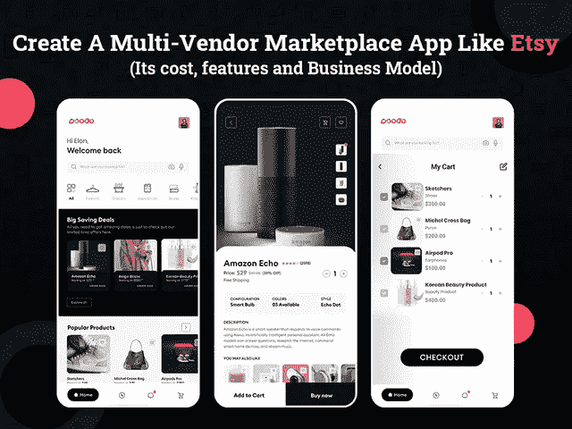
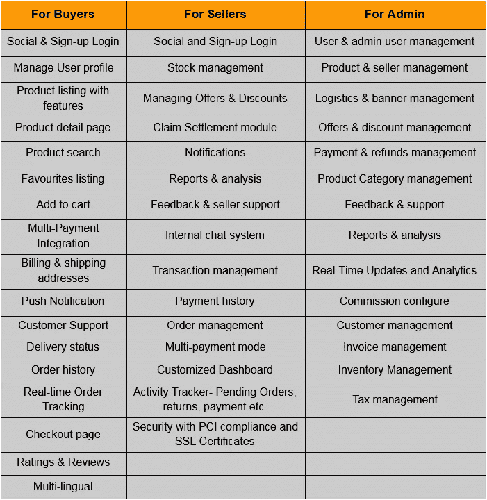

# 创建一个像 Etsy 这样的购物应用需要多少成本

> 原文：<https://javascript.plainenglish.io/how-much-does-it-cost-to-create-a-shopping-app-like-etsy-3f428389518f?source=collection_archive---------20----------------------->

## 创建一个像 Etsy 一样的应用程序:它的成本、功能和商业模式

开发一个买卖手机 app？创建一个像 Etsy 这样的购物 app 需要多少成本？如果这是你脑海中的主要问题，那么这篇博客中的细节将帮助你理解为什么你应该创建一个像 Etsy 这样的市场应用程序，它将花费你多少钱，以及它支持什么功能。

毫无疑问，在过去十年中，数字化对市场的新兴影响已经彻底改变了消费者的心理，并导致了在线市场的巨大转变。随着网上购物越来越流行，顾客愿意尝试新的时尚趋势、美容产品、生活方式等等，网上购物已经获得了最大的市场份额。

就像脸书、Instagram、WhatsApp 是社交媒体应用的热门领导者一样，Etsy 也是多供应商市场应用的巨头——将买家和卖家带到一个平台。

由于 Etsy 是在线市场领域的主导品牌，因此，大多数新兴企业的目标是复制商业模式，并像 Etsy 一样建立自己的数百万美元的业务。但是，在你开始复制 Etsy 的成功之前，你需要了解到底是什么让它在如此激烈的竞争市场中脱颖而出。

## 为什么开发 Etsy 这样的市场应用是一个有利可图的想法？

随着数以百万计的供应商在网上向全球客户销售他们的产品，Etsy 成为行业的主导名称，并激励着那些想要创造一个增长、维持和发展的市场的人。Etsy 仍在发展的主要原因是它经常采用新的用户友好的功能和流程。

与其他市场应用程序不同，Etsy 拥有一个独特的手工艺品、复古商品和手工艺品市场，并为多家供应商提供了成为这一蓬勃发展的行业的一部分的巨大机会。

> ***类似 Etsy 的 marketplace app 可以执行以下任务:***

*   *您可以保存物品和商店，以便用户以后再次访问相同的商店和产品。*
*   *订单发货后，会通过实时发货跟踪链接通知客户。*
*   *它有一个选项，可以将顾客直接连接到店主，让他们的疑问得到解答。*
*   *允许您根据您的视觉搜索和个人喜好探索精选推荐。*
*   *完整套件安全支付选项的集成确保了在 Android 和 iOS 上的无缝支付。*

听起来很简单？一些从其他市场转移过来的用户认为 Etsy 是一个更加简化、易于导航、大范围个性化和定制化的产品列表。如果谈到界面，Etsy 有一个更吸引人、主动和用户友好的外观，可以立即抓住用户的注意力，吸引他们更长时间，让他们在检查完他们选择的产品后离开网站。

希望你已经准备好了 Etsy 的应用程序结构，并希望 [**雇佣一名移动应用程序开发者**](https://www.xicom.biz/offerings/hire-mobile-developers/) 。但你们中的许多人仍然在寻找“开发一个像 Etsy 这样的在线市场及其流程需要多少成本”。但在此之前，你需要了解是什么特性和功能赋予了这个应用。您为应用程序设置的功能和复杂性的选择，将在决定市场的应用程序开发成本方面发挥重要作用。

# **帮助您构建成功市场应用的主要特性和功能**

开发像 Etsy 这样的市场应用程序是一项艰巨的任务，因为卖家可能希望创建一个单独的应用程序面板，在那里他们可以列出产品的最终数量，并使他们能够毫无争议地管理发货。而客户则在寻找具有多种功能的面板，使他们的搜索和购买更容易。但如何建立一个像 Etsy 这样的买卖市场应用程序是一个大问题。

> 这里我们提到了应该集成到每个面板中的基本功能列表。

如果您是一家新兴企业，非常关心创建像 Etsy 这样的买卖市场应用程序的成本，*可以选择从这些特性和功能开始，这些特性和功能的成本可能在 20，000 美元到 25，000 美元以上，然后扩展一个具有如下所述高级特性的应用程序:*

## **价格对比**

通过整合这一功能，客户可以轻松分析不同买家的产品成本，从而做出更好的决策。人们可以将此作为一种促销策略，如提供折扣，甚至重新评估价格点，以吸引更多的客户购买他们的产品。

## **自动计税**

这一功能主要是为卖方小组提供的，帮助他们更好地管理税收计算，并将放弃税收政策的风险降至最低。

## **多种货币和语言支持**

如果你试图瞄准一个拥有不同语言和文化的全球市场或地区，那么添加多种货币和多种语言的功能会给用户带来更个性化的购物体验。

## **忠诚度计划**

忠诚度计划可以通过两种方式发挥作用。首先，当你在购买的最后行动上奖励他们的时候，它能增加客户在你的平台上的长期参与。第二，当目标达成时，给予销售者利益。

## 聊天机器人

通过集成基于人工智能的聊天机器人，为你的应用程序添加客户支持，这些聊天机器人可以实时处理买家和卖家的常见查询。

## **出货追踪**

客户总是希望对他们的订单有一个完整的记录，什么时候发货，什么时候送货。此外，您还可以为用户添加选项，以提及更好的可用时间或安排任何人接受订单。

## **短信网关 API**

要添加此功能，您可以选择 [**雇佣应用程序开发人员**](https://www.xicom.biz/solutions/hire-developers/) ，因为短信服务似乎最适合市场平台中的客户服务。无论是订单确认、取消、发货通知还是任何奖励，用短信服务做好记录。

## **基于人工智能的语音/图像搜索、个性化推荐、客户行为跟踪**

对企业来说，在你的市场应用中实施人工智能可能是一个有价值的决定，因为它可以帮助你预测、感知和自动化这个过程。其实可以帮你迎合更好的用户体验，增加品牌美誉度。

## **应用内聊天/通话/相机**

为了使卖家和买家之间的整个沟通无缝，整合这三个 C 变得至关重要。摄像头将有助于客户给出公平的产品评价，而聊天和电话可以帮助联系客户服务或交付主管。

## **电话号码屏蔽**

为了提高客户个人信息的隐私性，marketplace 应用程序在其应用程序中广泛使用电话号码屏蔽功能。

*如果您计划构建一个预算估计在 50，000 美元以上的高级多厂商市场应用程序，那么这些是推荐纳入的几个特性。休息一下，如果你还在纠结“创建一个 Etsy 这样的购物 App 需要多少钱？”那么建议聘请一家软件开发公司，可能会更好的协助你。*

# **应用程序开发团队需要建立一个像 Etsy 这样的市场应用程序**

Etsy 是一个复杂的应用程序，因为它有两个版本，分别适用于买家和卖家。如果你梦想建立一个像 Etsy 这样的成熟的市场应用程序，那么首先你需要一个经验丰富、技术娴熟的团队，能够处理项目的复杂性，并能够将你的应用程序想法变成一个完美的健壮、可扩展和灵活的产品，无缝地运行在多个屏幕上。

无论你是聘请顶级的 [**应用开发公司**](https://www.xicom.biz/services/mobile-app-development/) 还是更喜欢与初创公司合作，确保他们有一个擅长实现复杂定制功能的团队，并建立一个用户友好但极具吸引力的 UI/UX 设计，以更好地吸引用户。

> **要开发像 Etsy 这样的市场应用，确保你有一个团队:**

*   **项目经理:**负责分析项目需求，用技术术语与 app 开发者分享。此外，项目经理单独负责与团队协调整个项目需求并管理项目。
*   **后端开发人员:**从开发应用程序插件、数据库管理、API 到其他后端功能，你需要雇佣跨平台的应用程序开发人员，他们将确保它能为多种应用程序(Android/iOS/Web)工作。
*   **应用程序端开发人员:**负责定制和个性化具有高度吸引人的用户界面的应用程序端。
*   **质量保证工程师:**大多数知名的移动应用程序开发公司都有专门的质量保证工程师，他们利用各种应用程序测试模块，并使其在多个平台上运行，以消除应用程序中出现错误的风险。

现在你们很多人都在想，雇佣一个移动应用开发团队要花多少钱？了解市场不断变化的需求，应用程序开发公司正在为您提供基于专用计费、计时计费或固定计费的各种参与模式。

根据应用程序开发人员的技能、专业知识、经验和所在地，开发人员的每小时成本差异很大。比方说，在印度，应用程序开发人员的每小时成本从 15 美元到 20 美元以上不等，这是众所周知的招聘应用程序开发资源的竞争地点。

其次，阿联酋正迅速成为第二大应用开发团队的首选，平均每小时成本为 20 至 25 美元以上。

最后，美国、欧洲、澳大利亚等地被认为是最昂贵的商业选择，因为开发人员的平均每小时成本在 100 到 150 美元以上。

# **创建一个像 Etsy 这样的 Marketplace App 需要多少成本？**

最期待的问题是， [**打造一个 Etsy**](https://www.xicom.biz/services/mobile-app-development/) 这样的购物 app 要多少钱？这个问题没有简单的答案，因为有多种因素会影响推出 Etsy 这样的市场应用程序的成本。

由于存在多个变量，包括平台选择、特性和功能、应用程序的复杂性、UI/UX 设计、应用程序开发等，因此，如果没有深入了解每个因素，很难提交粗略的估计和时间。

> 因此，我们从最重要的因素开始，包括线框图、设计和开发。让我们直接进入细节:

## **线框化**

线框图是一个过程，在这个过程中，在市场调查和确定应用概念的范围后，已经准备好了移动应用的草图。有了这个，应用程序所有者可以更好地了解他们的应用程序在现实中会是什么样子。平均而言，这一过程需要 40 多个小时，费用可能在 1000 美元左右。

## **UI/UX 设计**

现在，这是你的应用程序的核心和灵魂，帮助你吸引客户对应用程序的注意。marketplace 应用程序的用户界面、多功能性和灵活性将决定其在市场中的接受程度。所以不要把它做得太有创造性或者太复杂，雇佣一个有经验的 UI/UX 设计师来帮助你创造一个平衡的外观是值得的。

设计的成本取决于应用程序的复杂程度和你选择构建的屏幕数量。根据应用程序中使用的设计元素，它可能会花费 5000 美元以上。

## **App 开发**

这是最后也是最重要的一步，你需要 [**雇佣一个应用程序开发者**](https://www.xicom.biz/solutions/hire-developers/) 来实现你的想法和设计元素，并编写代码来创建一个成熟的移动应用程序。

因为，开发者需要在应用中添加你想要的定制功能，并使其兼容包括 Android 和 iOS 在内的两个平台，尽管这需要大量的应用开发时间和成本。

考虑到这些因素，创建一个像 Etsy 这样的市场应用程序估计需要 1400 多个小时，大约需要 35000 多美元。

*简而言之，如果计算了应用程序开发的成本，那么它将在 25，000 美元到 35，000 美元+之间。你在应用程序中实现的功能越多，花费在你预算上的时间和成本就越多。因此，如果您将所有这些高级功能整合到您的 marketplace 应用程序中，那么单个平台的应用程序开发成本将升至 50，000 美元以上。*

# **多厂商市场应用:如何从你的移动应用中赚钱？**

你可能已经在你的应用程序中集成了最好的特性和功能，但是如果你的应用程序没有为你的业务赚到任何钱，那么它就没有任何用处。卖家正在利用广泛的用户基础，客户正在你的平台上探索数千种产品，但作为应用程序所有者，了解你从 marketplace 应用程序中获得的收入很重要。

> 因此，选择正确的盈利策略是你的 marketplace 应用为你的企业赚取和创造收入的一个重要方面。移动应用货币化模式有多种选择，例如:

*   **订阅或会员计划:【marketplace 应用程序的主要创收模式之一是按月、按季度和按年订阅的模式，并允许用户获得必要的好处。**
*   **佣金:**为了获得可观的收入，您可以固定每个供应商的佣金百分比。它可以是固定的金额或百分比，取决于产品和服务的性质。为了让这种盈利模式无缝运行，你可以雇佣一个移动应用开发者来进行佣金配置。
*   **物流和运输费用:**对于任何市场应用程序来说，物流和运输服务都是巨大的额外创收来源。所以你可以从供应商那里收取额外的服务费用来提供无缝的物流和运输。
*   **支付处理费用:**应用程序所有者可以对通过应用程序进行的每笔支付交易收取固定费用或百分比费用。

*这些是少数几个最有潜力、最常用的货币化策略，可用于多供应商市场应用。*

# **结论**

多年来，像 Etsy 这样的多供应商市场应用程序已经占据了中心舞台，并为新兴企业提供了大量商机。因此，如果你也对 Etsy 的巨大成功印象深刻，并期待建立一个像 Etsy 一样的市场应用程序，那么你需要聘请一家 [**移动应用程序开发公司**](https://www.xicom.biz/services/mobile-app-development/) 专门开发具有定制需求的高度惊人的多供应商应用程序。

如果您已经有了一个正在酝酿中的应用程序想法，想要将其转化为一个强大的解决方案，并且正在寻找一个团队来帮助集思广益、设计、开发、应用程序测试、维护和支持，那么您可以 [**联系我们**](https://www.xicom.biz/contact/) 或者在下面提出疑问！

*更多内容请看*[***plain English . io***](http://plainenglish.io)