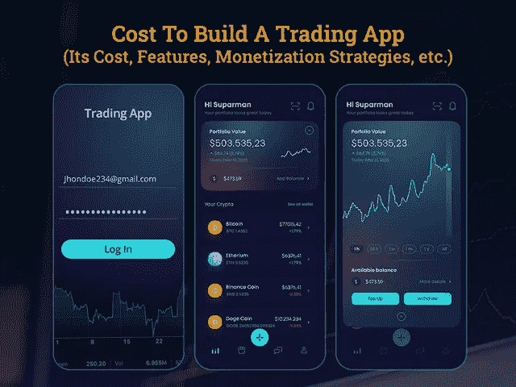

# 创建一个股票交易 App 需要多少钱

> 原文：<https://javascript.plainenglish.io/how-much-does-it-cost-to-create-a-stock-trading-app-ee0e890183bc?source=collection_archive---------12----------------------->

## **创建一个股票交易应用程序:其成本、功能和盈利策略**

当涉及到网上投资时，总是存在与欺诈相关的风险。但今天，随着数字世界中新兴技术和创新的出现，事情发生了彻底的变革。在当今的现代社会，无论是网上购物还是网上银行，人们都在无所畏惧地进行网上交易。

随着网络安全措施的提升，现在他们在网上投资时不会担心任何事情，因为交易应用程序在这里为所有投资者、经纪人或交易员服务，并提供了在不离开舒适的家的情况下释放股市利润的机会。

虽然开发在线交易应用程序的概念并不新鲜。像 E-trade、Merrill Edge 或 Fidelity 这样的交易应用程序已经使整个股票交易变得更加容易、有利可图并且没有佣金，这导致了用户不可阻挡的增长。

[*据统计*](https://www.thinkwithgoogle.com/consumer-insights/consumer-trends/search-statistics-for-investing-stock-apps/) *，投资和股票相关的 app 搜索同比增长 115%。*

调查报告显示，Android 金融移动应用渗透率高达 25.75%，进一步转移了用户对股票交易应用的兴趣。

然而，据预测，在 2021 年，交易行业将在交易平台开发方面投入比以往任何时候都多的资金。

*为什么*？

由于疫情，千禧一代在 2020 年见证了全球几次金融危机，被迫面临新的金融挑战。2020 年的全球形势已经使经济陷入混乱，目睹人们像泡沫破裂一样失去他们的储蓄。因此，拥有一个安全的网络已经成为当务之急。

这就是为什么千禧一代对疫情的第一反应是开始在股票市场进行小额投资。股市的突然转变引发了股票交易应用程序的开发，并允许有抱负的企业通过推出自己的股票交易应用程序来占领市场空间。

因此，如果你是一家初创公司或商业爱好者，正在寻找最好的应用程序开发思路来征服世界，那么现在是跳入股市的正确时机。

现在，你首先要考虑的是如何建立一个股票交易应用程序，它的功能，盈利策略，挑战以及法律问题和成本。

> 这是我们的向导来帮助你！

*   网上炒股 App 基本概述:如何运作？
*   为什么你应该投资在线交易应用程序开发？
*   成功的股市应用程序:给创业公司的忠告
*   构建在线交易应用程序的必备特性和功能
*   用于交易应用程序开发的第三方 API
*   如何将你的在线交易应用货币化？
*   开发一个股票交易 App 要多少钱
*   结论

## **1。网上炒股 App 基本概述:如何运作？**

股票交易应用程序是一种自动化交易系统，专为经纪人、交易员或投资者设计，帮助他们免费投资股票。在线交易应用的主要作用是允许投资者买卖交易所交易基金和股票，而无需向中间经纪人支付任何佣金。

移动交易应用程序不能仅仅被广泛用于新闻或进行交易，事实上是用于移动交易体验。因此，如果你打算投资股票应用程序开发，那么雇佣一家 [**移动应用程序开发公司**](https://www.xicom.biz/services/mobile-app-development/) 是值得的，它可以构建一个具有各种交易工具、多种类型的出价、图表、数据研究等等的应用程序。现在的问题是这些应用程序是如何工作的…

> 在线股票交易应用程序是如何工作的？

在电子交易平台上的买卖可以在几秒钟内完成，这是由于自动化的流程和其他一些技术的使用。让我们来看看典型的股票交易应用程序是如何工作的:

*   登录应用程序并链接帐户详细信息。
*   用户可以选择短期或长期交易
*   在智能手机上实时跟踪市场
*   设置一次性转账或定期存款
*   当当前交易出现在屏幕上时，买入股票
*   根据当前的交易趋势卖出股票出现在屏幕上
*   买卖股票不收取佣金
*   加密货币交易不收取佣金
*   推荐计划使用户能够赚取免费股票。

有了这个，你就必须准确理解什么是交易 app，以及它是如何工作的。但你们中的许多人关心的事实是，它如何能让你受益，为什么你应该使用在线交易应用程序？

## **2。为什么你应该投资在线交易应用程序开发？**

根据上述事实和陈述，很明显，这一应用类别有着广泛的用户基础，这些应用为不同年龄层提供的便利性使其实际上脱颖而出。积极的投资者能够使用股票交易应用程序更新他们的投资组合。

当您考虑开发股票市场应用程序开发服务时，范围更高，以释放新的赚钱机会。

近年来，股票交易应用程序已经成为人们谈论的话题，大多数软件开发公司已经通过制作完美符合市场需求的精彩应用程序来提升他们的体验。因为他们被设计来提供独特的功能，自由交易，提供有用的交易见解，因此，他们正在全面改变股市爱好者的体验。

总而言之，这些应用程序非常受欢迎，并将继续流行，毕竟它们属于“金融应用程序类别”，你知道这一类别总是有令人印象深刻的渗透率。

你不需要相信我们的话。以下是帮助您了解真实情况的市场概况统计数据。

*“*[*根据 Statista*](https://www.statista.com/statistics/1259920/etrading-app-monthly-active-users-usa/) *的数据，2017 年美国电子交易应用的月活跃用户超过 730 万，到 2021 年已飙升至 900 万。”*

*“根据* [*Statista 报告*](https://www.statista.com/statistics/270126/largest-stock-exchange-operators-by-market-capitalization-of-listed-companies/) *，2021 年初，全球最大的证券交易所是纽约证券交易所，股票市值超过 25 万亿美元。”*

有了这些统计数据和市场事实，可以有把握地说，投资股票交易应用程序是一个值得做的决定。由于股票市场拥有巨大的潜力，有一些应用程序，如 E-Trade、Robinhood 或 Stash，已经统治了这个应用程序类别。

因此，对于企业来说，如何从这些市场领导者中脱颖而出是一个核心问题。

让我们来得到这个问题的答案！

## **3。成功的股市应用:给创业公司的忠告**

你们中的许多人会得到专家的建议，在应用程序中实现独特的特性和功能，这是让你的应用程序在市场上取得成功的唯一途径。

然而，如果说实话，那么要在竞争激烈的市场中取得成功，就要考虑更多的因素。

因此，在你列出交易应用的必备功能之前，这里有一条来自领导们的建议。

*   **简单的用户界面**

股票交易是一个复杂的过程，因为它有如此多的投资选项，在交易应用程序中有如此多的事情要做，因此初学者在登录应用程序时很容易迷路。 [**雇佣手机应用开发者**](https://www.xicom.biz/offerings/hire-mobile-developers/) 避免制造混乱。通过融合多年的专业知识和知识，他们将帮助您在开发像电子交易这样的交易应用程序时保持简单、直接和易于导航。

吸引用户到你的定制交易平台的最好方法就是尽可能的简单明了。

*   **卓越的速度和性能**

在股市应用中，如果你的应用像一台运转良好的机器一样工作，投资者会很感激。当应用程序有闪电般的速度时，用户会更喜欢留在应用程序上。股票市场是一个快速运行的市场，因此拥有一个确保出色速度的应用程序非常重要。

*   **简单的登录/注册流程**

通常，应用程序可以通过使用电子邮件 ID、姓名、电话号码轻松注册，但您也可以提供社交媒体集成，以保持注册过程简单易行。

保持一个简单的三步登录程序，而不是用一个详细的问题来轰炸应用程序用户。

用户注册时间长了会很快弃用 app！

***一言以蔽之:*** *你的设计和 app 界面越人性化，用户就越愿意花更多的时间在交易上。因此，用户在交易上花费的时间越多，他们进行的投资就越多，交易企业将获得更多利润。*

因此，这些建议不仅会帮助你在市场中脱颖而出，还会扩大更好的赚钱范围。

## **4。构建在线交易应用程序的必备特性和功能**

当被问及如何构建一个在线股票交易应用程序时，大多数人都会进入开发过程。嗯，这实际上意味着如何选择应用程序界面的主要功能，以及你需要在应用程序中加入哪些功能。

> 因此，以下是你需要在交易应用中包含的几个最基本的功能:

**认证登录流程:**由于该应用程序涉及重大金融交易，因此，该应用程序应提供轻松的应用程序签到，并提供多种不同的方式注册到该应用程序，包括各种选项，如电话号码、社交网站或电子邮件 ID，以及生物识别或 touch ID 系统，以实现更好的认证。

**配置文件设置:**用户可以通过添加丰富的信息来定制配置文件的详细信息，并定制配置文件设置，使其公开或私有这些详细信息。

**仪表板:**一旦用户注册了应用程序，他必须被引导到应用程序仪表板，在那里他们可以深入了解股票的趋势。在你决定如何建立你的交易平台之前，想想 [**雇佣一个应用开发者**](https://www.xicom.biz/solutions/hire-developers/) 可以从新手的角度定制仪表盘。因为有大量的数据要显示在仪表盘、观察列表、订单状态、余额、持有量、图表等上面，所以，要确保所有的东西看起来都是有序且易于理解的。

**排序和过滤配置文件:**该功能允许认证的交易者使用排序选项来分析股票，该选项从分类帐中过滤向投资者描述交易记录的必要细节。这一功能将帮助用户以一种用户友好的方式浏览股票市场。

**交易管理:**这是帮助记录和监控所有交易历史的重要功能。这样，用户将能够毫无困难地处理他们的付款并安全地查看订单执行情况。无论是存款还是取款，每笔交易都将被告知所需的要求。

**资金转账和支付网关:**要购买或出售股票，您需要在应用程序中添加资金转账功能。确保您添加多个支付网关，它必须是高度安全的。

**股票搜索:**每个交易应用程序都可以从这个选项中受益，在股票交易应用程序中“搜索”或“搜寻”投资者和交易者，以搜索可用的股票和趋势股票市场价格。

**流式报价和图表:**股票交易基于快速决策，信息在几秒钟内就会发生变化。因此，对于投资者来说，应用程序中的任何股票信息都需要准确、及时和可靠。为此，你可以考虑 [**雇佣移动应用程序开发者**](https://www.xicom.biz/offerings/hire-mobile-developers/) 来添加实时流图表、快速报价，使用户能够做出即时而明智的决定。确保总是使用著名的资源，如美国消费者新闻与商业频道、彭博等。

**股票市场新闻馈送、分析和预测:**提供从金融网点获取的所有金融相关新闻是很重要的。金融市场的任何波动都可能是股票价格上涨或下跌的重要原因。了解这些公司可以帮助投资者更好地预测市场波动。

**推送通知:**让用户了解股市的每一个变化，以避免错过任何重大交易，这是你的应用程序最重要但又是必不可少的功能之一。

**实时分析:**股票交易员很高兴有这个机会观察统计数据并分析交易结果、交易等。添加各种性能图表和报告以获得实时见解将是非常棒的。

CMS 整合:这个应用的成功主要取决于它的内容以及如何巧妙地管理内容。因此，确保开发者集成 CMS 的方式能够提供用户期望的应用程序的确切重要性。

忠诚计划:这些计划让应用程序的用户保持对应用程序的忠诚，并帮助用户与你的应用程序保持联系。将此功能添加到您的应用程序将增加利润、促进销售、留住现有消费者、吸引新消费者等等。

这些是您的交易应用程序必须包含的几个普通功能，以确保平稳的交易体验。但是为了让它顺畅无缝地工作，使用增强其功能的第三方 API 是很重要的。

## **5。用于交易应用开发的第三方 APIs】**

当决定如何创建一个网上交易平台，如何使其功能？对于长期卓有成效的投资需要可靠的软件，第三方 API 和必要的技术支持是重要的考虑因素。有时，由于技术支持不当，它无法处理大量的大规模自动化操作。应用的功能和性能在很大程度上取决于你选择雇佣的 [**移动应用开发公司**](https://www.xicom.biz/services/mobile-app-development/) 以及他们如何集成这些 API。下面是你可以考虑用于交易应用开发的第三方 API:

*   Zirra:用于股票和公司时间序列的 best
*   Alpha Vantage:推荐用于历史股票、外汇、加密等
*   柱状图:提供更深入可靠的股票市场洞察
*   十二个数据:用于实时和历史数据
*   金融货币数据馈送:最好用于货币，金属，股票等
*   投资加密货币市场:使您能够跟踪各种股票的加密货币价格和汇率
*   股票和期权交易数据提供商:强烈推荐用于美国股票和期权
*   Marketstack:使您能够获得历史市场数据、当天数据或实时数据
*   Finnhub:获取构建金融产品的数据

***将这些 API 实现到 App*** 所需的团队结构

要构建一个成功的在线交易应用程序，您需要一个应用程序开发团队，其中可能包括:

*   商业分析员
*   生产部经理
*   应用程序开发人员(Android/iOS)
*   质量保证工程师
*   UI/UX 设计器

现在的问题是如何从你的应用程序中获利，以及如何为你的交易应用程序选择最佳的盈利策略…

## **6。如何将你的在线交易应用货币化？**

因此，现在你要构建一个具有最佳功能选择的应用程序，雇佣应用程序开发团队，现在你主要关心的是如何从你的应用程序中获利。嗯，有多种方法可以让你的应用赚钱，但尤其是对于交易应用，你可以考虑下面提到的应用赚钱策略:

*   **会员费:**收取少量费用成为会员并提供交易途径，这是一种很好的交易应用赚钱的方式。但是保持登录过程免费，并让用户挖掘股票市场的洞察力。你所需要做的就是 [**雇佣一个移动应用开发者**](https://www.xicom.biz/offerings/hire-mobile-developers/) ，让它对用户来说更有吸引力，更有信息量。这将增加开始交易的诱惑，并使他们更容易支付会员费。
*   **交易收费:**用户每在 app 上进行一次交易，app 就可以收取特定金额作为交易费用，从 app 上赚钱。
*   **出售早期交易:**为了盈利，你可以向用户提供早期交易提醒，这样应用程序用户就可以在交易中大赚一笔。这样，用户将在其他主要应用程序用户收到提醒之前收到提醒。
*   **销售金融产品:**为了获得更好的收益，您可以选择销售不同的金融产品，如共同基金、黄金 ETF、保险和其他允许用户进行无风险交易的货币安全包。
*   **应用内广告:**这是最传统的通过应用赚钱的方式之一。应用程序所有者可以在他们的股市投资应用程序上收费播放或显示其他服务提供商的广告。

这是几个最好的推荐货币化策略，可以帮助你从你的应用程序中获得更好的利润，你所需要的就是为你的应用程序选择一个最好的。现在来看下一个最常被问到的问题，开发一个交易应用程序要花多少钱…

## **7。搭建一个网上交易 App 需要多少钱？**

好吧，如果实话实说，那么没有人能给你一个准确的成本来建立一个在线交易应用程序。很多时候，初创公司或商业爱好者很难确定应用程序开发的价格范围。

但是在我们直接讨论应用程序开发成本之前，您需要了解您的业务需求、偏好和需求到底是什么。这里我们提到了实际上推动应用程序开发成本的主要因素。这取决于:

*   应用程序的概念
*   应用程序的特性和功能
*   应用程序的复杂性:简单、中等或高级
*   选择启动应用程序的操作系统
*   应用程序开发过程中使用的技术和 API
*   用户界面/UX 设计
*   应用测试和质量保证

在线股票交易和投资应用程序的开发涉及各种复杂性，因为它涉及到完整的交易过程和市场行为。此外，开发成本也因你选择开发这样一款前沿应用的公司而异。

因此，基于上述因素和参数，我们得出的结论是，基本的应用程序开发将花费您大约 20，000 美元，并需要长达 3 至 4 个月的开发时间。

但是，市场上已经有许多交易应用程序提供相同的特性和功能，那么你如何站在前面呢？

因此，专家们的建议是，选择中等至高级的交易应用程序开发解决方案，价格在 25，000 至 30，000 美元以上，开发时间为 5 至 9 个月以上。

这些是粗略的估计，让你对价格范围有个概念。对于实际定价和功能定制，建议联系深入了解您的需求并能够得出成本和时间估计的专家。

# **结论**

在这篇博客的结尾，你可以看到千禧一代是如何成为股票交易应用程序的最大驱动力，并利用它来做出重大的金融投资决定。希望你已经找到了创建一个处理股票的应用程序的关键问题的答案，并有很大的成功机会。因此，如果你打算开发一个有竞争力的股票交易应用程序，那么聘请一家 [**移动应用程序开发公司**](https://www.xicom.biz/services/mobile-app-development/) 来帮助你构建一个高性能的应用程序，并使其保持领先是值得的。

因此，如果你有任何交易应用程序的想法，你想变成一个解决方案，或者想要一个更精确的估计，或者有任何问题，那么你可以 [**联系我们**](https://www.xicom.biz/contact/) 或者在下面提出疑问。

======================================

*更多内容请看*[***plain English . io***](http://plainenglish.io/)