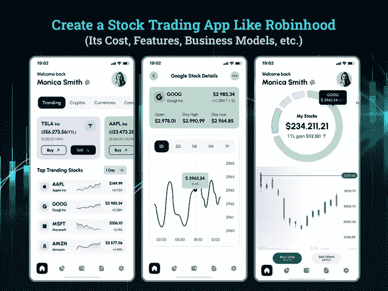
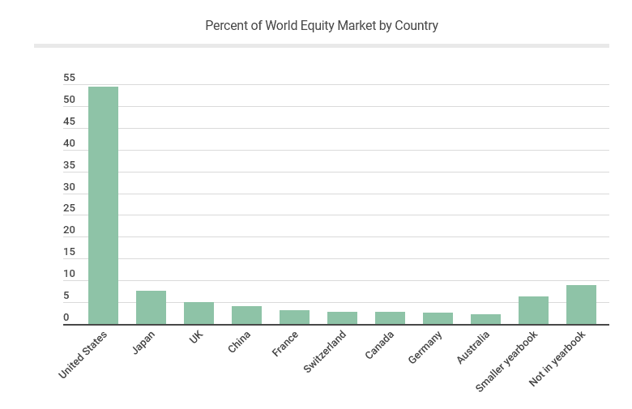

# 创建一个像 Robinhood 这样的交易 App 需要多少成本

> 原文：<https://javascript.plainenglish.io/how-much-does-it-cost-to-create-a-trading-app-like-robinhood-ba2cacdd9544?source=collection_archive---------7----------------------->

## 一个类似 Robinhood 的 App 开发要多少钱？

毫无疑问，新冠肺炎的疫情在零售交易中创造了一个不可预测的时刻。当人们呆在家里，面临失业，在金融危机中挣扎的时候，他们发现交易是最赚钱的机会，可以开始赚钱或从投资中获得丰厚的收入。

然而，当你想到股票交易的时候，有许多计算、交易规则、规定和预测总是让你气馁，让你远离股票交易市场。

这就是像 Robinhood 这样的股票交易应用程序为 1300 万业余股票交易者打开闸门的地方。

在下载了 Robinhood 之后，年轻投资者第一次觉得他们有了交易的权力，能够自己做决定，明白如何投资。

由于所有交易平台的佣金都是零，Robinhood 迅速创造了交易量的激增，并继续扩大首次交易者的数量。此外，一款来自硅谷的应用程序凭借其流畅的界面和游戏化的功能，迅速吸引了年轻投资者或首次交易者的注意。

因此，如果你打算进入金融科技行业，那么开发一个像 Robinhood 这样的股票交易应用程序是在在线投资领域获得关注的一个完美方式。

但问题是，如何创建一个像 Robinhood 这样的交易应用程序，才能在股票交易领域取得成功。要创建一个真正改变交易体验和跟踪股票走势并实时卖出或买入股票的能力的应用程序，你需要仔细研究市场上最受欢迎的交易应用程序 Robinhood 的克隆应用程序。所以为了让你更容易理解开发一个像 Robinhood 这样的电子交易 app 的整个流程，我们把每一节都做了详细的划分。

以下是这篇博客的主要亮点:

*   *市场状况:关于开发类似 Robinhood 的在线股票交易 App 的争论*
*   *是什么让 Robinhood 股票交易 App 成功？*
*   *处理交易应用开发的挑战和法律问题*
*   *创建一个类似 Robo-Type 特性的 Robinhood 的股票交易应用*
*   *最适合 Robinhood 等股票交易应用的货币化模式*
*   *创建一个像 Robinhood 这样的在线股票交易 App 需要多少成本？*
*   *结论:通过建立一个类似 Robinhood 的应用程序来扩展你的投资服务*

让我们直接进入这些点的细节…

## **市场统计:股票交易 App 交易市场现状**

无论是在线股票交易还是金融投资服务，金融科技都是关于以下正确的资金处理模式。随着 Robinhood 等在线股票交易解决方案的出现，传统的经纪机构、投资公司和金融咨询公司受到启发，并倾向于将其投资业务数字化。

如果你仍然想知道这是否是一个公平的决定去网上股票交易的解决方案，那么你需要先睹为快，在市场统计数据:

*   2020 年，美国见证了股市的突然上涨，并注意到很大一部分人已经开始交易，以获得赚钱的机会。
*   *根据市场统计，美国占世界股票市场资本总额的 54.5%。*
*   *最近的研究显示，全球市值飙升至创纪录的 95 万亿美元。*
*   大约 10%的美国家庭持有国际股票。
*   【2020 年后，本轮牛市从上一个十年的记录一直往上走。
*   *据预测，2019 年 131 亿美元的在线交易市值，到 2027 年有望达到 183 亿美元。*

[Image Source](https://fortunly.com/statistics/stock-market-statistics/#gref)

希望有了这些统计数据，很明显开发一个在线股票交易应用程序将是一个有价值的决定。虽然今天有太多的经纪应用程序可用，但一个 [**应用程序开发公司**](https://www.xicom.biz/services/mobile-app-development/) 可以帮助你建立一个最适合你的业务需求和要求将是一个复杂的决定。然而，如果你是一家初创投资公司或金融科技公司，正在寻找进入这一领域的有效途径，那么你可以寻找罗宾汉股票交易应用程序。

## **是什么让 Robinhood App 成功？**

像 Robinhood 这样的股票交易 app，在投资界树立了标杆。其需求激增背后的最大原因是允许用户免费投资股票。2014 年推出的在线经纪应用程序使投资者能够在不支付任何佣金的情况下买卖股票。根据调查报告，该应用程序拥有 2250 万活跃用户，并在 2021 年执行了超过 1500 亿美元的交易。

除此之外，Robinhood 股票交易应用程序的几个特点让它成为赢家:

*   该应用程序有一个简单易用的界面，允许投资者创建个人资料。
*   该应用程序通过发送最新的市场数据并保持用户更新，使整个交易过程变得更加简单和无缝。
*   为了让他们的投资者对市场的每一个动向保持更新和警惕，Robinhood 会在即将到来的股息发放时发送推送通知。
*   它允许投资者立即开始交易，而不必等待他们的资金结算。
*   *它为投资者提供了一个零佣金买卖股票的机会。*
*   *罗宾汉股票交易 app 不会收取任何年费或月租费。*
*   *此外，在使用 Robinhood 应用进行交易时，投资者无需支付任何加密货币交易佣金。*
*   *推荐计划使用户能够获得免费股票。*

像 Robinhood 这样的股票交易应用程序的这些特点使其成为投资行业的领先巨头。在你进入 app 开发的过程之前，问题是，开发一个炒股交易 app 有那么简单吗？

## **处理交易应用开发的挑战和法律问题**

如果您最终决定将您的投资或经纪业务数字化，并希望将其扩展到移动市场，那么您需要应对一些遗留挑战。

开发一个交易应用程序是一项复杂的任务，因为在开发你的应用程序时，你需要考虑许多投资政策。然而，如果你有一个新成立的投资公司，你可以考虑 [**雇佣一个移动应用开发者**](https://www.xicom.biz/offerings/hire-mobile-developers/) 或者通过法律政策来避免这样的法律问题。为了帮助你避免法律问题，我们在这里列出了你在开发像 Robinhood 这样的股票交易应用程序时需要获得的东西。

*   无论你计划在哪个国家推出应用程序，你都需要从相应公司的监管机构获得许可。
*   值得考虑加入投资者保护计划和监管机构，如 SIPC 和 FINRA，以增加你的平台的可信度。
*   为了保护消费者的敏感数据，建议您遵循 PSD2 指令和类似的规则。
*   通过实施多因素身份认证因素，如 256 位 AES 加密、基于人工智能的欺诈检测或其他安全工具，保护用户及其资金。

这些是克服与传统或数据欺诈检测相关的挑战的几个最重要的技巧。然而，股票交易应用程序的成功并不仅仅取决于加密策略。重要的是实现这些特性和功能以使其成功。

# **创建一个类似 Robo-Type 特性的 Robinhood 的股票交易应用**

构建一个成功的移动应用程序的简单技巧是将惊人的功能集成到一个应用程序中，确保最高水平的用户参与度。在创建像 Robinhood 这样的股票交易应用程序时，这成为一个更重要的考虑因素。对于许多接触交易的业余投资者来说，应用程序是一个大泡沫。但通过雇佣应用开发者，你可以降低构建复杂应用界面的风险，确保无缝交易体验，增加用户参与度。股票交易已经是一件复杂的事情，尽管包含这样的特性和功能以确保无缝的交易体验是值得的。

> **因此，创建像 Robinhood 这样的股票交易应用程序，并在应用程序中提供更好的用户友好界面的基本特性和功能是:**

*   **创建账户和注册:**下载应用程序后，用户需要创建一个账户，并使用电子邮件 ID 和电话号码等凭据进行注册。
*   **投资人 KYC:**注册有短期和长期两种方式。通过使用基本的个人信息，管理员只能验证用户的电话号码，并允许他们开始使用应用程序和访问其基本功能。但是，要使用金融和交易功能，必须完成长期注册/KYC 过程。
*   **在线仪表盘:**在像 Robinhood 这样的股票交易应用程序中，仪表盘是最重要的功能，它可以在一个地方提供关于交易的完整信息，如订单状态、观察列表、资金余额、基本涨跌图、交易股票、个人资料价值、最有希望的机会、图表、持股等。你可以雇佣一个 [**移动应用程序开发公司**](https://www.xicom.biz/services/mobile-app-development/) 来创建这个功能，并确保用户和交易市场的所有这些关键信息都应该以用户会感觉超载的方式显示。当构建一个像 Robinhood 这样成功的股票交易应用程序时，让仪表盘根据用户的偏好和进步程度进行调整总是好的，这样他们就可以获得更好的机会。
*   **交易者的投资组合:**使用该功能，交易者可以创建和管理自己的个人资料，而无需依赖任何第三方代理。在这里，他们可以详细分析自己的资产，并做出进一步的投资决策。为了无缝管理他们的个人资料，允许随时过滤和修改功能是一个好主意。由于投资组合设置由一组自动和可定制的选项组成，用户可以很容易地了解市场中反映的实时变化。像 Robinhood 这样有效的股票交易应用程序实际上会处理大量的数据和过程，如大文件，因此他们利用人工智能和 ML 技术来成功处理大量数据。
*   **市场数据收集和实时更新:**该功能可以让投资者在一个地方获得交易市场的所有更新。这是像 Robinhood 这样的交易应用程序最重要的功能之一，它允许交易者做出最有利可图的决定。因此，你可以在那里使用人工智能、机器学习或大数据等数据库技术，为交易市场提供更可靠的见解。
*   **存钱:**在 Robinhood 这样的顶级股票交易应用中，将钱换成资产最便捷的方式是将资金存入应用中的数字钱包，然后用虚拟货币购买资产。同样，你可以选择雇佣一个 [**软件开发公司**](https://www.xicom.biz/) 来开发这个功能，这样可以节省大量的时间。他们更好地知道需要从盒子里拿出什么 API，并避免从头开始开发这个特性。通过应用内多支付集成 API，您可以使用银行转账、信用卡、借记卡、Paypal、谷歌或苹果支付进行转账。一旦存入资金，用户就可以开始实时交易，获得完美的交易体验。
*   **交易功能:**不足为奇这是 Robinhood 这样的交易 app 的核心功能。从筛选股票到根据用户要求过滤和排序交易选项，该应用程序将提供所有功能，以确保无缝的交易体验。每个位置都包含关于股票的深入信息，如价格、资产负债表、公司描述、公司详情和新闻、收益、分析师评级。将所有此类交易信息放在一个地方将有助于您向用户提供有价值的信息，并使您能够在整个交易过程中保持透明。
*   **实时图表和股票报价:**在您的交易应用程序中实现这一功能将为您的仪表盘增加更多价值。交易数据需要每秒更新，以便提供最准确的分析、价格模式和股票策略。永远记住，在股市中，每一秒都可能产生巨大的影响。
*   **股票扫描仪:**在你的应用程序中增加这些功能，让交易员不断扫描股票，做出明智的决定。
*   **观察名单:**观察名单让投资者能够跟踪他们渴望购买或计划稍后购买的股票。用户可以将其添加到观察名单中，也可以将其从名单中删除，以防投资者改变决定。通过应用程序中的愿望列表功能，用户可以跳过浏览应用程序的练习，直接开始查看价格。
*   推送通知:这一功能可以让你的用户随时了解股票市场的每一个动向。通过发送实时通知，将促进更新，使他们即将到来的投资更有成效。如果你正在考虑 [**开发一个类似 Robinhood 的股票交易 app**](https://www.xicom.biz/services/mobile-app-development/) ，那么你需要集成这个智能特性。这样你可以提醒用户最新的优惠、交易和最有希望的机会。

除此之外，你还可以选择在你的交易应用中加入一些额外的高级功能，比如 Robinhood。但在你雇佣一家应用开发公司在应用中实现广泛的功能选择之前，重要的是要了解它要花你多少钱，以及它将如何帮助你的应用赚钱？

## **开发一个像 Robinhood 这样的炒股 App 需要多少钱？**

计算和估计像 Robinhood 这样的交易应用程序的开发成本是一项具有挑战性的任务。

由于应用程序开发成本根据客户的需求和要求变化很大，因此在不了解应用程序开发规范的情况下，得出平均应用程序开发成本确实很有挑战性。有各种各样的因素，如应用程序的复杂性，特性和功能，用户界面/UX 设计，技术，雇用移动应用程序开发人员等等。然而，通常，应用程序的成本是根据应用程序开发过程所花费的小时数来计算的。应用程序开发人员的每小时成本进一步取决于您选择 [**雇佣应用程序开发人员**](https://www.xicom.biz/solutions/hire-developers/) 的地区。

因此，估计和评估所有这些因素，构建一个具有上述功能的交易应用程序(如 Robinhood)的平均成本将在 20，000 美元至 25，000 美元之间，如果是高级应用程序版本，每个平台的平均成本可能会超过 35，000 美元。更多的功能将导致更高的复杂性，最终需要更长的应用程序开发时间。

因此，在你做出任何决定之前，值得与专家预约一个免费的咨询时段，讨论你对构建应用程序的要求。

## **如何像 Robinhood 一样将自己的炒股 App 变现？**

诚然，罗宾汉式股票交易已经迅速获得了业余交易者的关注，并已成为交易平台的首选。但与此同时，企业主也不能忽视这样一个事实，即 Robinhood app 对于交易没有额外的收费或手续费。所以罗宾汉赚钱是主要问题之一？

*让我们进入深度！*

如果你也打算建立一个类似 Robinhood 的股票交易应用，那么你需要知道它是由大投资者支持的，比如 Index Ventures，Google Ventures 等等。在行业巨头的支持下，Robinhood 仍然对用户免费开放。

但最重要的是，收入的主要来源是它的优质服务，帮助用户做出更准确的预测，使他们能够做出明智的决定。对于能够承担更高投资风险的大玩家来说，他们可以使用这款应用的升级版 Robinhood Gold。

要使用 Robinhood Gold 的这一独家功能，用户必须每月支付 20 美元至 2000 美元不等的费用，具体取决于交易水平。而这个水平是由交易者必须投入多少资金和借贷多少来决定的。

# **结论**

在这篇博客的结尾，可以说，股票交易市场正如火如荼地进行着，并保持着趋势。但是交易应用程序解决方案有一些限制，如 KYC、反洗钱、客户数据保护等。所以如果你正打算打造一款类似 Robinhood 的股票交易 app，那么就值得雇佣一家 [**手机 app 开发公司**](https://www.xicom.biz/services/mobile-app-development/) 通过编译所有的交易牌照来推出一款投资应用。他们帮助你创建一个应用程序来处理股票，发送通知，提供仪表板等等。创建一个交易应用程序是一项复杂的任务，所以值得考虑帮助你对用户产生积极影响的专业协助。

因此，如果你有任何想法，你想市场或只是想遵循罗宾汉股票交易应用程序的应用程序克隆，你可以 [**联系我们**](https://www.xicom.biz/contact/) 或在下面提出疑问。

=======================================

*更多内容看* [***说白了. io***](http://plainenglish.io/) ***。*** *报名参加我们的**[***免费每周简讯这里***](http://newsletter.plainenglish.io/) ***。****