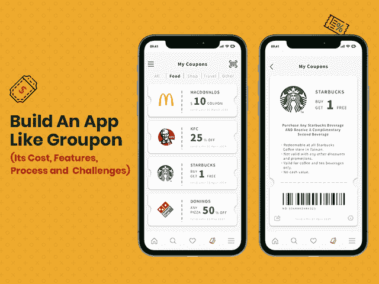
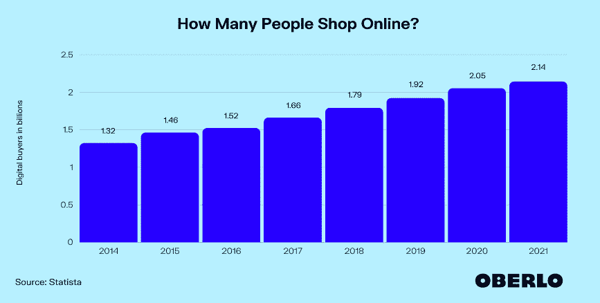
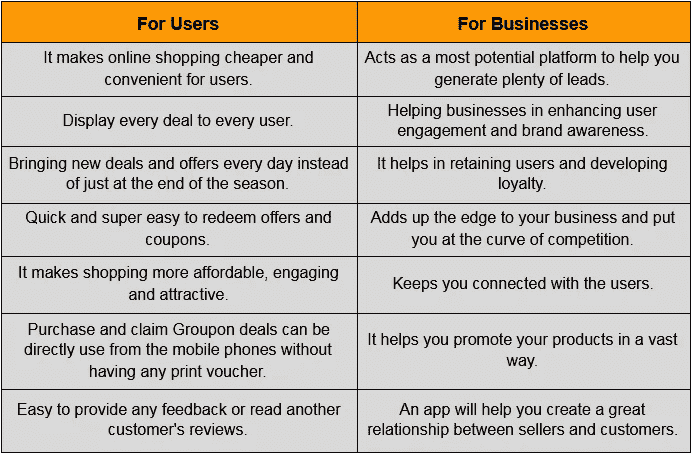
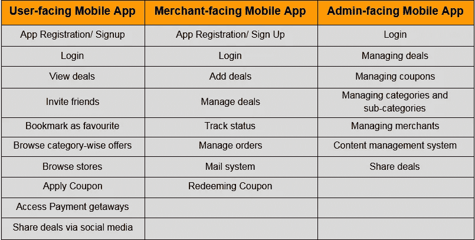
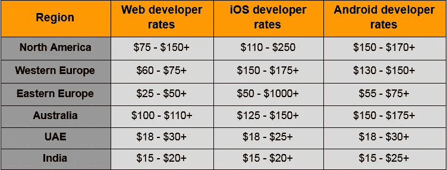

# 创建一个像 Groupon 这样的应用程序需要多少成本

> 原文：<https://javascript.plainenglish.io/how-much-does-it-cost-to-create-an-app-like-groupon-11ff02bc4cf4?source=collection_archive---------3----------------------->

## 创建一个像 Groupon 一样的应用程序:成本、功能、流程和挑战

如果你是一名电子商务企业家或一家进步的初创公司，你可能正在关注一个伟大的应用程序创意，它可以通过过滤行业巨头创造的市场噪音来帮助你接触到目标受众。

开发像 Groupon 这样的应用程序是你可以投资的最棒的应用程序创意之一。这个博客将向你解释像 Groupon 这样的应用程序变得如此流行的原因和方式。

随着电子商务的发展趋势，全球数字买家的数量也在增加，预计将从 2014 年的 13.2 亿增加到 2021 年的 21.4 亿。

[Image Source](https://www.oberlo.com/statistics/how-many-people-shop-online)

随着无缝互联网连接渗透到世界各地的网上购物，网上买家的数量持续增长，没有放缓的迹象。

提供日常在线交易和购物折扣的概念正在改变用户的在线购物体验，使其比以往任何时候都更具成本效益。

因此，来自世界各地的人们一直坚持使用购物应用程序，他们只是沉迷于偷窥交易，同时，他们付款以获取优惠。

> 您一定想知道到底是什么促使用户做出这种即时动作？

原因是，他们不能错过这些交易，尤其是当这些交易属于他们的兴趣和购物平台时。

如果你再深入一点，你会发现像 Groupon 这样提供日常交易和优惠券的移动应用不仅能满足用户的需求，还能让其他的连锁商店对用户来说可见和引人注目。

他们可以简单地展示他们的交易、优惠和优惠券来吸引用户群。感谢软件开发公司定制了这款应用的用户界面/UX，这一概念现在正在所有行业占据中心位置，大多数新企业都准备将它与自己定制的每日交易移动应用结合起来。

所以，如果你也想在 [**开发一个像 Groupon**](https://www.xicom.biz/services/mobile-app-development/) 一样的移动应用程序，并且在什么功能使它在市场上脱颖而出以及开发它需要多少成本的困境中，那么你就来对地方了。这篇文章揭示了构建 daily deals 移动应用程序的最佳功能，以及使您的应用程序在应用程序商店排行榜上名列前茅的技术参数和所需的团队结构。

## 以下是该内容的亮点:

*   *为什么要打造 Groupon 这样的 App？*
*   *构建 Groupon 这样的应用程序的主要挑战？*
*   【Groupon 等每日交易应用背后的特性和功能
*   *让您的日常交易成功的高级功能手机应用*
*   *开发一个像 Groupon 这样的每日交易应用需要多少成本？*
*   *结论*

让我们详细讨论每一点，以便更好地理解:

## **为什么要打造 Groupon 这样的手机 App？**

Groupon 是一个独特的平台，一直在寻求全世界进步的初创公司和企业的关注。它充当客户和商家之间的中间人，并向用户提供大部分交易或高达 70%的折扣券。

它于 2008 年在美国推出，作为一个当日交易平台，用户可以购买各种服务和产品的代金券和优惠券。从餐饮预订到沙龙服务，邮轮度假到购物交易，用户将有广泛的选择利用交易。

通过利用基于偏好、位置和交易历史的每日或每周推送通知，将所有这些独家交易带到他们的平台上，Groupon 取得了巨大的成功。

*十年来，Groupon 创造了 4570 万全球独立客户，同年贡献了 5.7841 亿美元。*

2019 年，Groupon 现已开始服务 50+个国家，并将业务拓展至加拿大、乌克兰、德国、希腊、法国、荷兰、比利时、阿联酋、新西兰等。

此外，随着全球范围的扩大，它已经与 10，000 多家当地企业建立了合作伙伴关系，并拥有 3，500 多万注册用户。这样一来，销售额在增加，慢慢地，本地企业也成为了 Groupon 的重要组成部分。

> 听起来印象深刻，对吧！

所以我们在这里假设你想知道像 Groupon 这样的应用程序将如何让你的企业和用户同时受益？

***以下是它如何让您的企业和客户受益:***

除了上面列出的好处，还有许多其他的特性使它在市场上获得成功和受欢迎。当 [**雇佣一个移动应用开发者**](https://www.xicom.biz/offerings/hire-mobile-developers/) 来开发一个像 Groupon 这样的应用时，你需要记住的一件事是，它有一个主要的客户群，它的目标受众主要是愿意花钱的年轻人。折扣交易是促使用户采取最终行动的唯一主要因素。

此外，它广受欢迎，因为其结构良好的计划和营销模式，不断鼓励用户访问它。但是，应用程序开发的过程并不像你听起来那么简单。

因此，我们在这里总结了一些你在开发 Groupon 这样的应用时可能会面临的主要挑战。

## 建立一个像 Groupon 这样的应用程序的主要挑战？

如果你最终决定建立一个像 Groupon 这样的应用程序，那么你需要看看在 Groupon 这样的移动应用程序上提供折扣和交易的完整商业模式。当你为产品和服务提供折扣时，最大的挑战是理解消费者的行为。向错误的受众提供交易和折扣会让你的整个业务处于风险之中。

由于更多的钱将用于为顾客提供产品折扣，因此，商业利润和损失将直接取决于你如何吸引顾客。

考虑到所有这些因素，Groupon 与中小型公司合作，开始销售普通商品，因此通过向用户提供真正的折扣优惠，这些服务部分地变成了另一个电子商务商店。

*但现在的核心问题是，你需要将哪些特性和功能集成到应用程序中？让我们来看看这些功能，了解一下它的价格……*

## 【Groupon 等每日交易应用背后的特性和功能

当开发一个像 Groupon 这样的应用程序时，要确保你的应用程序具有所有的基本特性和功能，让用户可以轻松访问和方便使用。您可以选择 [**雇佣一名应用程序开发人员**](https://www.xicom.biz/solutions/hire-developers/) 为您的移动应用程序定制所有必要的功能，让企业更容易提供最好的产品和服务。

*为了让你的应用程序流畅高效地工作，你需要为你的应用程序创建三个面板，分别丰富各自的功能:*

构建一个具有所有这些基本功能的应用程序的平均成本将在 10，000 美元到 15，000 美元之间，根据功能的复杂程度，最高可达 25，000 美元以上。你的功能越复杂，开发时间就越长，成本也就越高。

但是，如果你想用具备这些基本功能的移动应用来征服市场，那么你可能会把自己放在缓慢前进的轨道上。为了更好地了解您的客户和市场竞争，您需要更深入地挖掘并更喜欢集成高级功能。

# **构建 Groupon 这样的应用需要考虑的高级功能**

如果你想知道到底是什么让 Groupon 站在市场竞争的前沿，那么你需要了解这些让它更好工作的高级功能。因此，在你着手 [**为项目雇佣一名专门的应用程序开发人员**](https://www.xicom.biz/solutions/hire-developers/) 之前，请确保在你的应用程序中融入这些高级功能:

*   **导航和追踪:**记住，用户总是更喜欢离他们所在地近的交易。因此，通过整合谷歌地图或苹果地图，用户可以轻松过滤你平台上的所有交易。通过这种方式，你的应用程序将真正帮助用户抓住他们所在地区的最佳交易，并有利于企业将用户吸引到他们的品牌。
*   **支付网关:**除了使用标准支付选项，还值得添加多个支付网关，以增加通过信用卡/借记卡钱包、网上银行、PayPal 或 Braintree 进行支付的便利性。确保你的应用程序提供了一种方便、省事的方式来购买优惠券。
*   礼品卡:这是 Groupon 吸引用户并让他们适应该应用的主要功能之一。您可以向用户提供礼品卡，并鼓励他们使用优惠和优惠券。礼品卡和其他促销活动有助于提高企业的知名度。
*   **价格比较:**用户喜欢以更低的价格和最大的折扣购物的概念，因此在达成任何交易之前，他们总是想比较价格。因此，你的应用程序中的价格比较功能是一个很好的救星。用户可以通过应用优惠券代码和优惠来比较不同商店的产品价格。
*   **社交媒体整合:**让您的用户通过社交媒体平台与朋友分享交易、优惠和折扣。要构建这一功能，您可以选择跨平台应用程序开发解决方案，因此交易将在所有可能的平台上可见。
*   **云环境:**实施云技术对于以安全可靠的方式管理和存储数据非常重要。有了云环境，所有与用户、商家、交易、商店和支付细节相关的处理过的和原始的信息都将存储在云上，使整个过程完美无缺。
*   **实时分析:**实时分析是最重要的功能之一，用于从每日交易移动应用程序中存储的大量数据中提取已处理的信息。此外，它使您能够确定与交易和商店相关的正确和有效的统计数据，反过来帮助您实现完美的决策，使您的业务蓬勃发展。
*   **推送通知:**通过利用推送技术的潜力，您可以让您的用户随时了解优惠、折扣和各种优惠券。

构建具有高级功能的应用程序的平均成本在 12，000 美元到 18，000 美元之间，但这取决于应用程序的复杂性、平台选择、技术团队等。

*但是，这里一直存在的一个主要问题是，开发一个像 Groupon 这样的移动应用需要多少成本？*

# **开发一个像 Groupon 这样的应用需要多少成本？**

在每个企业主决定是否为自己的企业开发一款应用程序之前，估计建立一个像 Groupon 这样的移动应用程序的最终成本是他们的热门话题之一。但事实是，从一开始就预测应用程序的总成本从来都不容易，因为有各种因素会影响构建 Groupon 这样的移动应用程序的最终成本。

> 尽管如此，这不是火箭科学！

所以遇到一个 [**app 开发公司**](https://www.xicom.biz/services/mobile-app-development/) 之后首先想到的就是一个 app 的成本。但是，为了让您了解哪些参数导致了应用程序开发成本，以及它们花费了您多少成本，*我们在下面详细列出了重要因素:*

## **1。应用平台选择:Android/ iOS/ Hybrid**

嗯，这个世界上最领先的平台是 Android 和 iOS，但应用开发的成本会受到你选择的平台的影响。

通常，单个平台的原生应用程序开发成本在 12，000 美元到 15，000 美元之间，随着平台数量的增加，应用程序开发的成本也在增加。

因此，在这里，为多个平台开发应用程序的最便宜的方法是寻找跨平台应用程序开发解决方案，其成本比构建两个原生应用程序的成本低 40%。

## **2。手机应用程序的复杂性**

应用程序的复杂性是导致应用程序开发成本大幅变化的最大因素之一。一般来说，移动应用程序根据复杂程度进行分类，如基本、中等和高级。

*   ***基础 App 开发费用:****【10000 美元到 12000 美元+*
*   ***中型复杂 App 开发费用:****【12000 美元到 15000 美元+*
*   ***高级 App 开发费用:****【15000 美元到 18000 美元+*

应用程序的复杂程度取决于您选择的功能和您为应用程序构建的屏幕数量。此外，应用程序 UI/UX 也增加了应用程序的复杂性。

## **3。应用开发团队**

要开发像 Groupon 这样的应用，你需要一个技术高超、经验丰富的移动应用开发团队，包括:

*   *商业分析师*
*   *项目经理*
*   *安卓应用开发者*
*   *iOS 应用开发者*
*   *QA 工程师*
*   *UI/UX 设计师*

您可以根据您的预算和需求开始[**招聘移动应用开发人员**](https://www.xicom.biz/offerings/hire-mobile-developers/) ，因为大多数知名的移动应用开发公司都提供灵活的参与模式。此外，为了节省团队成本，您可以选择从中级公司或跨国公司雇佣工程师，这些公司以极具竞争力的价格提供服务。

app 开发团队的最终选择将主要取决于您的项目需求和项目的预计上市时间。

## **4。App 开发团队的位置**

除了选择合适的团队成员，应用开发者的网站也会影响你的应用开发成本。因此，这里的每小时费率如何根据地区或国家的发展变化。

这些是对每小时费用的粗略估计，可以根据开发者的技能、专业知识和你的应用程序的想法及其特点而变化。

# **结论**

如果你正在建立一个基于收入但又吸引人的应用程序门户网站，帮助你获得数百万的投资回报，那么开发一个像 Groupon 这样的应用程序将是你业务的最佳选择。

如果你心中已经有了一个应用程序的想法，并且正在寻找在市场上推广它的完美方式，那么你可以选择雇佣一家 [**移动应用程序开发公司**](https://www.xicom.biz/services/mobile-app-development/) ，由在创建业务授权解决方案方面拥有丰富知识的高技能专家提供支持。

这篇博客已经涵盖了关于建立一个像 Groupon 一样的应用程序(也有最好的功能集)需要多少成本的所有基本信息。不过，如果你对应用程序开发流程、技术和成本估算有任何疑问或疑问，或者想开发一个像 Groupon 这样的应用程序，那么你可以联系我们或在下面发表评论！

*更多内容请看*[***plain English . io***](http://plainenglish.io/)