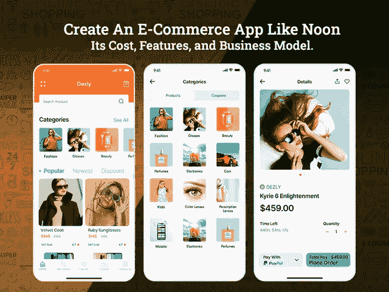

# 创建一个像 Noon 这样的应用需要多少成本

> 原文：<https://javascript.plainenglish.io/how-much-does-it-cost-to-create-an-app-like-noon-ade18f252b54?source=collection_archive---------4----------------------->

## 创建一个像 Noon 一样的电子商务应用程序:它的成本、特性和商业模式

寻找在 2022 年重振你的商业财富的方法？这并不奇怪，随着跨境商务、无国界企业、国际在线零售的发展，电子商务行业飞速发展，预计 2021 年将达到 9087.3 亿美元，美国零售电子商务销售额将增长 13.7%。

随着消费者行为心理的变化和在线购物需求的增长，电子商务行业在后疫情时代表现出了更强劲的需求。网上购物的便利是无与伦比的，尤其是当你可以在任何地方以极具竞争力的价格买到任何东西。当你回头看亚马逊等行业巨头。Flipkart、易贝、沃尔玛等正在占据电子商务市场的最大份额。2019 年，电子商务销售额占全球在线零售额的 50%。

这就是电子商务应用程序蓬勃发展的原因，几乎每个小企业都被鼓励涉足这一利润丰厚的领域。然而，只有少数初创公司或爱好者成功地在这个蓬勃发展的行业中生存下来，并增强了他们的可持续性。

然而，随着顶级移动应用程序开发公司的出现，开发一个电子商务应用程序不再是一个遥不可及的任务。你所需要做的就是在正确的方向上为你的电子商务移动应用开发打下基础。

像 Noon 这样的多供应商电子商务商店在阿联酋和中东国家令人瞠目结舌的大规模增长已经在零售商中传播了巨大的热情，并推动他们采用新的趋势来利用成功。

根据[新的市场研究报告](https://www.prnewswire.com/news-releases/e-commerce-market-to-be-worth-16-215-6-billion-by-2027--exclusive-report-covering-pre-and-post-covid-19-market-analysis-and-forecasts-by-meticulous-research-301264033.html)，全球电子商务市场预计将从 2020 年起以 22.9%的 CAGR 增长，到 2027 年达到 162，156 亿美元。随着迪拜零售店向数字购物店迁移的模式转变，许多企业陷入了两难境地，“开发一个像 Noon.com 这样的电子商务网站或应用程序需要多少成本？

通过 [**雇佣移动应用程序开发人员**](https://www.xicom.ae/services/mobile-app-developers/) ，开发一个像 Noon 这样成功的电子商务应用程序是很容易实现的，但是在你着手开始应用程序开发过程之前，你需要考虑下面提到的因素，而不仅仅是应用程序开发的成本。

*   什么是 Noon，创建一个像 Noon 这样的按需电子商务应用需要多少成本？
*   *如何创建一个像 Noon 这样的网购 App？*
*   *建立一个像 Noon 这样的电子商务应用需要多少成本，成本影响因素是什么？*

> 为了更好地理解，让我们深入了解以下几点:

# **什么是 Noon，2022 年创建一个类似 Noon 的 App 需要多少成本？**

Noon 是迪拜最具统治地位的在线购物平台之一，由沙特阿拉伯的百万富翁穆罕默德·阿拉巴(Mohamed Alabbar)支持，并以其高度友好的用户界面和无缝的可访问性赢得了全球的欢迎。

虽然这种平台的概念并不新鲜，但尽管是中东最年轻的平台，Noon.com 已经进入市场，并在全球市场树立了标杆。

在欧洲和北美，亚马逊、易贝、Etsy 等少数几家公司主导着这个行业，而 Noon.com 的市场规模仅是美国的十分之一。尽管如此，世界各地的公司仍在争夺市场份额。

> 有什么是如此独特的拥抱？

除了与最好的 [**移动应用程序开发公司**](https://www.xicom.ae/services/mobile-app-development/) 合作，该平台还通过积极的增长计划打入市场，并积极关注其后端物流和供应链系统。

以下是 Noon.com 在其他电子商务平台中胜出的关键亮点:

*   拥有广泛的产品列表，在不同的类别下组织良好，并为无障碍导航留出空间。
*   他们的核心关注点是供应链，因此除了提供标准的交付模式外，noon 还提供一种称为 Noon 的快递模式——随后是一个非常即时的存储、包装和交付过程，在 Noon 之前完成。
*   Noon 的产品种类繁多，从杂货、婴儿用品、美容产品、家用电器到时尚配饰。该应用程序最独特的部分是，产品分类良好，便于客户轻松使用。
*   Noon 允许用户访问适当的过滤器和搜索框来找到所需类别下的产品。
*   由于其易于使用的用户界面和惊人的响应功能，Noon.com 已经获得了超过其他领先的电子商务应用程序的巨大人气。

随着产品的按时交付，Noon.com 不仅在市场上建立了强大的立足点，还激励了世界各地的企业聘请移动应用开发公司，并开发像 Noon 这样的应用。

# **如何创建一个像正午一样的网购 App？**

现在你知道你要做什么，你将如何开发你的电子商务应用程序，是时候为你的应用程序列出一个必备清单了。以下是开发像 Noon.com 这样的在线购物应用程序时需要考虑的一些基本特性。

*   **注册或登记**

如果你正计划在 [**开发一个像正午**](https://www.xicom.ae/services/mobile-app-development/) 这样的电子商务应用程序，它能立即帮助你抓住目标受众，那么确保注册程序必须快速简单。永远不要让用户在填写信息上投入更多时间，所以让入职过程更快更简单的理想方法是通过第三方应用程序，如脸书和谷歌来招募。

*   **用户资料**

有了用户资料，你就能获得更多关于你的客户及其偏好的信息。在注册阶段要求过高可能会增加放弃率。因此，添加此功能将是您应用程序的一大亮点。

*   **推送通知**

它可以成为您企业的强大营销工具，让您的用户与应用保持互动。它为企业向目标用户发送警报、报价和交易提供了一个选项。

*   **多个账户**

将在 app store 上发布的应用程序始终是买家版本，并拥有属于买家的功能。但是，如果你要求一个市场，你必须考虑有一个卖家帐户，将他们的帐户与其他产品结合起来，接收付款，并与客户沟通。

*   **登陆页面**

您的应用程序的登录页面是在入职后吸引用户注意力的主要功能。为了使它有影响力，确保它包含了你的观众最需要/最感兴趣的信息。例如，在登录页面上为你的应用程序添加有利可图的优惠、折扣或最近添加的内容。

*   **产品目录**

产品目录是你的应用程序的核心。你的产品目录应该以图片为导向，最广泛认可的方法是用清晰的图片、产品细节、名称和成本对产品进行分类。

*   **产品页面**

类别中的每个产品都有不同的描述，它包括各种细节，如图像，描述，评级，评论和添加到购物车按钮。

*   **高级搜索过滤器**

在你的应用程序中添加多个搜索过滤器是一个很好的实践，可以为你的应用程序添加精明的搜索，可以预测用户在搜索什么。你可以 [**雇佣一个 app 开发者**](https://www.xicom.ae/solutions/hire-developers/) 来定制这个功能，让它更有冲击力。在过滤器的帮助下，用户可以根据颜色、价格、类型和其他不同属性对产品进行分类。

*   **愿望清单**

此选项允许用户为他们希望购买或稍后在购物车中查看的所需产品添加书签。

*   **产品评级和评审**

评论和评级是绝对必要的。个人不太倾向于在网上购买没有评论或评级的产品。顾客反馈是能显著影响网上购物的主要因素。

*   **多支付网关**

添加多种支付选项，并允许用户通过信用卡/借记卡、Paypal、电子钱包等进行支付。您的应用程序需要快速有效地处理支付，因此使用多支付网关，您可以确保无缝的结账体验。

*   **订单和交货状态**

添加该功能以确保订单的实时监控，因为它将提供预计的交货时间。

*   **计划交货**

根据您在该地点的可用性和便利性，可以选择预订送货时段。

*   **应用内聊天**

为了增加额外的隐私层并避免与送货人共享个人联系信息，允许用户通过应用程序进行交流。

电子商务应用程序开发的特性和功能没有限制。但是如果你雇佣一家软件开发公司来创建一个像 Noon 这样的在线购物应用，那么这些是你应该考虑在应用中实现的几个基本到中等水平的功能。现在，你们中的许多人很想知道它到底要花多少钱？

*嗯，如果你选择开发一个具有上述功能的应用程序，那么应用程序的开发成本将在 20，000 美元到 25，000 美元之间，而包含所有现代功能的高级版本将花费 35，000 美元以上。*

现在的核心问题是，为什么应用程序开发成本会有巨大的差异？事实是，有多种因素会影响应用程序开发的最终成本。

# **建立一个像 Noon 这样的电子商务应用需要多少成本，成本影响因素是什么？**

在迪拜开发一个类似于 Noon 的电子商务应用程序的成本取决于应用程序开发过程中涉及的各种因素以及你选择雇佣的 [**应用程序开发公司**](https://www.xicom.ae/services/mobile-app-development/) 。为了给你的电子商务商店创建一个像 Noon 这样的电子商务应用程序，需要对下面提到的元素进行深入的理解和分析，以了解应用程序开发的真实估计。

*像正午这样影响电商 app 开发成本的因素有:*

*   App 平台:平台的选择主要取决于目标受众。根据调查报告，Android 和 iOS 是占据移动应用市场 98%份额的两大领先平台。而通过雇佣跨平台的 app 开发公司，可以针对两个平台，能够节省 40%的开发成本。
*   **应用程序设计:**电子商务应用程序克隆脚本的成本取决于您为应用程序选择的设计类型。应用程序设计应该具有吸引力，并提供一个愉快的体验。
*   **应用规模**:你的应用结构有多复杂和庞大，实际上决定了应用开发的成本。如果你正在考虑 Noon，请记住它拥有复杂的应用程序结构，尽管它需要昂贵的预算。
*   **所需团队:**要打造一款像 Noon 这样的 app，需要一个由业务分析师、产品经理、app 开发者和质量保证专家组成的团队。
*   **特性和功能:**这可能是你的应用程序开发的最大成本驱动因素，因为复杂的应用程序特性将导致昂贵的开发成本和时间。

基于上述因素，Noon app 开发成本可能会有很大差异。但是，为您提供一个粗略的估计，基本应用程序开发成本将为 20，000 美元，中等版本将在 25，000 至 30，000 美元之间。然而，如果您计划构建一个面向未来的应用程序，实现包括语音搜索选项、人工智能聊天机器人、基于 ML 的实时分析、个性化购物推荐、基于 AR 的试穿过滤器等功能。应用程序开发的成本将上升到 35，000 美元。

# **结论**

随着电子商务领域的大量商机，现在是启动您的业务并投资 Noon 这样的应用程序以将您的业务推向新高度的最佳时机。为了开始这个应用程序的想法，你需要聘请一家有经验的 [**移动应用程序开发公司**](https://www.xicom.ae/services/mobile-app-development/) ，通过采用最好的技术和实现要求苛刻的功能，将你的应用程序想法转化为实时移动应用程序。

希望，通过这篇博客，你一定知道 Noon 是如何在市场上引起关注的。如果你有一个类似的应用程序的想法，并且正在寻找专家来帮助你以你想象的方式实现它，那么你可以 [**联系我们**](https://www.xicom.ae/contact/) 或者在下面提出疑问！

===================================

*更多内容请看*[***plain English . io***](http://plainenglish.io/)