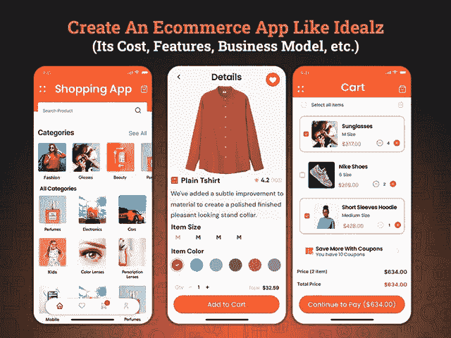

# 创建一个像 Idealz 这样的电子商务应用程序需要多少成本

> 原文：<https://javascript.plainenglish.io/how-much-does-it-cost-to-create-an-ecommerce-app-like-idealz-1361414c4895?source=collection_archive---------9----------------------->

## **创建像 Idealz 这样的电子商务应用——成本、功能和技巧，打造 2022 年最畅销的应用**

随着数字购物趋势正在迅速重塑传统市场，并准备接管零售业，现在是开办在线电子商务商店的最佳时机。

但真正的挑战是如何在竞争激烈的市场中生存，像亚马逊这样的电子商务应用程序已经统治了这个领域。

在那里，迪拜的商业大亨“Jad Toubayly”提出了一个创新的想法，彻底改变了电子商务行业。2016 年，他推出了一款名为“Idealz”的电子商务应用，这款应用的购物体验最有回报。凭借其罕见的概念和有益的策略，这种应用程序的想法占据了中心舞台，并以其成功的故事激励了各种创业公司。

*但是如何才能获得像 Idealz 这样的电子商务应用呢？*

希望涉足电子商务领域的商业爱好者实际上需要利用移动应用的优势，为你的业务带来大量机会。如果你想知道投资电子商务移动应用程序开发解决方案是否是一个值得的决定，那么你会惊讶地知道关于客户如何倾向于数字购物趋势的电子商务统计数据。

## **了解电子商务 App 行业市场统计及未来范围**

你还在经常问自己“你的店需要电商手机 app 吗？”。在过去的几年里，零售业经历了巨大的变革。因此，如果你处于投资电子商务移动应用程序开发解决方案将如何盈利的困境，那么你必须了解这些电子商务统计数据。

*   根据调查报告，预计 2021 年将有[21.4 亿全球数字买家](https://www.oberlo.com/statistics/how-many-people-shop-online)
*   根据最近的报告，预计到 2023 年，电子商务销售额将占全球零售额的 18.1%，全球销售额将增长 22%。
*   随着购物趋势的变化，调查报告显示，超过三分之一的美国小企业没有网站，所以你的移动应用有更高的机会吸引用户。

有了这些关于电子商务行业的统计数据和事实，可以有把握地说，电子商务移动应用程序解决方案正在咆哮，并在电子商务行业中大胆地铺平道路。知道这些数字后，你一定是怀着满腔的好奇心去聘请一家 [**手机 app 开发公司**](https://www.xicom.ae/services/mobile-app-development/) 了解如何创建一个像 Idealz 这样的电商 app，创建一个 app 需要多少成本，以及 Idealz 与其他电商 app 有何不同。

**在我们继续下一步之前，让我们先来看看这个博客的亮点:**

*   *像 Idealz 这样的电商 App 和其他 App 有什么不同？*
*   如何创建像 Idealz 这样的电子商务应用程序？
*   *创建像 Idealz 这样的应用程序需要考虑的特性和功能*
*   *创建一个像 Idealz 这样的电子商务应用程序需要多少成本？*
*   *影响 App 开发整体成本的主要因素*
*   *结论:准备用 Idealz 这样的电商 App 完成！*

让我们从基础开始吧！

## 像 Idealz 这样的电子商务应用程序与传统的电子商务应用程序有何不同？

自过去几年以来，电子商务行业一直在增长，没有任何下降的迹象，但早在 2016 年，Jad Toubayly 就通过为传统电子商务市场带来新的购物趋势而撼动了该行业。他通过简单地将他的想法与最佳应用程序开发解决方案整合到商业模式中，成功地转变了在线购物概念的想法。

现在的问题是，是什么让它在行业中脱颖而出？

Idealz 在线购物商店的独特之处在于，当顾客在这个在线平台购物时，默认情况下，他们将有资格从正在进行的活动和商业促销的广泛选择中获得赢得豪华大奖的机会。在 app store 上进行购买后，客户将获得一张参与券。这个抽奖系统最棒的部分是，整个过程都遵循政府制定的适当规范和条例。它是经过测试的，所以顾客肯定有公平的机会试试运气，在这个购物应用上赢得一个豪华的价格。

在迪拜，Idealz 已经成为一个热门话题。无论是客户还是企业，这家电子商务应用商店都在寻求世界各地的关注，并创造了一个惊喜。

了解了这个应用程序的想法后，你一定会为创建一个像 Idealz 这样的 [**电子商务应用程序而兴奋，但同时也确实担心创建一个像 Idealz 这样的应用程序需要多少成本。**](https://www.xicom.ae/services/ecommerce-development/)

在你深入了解确定应用程序开发成本的事实，并聘请电子商务应用程序开发公司将你的应用程序想法转化为强大的解决方案之前。让我们来看看这款手机应用的特性和功能。

# **创建像 Idealz 这样的电子商务应用程序所需的重要特性和功能**

虽然市场上有各种各样的电子商务应用程序在一个屋檐下提供各种各样的服务。但是每个 app 在市场上都成功了吗？不要！

因为应用中特性和功能的选择可以对应用的成功产生更大的影响。此外，应用程序开发团队倾注了他们的专业知识，将这些特性转化为可以改变游戏规则的适当功能。除此之外，应用程序的简单导航在应用程序开发过程中也非常重要。

*所以让我们直截了当地谈谈帮助你创建像 Idealz 这样强大的电子商务应用程序的最重要的特性和功能。*

*   **Swift 用户登录:**下载您的应用程序后，允许用户使用电子邮件 id、电话号码或社交媒体凭证登录 Swift，开始使用应用程序。
*   **浏览产品:**允许用户在应用过滤器的基础上从大量产品和服务中进行选择，如产品名称、数量或尺寸。
*   **奖励积分:**确保你的应用程序中有一个功能，可以向用户提供可兑换的奖励积分，或者允许他们毫无争议地向任何人捐赠他们的忠诚度积分。
*   **产品类别:**如果你正在考虑开发一个像 Idealz 这样的应用，那么确保你已经定义了像文具、外观、手表等类别。
*   **多种支付集成:**通过多种支付方式进行支付，您可以为用户提供轻松在线购物和支付的灵活性。确保你有一个条款，接受通过信用卡/借记卡支付，应用内建立电子钱包，等等。
*   **应用内导航:**追踪商品配送的实时位置，可以帮助用户监控商品的位置。
*   **推送通知:**这是你的应用程序中的一项重要功能，因为它允许用户随时了解每个优惠、交易、折扣和其他信息，如订单确认、获奖者等。
*   **费用计算器:**建议使用 ETAs，以便用户可以估算产品的费用以及预期的增值税费用。这将有助于你获得用户的信任，并避免显示任何隐藏的费用。
*   **活动:**在应用程序中有一个选项来管理应用程序中的频繁活动，并使应用程序所有者能够定期启动它。
*   **多语言支持:**如果你的目标用户是全球用户，那么在你的应用中加入这一功能并允许用户以他们自己的本地语言访问应用将是一个很好的主意。
*   **接受多种货币:**为了实现无缝支付，请确保您的应用程序接受美元、迪拉姆等货币。像 Idealz 这样的电子商务应用程序接受各种货币，并确保用户获得出色的购物体验。

这些是开发像 Idealz 这样的电子商务应用程序的几个基本功能。然而，要使它成为迪拜成功而独特的应用解决方案，你可以考虑雇佣一家离岸 [**应用开发公司**](https://www.xicom.ae/services/mobile-app-development/) ，它可以将你的应用想法转化为完美的解决方案。但是在了解了特性和功能之后，你想到的主要问题是，创建一个像 Ideals 这样的应用程序要花多少钱？

*答案来了！*

# **创建一个像 Idealz 这样的电子商务应用程序需要多少成本？**

如果你正在头脑风暴创建一个像 Idealz 这样的应用程序需要多少成本，那么你需要了解实际影响应用程序开发成本的参数。

通常，应用程序开发公司提供的基本应用程序开发成本的平均估价为 20，000 美元，而中级到高级应用程序开发的平均估价为 25，000 美元到 35，000 美元。

但你们中的许多人都想知道这些价格估计的确切构成……所以我们在这里揭示了应用程序开发的重要参数，这些参数对应用程序开发成本有影响。

*   **应用在各种平台上的可用性:**操作平台的选择是你的应用最大的成本驱动因素。因此，如果你打算推出一款兼容 Android、iOS 等领先平台的应用，那么选择跨平台应用开发服务，而不是为各种平台开发不同的原生应用，是值得的。
*   **功能和特性:**这个参数可能是你的应用程序开发成本的主要预算者。更复杂的应用程序功能将需要更长的编码时间，因此需要更熟练的开发人员，并提高他们的每小时成本。尽管如此，这将极大地影响应用程序的整体定价。
*   **App 设计:**App 的 UI/UX 设计是你 App 的心脏和灵魂。它不仅能帮助你吸引用户的注意力，还能让你确保出色的用户体验。因此，不要给应用程序花哨的外观，要确保它提供屏幕之间的无缝导航。
*   **应用程序开发团队:**开发电子商务应用程序是一项复杂的任务，因为它包含了创新技术包装的多种功能。所以，确保你雇佣的软件开发公司能让你接触到商业分析师、项目经理、应用开发者、UI/UX 设计师和质量保证工程师。

综合所有这些因素，相信 Android 应用程序开发解决方案比开发 iOS 原生应用程序成本更高肯定是令人怀疑的。因为与 iOS 设备相比，Android 应用程序是为各种设备和大小定制的，尽管它需要更长的开发时间，最终会影响应用程序的整体定价。在这种情况下，选择跨平台的应用程序开发解决方案可能是最好的选择。

但最重要的是，每个企业都有不同的业务需求，尽管建议与专家预约免费咨询时段。

## **结论:准备好与迪拜领先的电子商务应用竞争吧！**

有了所有这些关于电子商务应用的事实和数字，可以有把握地说，电子商务行业正在蓬勃发展，在不久的将来肯定不会有任何发展。在这种渐进的情况下，像 Idealz 这样的电子商务应用程序给商业爱好者带来了独特的希望，让他们能够通过这种开创性的应用程序创意进入市场。然而，无论你的应用程序想法有多复杂或简单，你都需要雇佣一家 [**移动应用程序开发公司**](https://www.xicom.ae/services/mobile-app-development/) ，让你能够将你的应用程序想法转化为一个包含应用程序中所有最新特性和功能的完美稳健的解决方案。

因此，如果您心中有任何应用程序想法，或者正在寻找从概念化、设计、开发到部署都支持您的应用程序开发团队，那么您可以 [**联系我们**](https://www.xicom.ae/contact/) 并获得您的免费评估，或者在下面提出疑问！

=======================================

*更多内容请看*[***plain English . io***](http://plainenglish.io/)