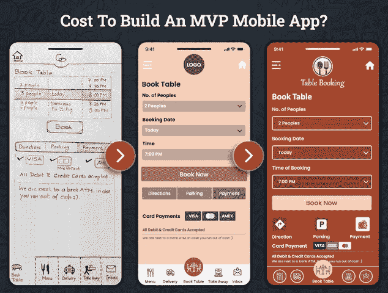

# 2022 年创造一个 MVP 需要多少钱

> 原文：<https://javascript.plainenglish.io/how-much-does-it-cost-to-create-an-mvp-in-2022-d209bb55a47f?source=collection_archive---------12----------------------->

## **制造一个 MVP 需要多少成本:解释了影响成本的特性**

从经验来说，有一个百万美元的应用程序想法并不是成功的关键。要推出一款成功的移动应用，在成功的旅程中需要大量的规划、策略、努力和方法。

还是不明白？

*这里有一个解释……*

一个商业爱好者受到这样一个事实的影响，即移动应用程序开发行业预计在 2023 年产生 9352 亿美元的收入。一位创始人有了一个绝妙的移动应用开发想法，成为这个蓬勃发展的行业的一部分。他非常兴奋，急于构建一个解决方案，并推出了一个由最新技术支持的高级功能包装的成熟应用程序。

一位创始人随后在营销和应用推广方面投入了预算来销售它。只有少数用户安装了应用程序并购买了服务。很快创始人的预算就用完了。结果，产品死亡，创始人浪费了时间、精力和金钱。

在这个竞争激烈的时代，如果你打算开发一个成功的移动应用，那么时间和金钱是决定一个应用解决方案能否成就你的事业的两个有限来源。仅仅一个伟大的应用程序想法不会帮助你达到最佳效果。你的预算和最小可行的产品必须一起计划，否则，它会严重失败并很快关闭。不管你的应用程序有多花哨或功能有多丰富。

*你不必相信我们的话……以下是值得信赖的统计数据……*

## 为什么 MVP 开发是科技创业公司的理想选择？

开发一个具有广泛功能选择的移动应用程序不仅是一个昂贵的选择，还会增加商业风险。摆脱这种昂贵风险的完美替代方案是构建一个最小可行产品(MVP ),其成本远低于构建一个成熟的应用程序。

以下是市场统计数据，描述了为什么 MVP 比推出成熟的移动应用更有可能成功。

*   42%的成熟应用程序未能获得成功，因为当它们推出时，市场上已没有存在的必要。
*   17%的应用程序因没有业务模型而失败。
*   由于团队和投资者之间的不和谐，13%的人公平地使用移动应用程序来创建他们的身份。
*   7%的移动应用因为没有旋转而失败。

但中心问题是“*2022 年 MVP 花了你多少钱”*？

当您开始 MVP 开发之旅时，要考虑的最重要的因素是它的成本。如果你也很想知道构建一个 MVP 解决方案需要多少预算，那么你需要考虑这个博客，并了解影响 MVP 应用开发成本的各种因素。

*最重要的事情总是先来！*

对于那些开始使用他们的第一个应用程序的商业爱好者来说，他们可能甚至不清楚什么是 MVP？

## **了解 MVP 的概念及其主要特征**

MVP 是一个最小可行的产品，用最少但基本的功能选择来构建，通常需要大约三个月的开发时间，并且需要一小组开发人员来构建它。

构建 MVP 解决方案的目的是用最少的功能快速营销你的应用程序，并允许用户测试产品并找出应用程序想法的有效性。在这种情况下， [**应用程序开发公司**](https://www.xicom.biz/services/mobile-app-development/) 的角色非常关键，因为他们可以帮助你建立一个符合你需求的 MVP。当用户测试产品时，他们会很容易发现不必要的功能。在这种情况下，开发者重新考虑他们的应用程序开发策略，并从应用程序中替换那些不必要的特性和功能。

考虑到推出 MVP 解决方案，企业主可以节省 5 到 7 个月的开发时间和一次性构建完整应用程序的成本。事实上，通过向市场推出 MVP 解决方案，评估目标受众是否对你的应用解决方案感兴趣以及他们的反馈变得更加容易。此外，开发者可以根据用户的反馈对你的应用进行修改。

> 除此之外，MVP 的主要特征如下:

*   MVP 解决方案具有足够的价值，可以轻松帮助您评估最终用户是否会感兴趣并购买它。
*   随着它的发布，您可以很容易地从最终用户那里获得反馈，以帮助未来的开发。
*   它展示了足够的未来利益来留住早期采用者。
*   它为你提供了一个机会来测试你的应用创意的潜力和它所需要的特性。
*   通过只构建必要的功能来节省您的金钱和时间。
*   构建解决方案所需的资源更少。
*   最小化业务风险，并提供最终扩展的灵活性。
*   MVP 解决方案将向商业投资者提供他们的应用程序看起来如何的实际想法，谁将是目标受众，以及其成功的可能性。

**简而言之:**开发一个 MVP 就是销售一个甚至还没有完全构建好的产品。你通过 [**雇佣移动应用开发者**](https://www.xicom.biz/offerings/hire-mobile-developers/) 将产品推向市场，并能够获得反馈，开始应用和添加基于它的功能。根据最终用户的反馈，您可以相应地扩展应用程序。现在继续我们最初的问题，构建一个 MVP 解决方案需要多少成本？

## **2022 年为你的企业打造 MVP 解决方案需要多少钱？**

估算 MVP 的开发成本就像预测一个成熟应用的 app 开发成本一样复杂。如果不知道应用的商业理念、特性和功能，UI/UX 设计的复杂性，猜测 MVP 的平均成本会变得很复杂。

当计算构建 MVP 的成本时，它取决于几个关键因素。创始人认为构建 MVP 解决方案的成本主要取决于应用开发所使用的技术，这是一个常见的误区。但事实并非如此。

这只是影响应用程序开发成本的因素之一。但是在制定预算时，理解所有这些影响成本 MVP 开发的关键因素也同样重要。

*让我们从影响 MVP 开发成本的重要因素开始:*

## **1。开发团队的选择**

MVP 开发的预算很大程度上取决于应用程序开发人员的每小时成本。如果您在这里假设 MVP 可以由任何开发人员构建，那么您可能错了。即使它是一个 MVP，它仍然需要编程技巧来成功构建它。你可以选择雇佣内部开发人员，外包 [**移动应用开发公司**](https://www.xicom.biz/services/mobile-app-development/) 或者寻找自由职业者。每种选择都有其利弊，并有不同的定价模式。

如果你选择雇佣一个自由职业者，根据技能，专业知识和知识，每小时的成本可能从 10 美元到 200 美元不等。这可能是你的最低成本，但有很多质量和安全风险。

接下来是创建一个内部应用程序开发团队，这需要大量的精力和时间来筛选每个专家。整个开发团队的月工资成本会比构建一个完整的 MVP 解决方案相当昂贵。

所以最后，外包应用程序开发公司，该公司以有竞争力的价格为您提供完整的应用程序开发包，遵守 NDAs 和其他安全措施，确保按时交付项目而不影响质量，这将是一个相当重要的决定。根据公司的规模、技能、经验和知识，应用程序开发人员的每小时成本从 20 美元到 49 美元不等。但根据应用程序的复杂程度，它可能会超过 75 美元/小时。

## **2。产品设计的复杂性**

毫无疑问，UI/UX 设计是你的应用程序中最重要的组成部分。但你不能否认的事实是，应用程序设计的复杂性也可以极大地影响 MVP 移动应用程序开发的成本。

成本取决于应用程序设计的复杂程度。评估 MVP 设计成本的最佳方法是评估应用程序中使用的用户界面(UI)。然而，永远记住构建 MVP 设计的成本有一个单独的成本。

为了控制应用程序的设计成本，雇佣一个应用程序开发人员是值得的，他会向你推荐简单的、吸引人的、有吸引力的 UI/UX 设计，它必须让你的用户更长时间地停留在屏幕上，并且花费更少的开发时间。通常，MVP 设计需要 70 到 120 个小时，决定 UX 设计 MVP 成本结构的主要因素有:

*   **准备:**在安排与专家会面之前规划设计。
*   **线框:**它就像是你的应用程序设计的结构，或者是纸上解释导航、屏幕和应用程序中其他元素的粗略布局。
*   **模型:**对客户的设计的基本介绍，这是设计的早期版本。

## **3。应用程序的特性和功能**

您的 MVP 解决方案中的功能数量将决定您的 MVP 解决方案在 2022 年的成本。向应用程序添加更多功能意味着更高的复杂性，并且会花费更多的开发时间和成本。因此，您需要优先考虑并列出要添加到应用程序中的基本功能和附加功能的数量。

在列出特性和功能时，开始创建一个在流程的每个阶段都能很好工作的特性列表，在这一点结束时，您必须列出“必须拥有”和“最好拥有”的特性，以及优先级和影响级别。

然而，在你开始列举功能之前，确定你正在开发什么类型的移动应用以及谁是最终用户是很重要的。确保应用程序开发人员应该在 MVP 开发中包含所有基本和必备的功能。

## **4。用于 MVP 开发的技术栈**

用于 MVP 开发的技术将对整个 app 开发成本产生重大影响。万一，如果你外包一个 [**移动应用开发公司**](https://www.xicom.biz/services/mobile-app-development/) 了解不同的技术和框架，那么你已经赢了一半的战斗。但是，如果您和您的团队都没有能力选择最佳堆栈，您可以考虑咨询专家，这将增加费用。

*不过，这里有一个给科技初创公司的专业建议，关于他们可以考虑用于 MVP 开发的技术有:*

*   **React Native** :构建跨平台应用，节省时间和预算，因为 90%的代码都是可重用的。
*   **用于后端开发的 Ruby on Rails:**虽然很容易理解，并确保开发速度提高 30–40%。

最重要的是，选择正确的技术来构建 MVP 可以影响项目的质量，并且可以全面提高移动应用程序开发的成本。

***简而言之:*** *这是影响 MVP 开发整体成本的几个主要参数。除此之外，开发需要多少时间将决定 MVP 的 app 开发成本。*

## **2022 年构建 MVP 解决方案的总成本**

如果你渴望知道 2022 年建立一个 MVP 解决方案要花多少钱，那么如果你自己知道怎么做，这个成本可以是零。但在 99.9%的情况下，这是行不通的。因此，构建移动应用 MVP 解决方案的平均成本可能从 17，500 美元到 20，000 美元不等，具体取决于功能的复杂程度。包装在大量功能中并由领先技术支持的更复杂的应用程序将增加开发的昂贵成本。

在建立预算时，大多数人在规划 MVP 时犯了一个错误，即区分初创企业和企业。在你雇佣一个移动应用开发者之前，通过回顾成功的 MVP 解决方案来影响你。如果你遇到了一个成功的 MVP 样本公司，如 Airbnb、优步、亚马逊等等，并试图将基于企业的 MVP 解决方案的评估与创业应用联系起来，那么它会起作用吗？

不同的企业规模有不同的需求和预算要求。因此，在得出任何结论之前，安排一次与专家的会面是值得的。

# **结论**

如果你知道什么参数需要权衡，什么因素影响应用程序开发成本，确定构建 MVP 的成本并不是火箭科学。如果你已经准备好为你的企业开发一个移动应用程序，但不确定要花多少钱，那么雇佣一个 [**移动应用程序开发公司**](https://www.xicom.biz/services/mobile-app-development/) 来开发一个成功的移动应用程序 MVP 是值得的。一旦你建立了一个 MVP 解决方案，评估应用的想法和从目标客户那里获得有价值的反馈就变得更加容易了。

然而，最终的估计将取决于建立一个应用程序需要多长时间。但是正确选择应用程序开发人员可以帮助您推出具有必备功能的应用程序，并获得节省时间和预算的最佳应用程序开发替代方案。

因此，如果您有任何想要快速推广的应用程序想法，并且正在寻找应用程序开发团队来定制它，那么您可以 [**联系我们**](https://www.xicom.biz/contact/) 或在下面提出疑问。

=======================================

*更多内容看* [*说白了. io*](http://plainenglish.io/) *。在这里注册我们的* [*免费周报*](http://newsletter.plainenglish.io/) *。*