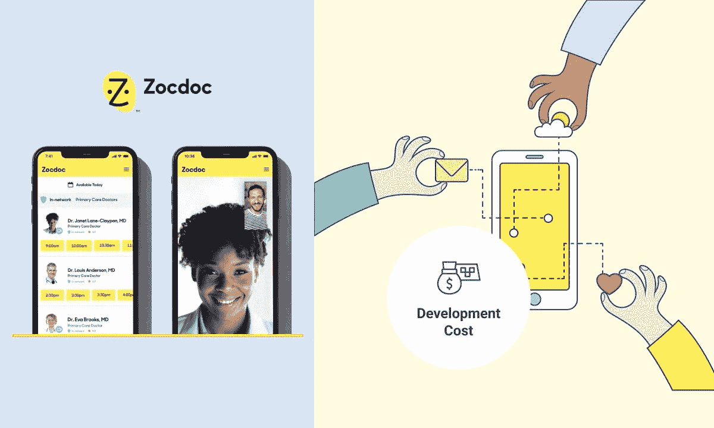
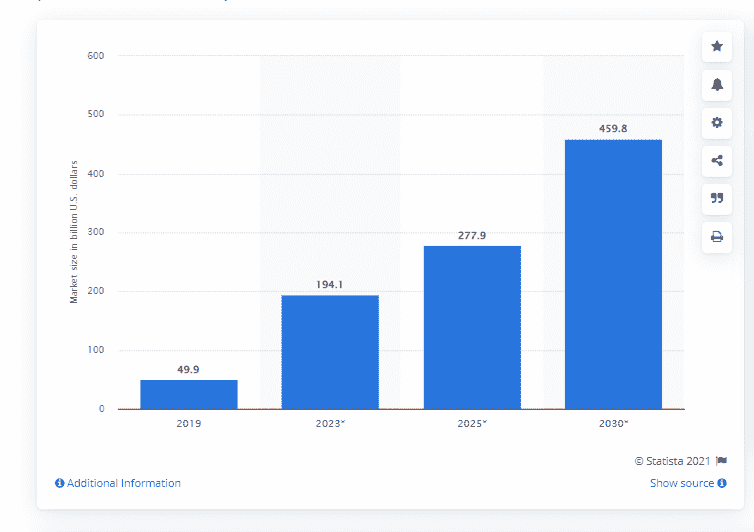
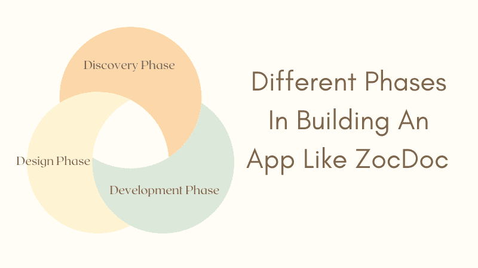
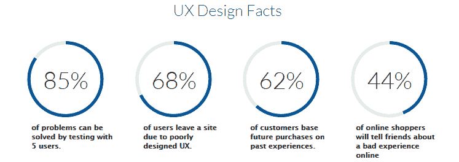
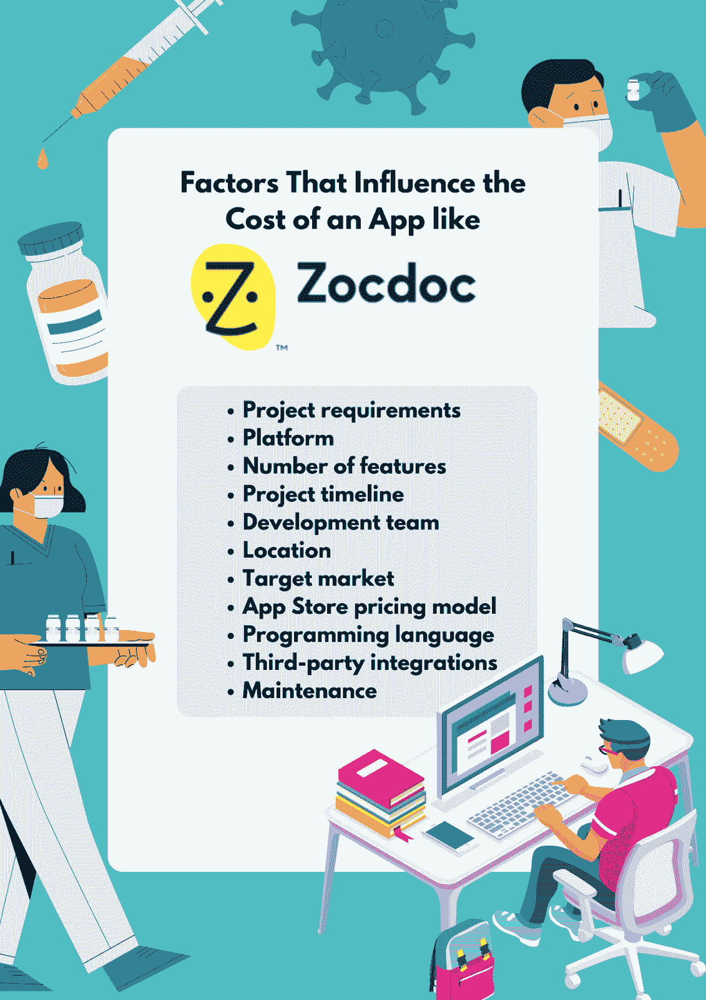
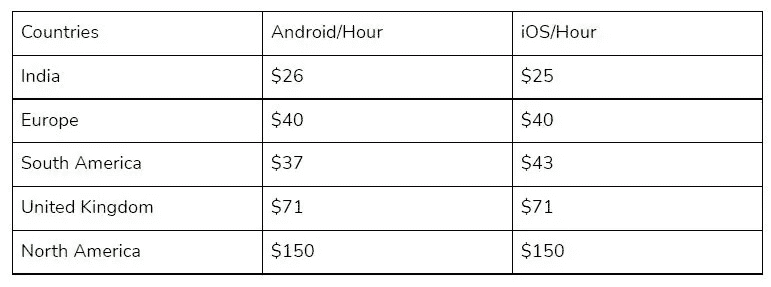
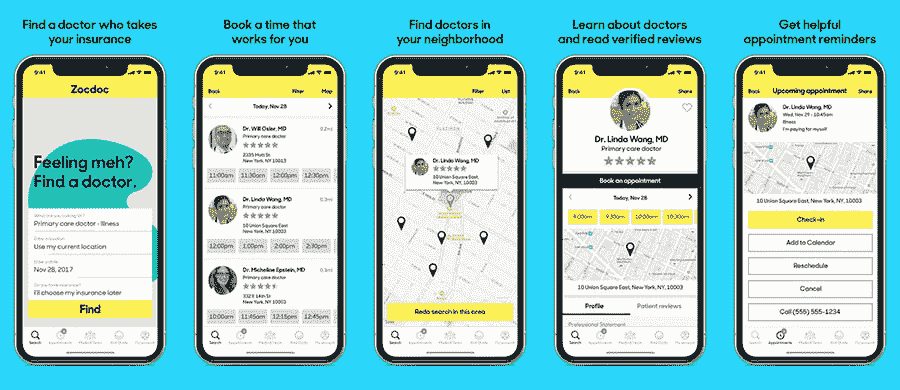
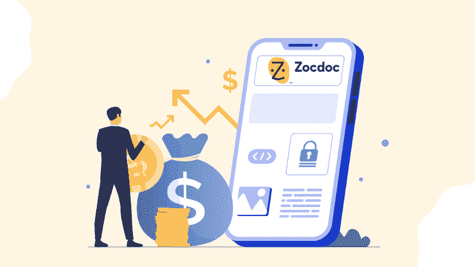

# 开发一个 ZocDoc 这样的 App 要多少钱？

> 原文：<https://javascript.plainenglish.io/how-much-does-it-cost-to-develop-an-app-like-zocdoc-58a68eacd683?source=collection_archive---------10----------------------->

***“开发一个像 ZocDoc 这样的应用需要几千到上百万美元，这取决于几个因素。”***

像任何其他业务一样，ZocDoc 这样的应用程序的成本主要取决于它需要什么。像这样的事情根本无法用金钱来衡量。理解工作范围、应用程序的特性以及任何其他可能影响成本的因素至关重要。

考虑这些事情可能很有挑战性，尤其是如果你不精通技术细节的话。因此，我们将回顾开发过程，并提供一些关于制作这样一个应用程序的见解。

**下面是我们将涉及内容的快速总结:**

*1。ZocDoc 这样的 app 是如何创建的？*

*2。影响 ZocDoc 这样的应用成本的因素。*

*3。开发类似 ZocDoc 的 app，应该寻找哪些特性？*

*4。预算明细:ZocDoc 应用费用*

但是在我们开始之前，让我们通过下面的信息图来了解一下 ZocDoc 的简史。

# ZocDoc 这样的 App 是如何创建的？

乍一看，ZocDoc 这样的 app 似乎很简单。这是一个医生和病人的在线目录。该功能仅限于允许用户搜索他们所在地区的医生，了解他们接受的保险，以及预约。

高达 88%的患者使用智能手机来寻找医生。Zocdoc 在美国尤其受欢迎。Statista 估计，到 2030 年，全球远程医疗市场将达到 4000 亿美元！

然而，在这个看似简单的服务背后，隐藏着一小群程序员、产品经理、UX 设计师、图形艺术家和营销专家。总共需要 50 人以上的**专门开发团队从零开始开发此类产品。**

**像 ZocDoc 这样的应用程序分三步开发:发现、设计和开发。**

****

****发现阶段** —发现阶段是为确定要制造什么产品而进行的初步研究。这个阶段通常持续 1-3 个月。在此期间，广泛的用户访谈和对人们当前如何解决问题的观察发展了它。**

****设计阶段—** 一旦 MVP 决定下来，设计师就要创建线框、模型、前端、后端等。这位 UX 设计师创作了许多草图和线框。**

**图形设计师在所有应用程序屏幕上工作，并将图像上传到主图像库。每个视觉元素都与一个特定的用户故事或特性相关联，因此其他团队可以根据需要轻松地重用它。**

**例如，如果要创建用于输入医生姓名的字段，相应的图形元素将被添加到图像库中的常规“表单”类别中。**

**在整个阶段，程序员与 UX 设计师合作创建一个交互式原型，模拟用户如何交互和使用最终产品，并允许功能和限制测试。一个 MVP 大约需要三个月的设计时间和一个月的构建时间。**

**此外，请记住，如果你的移动 UX 不够好，不够吸引人， **68** %的用户更有可能离开你的网站。**

****

****开发阶段**——设计完成后，程序员开始编写应用程序的每个屏幕/模块。每个屏幕都是从头开始编码的。但是有些标准功能只需创建一次，然后就可以在整个产品中重用。**

**构建一个应用程序每个功能需要 1-2 个月(如果没有错误发生)。一个最小的可行产品通常需要大约 3-6 个月的总开发时间(尽管这取决于需求的范围和期望的特性)。此外， [**聘请手机应用开发者**](https://www.pixelcrayons.com/hire-mobile-app-developers) 他们可以轻松定制你的需求。**

# **像 ZocDoc 一样，应用程序的成本取决于几个因素——这里有几个！**

**创建像 ZocDoc 这样的应用程序的成本会因各种标准的不同而有很大差异，包括:**

****

**项目需求——产品需要的特性越多，构建它所需的时间和金钱就越多。这意味着一个简单需求的产品比一个复杂需求的产品花费的时间更少，成本更低。**

****2)平台-** 很多开发平台都有，但是为每一个开发一个 app 的成本；变化很大。为 iOS 开发一个应用程序的成本通常比为 Android 开发的成本更高。**

****3)功能数量-** 如上所述，产品功能越多，开发时间就越长，因此价格也可能越贵。**

****4)项目时间线-** 如果一个项目非常复杂，那么它将需要更长的时间来构建，从而延长期限。这意味着需要更多的时间来研究、设计、构建和测试产品。如果需要满足截止日期或需要更少的功能，制作应用程序将花费更少的时间，因此成本也更低。**

****5)开发团队**——一个有很多复杂功能的项目需要一个更大的开发团队来构建。如果应用程序相对简单，那么开发人员就更少，这意味着花在工资上的钱就更少。也有可能以低于全职员工的价格雇佣自由职业者。**

****6)地点-** 开发团队可以位于全球任何地方，这会影响最终成本。雇佣海外团队通常比雇佣本地或国内团队更便宜，因为要考虑的差旅费等费用更少。离岸开发团队的可用性也意味着可以在短时间内雇佣一个团队。**

*****根据应用程序开发研究，北美是应用程序开发成本最高的地区。此外，印度的服务成本相当低。*****

****

****7)目标市场-** 有多少用户会使用该应用程序会影响其成本。为非常小众的受众开发的应用程序，例如特定国家的人或说特定语言的人，可能比为大量受众开发的应用程序便宜，因为它不需要翻译或本地化。**

****8) App Store 定价模型-** 苹果和谷歌都有自己的定价模型，这些模型会影响一个应用的最终成本。需要进行市场研究，以确定在哪里销售应用程序最有利可图。**

****9)编程语言-** 这是另一个影响开发一个 app 成本的因素。如果一种编程语言已经为开发团队所熟悉，那么使用这种语言的成本会比团队需要学习它的成本要低。**

****10)第三方集成-** 与社交媒体、支付处理器和其他第三方服务的内置集成将影响最终开发成本。如果产品需要与许多这些服务集成，将会花费更多的时间和金钱。**

****11)维护**——一个 app 上线后，需要更新和支持。通常，更新的成本会低于初始开发阶段，但更新一个应用程序仍然会根据需要进行多少更改而有所不同。**

# **开发类似 ZocDoc 的 App，应该寻找哪些特性？**

****

**[Image Source](https://ebafl.com/zocdoc-find-book-doctors/)**

****1)基本注册/登录功能** —用户需要在使用产品前创建账户。这可能包括名称、电子邮件、密码和显示名称字段以及登录/注销按钮。如果需要额外的功能(例如，用户名更改)，也需要构建。**

****2)基本信息收集**包括为用户创建字段以输入其家庭地址、账单/支付信息等。在使用产品之前，必须从用户那里收集大量的信息，因此这个过程必须是平稳的和用户友好的。**

**3)日程安排功能 —一旦用户的数据被成功输入，他们需要能够安排一个约会。这包括显示所需时间段的可用医生列表，从该列表中选择医生，以及最后安排预约。**

****4)提醒—** 用户可能希望在约会时间到来时收到提醒信息，因此产品必须能够发送这些信息。**

****5)取消/修改—** 用户需要能够取消或修改他们的预约。这个过程对他们来说应该是高效和简单的。**

****6)易访问性—** 用户应该很容易找到他们想要的产品。需要一个好的导航系统，搜索选项和过滤器，以便用户可以快速找到他们需要的信息。**

****7)视频会议选项—** 一些医生在预约前为患者提供视频会议选项。要做到这一点，需要在应用程序中内置视频聊天功能。**

****8)推送通知—** 当用户被添加到等候名单中或其他用户将其添加为推荐人时，用户应该会收到推送通知。他们还需要接收有关应用程序任何更改或更新的推送通知。**

****9)支付选项—**ZocDoc 上的医生可以接受现金、支票、信用卡和其他形式的预约支付。这些支付选项应该在平台上可用。**

****10)地图集成-** 为了帮助用户找到去医生办公室的路，应该有一个将地图集成到应用程序中的选项。**

# **开发 ZocDoc 这样的应用程序的预算细目:**

****

*   ****开发**:25，000 美元到 50，000 美元(取决于项目的复杂程度)**
*   ****设计**:10，000 美元到 25，000 美元(取决于需要做多少修改和需要的页数)**
*   ****QA 测试:**$ 3000–5000(这包括在不同的设备和浏览器上进行测试，识别错误，优化平台)**
*   ****营销**:5000 美元——30000 美元(取决于市场规模；还包括品牌战略)**
*   ****维护**:5，000 美元—15，000 美元(初始发布后；少于原始开发，因为更新成本更低)**

**总而言之，预算在 8 万到 15 万美元之间。**

# ****结论****

**希望这篇文章已经回答了你关于开发一个类似于 ZocDoc 的应用要花多少钱的问题。这个项目需要很大的预算，但这是由于平台需要多种功能。**

**根据您的具体需求，您可能不需要那么多功能，并且会降低预算。假设你有一个移动医疗预约调度 app 的想法。在这种情况下，我们鼓励你进一步探索你的选择，与移动开发者交谈，或者在印度找到一家 [**移动应用开发公司**](https://www.pixelcrayons.com/mobile-app-development/) 来帮助你创建它。**

# **常见问题**

****Q1:医生预约应用需求上升的原因是什么？****

**A1:对医生预约应用的需求正在上升，因为:**

**1.这些应用程序让医生和患者之间的交流和预约变得更加容易**

**2.这些应用程序还为医生提供了查看患者信息、跟踪患者进展的空间，并通过推广医生预约以外的服务来增加收入**

**3.由于这些平台是为移动设备设计的，它们可以从任何地方访问，这为出差的医生或出城的病人提供了方便**

**Q2:我如何制作一个像 ZocDoc 这样的应用程序？**

**A2:做一个 ZocDoc 这样的 app，最好的方法是聘请有医疗 app 设计经验的开发公司。他们可以帮助你从头开始构建你的应用，或者集成第三方插件，创建一个与 ZocDoc 功能相同的应用。**

**他们还可以为搜索引擎优化应用程序，在不同的设备和浏览器上测试漏洞，在推出后提供维护服务，等等。**

****Q3:预约医疗的应用程序是如何工作的？****

**答 3:预约医疗应用程序的工作原理是让医生和患者通过同一个平台相互交流。它还可以帮助他们安排预约、查看患者档案、跟踪进展以及推广企业提供的其他服务。**

***更多内容看* [***说白了。报名参加我们的***](http://plainenglish.io/)***[***免费每周简讯点击这里***](http://newsletter.plainenglish.io/) ***。********