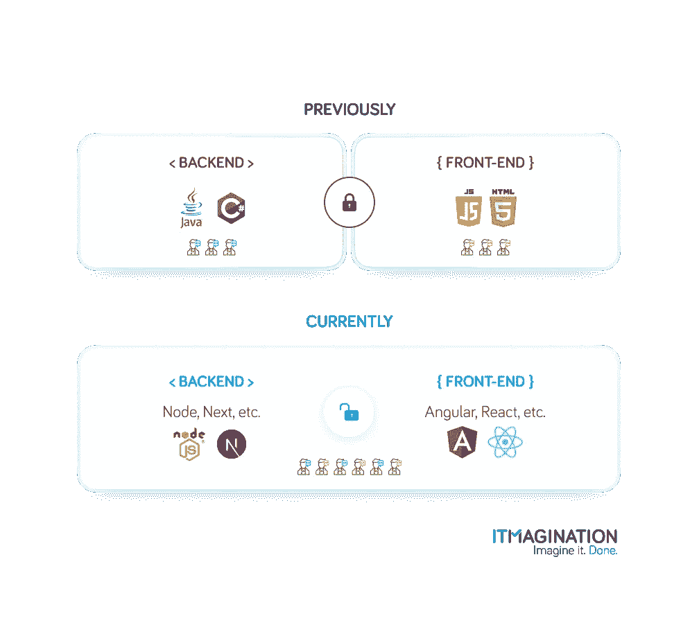
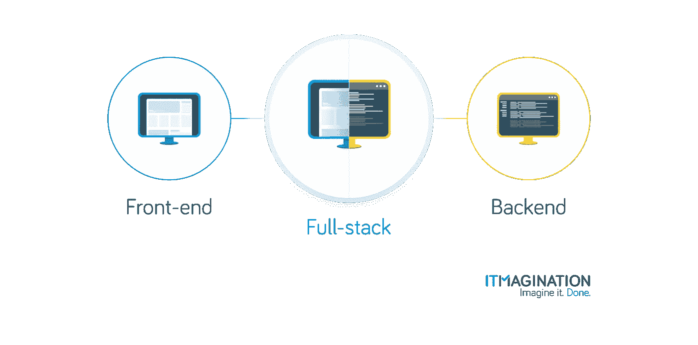
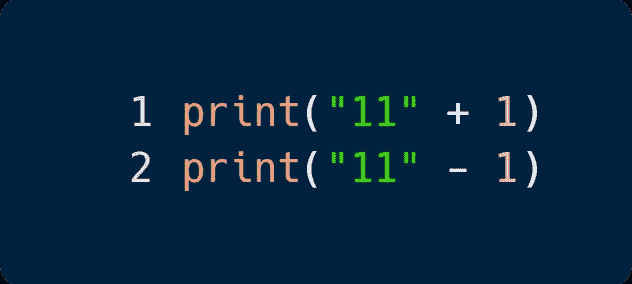
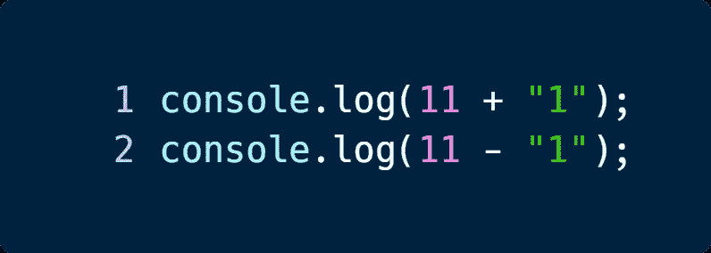

# Node.js 如何改变企业软件工程的世界

> 原文：<https://javascript.plainenglish.io/how-node-js-changed-the-world-of-corporate-software-engineering-3f00fd2b77ff?source=collection_archive---------8----------------------->

公司软件工程本身就是一个世界。巨大的代码库，通常包含意大利面条式的代码，需要一种静态类型的语言来帮助在处理如此复杂的项目时保持理智。很长一段时间以来都是这样——Java 和 C#曾经是这个领域的两大王者，统治着这个领域，看不到真正的竞争对手。

软件工程师在不得不处理诸如编译、困难的包管理和这些语言的整体复杂性等复杂问题时，努力保持理智。很少有人知道，自 1995 年以来，企业将开始迁移的语言就在他们的眼皮底下——JavaScript(JS)。

然而，为了准备好“严肃”的使用，它需要两个版本。如果没有 node . js(Brendan Eich 创作的运行时)和 TypeScript，即类型化 JavaScript 超集，企业团队就无法在更大的项目中使用这种语言。他们两人都以自己的方式提供帮助。

# node . js——从 2009 年开始统一 JavaScript 开发者

Node.js 允许在浏览器之外执行 JavaScript。虽然这不是第一次允许这样做，但却是第一次成功。几年后，这个项目成为 JavaScript 迈向全球第一的关键因素之一。企业应用变得更轻，编写速度更快，团队可以变得更小——同时保持相同(甚至改进)的应用质量。最后一个方面主要归功于 TypeScript 的创建。

# 后端和前端使用相同的语言

许多企业在服务器端使用 Express.js、Fastify 或 Nest.js 等框架，在客户端使用 React、Angular 或 Vue。他们也不会就此罢休。React Native/NativeScript 经常在创建移动应用程序时为他们服务。电子允许他们创建桌面应用程序。尽管他们有资源让专门的团队用本地语言为所有平台工作，但他们选择不这样做。为什么？

首先，如果所有的软件工程师都专攻同一种语言，那么每个人都能相互理解。传统上，一个团队用 C#/Java 开发，另一个团队用 JavaScript 开发，这种情况不会发生。这造成了难以克服的人为分歧。在 PayPal，早在 2013 年，前端和后端团队就被统一为一个团队，允许[他们]了解并回应技术堆栈中任何级别的[他们的]用户需求。"团队可以分享他们的经验，通常是 1:1，这样可以更快地修复 bug。

此外，由于团队规模更小，支出更少也有经济效益。

# 需要更少的开发人员

PayPal 是如何减少开发人员数量的？

随着他们的转变，他们确保只有一个团队只用一种语言编写代码。当时，全栈 JavaScript 开发人员确实是一个罕见的发现。有更流行的栈，比如 Java & Java Server Faces(现在是 Jakarta Server Faces)或者。NET + Angular.js。

现在一个应用两边工作的开发者比较常见，也享有一定的知名度。他们可以为大公司节省大量资金，同时应用程序保持相同的质量水平。

结果，团队成员减少了，总体上需要的团队数量也减少了。

# 人才库？人才海洋。

除了受到大型组织的喜爱之外，JavaScript 也是开发人员喜爱的领先语言。它的简单性、较低的入门门槛、学习资源的普遍可用性以及它的普遍性使它成为有经验和新鲜的程序员的普遍选择。

JavaScript 是 GitHub 的[“octo verse 的状态”](https://octoverse.github.com/)研究中的领导者，是自 2014 年以来最受欢迎的语言(最新版本是在 2020 年)。TypeScript 排在第四位，在 C#、PHP 或 Ruby 之前，在 Java、Python，当然还有 JavaScript 之后。

[在 StackOverflow 同年的总结中](https://itmagination365.sharepoint.com/sites/Marketing/Shared%20Documents/General/Blog%20Files/In-depth%20posts/insights.stackoverflow.com/survey/2020)，JavaScript 连续第八年成为最受欢迎的语言。].谈到亲和力，TypeScript 排在第二位，在 Rust 之后，在 Python 之前。

> 这些只是人才库深度的一些指标。ITMAGINATION 的首席创新官马尔钦·dąbrowski 补充说，一个“问题”是，GitHub 上 JavaScript 的流行很大程度上要归功于前端工程师。

这只是优势的开始——企业从采用 Node.js 中享受到许多其他好处。

# 运行更快的应用程序，用更少的代码行构建得更快

[2013 年，PayPal 写了一篇关于他们与 Node.js 的旅程的文章](https://web.archive.org/web/20180326002331/https:/www.paypal-engineering.com/2013/11/22/node-js-at-paypal/)他们成功地用两倍的速度用 JavaScript 重建了他们的应用，用了更少的人。最重要的是，减少了 33%的代码行，减少了 40%的文件(！).

不仅如此，与基于 Java 的应用程序相比，该应用程序可以处理两倍的请求量。有趣的是，Node.js 应用程序只使用了其中一个内核，而 Java 使用了… 5 个内核[原文如此！].如果你现在还不满意，页面服务速度快了 200 毫秒。

Node.js 通常不需要很多资源就能运行，速度非常快。ITMAGINATION 的 Artur abudzi324ski 在与我们的对话中分享了他对该语言的性能和谷歌在 V8 引擎上的出色工作(Node.js 的基础)的印象

> 【谈论 JavaScript 在云和后端用例中流行的原因】对我来说，因为它的速度。因为它的优化，因为谷歌在 V8 上真的很努力，这是运行 JavaScript 的引擎。他们优化了它，编写了几个编译器，这就是为什么它启动很快，同时也可以优化自己，因为 JIT 代表“实时编译”。
> 
> 多亏了这一点，我们现在有了一种可以在任何地方运行的像样的编程语言。Node.js 是一个运行在 V8 上的 JavaScript 环境，它连接到操作系统，允许我们编写更严肃的后端和应用程序，而不仅仅是显示一个网站。

自 2013 年以来，对语言和运行时进行了大量改进，这很可能进一步提高了性能。

# 微服务

直到几年前，企业的一般方法是使用单一架构构建应用程序。简单地说，应用程序的所有部分都紧密依赖于彼此，这导致了一个重要的问题。如果应用程序的一部分失败了，整个应用程序都会失败。

这是企业团队开始接受微服务架构的主要原因之一。应用程序的所有部分都是独立的，因此，如果一个功能停止工作，应用程序仍然可以正常工作。实现这种分离有两种主要方式——容器和无服务器功能。

# 微服务—容器

当团队希望让他们的应用程序更加独立于他们工作的环境时，他们会转向容器。它们仍然需要考虑运行什么和在哪里运行，尽管不是那么多。总的来说，容器化是确保我们消除软件工程中众所周知的问题的可靠方法——“但是它在我的电脑上运行”。

毫不奇怪，这也是 JavaScript & Node.js 统治的地方。Node.js 几乎不需要运行——很少的 RAM 和配置，等等。开发人员在标准库中也有一个 web 服务器，给开发人员很大的操作空间，而不需要参考第三方代码。即使您决定使用一个库，比如 Express.js，它们通常只是内置节点的 Http 库之上的薄薄的一层。创造。建造。[使用 PM2](https://pm2.keymetrics.io/) 管理生产应用。完成了。

# 微服务——无服务器计算

无服务器功能是抽象“在哪里”的另一个步骤。Azure Functions 或 AWS Lambdas 等解决方案在分离特性和功能方面有些激进。传统上，它们也是企业用户的首选。[事实上，在 2020 年，来自大公司的大约 80%的 AWS 用户使用 Lambdas。最大的用户非常喜欢它们，因为对于较小的团队来说，调试可能是一个不值得考虑的问题，但是容错、隔离是较大的团队非常需要的。它们可更好地扩展，部署更快，并且我们可以避免任何局限。](https://www.datadoghq.com/state-of-serverless-2020/)

这里的一个重要指标是冷启动，这是当您的函数长时间空闲时会发生的情况。事实证明，唯一能和 JavaScript 抗衡的语言是 Python。

最后，无服务器功能是所有微服务解决方案中最具成本效益的，因为人们只需支付使用量，而不是预付一个月的费用。

# TypeScript —企业的救星

在我们进入更多细节之前，我们必须谈论一件事。大多数企业应用程序、库和框架都是用**类型脚本** (TS)编写的——它是 JavaScript 的超集，提供了设计时类型安全。设计时与代码编辑期间的类型安全同样重要。

举一个简单的例子，说明如果没有创建 TypeScript，可能会出现的问题:

如果用 C#，你写

什么都不会编译，你也不能计算表达式，因为你会得到一个错误。在 C#中使用加号是公平的，因为它是字符串连接。使用负号会给你带来麻烦。很公平。

在 Python 中，我们不能使用加号或减号。

这个简单的代码将不能正确运行，因为我们将得到一个“类型错误”

现在在 JavaScript 中，事情变得有趣了。我们从哪里得到的

分别是 111 和 10。没有错误，没有问题。

尽管这些例子至少说起来微不足道，但它们说明了一个更大的问题，并让人们尝到了如果微软没有在 2012 年创建他们的语言(TypeScript)会发生什么。幸运的是，他们做到了，这使得在大型代码库中包装代码变得更加容易。TypeScript 会对代码片段做什么(请注意它与 JavaScript 代码片段是如何相同的)？

答案是:完全没有。当编译我们的代码时我们会得到一个错误，我们的编辑也会抱怨。

更广泛的社区也爱上了它，迅速地将众多项目转换为 TypeScript，并为以前没有定义类型定义的库和框架添加了类型定义。因此，您可以在 99%的时间里享受类型安全。ITMAGINATION 的高级 JavaScript & Node.js 开发人员 Artur abudzinski 在最近的视频采访中建议，即使是最小的项目也要使用 TypeScript，在这次采访中，我们讨论了全栈 JavaScript 开发的现状。

在打字稿的情况下，好处大大超过任何可能的负面影响。简单、快速、经济高效。同时维护(设计时)类型安全。明确地说，采用超集可能有什么缺点？

我们主要说的是时间支出。有时有必要为没有类型定义的包声明类型定义。(部分)设计类型的安全性也可以在 JavaScript 中使用 JSDoc 注释来实现，尽管不如 TypeScript 注释好。最后，你的。ts 文件需要转换成 JavaScript。虽然不需要很长时间，但是有点不方便。

# 结论

经过漫长而坎坷的历史，JavaScript 从一只丑小鸭成长为一只美丽的天鹅。公司软件工程师喜欢这种语言的许多优点，而由于有了 TypeScript，最紧迫的问题很容易避免。

Node.js 比其他替代产品更快，也更容易接近，并且一直在变得越来越快，成为微服务的企业门户。它的替代品 Deno 可能也会受到大公司的青睐，但是现在决定它是否会和 Node.js 一较高下还为时过早。

***PS:我们正在招聘 Node.js 开发者:*** *对于所有 Node.js 的专业人士，我们有一个好消息——我们正在招聘。无论你是一个* [*后端开发者*](https://www.itmagination.com/open-jobs/NodejsDeveloper-8050000012856481) *，* [*React 开发者*](https://www.itmagination.com/open-jobs/ReactDeveloper-8050000012874788) *，* [*React 原生开发者*](https://www.itmagination.com/open-jobs/ReactNativeDeveloper-8050000012886577) *，* [*Vue.js 开发者*](https://www.itmagination.com/open-jobs/VuejsDeveloper-8050000013295265) *，还是一个* [*角度开发者*](https://www.itmagination.com/open-jobs/SeniorFrontendEngineerwithAngular-8050000009516936) *，我们都在等待*

*原载于*[*https://www.itmagination.com*](https://www.itmagination.com/blog/node-js-changed-corporate-software-engineering)*。*