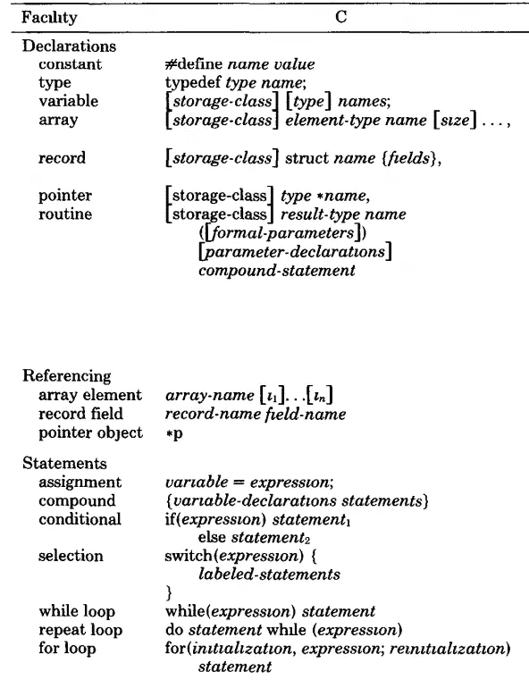

# 旧语言如何提高年轻开发人员

> 原文：<https://javascript.plainenglish.io/how-old-languages-improve-young-developers-a6e65083c28?source=collection_archive---------11----------------------->

## 旧语言——新突破

## 今天使用的 3 种旧编程语言。这是他们教我们的。

Photo by [The Lazy Artist Gallery](https://www.pexels.com/@thelazyartist?utm_content=attributionCopyText&utm_medium=referral&utm_source=pexels) from [Pexels](https://www.pexels.com/photo/man-in-blue-suit-999267/?utm_content=attributionCopyText&utm_medium=referral&utm_source=pexels)

我和其他开发者一样。够好了。解决问题，前进，做得很好。

编写我的学校项目。为我的位置工作。点在编码，而不是工程。

偶然发现了这些古老的语言。他们提高了我的复杂思维、解决问题和日常编码技能。

# **LISP**

没错，就是带括号的语言。是的，它令人讨厌。是的，它是旧的。

LISP 是*【黑客】*应该知道的语言之一。Eric Raymond 在他的*“如何成为一名黑客”⁸.中如是说*

保罗·格拉厄姆用 LISP 建立了一个成功的企业。与竞争对手相比，口齿伶俐是他的优势。⁴

下面是常见的 Lisp:

Wrote this piece of code as part of my faculty chores

你能从 LISP 中学到什么？

很奇怪。不像其他人。基本数据结构是一个链表。因此得名*“列表处理器”*。连代码都是列表。

一切都是不变的。你不保留任何状态。保留状态导致非惯用的 LISP 解决方案。

培养你解决问题的能力。仅使用一个列表，开发每一个可能的解决方案。有限的工具集带来巨大的发展。

一般的开发者不在乎改进。保罗·格拉厄姆说得最好。

> …当你终于懂了(LISP)；这种经历会让你在以后的日子里成为一名更好的程序员，即使你实际上从来没有大量使用 Lisp 本身。⁴

你只限于递归。你只限于列表。你就是这样进步的。使用很少的工具开发复杂的程序。

你会学到递归。一切都是用递归完成的。您将首先学习如何检查出口。如何避免迭代而倾向于递归？

递归将程序员和非程序员区分开来。递归是有抱负的开发人员的三个 issues⁵之一。

学习 LISP 导致学习自顶向下的架构。学习递归地思考，关注层级的顶端。

更好的故事来自保罗和他的 startup⁴.

他们开发了一家名为 Viaweb 的初创公司。你知道为什么吗？它是“通过网络”。

这个项目发展了，雅虎买下了它。Viaweb 现在归雅虎所有。

有了 LISP，他们能够智胜竞争对手。随着竞争对手新闻稿的结束，他们开发功能。

在早期，LISP 为他们工作。想象一下 LISP 现在能做什么。

> …但是要让那些已经对使用 Lisp 感兴趣的人放心——那些知道 Lisp 是一种强大的语言，但是担心它没有被广泛使用的人。在竞争激烈的情况下，这是一个优势。Lisp 的强大之处在于你的竞争对手不了解它。⁴

# C

成为*“黑客”需要的另一种语言。⁸*

*指针*。到处都是指针。你可能会觉得他们很讨厌。但是他们分享丰富的知识。

了解数组的工作原理。如何使用指针作为数组的访问器？如何使用指针或地址算法？

让我们了解格言问题之间的区别。通过引用传递，或通过值传递。

为什么我们使用哪个很重要？我们了解副作用。

通过引用传递，改变函数内存空间之外的内容。大多数语言的解决方法是通过值传递。在 C 语言中，你可以传递指针，并继续产生副作用。

学习内存寻址的内部工作原理。关于数组的更多信息。数组的数组或矩阵。为什么停在这里，多维数组。

Taken from “Comparison of the programming languages C and pascal”²

> 另一方面，c 很少隐藏底层机器。相反，它试图提供一种控制机器的便捷方式。

c 将教你如何使用内存。如何推理记忆？

程序员在编程的时候应该做什么？分配、释放和重新分配内存。所有这些都留给程序员去处理。

对内存的巨大控制是有代价的。易出错程序的成本。因此，很多程序员的努力都花在了内存管理上。

您将了解关于文件的更多信息。如何打开它们，以及可以打开它们的模式。学会如何关闭它们，留下一个干净的石板。

大多数 C 程序是为操作系统设计的。UNIX 系统是用 C 编写的，你可以学习如何用 C 编写系统。

# 装配工

> x86 汇编是一种用于 x86 类处理器的编程语言。…汇编语言是机器专用的，被认为是“低级”语言。— [3]

这是比 c 更深的一个层次，可以多了解机器指令。在比 c 语言更低的层次上处理内存。

[https://stackoverflow.com/a/7383090/5999670](https://stackoverflow.com/a/7383090/5999670)

你将学会欣赏[拾荒者](https://en.wikipedia.org/wiki/Garbage_collection_(computer_science))。学习如何存储参数，如何存储上下文，以及清理内存。

了解更多关于函数如何工作的信息。参数存储、上下文切换和子程序。汇编之后，没有人认为函数是理所当然的。

了解有关控制流结构的更多信息。`GOTO` `JMP` `JMP addr`就是其中的一些。记住这一点，你的程序结构会更加合理。

> 我将学习如何编写更小、更快、更高效的例程。我对软件开发的理解会达到我的大多数同龄人所没有的水平。

你会记得 IDE 后面有什么。用汇编程序，你看后面是什么。引擎盖下。

> 软件变得比硬件变得更快更慢。⁰

软件越来越重要。Niklaus 建议远离精益软件。将硬件空间填满到极限。

我们应该从汇编语言中学到什么？基础编程。欣赏简单的解决方案。远离无意义的添加，专注于本质特征。

> 我们的抽象能力是生产力 enhancer⁹.

懂汇编只是扩大了我们的背景知识。抽象是基于背景知识的。

# 资源

[【1】](https://onlinelibrary.wiley.com/doi/pdfdirect/10.1207/s15516709cog0802_1)学习 LISP 编程

[2] Feuer，Alan R .和 Narain H. Gehani。"程序设计语言 C 和 pascal 的比较."*美国计算机学会计算调查(CSUR)*14.1(1982):73–92。

[【3】](https://www.codeproject.com/Articles/89460/Why-Learn-Assembly-Language)为什么要学习汇编语言？

打破平均水平

Dehnadi，Saeed 和 Richard Bornat。"骆驼有两个驼峰(工作名称)."*英国米德尔塞克斯大学*(2006):1–21。

[【6】](https://www.joelonsoftware.com/2005/12/29/the-perils-of-javaschools-2/)爪哇学派的危险

[【7】](https://blog.codinghorror.com/separating-programming-sheep-from-non-programming-goats/)将发情的绵羊与不发情的山羊分开

[【8】](https://cs.fit.edu/~wds/classes/cdc/Readings/BecomeAHacker.pdf)如何成为一名黑客埃里克·雷蒙德

[【9】](https://www.cs.auckland.ac.nz/compsci210s1c/resources/PattPatelChap1.pdf)计算系统简介:从比特和门到 C 及更高，2/e 耶鲁 N. Patt，德克萨斯大学奥斯汀分校 Sanjay J. Patel，伊利诺伊大学厄巴纳/香槟分校

[10]尼古拉斯·沃斯呼吁精简软件

这件作品的灵感来自于:

 [## 学习汇编对编程有什么帮助？

### 关门了。这个问题跑题了。它目前不接受回答。锁住了。这个问题及其答案是…

softwareengineering.stackexchange.com](https://softwareengineering.stackexchange.com/questions/156722/how-does-learning-assembly-aid-in-programming)  [## 在软件开发领域，有哪些非常聪明的解决问题的例子？

### 回答(59 题中的第 1 题):巧妙解决问题怎么样...为懒惰的开发者收拾残局？2019 年，我们采取系统时间…

www.quora.com](https://www.quora.com/What-are-some-examples-of-extremely-clever-problem-solving-in-the-software-development-world)  [## 在计算机工程/科学中有哪些非常聪明的解决问题的例子…

### 答案(5 之 1):降阶。你听说过这样的说法吗“不可能测试一个程序是否有任何…

www.quora.com](https://www.quora.com/What-are-some-examples-of-extremely-clever-problem-solving-in-the-computer-engineering-science-world)