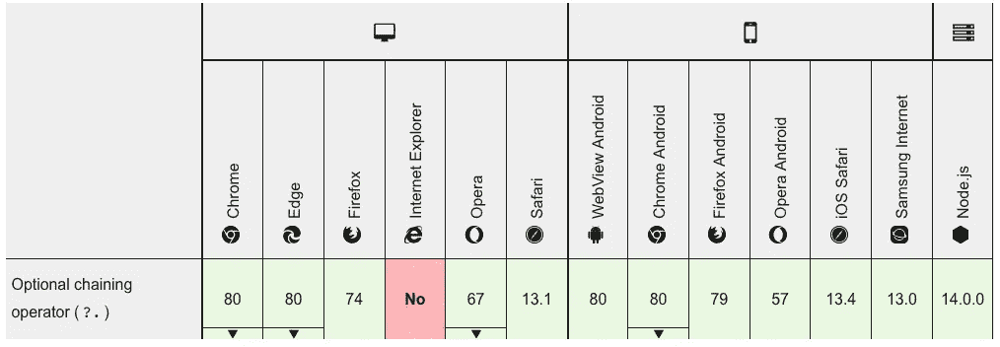

# JavaScript:可选链接将如何改变你的代码

> 原文：<https://javascript.plainenglish.io/how-optional-chaining-is-going-to-change-your-code-fd7d85dbc4f1?source=collection_archive---------19----------------------->

## 当您必须确保深层对象中的嵌套属性存在时，您曾经诅咒过您的代码吗？不要再诅咒了！

每当你在 JavaScript 中处理一个对象时，你经常想要从中获取数据。当你想从一个嵌套了几层的对象中得到一些东西时，你已经害怕出现错误“*无法读取未定义的*的属性‘name’”，对吗？听起来很熟悉？

当生产应用程序中出现错误时，您是否也诅咒过？

幸运的是，有可选的链接。让我解释一下

# 背景故事

好了，你得到了这个对象，它可能有也可能没有特定的数据属性，假设我们正在处理一个用户。数据可能看起来像这样

它可能有，也可能没有名字，可能有，也可能没有名字属性。所以当你想得到这个属性时，你不能相信这个链的存在，那么你该怎么做呢？对…像这样检查每一关

一旦发现用户对象中的 name 属性存在，就可以对其内容做些什么。然后你还是不知道到底有没有名。

但你更想做的是这个，对吗？

# 解决方案

嗯，你很幸运，这正是可选链接在这里的作用。它将为您检查是否可以到达所需的嵌套属性，而无需您搜索所有属性。

看到那个问号了吗？这就为你做了检查！所以上面的代码行检查对象内部的每个链，就像我们用`if &&`检查一样。

现在，在我们的示例中,`firstName`将实际返回“Foo ”,但是我们也可以执行以下操作:

这将按预期输出`undefined undefined`，并且不会抛出错误。

是的，这也适用于函数，就像这样。

这将再次返回`undefined`，并且不会调用不存在的函数。尽管有一点需要注意，如果`combinedBirthday`被设置了，但不是一个函数，它仍然会出错，所以确保不要混淆数据！

# 问题是

那么有什么问题呢？嗯…如果你使用现代堆栈，你真的不会有问题。可选链接已经在所有现代浏览器上得到支持，并被添加到 NodeJS 14 中。

Source: [MDN Optional Chaining Page](https://developer.mozilla.org/en-US/docs/Web/JavaScript/Reference/Operators/Optional_chaining)

然而，你应该知道这是一个相对较新的添加，例如 Chrome 80 在 2020 年 2 月才发布，所以如果你在网络环境中使用可选链接，请确保你使用 [babel](https://babeljs.io/docs/en/babel-plugin-syntax-optional-chaining) 正确设置了潜在的 polyfill。

这就是你所需要知道的，考虑你自己对这个话题的了解，开始使用这个甜蜜的可选链接吧！