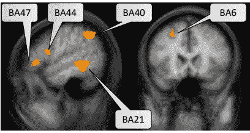

# 编程如何影响你的大脑:科学支持的三大真理

> 原文：<https://javascript.plainenglish.io/how-programming-affects-your-brain-fedea6b02f85?source=collection_archive---------0----------------------->

## 根据科学家的说法，编程不仅能激活大脑中心，还能改变你的思维方式，以下是具体的方法


Image by [Gerd Altmann](https://pixabay.com/users/geralt-9301/?utm_source=link-attribution&utm_medium=referral&utm_campaign=image&utm_content=4389372) from [Pixabay](https://pixabay.com/?utm_source=link-attribution&utm_medium=referral&utm_campaign=image&utm_content=4389372)

> 一个儿子问他的父亲(一个程序员)为什么太阳从东方升起，在西方落下。他的回应？有用，不要碰！”

好吧，已经有人说过，当谈到程序员时，他们确实与其他人有不同的思考方式——事实上有一整本书都是关于这方面的“[像程序员一样思考:创造性解决问题简介](https://www.amazon.in/gp/product/1593274246/ref=as_li_tl?ie=UTF8&camp=3638&creative=24630&creativeASIN=1593274246&linkCode=as2&tag=2026030-21&linkId=6028998907a73e1ef81b8a62c558f034)”*(附属链接)*

且不说就连苹果的创始人史蒂夫·乔布斯自己也说过，“编程教会你如何思考。”

对于程序员来说，他们的工作不仅仅是写一堆代码或开发一些东西，还远远不止这些——它包括逻辑思维、解决问题和跳出框框思考。

> "编程就像性:一个错误，你就要提供一辈子的支持."—迈克尔·辛兹

为了找出程序员的大脑是什么样的，或者他们的大脑与非程序员的大脑有什么不同，科学家们多年来一直在研究程序员的大脑。

最终，他们发现从事编程——这是一项智力活动——不仅影响大脑，还影响人的思维方式。

# 1.激活大脑的学习中心

根据世界观察型 PC 程序构建驱动专家之一 Janet Siegmund 博士在[完成的一项研究](https://kilthub.cmu.edu/articles/journal_contribution/Understanding_Understanding_Source_Code_with_Functional_Magnetic_Resonance_Imaging/6626357)，编码激活了五个明显的思维区域，它们与语言处理、工作记忆和解决问题有关，这符合当前对程序理解的理解。



Five brain regions activated during programming, according to [Dr. Janet’s study](http://www.cs.cmu.edu/~ckaestne/pdf/icse14_fmri.pdf).

编码启动了大脑中的不同区域，它强化了建立肌肉记忆的单调运动，并使大脑在学习过程中变得更加熟练。

约翰·霍普金大学的博士生 Yun-Fei Liua 领导了另一项研究，他对 15 名有经验的程序员进行了 fMRI 扫描。

> Yun-Fei 说:“因为人们学习编程的方式非常多，从自己动手的教程到正式的课程，令人惊讶的是，我们发现编码人员的大脑活动模式如此一致。”。

像编程这样的大脑刺激活动基本上是对大脑的一种很好的锻炼，并加强其记忆和执行任务的能力。

由于程序员的任务包括复杂和多方面的能力，编码提供了帮助，加强了大脑不同部分之间的联系。它增加创造力、分析问题和解决问题的逻辑思维，并增强大脑的学习能力。

# 2.它改变了你的思维方式

> “我们使用的工具对我们的思维习惯有着深远(和迂回)的影响，因此也影响着我们的思维能力。”—埃德格·迪克斯特拉

不可否认的事实是，编程语言的设计决定了你的思维方式。

这不仅仅是写一堆代码，而是换一种方式思考。用一种特定的方式思考，这样就可以把模糊的概念转化为具体的概念来解决问题。

你可能想[检查一下这些线](https://www.dictionary.com/e/typoglycemia/)，看看你是否能读懂它们:

```
“Aoccdrnig to a rscheearch at Cmabrigde Uinervtisy, it deosn’t mttaer in waht oredr the ltteers in a wrod are, the olny iprmoetnt tihng is taht the frist and lsat ltteer be at the rghit pclae. The rset can be a toatl mses and you can sitll raed it wouthit porbelm. Tihs is bcuseae the huamn mnid deos not raed ervey lteter by istlef, but the wrod as a wlohe.”
```

怎么样了？当然，即使它完全是一团糟，你也能读出来。*为什么？*因为我们的大脑不是阅读每个字母，而是阅读整个单词——但这在编程中不可能发生。

你不能把`string`写成`srting`，尽管你的大脑明白它的意思。

我的观点是，当你阅读**字符**而不是**单词和句子时，这些单词行的一种工作方式和另一种工作方式的方法迫使你发展一种不同的思维。**

同样的理论也适用于高级思维。

当程序员编程时，他/她需要以特定的和上下文正确的方式工作——从编写正确的语法到执行命令，一个错误就会导致程序失败。

编程不仅涉及应用一些数学和逻辑，还需要一种创造性的思维方式，这需要一个人跳出框框思考——这正是大脑思维过程的发展方式。

# 3.推动记忆和认知技能

随着年龄的增长，我们记忆事物的能力下降，但在一项研究中发现，“智力活动有助于缓冲个人对[认知]下降的影响。”

简而言之:从事编码等认知密集型技能有助于对抗记忆丧失。

人脑基本上由两个半球组成:*左*和*右。*右*脑半球*负责**直觉思维和想象**，而左*脑半球*负责所有**分析和逻辑思维。**

从事编程可以提高两个大脑半球的功能，反过来，这又可以开发整个大脑。

编程基本上是一种精神参与，它实际上会导致更敏锐的大脑，构建涉及学习和智力困难的认知能力，并推进一个人的记忆。

图灵奖获得者，Algol 语言的作者 Alan Perlis 认为:学习一门编程语言可以改变一个人的思维方式。他还说 ***“一种不影响你思考编程方式的语言是不值得了解的。”***

*更多内容请看*[***plain English . io***](http://plainenglish.io)

[](/5-best-side-hustles-to-a-make-six-figure-passive-income-as-a-programmer-3392f0d6bc53?sk=03d868adba932a9c30f98920fae5f9ea) [## 作为一名程序员，5 Best Side 的被动收入高达六位数

### 通过这些副业每月赚取 500 到 150，000 美元

javascript.plainenglish.io](/5-best-side-hustles-to-a-make-six-figure-passive-income-as-a-programmer-3392f0d6bc53?sk=03d868adba932a9c30f98920fae5f9ea) [](/two-entrepreneurs-built-a-240-billion-empire-after-getting-inspired-by-amazons-e-commerce-model-85a267080a8f) [## 两位企业家受到亚马逊电子商务模式的启发，建立了一个 2400 亿美元的帝国

### 创建“Amazon.com of something”的决定如何成为当今最具标志性的流媒体服务。

javascript.plainenglish.io](/two-entrepreneurs-built-a-240-billion-empire-after-getting-inspired-by-amazons-e-commerce-model-85a267080a8f) [](/2-college-drop-outs-went-from-being-teen-coders-to-running-a-7-4-billion-empire-by-the-age-of-25-6cbb3a677730) [## 2 名大学辍学生在 25 岁时从青少年程序员成长为经营 74 亿美元帝国的人

### 两个家伙如何在不到四年的时间里建立了一个十亿美元的帝国

javascript.plainenglish.io](/2-college-drop-outs-went-from-being-teen-coders-to-running-a-7-4-billion-empire-by-the-age-of-25-6cbb3a677730) [](https://betterprogramming.pub/5-programming-languages-you-wont-likely-be-using-by-2030-7bf2e2ea4e93) [## 到 2030 年，你不太可能使用的 5 种编程语言

### 这些语言将来可能会消亡或消失

better 编程. pub](https://betterprogramming.pub/5-programming-languages-you-wont-likely-be-using-by-2030-7bf2e2ea4e93)