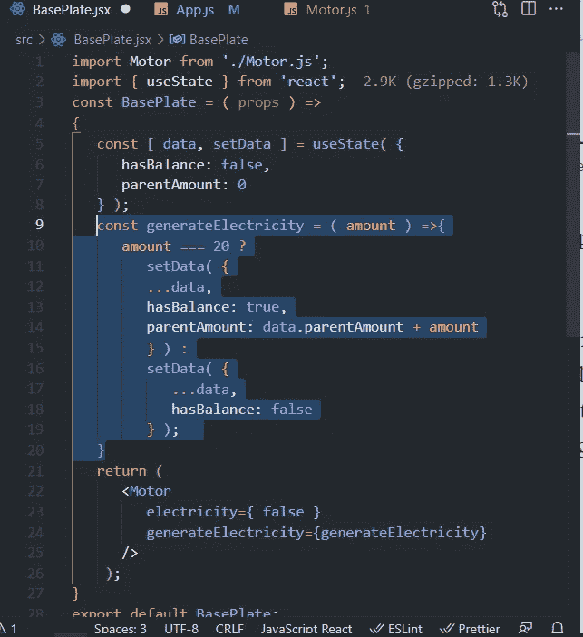

# React 组件如何使用 Props 在彼此之间传递数据

> 原文：<https://javascript.plainenglish.io/how-react-components-pass-data-between-each-other-using-props-26aea3ceabc4?source=collection_archive---------5----------------------->

Photo by [Ferenc Almasi](https://unsplash.com/@flowforfrank?utm_source=medium&utm_medium=referral) on [Unsplash](https://unsplash.com?utm_source=medium&utm_medium=referral)

这篇文章是为中级反应学习者准备的。React 中有很多值得讨论的地方，但我们的重点是在组件之间传递数据。在 React 中，传递数据是最重要的主题之一，因为 React 通过组件工作。基本上，组件就像 React 应用程序的子集。

因此，我们将涵盖:

1.  成分
2.  传递数据

## **1。组件**

你周围有成千上万的例子来知道一个组件到底是什么。如果你想开发一个高级或复杂的 web 应用程序，那么了解组件对你来说尤其重要。

基本上，组件有助于将复杂的部分分解成简单的部分。它的意思是 ***将小的解决方案分解或分割成组件形式，然后将它们全部合并成一个单一的输出*** 。让我们看看如何将组件合并成一个输出。

Example of components

这是理解组件最简单的例子之一。这些就是吊扇的 ***零件或部件*** 命名为 ***“底板、吊杆、壳盖、电机、叶片、拉线开关”。这些都是微小的部件，它们的工作和形状各不相同。但是它们之间有一点是共同的，即它们通过单个输出彼此连接，在这种情况下是空气。同样的概念也适用于 React、Angular 和 Vue.js。***

## 2.传递数据

在上图中，我们看到每个组件都有自己的形状和功能，并且它们相互之间也在传递电流。如果一个组件无法工作，那么其他组件可能会停止工作。但是所有这些都完全依赖于架构结构，即每个组件是依赖于另一个还是独立的。

在风扇的例子中，我们的一些组件是相关的，一些是独立的。**基板**是根(主)部件，负责将电力传递给其他部件，**电机**部件完全依赖于**基板**部件。如果基板通了电，只有电机才能运转——否则不行。

现在从技术上来说， ***React 组件可以有不同的逻辑和 UI。*** 在 ***道具组件之间传递数据只有一种方式。*** 如果你熟悉 ***React 上下文 API，*** 这是 React 中组件间传递数据的另一种方式，但这种方式也是通过 ***道具*** 传递数据。

在传递数据之前，我们必须知道如何在组件内部存储数据。 ***存储 React 组件数据的方式只有一种，即状态。*** 所以，我已经说了，这篇文章是给中级学习者看的。我希望你知道确切的状态是什么，但为了快速演示， ***状态是 React 虚拟 DOM 的一部分；没有状态，React 组件不能改变 UI。*** 如果你不熟悉状态，那么在阅读本文之前，先去熟悉一下 [***状态***](https://reactjs.org/docs/state-and-lifecycle.html)*。*

****所以，要在组件中存储数据，状态是必需的。但是对于在组件之间传递数据来说，就要用到道具了。****

**

*BasePlate Component*

*这是简单的反应功能组件。 ***你可以看到这个组件里有两个东西——一个是名为 Motor 的进口模块组件；第二个是名为电的道具，其值为真。****

**

*Motor Component*

*这是 Motor.js 组件。 ***这里可以看到我们只是在用三元运算符验证 props 值——不管它的值是真还是假。*** 如果`props.electricity`为`true`，则执行第一串；如果没有，那么将执行第二个。*

*我们知道，道具是不可变的(不可改变的)。我们不能直接修改它们，但是有一些方法可以改变它们。然而，我们不会在本文中涉及它。*

*记住，我们的文章主题是通过组件传递数据，所以我们的重点是传递数据。*

*正如我们所知，React 使用单向数据绑定方法，这使得 React 很快。整个数据将在根组件中可用，根组件将把数据传递给其他组件。 ***如果我们要将底板数据传递给电机组件，那么底板组件应该导入电机组件。而且导入后必须用道具通过它传递数据。****

*现在，`BasePlate`组件成为了`Motor`组件的父组件，因为`Motor`被导入(追加)到了`BasePlate`组件中。现在，底板组件已经通过了一个名为`electricity`的道具，其值为`true`。输出看起来像这样:*

**

*The Output*

*如果我将名为`electricity`的道具的值改为`false`:*

**

*BasePlate Component and prop named electricity = false*

*那么输出将如下所示:*

**

*Motor Component prop named electricity is now false*

*基于`props`，您可以看到改变一个组件内部的值如何改变另一个组件的行为。*

*需要注意的一点是——我们只是将一个道具表单`BasePlate`传递给了`Motor`组件。但是，如果我们必须将数据从子(马达)传递到父(基板)会怎样呢？然后，我们必须在 props 中传递方法/函数，这些方法将从它们的参数中获取值。见`BasePlate`修改版。*

**

***Modified BasePlate Component***

*在这个`BasePlate`的修改版本中，我们刚刚增加了两件事——一个是名为`generateElectricity`的方法或函数；第二件事是一个名为`data`的状态。最后，我们已经通过了`generateElectricity`方法作为马达的道具。*

*我们还对`Motor`组件进行了一项更改:*

**

*Modified Motor Component*

*我们刚刚给 JSX 添加了一个按钮标签，并附加了一个`onClick`事件，我们通过在点击事件期间传递电机数据来调用该方法。现在输出将是:*

**

*New output*

*现在，默认情况下`props.electricity`等于`false`。这就是为什么“没有发现电！”消息正在呈现。但是如果我们单击按钮，那么将调用`generateElectricity`方法，并且`amount`状态将作为参数传递给`generateElectricity`函数，并且在该函数内部:*

**

*generateElectricity function*

*`amount`参数将保存`Motor.js`状态的数据，在本例中命名为`money`。*

**

*onClick function*

*货币参数来自`Motor`组件状态。*

**

*Motor component’s state*

*所以，我们讨论了两件事:*

1.  *如何将数据从父传递到子*
2.  *如何将数据从子代传递到父代*

*两种方法都使用道具来传递数据。*

> *正如您已经注意到的，数据是从父代传递到子代和从子代传递到父代的。*

****这两种方法只有一个区别，那就是回调函数。我希望你知道回调函数。****

*`<button onClick={() => props.generateElectricity(money)}>Request for electricity</button>`*

*上面一行代码有一个按钮，里面有一个***【On Click】***事件，这个事件有一个回调函数，*

*`() => props.generateElectricity(money)`*

*上一行有两个函数——一个只是调用函数(实际上是一个*箭头函数)；*第二个函数是`generateElectricity(money)`，该函数来自名为`BasePlate`的父组件。*

## *最后的想法*

*父组件只使用道具来传递数据，而子组件使用回调函数。由于回调，我们可以将数据从子代发送到父代。谢谢你的阅读。*

*欢迎任何建议！*

**更内容于* [*通俗易懂*](http://plainenglish.io/)*