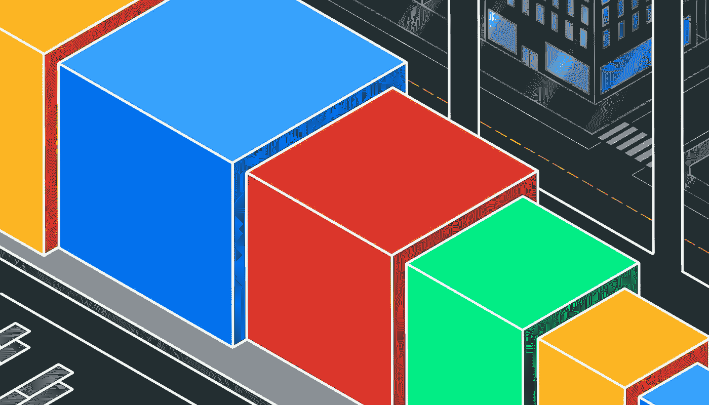
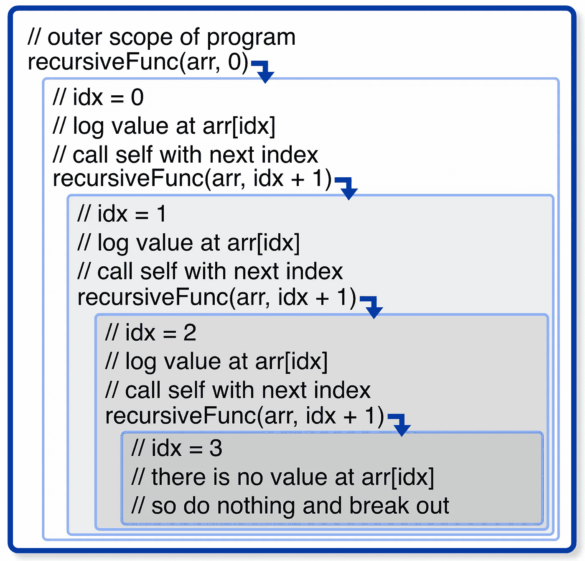
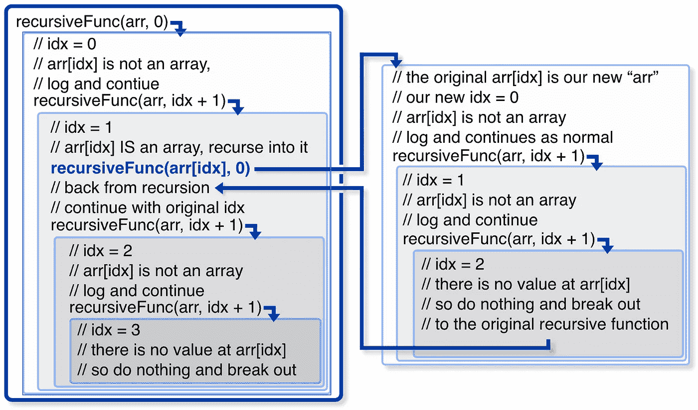

# 递归如何工作:简单的方法

> 原文：<https://javascript.plainenglish.io/how-recursion-works-the-easy-way-d45dcb4d98e2?source=collection_archive---------14----------------------->

## JavaScript 示例，不需要 fibonacci



如果你已经通过使用[斐波那契](https://medium.com/quick-code/fibonacci-sequence-javascript-interview-question-iterative-and-recursive-solutions-6a0346d24053)或[指数](https://medium.com/@julianjohannesen/banging-my-head-against-recursive-functions-a79f53fbab0f) JavaScript 函数努力学习**递归** ，那么这篇文章是给你的。起初，我遇到了递归的麻烦，因为基于“数学”的递归有两个方面:实际的递归和不断变化的返回值。幸运的是，如果我们从等式中去掉返回值，事情就简单多了。我们可以通过专注于迭代数组来实现这一点。

## 什么是递归？

对于一个递归的函数，它只需要做两件事:1) **调用自己**和 **2)知道什么时候*停止*调用自己**。就这样，就这样。严格来说，你甚至不需要第二个。当然，没有它，你的函数会爆炸，但是它会递归地爆炸*。*

# 让我们构建一个简单的函数

首先，让我们做一个基本函数。它所做的只是在数组中记录一个值:

```
const **recursiveFunc** = (**arr**, **idx**) => {
  **console.log**(`- ${**arr**[**idx**]}`);
};const **arr**= ['*a*', '*b*', '*c*'];// this would log each value **recursiveFunc(arr,** 0**);
recursiveFunc(arr**, 1**);
recursiveFunc(arr**, 2**);**
```

您可能注意到记录每个值的方法是用一个更大的索引来调用它。现在**我们**调用函数并增加索引，但是如果函数本身调用了呢？

# 使函数递归

让我们在函数中添加递增和调用*。*

```
const **recursiveFunc** = (**arr**, **idx** = 0) => {
  **console.log**(`- ${**arr**[**idx**]}`);
  **recursiveFunc**(**arr**, **idx** + 1);
};
```

就是这样:一个**递归函数**。看到函数调用本身看起来很奇怪，但是所有的编程语言都能够做到这一点。然而，如果我们照原样运行，它就会爆炸。那是因为我们从来没有告诉它在任何时候停止*。我们仍然需要要求 2，一个停止条件:*

```
*const* **recursiveFunc** = (**arr**, **idx** = 0) => {
  if (**arr**[**idx**]) {
    **console**.log(`- ${**arr**[**idx**]}`);
    **recursiveFunc**(**arr**, **idx** + 1);
  }
};
```

现在，一旦我们找到一个不在数组中的索引，它就什么也做不了，整个递归函数链也就结束了。

# 到底发生了什么

如果您运行这个函数，您会得到:

```
**recursiveFunc(**[*'a'*, *'b'*, *'c'*])**;**// Logs out:
- a 
- b 
- c
```

但在内部，这是正在发生的事情



How each new function works with the new arguments

如您所见，我们每次都会将索引值增加一，因此我们会遍历整个数组。当索引值改变时，数组不改变。一旦索引处没有值，该函数就没有什么可做的了，所以我们退出该函数，然后它就完成了链上所有的函数。花一分钟时间真正地内在化这里发生的事情的逻辑，因为这是递归如何工作的焦点。

# 我们必须走得更远

我们的函数符合我们对递归的定义，但是它不能递归地遍历*嵌套的*数组。这不好，因为这实际上是递归的一个实际应用。看，循环处理迭代更好，但是它们不容易处理未知深度的嵌套。这是因为如果递归函数发现了另一个嵌套数组，它可以在那个数组上再次调用自己的*。*

*为了说明嵌套，我们需要做的就是添加一个步骤，在这里我们检查值是否是一个数组。如果是，我们从索引 0 开始，如果不是，我们像往常一样继续:*

```
*const recursiveFunc = (arr, idx = 0) => {
  if (arr[idx]) { **if (Array.isArray(arr[idx])) {
      recursiveFunc(arr[idx]);
    } else {**
  **    console.log(`- ${arr[idx]}`);
    }** recursiveFunc(arr, idx + 1);
  }
};recursiveFunc([*'a'*, [*'x', 'y'*], *'d'*]);// logs 
- a 
- x
- y
- d*
```

*这是我们之前图表的新版本*

**

*Our new recursive function showing the separate array step in another box*

*这是在新数组上开始另一个递归调用链。看看我们如何传入新数组并默认返回到`0`来开始新序列。一旦这个序列完成，我们回到我们的主链。另外，注意最后的`recursiveFunc`调用是在之后的*调用，并且在数组检查之外。这是因为当我们进入一个数组后，当我们返回时，我们总是想继续下去。为了简单起见，我们只嵌套一次，但是这可以用于更多的层次。**

# *通过想象来仔细检查*

*为了确保您理解主要概念，为什么不尝试添加另一个参数呢？让我们为更好的打印添加一个`level`参数:*

```
**const* **recursiveFancy** = (**arr**, **idx = 0**, **level = 1**) => {
  if (arr[idx]) {
    if (**Array.**isArray(**arr**[**idx**])) {
      **recursiveFancy**(**arr**[**idx**], 0, **level** + 1);
    } else {
      **console**.log(`${'- '.repeat(**level**)}${**arr**[**idx**]}`);
    }
    **recursiveFancy**(**arr**, **idx** + 1, **level**);
  }
};**recursiveFancy**(['*a*', '*b*', ['*q*', ['*x*',]], '*c*']);
*# returns* 
- a
- b
- - q
- - - x
- c*
```

*注意我们这里的`+1` `idx` 和`level`，并不完全相同。我们只在处理嵌套数组时增加`level`,只在数组中向前移动时增加`idx`。既然基础知识已经完成，学习递归返回值应该会容易得多。看看他们如何处理[斐波纳契面试问题](https://medium.com/quick-code/fibonacci-sequence-javascript-interview-question-iterative-and-recursive-solutions-6a0346d24053)。*

# *递归的缺点*

*如果递归如此简单，为什么我们不到处使用它呢？为什么循环对于纯迭代更好？原因与 [JavaScript 调用栈](https://www.javascripttutorial.net/javascript-call-stack/)有关。我建议检查一下，这是编程的基础部分。但是最重要的是:当你调用一个函数时，它被放在调用栈中。一旦完成，它就被移除。但是，递归的问题是，第一次调用直到所有的*子函数*完成后才能完成。这意味着调用栈越来越高。如果太高，它会全部坏掉。*

*这就是递归的问题，有一个最大深度。你希望一个函数有一个`for`循环，可以重复一百万次？太棒了。但是递归函数可以更快地发现问题。这并不意味着循环更好。这意味着我们必须使用递归来解决更具体的问题，比如未知的深度或递归数据结构([二分搜索法树](https://www.youtube.com/watch?v=t2CEgPsws3U))。这只是为问题找到合适的工具。*

*大家编码快乐，*

*迈克*