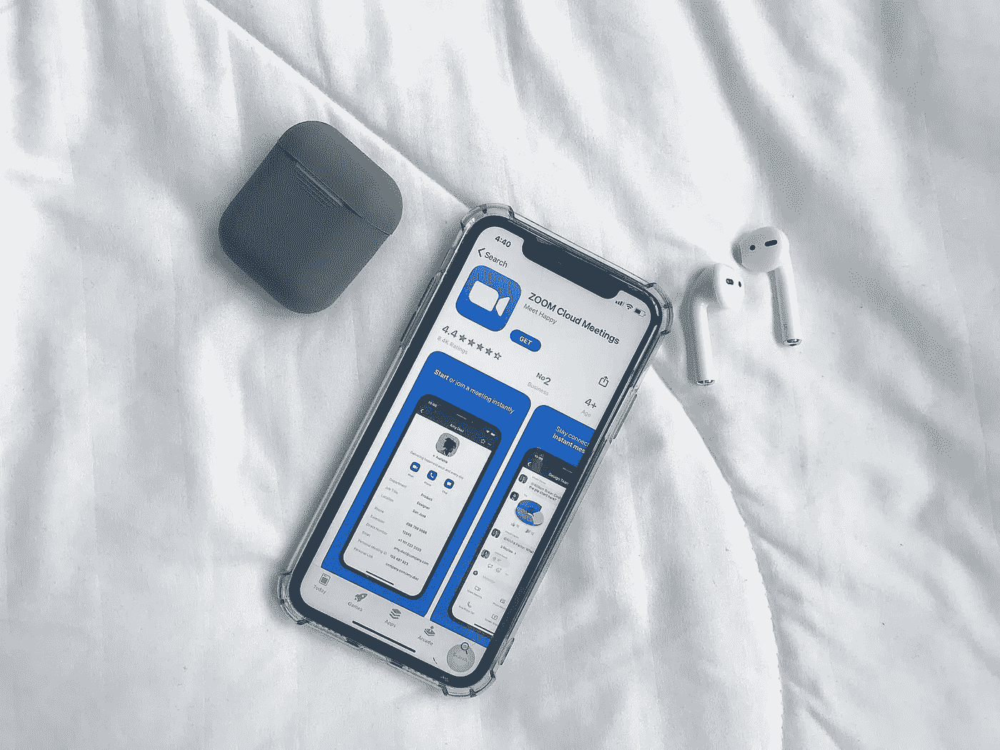

# 作为一名开发人员，你应该如何准备第一次面试？

> 原文：<https://javascript.plainenglish.io/how-should-you-prepare-for-your-first-interview-as-a-developer-5aba79107256?source=collection_archive---------22----------------------->

在你在面试中说一句话之前，招聘人员会立即注意到你是否做了功课和练习。

在过去的几年里，我已经指导了 300 多名学生和职场人士如何准备面试以获得他们梦想中的工作。

# 以下是我对如何准备第一次面试的一些建议。

在面试之前，你必须做充分的准备。

> 在你面试中说一句话之前，招聘人员会立刻注意到你是否做了功课和练习。

提前做好所有的工作，这样当你参加面试时，你就已经赢了。

**面试前你需要做什么？**

# 1 —做你的研究。

15-30 分钟浏览网站不是研究。

> *“招聘经理最大的抱怨之一是，许多面试候选人对他们面试的公司知之甚少”*

# 2-记住没人关心你。

招聘人员有工作要做。

他们需要雇佣对公司有积极帮助的优秀人才。

他们会在你的下面寻找。

*   你会成为一名优秀的团队成员吗？
*   你会在你的职位上超越吗？
*   你会是公司的合适人选吗？

这种心态并不邪恶，这就是生活。

但是现在你知道规则了，让我们学习如何玩这个游戏。

# 3-把面试变成一场对话。

我职业生涯中“学到的最重要的一课”。

> 人们与他们所爱的、信任的和尊重的人做生意。

如果他们觉得你不值得信任或者你不容易共事，

他们不会雇用你。

故事结束。

# 现在是节目时间(采访对话)

真正的赢家在开始之前就计划好了。

> 要开始面试，写下你生活中想突出自己的 5 个重点。

可能是你过去的工作经历，志愿者工作。

# 5-了解面试官

仔细阅读你的电子邮件，人力资源与你分享，你会被告知谁将在面试小组的人的名字。

谷歌他们，找到他们的 Twitter/LinkedIn 账户，搜索他们是否发表过任何页面或文章。

# 6-记得呼吸

刚开始面试的时候，我会超级紧张。

我非常害怕失败，这反映在我的面试中。

我会说得很快，并经常急于回答问题。

**这里有一个秘密，我希望有人在我刚出道时告诉我**

> 你不必总是马上回答。

慢下来，深呼吸&真的花点时间考虑一下你对这个问题的回答。即使你不知道答案，记住说不也没关系。

# 7-我不知道

准备好说出来。

> *如果你不知道答案，就不要装模作样。*

人们通常会直接阅读它。

# 8-了解自己的简历？

再一次，如此明显。

> 然而，人们在参加面试时很久都没有看过自己的简历。

我曾经遇到过这样的情况，当我问他们简历上的问题时，他们不得不思考一下。

> *在你参加面试之前，请给自己一些时间看看。*

准备故事帮你回答面试问题的时候也要仔细复习。

**感谢阅读。**

**“不要错过。”**

**在 Twitter 上关注你的导师:**[**TheAnkurTyagi**](https://twitter.com/TheAnkurTyagi)

如果您想与我一对一地详细讨论您的职业发展问题，您可以雇佣我作者 [**图书 1-1 电话或聊天订阅**](https://www.hiretheauthor.com/theankurtyagi)

如果你觉得慷慨，你可以给我买瓶啤酒。编码快乐！

给我买杯啤酒。

*更多内容请看*[***plain English . io***](http://plainenglish.io/)