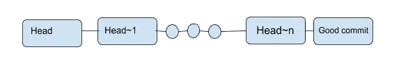

# 聪明人如何发现导致应用崩溃的错误

> 原文：<https://javascript.plainenglish.io/how-smart-people-find-the-bad-commit-that-crashed-your-app-eb99c6178046?source=collection_archive---------11----------------------->

Photo by [Yancy Min](https://unsplash.com/@yancymin?utm_source=medium&utm_medium=referral) on [Unsplash](https://unsplash.com?utm_source=medium&utm_medium=referral)

你可能正在经营一家价值十亿美元的初创公司，客户/用户使用你的产品来推动他们的业务和目标，或者你可能正在推动你的第一个 MVP 来跟踪客户/用户，给他们宝贵的经验。

不知从哪里，你发现了一个让你的程序崩溃的错误。你大脑做的下一件事是回顾你使应用程序崩溃的步骤，你将记下这个问题的数据点。

Photo by [Volodymyr Hryshchenko](https://unsplash.com/@lunarts?utm_source=medium&utm_medium=referral) on [Unsplash](https://unsplash.com?utm_source=medium&utm_medium=referral)

*   应用程序崩溃在哪个页面？
*   什么样的**组件**对此次坠机事件负责？
*   导致应用崩溃的**场景**或**数据**是什么？

一旦你找到了这些问题的答案，接下来你要做的就是实现修复。但不幸的是，时间是你买不起的奢侈品。主要是因为下面列出的两个原因:

*   不同的用户和你的产品声誉将要探索的有一个错误的活产品，并且是在线的。
*   对于一个早期创业公司来说，获得一个线索(推荐、营销)需要花费更多的实际资金。如果用户流失了，那么他/她不会很快回来。

# 最佳/快速的解决方案是恢复到您的应用程序的良好版本并部署它。

对于开发人员少于 5 人的小型创业公司来说，发现导致崩溃的变更并恢复它是很容易的(即使现在这也不容易，因为人们经常犯错误，而且错误可能已经存在，而你可能只是最近才发现，所以它可能远远低于提交线)。

Photo by [Stillness InMotion](https://unsplash.com/@stillnes_in_motion?utm_source=medium&utm_medium=referral) on [Unsplash](https://unsplash.com?utm_source=medium&utm_medium=referral)

你的剑的击剑不同于在战场上使用它。想象一下，当有人盯着你的屏幕时，你是如何编码的。我知道这是一场噩梦，你经常会犯更多的错误。

你有**同行压力**和**责任**尽快恢复和部署。

# GIT 平分

Git 是一个强大的工具。您不必学习每个 git 命令，您可以在需要时学习。

## [Git 等分](https://git-scm.com/docs/git-bisect)是一个使用二分搜索法找到导致 bug 的错误提交的工具。

[Git 二等分](https://git-scm.com/docs/git-bisect)占用了您提交历史的一部分，所以您在主服务器上有最新的 **HEAD 提交**，然后是最后一个好的提交(您知道它没有任何 bug)。

如果你知道二分搜索法，它需要一个排序的**项目列表**和一个**目标**值。

binary search

1.  它选择**中间的**元素，*将其与目标进行比较*
2.  如果*的目标是<元素*，它将从**第一个元素**到**中间元素-1** 拆分列表
3.  如果*的目标是>元素，*那么它将从**中间元素+ 1** 直到**最后一个元素。**
4.  一旦你有了清单**重复**以上步骤**直到你找到目标。**

这就是二分搜索法的工作方式，同样的原理也适用于你的 git 等分。

# 查找错误提交的步骤

1.  在您的本地开发环境中运行您的应用。
2.  尝试运行导致应用程序崩溃的步骤。
3.  确保您在 **HEAD commit** (这意味着您在使用最新的代码)。
4.  打开终端运行`git bisect start`。
5.  下一个命令是`git bisect bad`，我们将特定的提交标记为坏的，因为它有一个 bug。
6.  接下来`git bisect good GOOD_COMMIT_SHA`这里的 GOOD_COMMIT_SHA 是 COMMIT hash/shah(2f 3865852 FD 7 b 7 eebc 70481 a 157 D5 fbf 0 f 21 c 550)
    你必须选择一个你知道运行良好的提交。(如果您不知道，请选择一个月前的提交，或者随机选择 50 次提交之后的提交)。
7.  现在 *git 二等分*自动运行并选择中间提交，您将看到类似`B*isecting: 34 revision left to test after this (roughly 5 steps)*` *的消息。*您还会看到它选择的提交散列/sha。
8.  尝试重复**步骤 2** 。
9.  如果你仍然发现错误运行`git bisect bad`。
10.  如果不是，则运行`git bisect good`。
11.  你将重复第 8、9、10 步。在某一点上，git 二等分将找到导致这个问题的提交，现在您可以识别核心问题了。

一旦找到导致问题的提交，就可以恢复到该提交下的版本。

# 最后一个音符

**一个重要的注意事项:**一旦发现 bug 或者想退出，就运行`git bisect reset` 退出 git 平分状态。

> **注:**以上过程仅适用于容易重现的 bug。如果你的 bug 是随机发生的，那么就不容易找到正确的提交。

# 关注我激励我写一篇有趣的文章

*   [https://medium.com/@amerrnath](https://medium.com/@amerrnath)
*   [https://twitter.com/amerrnath21](https://twitter.com/amerrnath21)

*更多内容请看*[***plain English . io***](http://plainenglish.io/)