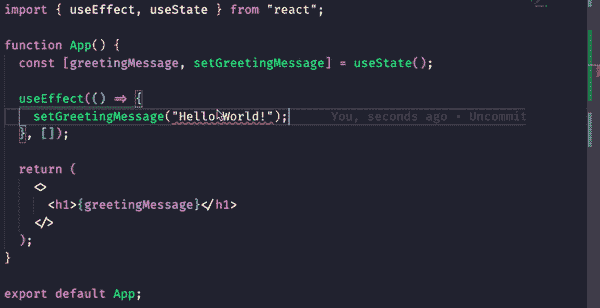

# React useState 挂钩在 TypeScript 中如何工作

> 原文：<https://javascript.plainenglish.io/how-the-react-usestate-hook-works-in-typescript-418a68ca22a0?source=collection_archive---------11----------------------->

## 了解如何通过使用 TypeScript 进行自动完成和错误捕获来充分利用 useState


我觉得 TypeScript 真正释放了 React 钩子的潜力。使用带有 React 钩子的 TypeScript 感觉很好。它开启了高度精确的自动补全功能，以及在错误发生前捕捉错误的能力。我们将通过一些例子来了解 React 钩子和 TypeScript 是如何完美匹配的。

# 我们开始吧

在我们进入这些例子之前，我想更详细地了解一下 useState 钩子如何与 TypeScript 一起工作(可以说是它的来龙去脉)。

TypeScript 总是试图推断变量的类型，这对我们来说真是个好消息。基本上这意味着我们可以像在 JavaScript 中一样使用 useState 钩子。当有可能出现多种类型时，事情就会发生变化。例如，如果有一个变量可能是未定义的或者是 T2 字符串。在这种情况下，TypeScript 将需要一点帮助。这就是 TypeScript 泛型发挥作用的地方，也是在 TypeScript 中使用 useState 钩子的关键。

# 是时候举些例子了

如果您愿意，可以通过运行以下命令来遵循这些示例。我只是要替换掉 **App.tsx** 文件中的内容。现在让我们来看例子。

```
npx create-react-app demo-app --template typescript
```

## 示例 1:带有类型推断的 useState 挂钩

就像我上面说的，这种情况经常发生，在这种情况下，代码看起来和 JavaScript 代码一样。

你会注意到，在上面的例子中，这看起来像完全正常的 JavaScript React 代码，这是因为它是。TypeScript 将推断出放置在 useState 函数中的任何内容的类型。在这种情况下，它是一个*字符串*，但是如果我将一个*布尔值*放入 useState 中，那么推断出的类型将是一个*布尔值*。

## 示例 2:不带类型推断的 useState 挂钩

有些情况下，TypeScript 不能推断出正确的类型，这就是我将在下面演示的内容。

就像我上面说的，TypeScript 会推断出 useState 函数中的类型。在这种情况下，我没有传递任何东西，所以它将推断未定义。这显然是一个问题，因为在 useEffect 钩子中，我们将 greetingMessage 的状态设置为一个字符串。输入 TypeScript 泛型。你会在第 4 行的**上看到，在 useState 函数初始化之前，我使用了一个 **< >** 语法。这明确地告诉 TypeScript，greetingMessage 的类型可以是*未定义的*或*字符串*，允许我们将 greeting message 的类型设置为*字符串*，而不会扰乱 TypeScript 编译器。**

下面是一个例子，如果我试图在不使用 TypeScript 泛型的情况下将问候消息的类型设置为一个*字符串*会发生什么。



## 示例 3:带有接口/类型的 useState 挂钩

让我们看看如何在 TypeScript 中将复杂类型(例如 todo 列表的类型)与 useState 挂钩一起使用。我们将看到，设置与上面的示例相同。

我们告诉 TypeScript，are todoList 的类型是一个类型为 *Todo* 的数组，然后简单地将一个空数组传递给 useState。它将推断该类型是一个类型为 *Todo* 的空数组。

# 结论

这就是事情的全部。在 TypeScript 中使用 useState 就像确保我们可以推断类型一样简单，当我们不能推断类型时，我们就在泛型中指定类型。

*更多内容请看*[***plain English . io***](https://plainenglish.io/)