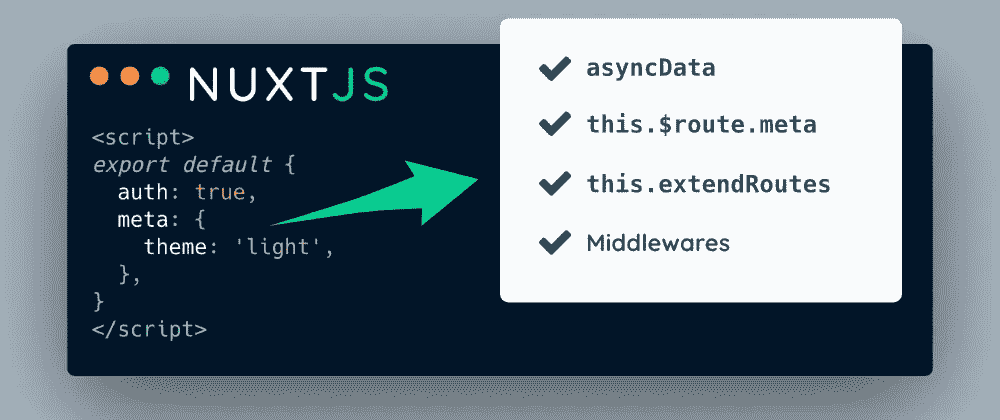

# 如何访问路由元字段中的 Nuxt.js 页面数据

> 原文：<https://javascript.plainenglish.io/how-to-access-nuxt-js-page-data-in-route-objects-8fa564d0b984?source=collection_archive---------10----------------------->

嘿，伙计们，这篇文章是关于在路由对象中访问页面数据的。这是我经常遇到的一个用例，例如在生成站点地图时。

Nuxt 页面允许您定义结构化数据，如来自@nuxtjs/auth 的 [meta](https://github.com/nuxt/nuxt.js/issues/1687) 属性或 [auth 属性(注意，它们不应该与](https://auth.nuxtjs.org/guide/middleware) [meta 标签](https://nuxtjs.org/docs/2.x/features/meta-tags-seo)混淆)。如果能在其他地方看到它们，那就太好了。可以在很多地方访问 route 对象:

*   `asyncData`中的`context.route`
*   `this.$route.meta`在组件中
*   `this.extendRoutes`在模块中
*   `context.route`在瓷器中

我做了一些测试，发现访问页面外的页面数据的唯一可能性是在`asyncData`和中间件中，正如在本期的[中所讨论的。其他地方都不工作，有空的`meta`对象。此外，链接问题中讨论的案例在 route 对象本身中添加了一个`meta`属性，而不是在`matched`数组中，因为它在 vue-router 中(参见 vue-router](https://github.com/nuxt/nuxt.js/issues/1687) 中的[示例)。](https://router.vuejs.org/guide/advanced/meta.html)

好吧，这就是目前的状态。现在，我们如何修复它并添加页面数据来路由对象呢？

# nuxt-路由元

我编写了 [nuxt-route-meta](https://github.com/dword-design/nuxt-route-meta) 模块，它在构建时解析页面组件，并通过`this.extendRoutes`将数据添加到路由中。这是一个零配置模块，所以你可以把它添加到你的`nuxt.config.js`中，它开箱即用。

首先，通过`npm install nuxt-route-meta`安装。

然后添加到您的`nuxt.config.js`:

现在让我们用一些数据创建一个页面，如下所示:

我们已经完成了配置！让我们回顾一下上面讨论的案例:

**异步数据**:

**这个。$route.meta** :

**this.extendRoutes** :

**中间件**:

正如我们所看到的，我们现在可以在任何地方访问页面数据！这就是如何使用该模块。

# 生成带有非授权路由的站点地图

访问页面数据的一个常见用例是站点地图生成，尤其是有条件地向站点地图添加条目。我们现在将配置`@nuxtjs/sitemap`仅添加非授权路由。因此，让我们通过`npm install @nuxtjs/sitemap`添加站点地图模块，并将其添加到我们的配置中:

现在过滤路由很容易，因为我们只需检查 meta 属性:

就是这样，如果你检查`/sitemap.xml`，你应该只看到非授权路线！

# 结论

这是对 [nuxt-route-meta](https://github.com/dword-design/nuxt-route-meta) 的介绍。希望对你有点用！如果你喜欢，可以在 GitHub 留下一颗星🌟。此外，该模块可能还需要一些工作，所以如果你需要什么或者有一个 bug，[提交一个问题](https://github.com/dword-design/nuxt-route-meta/issues)。感谢阅读！

**如果你喜欢我正在做的事情，请关注我的**[**Twitter**](https://twitter.com/seblandwehr)**或查看我的** [**网站**](https://sebastianlandwehr.com) **。也可以考虑在** [**给我买杯咖啡**](https://www.buymeacoffee.com/dword)**[**PayPal**](https://www.paypal.com/paypalme/SebastianLandwehr)**或者**[**Patreon**](https://www.patreon.com/dworddesign)**进行捐赠。非常感谢！❤️****

***原载于【sebastianlandwehr.com】***

****更多内容请看*[*plain English . io*](http://plainenglish.io/)***