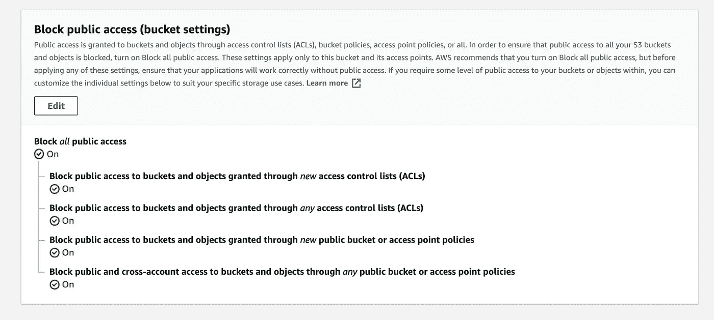
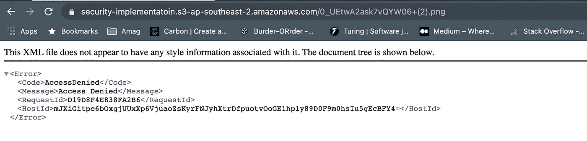

# 如何安全地访问私有 S3 存储桶

> 原文：<https://javascript.plainenglish.io/how-to-access-private-s3-buckets-securely-87778efd93bd?source=collection_archive---------0----------------------->

## 使用预签名的 URL

Photo by [Franck](https://unsplash.com/@franckinjapan?utm_source=unsplash&utm_medium=referral&utm_content=creditCopyText) on [Unsplash](/s/photos/security?utm_source=unsplash&utm_medium=referral&utm_content=creditCopyText)

将文件上传到远程服务器是任何现代应用程序最常见的任务之一。AWS 有一个名为 S3(简单存储服务)的服务，使这项工作变得非常容易。

但是**你知道**我们如何安全地访问这些桶吗？

今天，我们将看看如何安全地执行最常见的两种操作

1.  **上传**文件到 S3
2.  从 S3 下载文件

先从上传文件说起。

# 重要的事情先来

我假设你已经知道如何创建一个 S3 桶。如果没有，有大量的文章。

您可以从您已经拥有的任何铲斗开始，并执行以下操作

转到**桶**->-**权限**->-**阻止*所有*公共访问**

Block All Public Access

现在我们的水桶是**安全的**。现在，当任何人试图访问桶时，他们将看到这个而不是实际的文件。

Access denied

好了，现在我们的桶安全了。但我们需要访问它，对吗？

让我们从如何将文件上传到我们的 bucket 开始。

# 备选方案 1。通过自定义后端上传

您可以将文件发送到某种服务器，然后进行验证，使用适当的身份验证令牌将文件发送到 s3，并将 URL 返回给用户。

流程看起来像这样，

`Frontend Application`->-`Custom Backend`->-`S3 Bucket`

## 这种方法的问题

*   它增加了服务器的负载。
*   用户首先必须等待文件上传到服务器，然后再上传到 s3，这需要时间。
*   对于大型文件，存在多个故障点，这是不可取的。

# 选项 2。直接从前端上传

您可以直接将文件上传到远程服务器。这样我们等待的时间就少了。

`Frontend Application`->-`S3 Bucket`

下面的文章展示了如何做到这一点。

 [## 如何在 React 中将文件上传到 AWS S3

### 以两种不同的方式

javascript.plainenglish.io](/how-to-upload-files-to-aws-s3-in-react-591e533d615e) 

## 这种方法的问题

*   你必须直接在你的前端代码中存储安全令牌，这不是一个好主意。
*   如果你的安全令牌暴露了，你会损失一大笔钱。

# 改进的解决方案:预签名 URL 方法

现在我们来看看如何解决前两种方法的所有问题。在这种方法中，我们可以使用我们的`aws-sdk`来生成一个预签名的 URL，这样我们就可以直接访问 S3 桶，而不用暴露安全令牌。

首先，我们将一些关于对象的信息(不是实际的文件)从前端发送到某种后端 API(可以是 lambda 函数)。

这个函数获取信息并为我们创建一个 post API。

然后我们可以使用`axios`或`fetch`将对象直接从前端发送到 S3 桶。

## 这种方法的好处

*   我们不需要在前端代码中存储任何种类的**秘密**。
*   我们不需要等待将实际文件发送到后端，从而将响应时间减少了 50%!

# 第一步。准备后端

下面是可以用来生成签名 URL 的函数

function to generate signed URL

你可以把这个函数保存在 lambda 或者你自己的后端。

# 第二步。在前端使用

在您的前端，您只需调用这个 API 或 Lambda 并获取 URL，然后向您提供的端点发出一个简单的`PUT`请求。

有效载荷必须是你的实际文件，而不是某种多部分数据。

下面是一个简单的 React 组件来实现这一点

Frontend Code

该组件可用于安全地将文件上传到 s3 存储桶。

# 安全地获取对象

我们已经看到了如何通过预先签名的 URL 安全地上传文件。下载呢？

好吧，这里我们可以再次使用这种预先签名的 URL 方法！现在不是`putObject`类型的网址，我们需要的是`getObject`类型的预签名网址。我们可以使用下面的函数来实现。

get pre-signed get object url

现在，每当我们的用户需要查看一些图像时，我们将向他们显示带有**预签名 URL** 而不是**实际 URL** 的图像。

就是这样！我希望这篇文章能对如何**安全地**访问 **S3 桶**来上传和下载数据有所启发。

祝您愉快！

**有话要说？**

**通过**[**LinkedIn**](https://www.linkedin.com/in/56faisal/)**或我的** [**个人网站**](https://www.mohammadfaisal.dev/) **与我取得联系。**

 [## 任何大型 React 应用程序的 20 个基本部分

### 如果您正在编写企业级代码，您需要了解这一点

javascript.plainenglish.io](/20-essential-parts-of-any-large-scale-react-app-ee4bd35436a0)