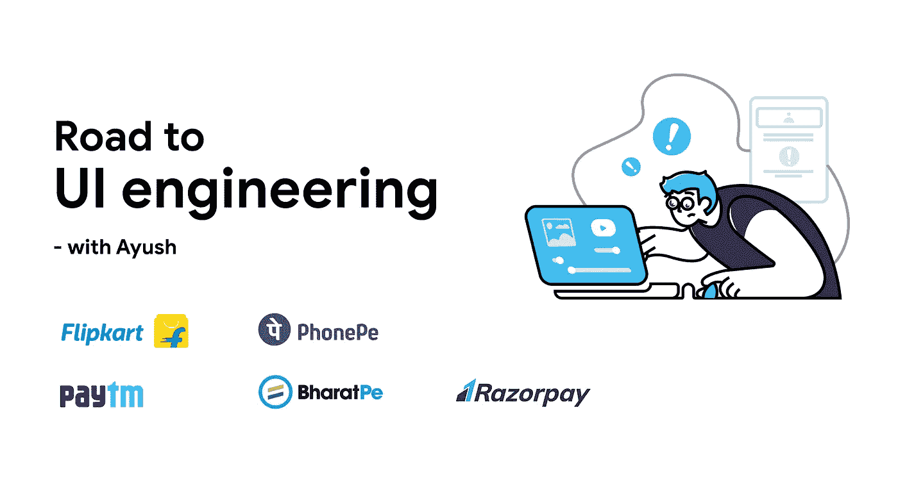
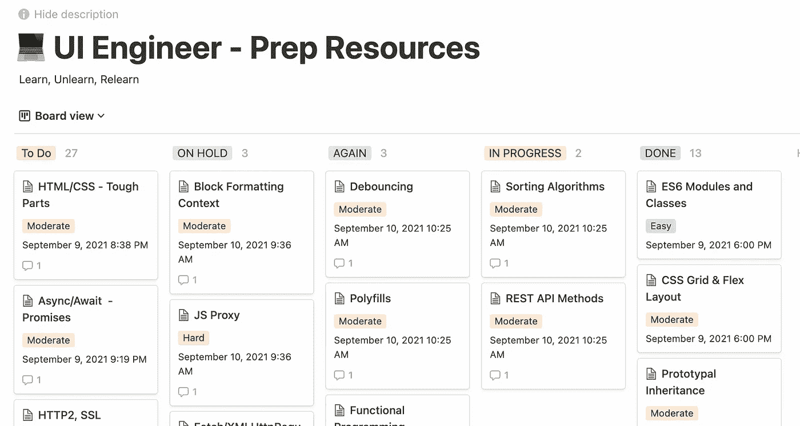
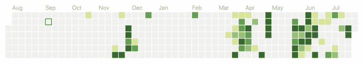
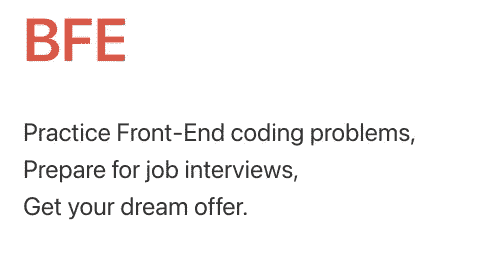
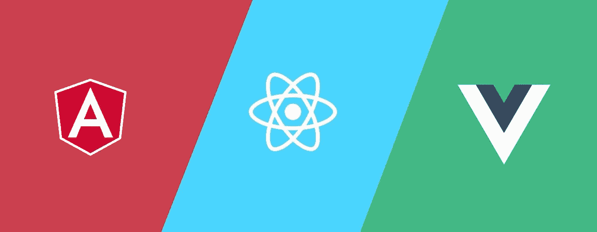
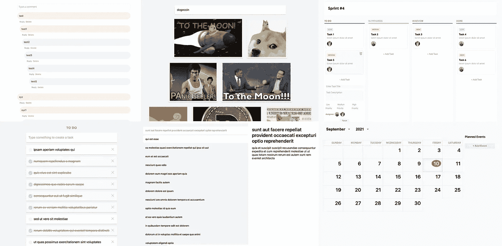
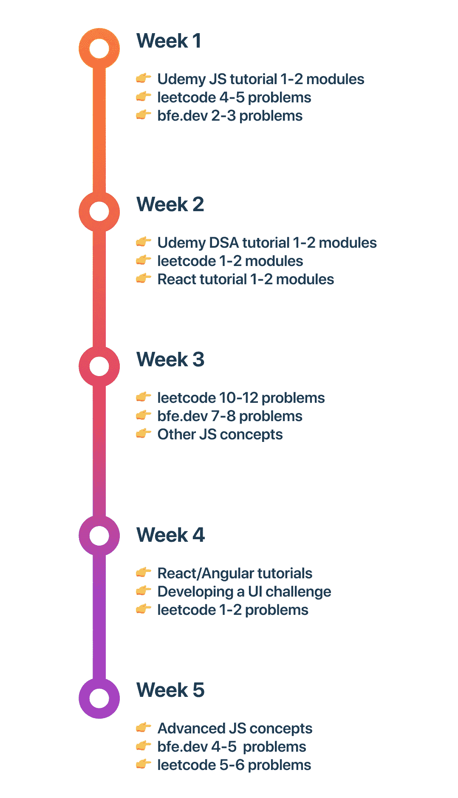
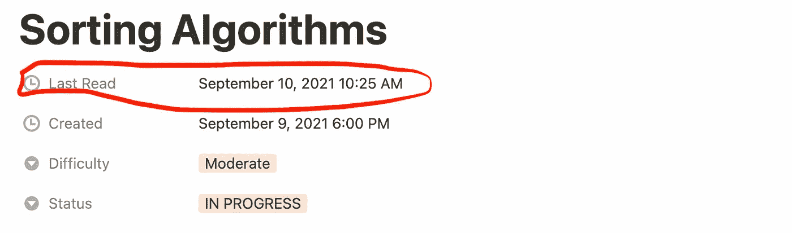
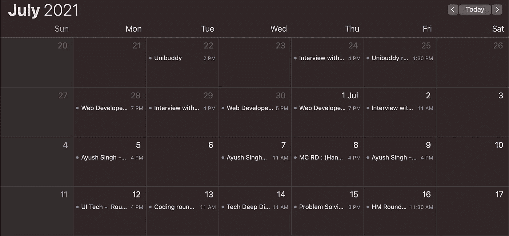
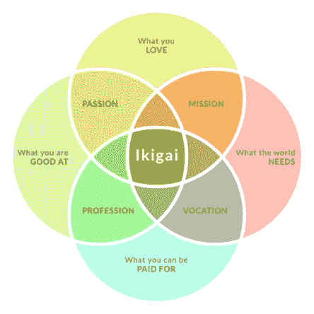

# 如何赢得用户界面工程师面试

> 原文：<https://javascript.plainenglish.io/how-to-ace-a-ui-engineer-interview-1cfbdcf2ec83?source=collection_archive---------0----------------------->

## 我最近在 Flipkart、Paytm、RazorPay、PhonePe、BharatPe 和其他公司接受了采访。我收到了多次邀请(也有几次被拒绝)。分享一份综合指南，记录所有内容。

Road to UI Engineering

> 作为一名用户界面/前端工程师，你必须跟上很多事情。该指南将使您能够链接您的方程式中缺失的部分，并希望为您找到您梦想中的工作！

# 先决条件—准备计划

1.5 年前，我开始了我的准备之旅，没有记录任何事情。我到处都是。正如你可能想象的那样，事情没有解决。是时候准备一个策略了！

> 如果您**未能通过****计划**，您**计划**至**未能通过**！

## 我记录了我对概念的学习

它改变了游戏规则。你所学到的一切，你需要重新审视的话题，相对困难的话题，都在一个拖放看板的屋檐下。

[My Kanban on Notion](https://alphaayush.notion.site/alphaayush/2e13395deff94a428d45b3aa88dc7ee7?v=06b5c5617b8442bc878bd210257786ad)

我正在分享我的看板链接，请随意创建一个副本，并根据您的需要进行定制。

 [## 用户界面工程师-准备资源

### 学习，遗忘，再学习

alpha ayu sh . conception . site](https://alphaayush.notion.site/2e13395deff94a428d45b3aa88dc7ee7?v=06b5c5617b8442bc878bd210257786ad) 

## 好吧，但是怎么用呢？

*   **记录一切！**

阅读一篇翔实的文章？嵌入它！灵机一动？注意下来！

*   **列出你已经知道的一切。**

对于你已经理解的所有主题，为它们制作卡片。

*   **随意将事情划分为子任务**

如果您觉得该主题有太多的内容需要一次性覆盖，这是您将它分成子任务的提示。

*   **根据你对主题的理解程度，指定一个难度等级**

这将派上用场时，它的展示时间和修订。

*   **不要犹豫，继续扩大范围。**

对于某些事情，你没有意识到你不知道。

*   **阅读面试经历，准备面试名单。**

不知从何说起？在线阅读面试经历(来自 Leetcode 讨论、团队盲注、在线博客、极客论坛)，准备一份你需要学习的主题清单。

> 不要为了面试而把事情搞得一团糟。享受学习过程，并与您的计划保持一致。

# 执行您的计划🚀

好了，既然你已经准备好了一个坚实的计划，是时候执行了！

## 我的 UI 工程 5 大支柱方法

1.  JavaScript(深度)
2.  数据结构和算法
3.  问题解决
4.  前端框架和库
5.  用户界面技术与挑战

我将在这里简单地谈谈这些话题。详细计划的所有链接和资源都可以在我的概念上找到。

## 1.JavaScript(深度)

[Pic Courtesy: Victor](https://dev.to/mr_victor/the-history-of-javascript-1fp3)

不用说，了解 JavaScript 有多重要。以下是一些您需要熟悉的主题:

*   继承+原型链
*   封闭和吊装
*   范围和执行上下文
*   `this`关键词
*   功能程序设计
*   最新功能:ES6、ES7、ES8、ES9、ES10、ES2020
*   模块模式— ES6/AMD/UMD/FESM
*   面向对象编程
*   事件循环和 JS 如何在幕后工作
*   事件委派/事件冒泡
*   数组、字符串、对象、函数和承诺方法
*   更多的我忘记了

参考我的想法板上的 JavaScript 模块。

## 2.数据结构和算法

在大学时代，我总是害怕 DSA。质疑为什么一个前端工程师需要知道这一切。我在 2019 年开始学习 DSA，没有打算在任何截止日期前完成。不得不多次重温相同的概念。

终于，一年前，我决定改变这一切。从 DSA Udemy 课程开始学习。从 Hackerrank 和 Leetcode 上的简单问题开始。最终获得了信心，并开始了学习解决问题模式的盲 75 & LC 面试系列。我很快意识到这对我作为前端工程师的日常工作有多大帮助。

UI 工程师 PS/DSA 多少钱？

*   链接列表(SLL/DLL)
*   字符串/数组
*   树木(英国标准时间)
*   堆栈/队列
*   堆(优先级队列)
*   哈希映射
*   图表(基本)
*   动态编程(记忆化)

要了解更多信息，请参考我的想法板上的 DSA 模块。

## 3.问题解决

前端问题解决可以分为以下几个部分:

*   **基于聚合填充的问题**

例如:为数组 map/reduce/filter、Set、map、Promise.all、Object.create、setInterval、EventEmitter、Observable 等编写 polyfill

*   **DOM API 相关问题**

例如:逐层遍历 DOM，像 React 一样实现虚拟 DOM，编写基本的 Diffing 算法，在给定的 DOM 树、DOM 树高度中找到唯一的标签，等等

*   **基于函数的问题**

Lodash 方法比如 _。获取，_。设置，_。cloneDeep 等。展平多维数组、curry 问题、一般合成和管道、去抖、节流等

[BFE.dev](https://bigfrontend.dev/problem) 是上述问题的绝佳资源。此外，你可以在我的想法 BFE 卡中找到我对各种问题的解决方案。

## 4.前端框架和库

[Pic courtesy: Vamshi](https://chsvk.medium.com/vue-vs-angular-vs-react-in-2019-answered-4ec8dc96e602)

框架和库可能非常固执己见。我个人是在 2016 年为了一个大学项目学习 Angular (v2+，不是 v1)的。我使用该框架完成了多个大型企业项目。去年，我决定跳上反应列车。如果你非常熟悉温泉是如何工作的，在生态系统之间切换是很容易的。我喜欢 Angular 和 React，它们在不同的用例中都很有用。但是，那是另一天的话题。

我会建议挑一个，深入学习。质疑一切！路由实际上是如何工作的？什么是 event emitter/observable？如何防止在你的应用程序中重新渲染？元器件优势？或者，你的项目需要一个框架/库吗？

自从一年前我开始使用 React 以来，我已经整理了我曾经学习过的资源。参考反应卡上我的想法。

## 5.用户界面技术和挑战

一旦你精通 JavaScript 和框架。是时候学习更高级的概念了。你可以在我的观点中找到一些话题:

*   Web 性能和 JANK 减少(非常重要的技能)
*   渐进式网络应用(PWAs)
*   状态管理策略— Redux，RxJS
*   数据流—通量架构，双向数据绑定
*   变更检测/协调
*   服务器端呈现/静态站点生成
*   网络安全—XSS/CSRF/点击劫持/授权
*   虚拟滚动条
*   无限滚动器
*   JavaScript 代理
*   部署策略—CDN/缓存/HTTP2/SSL
*   核心网络生命
*   符号、生成器和迭代器
*   前端系统设计

**我在香草 JS 上开发的一些 UI 挑战(** [**Github 链接**](https://github.com/ayush013/ui-bootcamp) **):**

*   日历
*   待办事项
*   旋转木马
*   第 n 级注释小部件
*   带有无限滚动条的 Giphy 搜索引擎
*   任务跟踪器(看板)
*   类似路由的仅 JS SPA
*   电子邮件应用程序(Gmail/Outlook)
*   井字游戏

通常，你可能会在 MC/OA 面试中遇到这些挑战。许多公司建议在没有框架的情况下在普通 JS 上开发这些。允许使用模块捆扎机，以便您可以预先准备脚手架。将你的代码分割成一个 MVC 模式。给自己 2-3 个小时来模拟面试环境。更多关于这个概念的细节。

# 把所有的东西都放在一起——表演时间到了！

一份为期 5 周的培训计划可能如下所示:

Can be repeated for multiple weeks until you’ve covered all the topics

记得我告诉过你，不要为了面试而学习。最终，你会对这些主题充满信心，以至于你可以马上回答问题/编写代码！一旦你至少经历了一次你的准备策略，你所要做的就是在面试前修改你的薄弱环节。

你已经知道你需要修改什么，因为一切都有据可查。请注意，每张卡片都有一个用于捕获“最后一次读取”的密钥。

这将帮助你在循环之前选择正确的牌。

PS:不要在面试前研究新的话题

# 我的面试经历

An onsite a day keeps nervousness away

现在有趣的事情！有了这些准备，是时候尝试采访了。正如我提到的，我不会分享确切的问题。如果你遵循了备考指南，你应该能够回答这些问题。

## 1.Paytm

我是如何申请的- 我联系了招聘人员。

整个过程用了 10 天左右。总共有 4 轮:

1.  **在线评估:**

共享了一个 Mettl 测试链接。总共有大约 20 个问题:

*   为布局实现 IE 兼容的 DOM APIs 的一个问题
*   5-6 个关于 AngularJS 的问题(是的！角度 1😅)
*   关于 React 的 5-6 个问题。
*   7–8 个基于 JavaScript 和 HTML/CSS 输出的问题。

**2。解题回合:**

*   关于我的简历项目的问题
*   数组/散列表上的问题解决问题
*   JS 概念，如承诺、异步/等待、事件循环、调用、绑定
*   CSS 基础和 HTML 语义
*   基本反应问题

**3。数据结构回合:**

*   关于我最近的项目和为什么我使用 SSR/SSG 方法的问题
*   关于类型强制、稀疏数组的基于输出的问题
*   数组数据结构问题
*   涉及 DFS 的二叉树问题

**4。招聘经理轮:**

*   关于我的简历项目的问题
*   网络安全问题
*   关于文化、角色和责任的讨论

## 2.Flipkart

**我是如何申请的-** 我在接到电话前 2-3 个月就在职业门户网站上申请了。

整个过程大概用了 8 天。总共有 4 轮:

**1。机器编码回合:**

*   根据书面的问题陈述创建一个应用程序。
*   提供了 API 端点
*   需要普通的 HTML/CSS/JS
*   我遵循 ES6 模块和 MVC 模式
*   允许使用网袋捆扎机，所以事先准备好脚手架
*   在大约 1 小时 20 分钟内完成了一个运行代码，我们后来讨论了一些事情，如果我有更多的时间，我会即兴创作。
*   我们讨论了交叉点观察器和符号。

**2。UI 技术回合:**

*   关于我的简历项目的问题
*   涉及递归的问题陈述
*   关于 Web 性能的深入讨论
*   一些 JavaScript 概念

**3。解决问题回合(PS/DS)**

*   链表上的一个问题(leetcode easy)
*   与数组间隔相关的问题
*   与字符串相关的问题

**4。招聘经理轮次**

*   关于我的背景和迄今为止的旅程的深入讨论
*   对我的决策和我的一个项目的工作进行深入分析
*   非常标准的 HM 问题

## 3.巴拉特佩

**我是如何申请的-** 当我看到他们提供宝马自行车和为期一个月的迪拜工作时，我就在他们的职业门户网站上申请了😛

整个过程用了 10 天左右。总共有 5 轮:

1.  **与 CTO 进行技术讨论:**

*   关于我的旅程、兴趣和未来计划
*   1 个关于简单 lodash helper 方法实现的问题
*   关于巴拉特佩和未来计划的讨论

**2。用户界面技术**

*   关于我的简历项目的问题
*   对纯组件、协调、记忆等概念做出反应
*   关于闭包、事件循环、微任务/宏任务的 JS 问题
*   服务工作者和网络工作者
*   其他基本前端问题

**3。家庭作业**

带回家的作业要在 48 小时内完成。允许使用框架，React 的加分，良好的用户界面和优化的代码。因为我已经在准备过程中练习了 UI 挑战，所以我用了 4 个小时提交了我的作品。

**4。技术讨论:**

*   基于简介和简历的问题
*   代码审查和实践
*   我使用的技术堆栈

**5。文化装修回合:**

*   我的职业抱负
*   我未来 5 年的计划是什么
*   关于我的创业演出的问题
*   基本上是检查我在文化上是否合适

## 4.RazorPay

此时，我已经持有上述报价。已经和 Flipkart 签订了一份合同。整个过程历时 5 天，共 4 轮:

1.  **科技深度挖掘**

*   公平讨论我的简历指针
*   SSR/SSG，我为什么要用
*   关于 UI 场景的深入讨论(React)
*   Redux v/s 上下文 API

期望:扎实的前端职业，反应知识是必须的

2. **UI 挑战:**

*   根据书面的问题陈述创建一个应用程序。
*   建议使用 React，我事先准备了一个支架。
*   样式不是预期的，我用顺风做了基本的样式和布局
*   使用交叉点观察器和反应钩子解决了这个问题
*   在大约 1 小时 10 分钟内完成了一个运行代码(有一个 bug ),我们讨论了减轻它的策略。

**3。网页基础回合:**

*   跨产地资源共享的深入探讨
*   基于情景的问题评估我的决策
*   关于 Web 性能和降低 JANK 的开放式对话
*   Web 安全和漏洞缓解策略
*   反应 v/s 角度—主要差异、优点/缺点

**4。HM 回合**

有一段时间，我是幽灵，有一天我表现不好，所以我也没有联系。以上几轮是我一直在寻找的学习经历。

## 5.电话

整个过程花了大约 1 个月，在通过电子邮件收到 OA 之前，我已经申请了 3-4 个月。总共有 4 轮:

1.  **在线评估**

*   在 Codesignal IDE 上进行 90 分钟的测试，支持摄像头和屏幕共享
*   1 个关于字符串/DP 的 DSA 问题(硬)
*   2 JS 调试问题
*   5 反应 MCQ
*   5 JS MCQ
*   其他一些我忘记的 HTML/CSS 问题

**2。UI 技术回合**

*   我的简历和自我介绍中的问题
*   JANK 减少策略，整个生命周期的关键渲染路径
*   标准 CSS 问题
*   对记忆和问题作出反应，编写一个通用的 memo 函数
*   写聚合填充的一个问题
*   还原模式和数据流，反应生命周期挂钩

**3。问题解决回合(PS/DS)**

*   围绕 n 叉树的一个问题来编码一个类似 React 的差分算法。
*   给出了虚拟 DOM 和真实 DOM 对象的样本输入
*   这是一个 BFE 风格的问题，有多个边缘案例
*   我编码了 3 个边缘案例中的 2 个
*   关于时间复杂性和我将对代码做的优化的讨论
*   总的来说，这是我有过的最好的 DSA 检查经历

**4。HM 回合**

我有一段时间是幽灵。两周后，我收到了一封拒绝邮件，考虑到我表现得相当不错，这是我没有想到的。尽管如此，自由练习:)

**其他优惠:** 2 家早期创业公司，有过类似的面试经历。

# 心态和个性发展

不管你有多熟练，如果你不是一个好的沟通者，事情可能会对你不利。面试官会问几乎每个应聘者一些问题，试图了解他们的个性和潜力。你可能会被问到你的优点和缺点，你的领导风格，以及其他基本的职业特征。这个 LinkedIn 课程会帮助你理解问题背后的心理。

 [## 回答常见面试问题的专家提示在线课堂| LinkedIn Learning，原名…

### 面试官会向几乎所有的受访者提出一些问题——不管职位或…

www.linkedin.com](https://www.linkedin.com/learning/expert-tips-for-answering-common-interview-questions/) 

最后，一些被低估的建议。觉得太自信的可以跳过这个:)

## 多巴胺排毒

我不知道你从何而来，但如果你是一个容易分心的人，你可以遵循以下步骤:

Dopamine detox

*   尝试纳入一个健身制度
*   吃干净的食物
*   可能是咖啡因？
*   想象自己在你梦想中的公司——是的，那应该是你的多巴胺高峰
*   冥想也很有帮助

我个人是个健身狂。我已经举重 6 年了。每天早上，我吞下咖啡因药片，然后进行高强度的举重训练。这帮助我在接下来的一天里保持专注。

## 享受过程而不是结果

IKIGAI

*   应该是激情驱动你内心的火焰。
*   好事需要时间。
*   结果只是时间问题。
*   面试总是有点像抽奖。
*   很大一部分是纯粹的运气。
*   不要把这当成个人问题，开始把它当成一项需要策略和准备的游戏或运动。
*   面试是双向的，把它当成讨论吧

> 拒绝？我称之为自由练习！

只做需要做的事，不在乎结果。

我最近加入了我梦寐以求的公司！在我的准备和面试周期中，我学到了很多很多东西。让我兴奋的是，这仅仅是我在 Flipkart 的旅程的开始。我希望这能帮助你赢得面试。但是如何获得面试机会呢？嗯，那是另一天的故事！

更多更新请关注我:

 [## Ayush Singh - UI 工程师@ Flipkart | LinkedIn

### 我是一个有 UI/UX 设计感的专业前端工程师。凭借超过 2 年的行业经验，我已经运…

www.linkedin.com](https://www.linkedin.com/in/alphaayush/)  [## 在 Twitter 上关注我:ayush013](https://twitter.com/ayush013) 

*更多内容看*[***plain English . io***](http://plainenglish.io/)