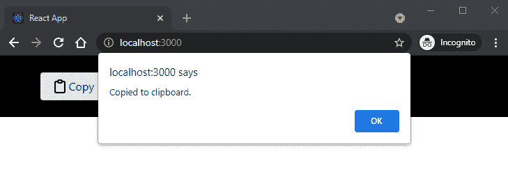
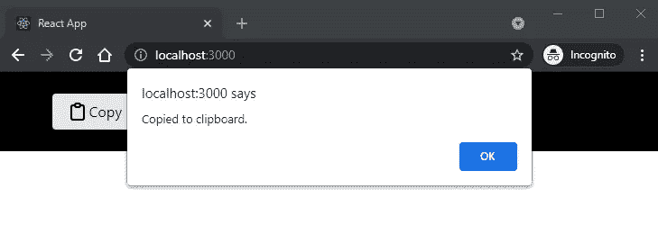

# 如何在 React 中添加复制到剪贴板功能

> 原文：<https://javascript.plainenglish.io/how-to-add-a-copy-to-clipboard-function-in-react-d145c613761?source=collection_archive---------16----------------------->



添加一个 React“复制到剪贴板”功能非常简单。它可以内联完成，也可以作为方法调用。

**反应复制到剪贴板事件处理程序的基础知识**

*onClick React 事件*

```
onClick={}
```

从一个`onClick`反应事件开始。

*内联事件处理程序*

```
onClick={() => {navigator.clipboard.writeText("http://localhost:3000/")}}
```

箭头函数是 React 事件处理程序，包含在花括号中。

添加`navigator.clipboard`访问系统剪贴板，并将文本`"http://localhost:3000/"`作为剪贴板的内容。

*事件处理程序作为方法*

```
copy() {
    navigator.clipboard.writeText("http://localhost:3000/");
}

onClick ={this.copy}
```

另一种方法是将事件处理程序作为一个单独的方法，并在必要时调用它。

*带警告的内联事件处理程序*

```
onClick={() => {navigator.clipboard.writeText("http://localhost:3000/"); alert("Copied to clipboard.");}}
```

除了剪贴板功能之外，您还可以随意添加警告。

*带有警告的事件处理方法*

```
copy() {
    navigator.clipboard.writeText("http://localhost:3000/");
    alert("Copied to clipboard.");
}

onClick ={this.copy}
```

当然，您也可以向该方法添加警告。

# **反应复制到剪贴板的示例**

**内嵌事件处理程序**

内联的`onClick`事件处理程序对于功能组件来说工作得很好。

*功能组件内的事件处理程序*

```
function App() {
  return (
    <div className="App" class="p-6 bg-black">
      <a onClick={() => {navigator.clipboard.writeText("http://localhost:3000/"); alert("Copied to clipboard.");}} class="bg-white hover:bg-gray-200 text-black py-2 px-4 rounded inline-flex items-center">
        <svg  class="h-6 w-6" fill="none" viewBox="0 0 24 24" stroke="currentColor">
          <path stroke-linecap="round" stroke-linejoin="round" stroke-width="2" d="M9 5H7a2 2 0 00-2 2v12a2 2 0 002 2h10a2 2 0 002-2V7a2 2 0 00-2-2h-2M9 5a2 2 0 002 2h2a2 2 0 002-2M9 5a2 2 0 012-2h2a2 2 0 012 2" />
        </svg>
        Copy
      </a>
    </div>
  );
}

export default App;
```

这段代码被添加到 [React Tailwind 项目](../../../blog/article/reactjs-tailwindcss)中。请随意将其添加到任何其他组件中。

该按钮可在 [7 尾翼按钮](../../../../../blog/article/7-tailwindcss-buttons)中找到。

**方法事件处理程序**

*事件处理程序作为类组件中的方法*

```
import React from 'react';
import ReactDOM from 'react-dom';

class App extends React.Component {
  copy() {
    navigator.clipboard.writeText("http://localhost:3000/");
    alert("Copied to clipboard.");
  }
  render() {
    return (
      <div className="App" class="p-6 bg-black">
        <button onClick={this.copy} class="bg-white hover:bg-gray-200 text-black py-2 px-4 rounded inline-flex items-center">
          <svg  class="h-6 w-6" fill="none" viewBox="0 0 24 24" stroke="currentColor">
            <path stroke-linecap="round" stroke-linejoin="round" stroke-width="2" d="M9 5H7a2 2 0 00-2 2v12a2 2 0 002 2h10a2 2 0 002-2V7a2 2 0 00-2-2h-2M9 5a2 2 0 002 2h2a2 2 0 002-2M9 5a2 2 0 012-2h2a2 2 0 012 2" />
          </svg>
          Copy
        </button>  
      </div>
    );
  }
}

ReactDOM.render(<App />, document.getElementById('root'));
```

或者，好的做法是将事件处理程序作为类组件中的一个方法分离出来。

内联和方法事件处理程序都可以工作。

完成后，您可以点按按钮并将文本复制到剪贴板。



*原载于*[*https://www.ordinarycoders.com*](https://www.ordinarycoders.com/blog/article/react-copy-to-clipboard)*。*

*更多内容请看*[***plain English . io***](http://plainenglish.io/)