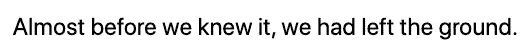
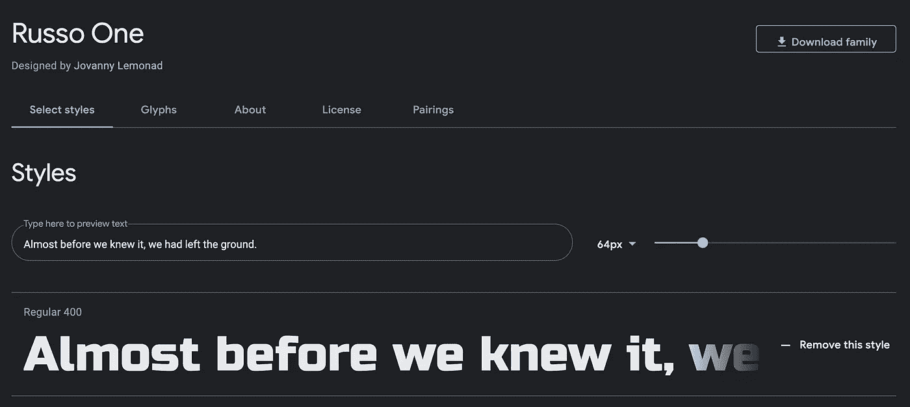
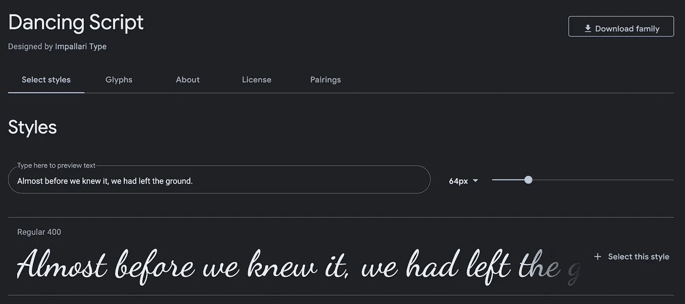
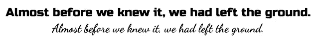

# 如何在 Next.js 和 Tailwind CSS 应用程序中添加自定义的 Google 字体

> 原文：<https://javascript.plainenglish.io/how-to-add-a-custom-google-font-to-a-next-js-and-tailwind-css-app-d0e4ad03f1c3?source=collection_archive---------3----------------------->

## 通过使用自定义文档文件和配置 Tailwind CSS


Photo by [Brett Jordan](https://unsplash.com/@brett_jordan?utm_source=medium&utm_medium=referral) on [Unsplash](https://unsplash.com?utm_source=medium&utm_medium=referral)

选择合适的字体是任何设计的重要部分。你选择的字体会对你的网站或应用程序的信息、声音和感觉产生巨大的影响。

在本文中，我们将了解如何使用 Tailwind CSS 向 Next.js 应用程序添加自定义 Google 字体。这将包括以下步骤:

1.  设置基本应用程序
2.  选择一种字体
3.  创建自定义文档文件
4.  给顺风添加字体

# 设置基本应用程序

首先，我们将使用`create-next-app`创建一个新的 Next.js 项目，并添加 Tailwind CSS。

要了解如何设置这个项目，请查看下面的文章。

[](/introduction-to-using-tailwind-css-with-next-js-d609be5b6e91) [## 将 Tailwind CSS 用于 Next.js 的介绍

### 为什么应该在 Next.js 应用程序中使用 Tailwind CSS

javascript.plainenglish.io](/introduction-to-using-tailwind-css-with-next-js-d609be5b6e91) 

设置完成后，我们将把以下文本添加到`index.js`文件中，以查看字体的变化。

```
<div *className*="flex flex-col h-screen justify-center items-center text-2xl">
  <p>Almost before we knew it, we had left the ground.</p>
</div>
```

如果我们运行我们的项目，我们将看到默认字体如下所示。



# 选择一种字体

现在是有趣的部分。去 https://fonts.google.com/[看看不同的字体。Google 字体目录有许多开源字体，您可以将它们集成到您的应用程序中。](https://fonts.google.com/)

对于这个例子，我们将选择两种不同的字体。一个是 sans 字体，用来替换默认字体，另一个是作为新的自定义实用程序添加的。*(当我们在最后一步给 Tailwind 添加字体的时候，我们会涉及更多的内容。)*

对于默认的 sans 字体，我将使用名为 [Russo One](https://fonts.google.com/specimen/Russo+One) 的字体。



对于自定义字体，我将使用一个名为[舞蹈脚本](https://fonts.google.com/specimen/Dancing+Script)的字体。



选择正确的字体可能很难。看看下面这篇文章，就如何为你的网站选择最好的字体提供一些建议。

[](https://www.websitebuilderexpert.com/designing-websites/pick-best-font-style-for-website/) [## 网站最佳字体|选择字体的专家指南

### 我们的独立研究项目和公正的评论部分由附属委员会资助，没有额外费用…

www.websitebuilderexpert.com](https://www.websitebuilderexpert.com/designing-websites/pick-best-font-style-for-website/) 

# 创建自定义文档文件

一旦你选择了你的字体，下一步就是在 pages 文件夹中创建一个`_document.tsx`文件。

Next.js 允许您创建一个定制的文档文件，它将增加您的应用程序的`<html>`和`<body>`标签。您可以通过将以下代码添加到`_document.js`文件中来覆盖默认的文档文件。

```
import Document, { Html, Head, Main, NextScript } from 'next/document'

class MyDocument extends Document {
  static async getInitialProps(ctx) {
    const initialProps = await Document.getInitialProps(ctx)
    return { ...initialProps }
  }

  render() {
    return (
      <Html>
        <Head />
        <body>
          <Main />
          <NextScript />
        </body>
      </Html>
    )
  }
}

export default MyDocument
```

然后，我们可以通过在`<head>`标签中添加一个`<link>`标签来添加我们想要使用的 web 字体。通过将其添加到自定义文档文件中，我们可以在整个应用程序中使用这些字体。用下面的代码片段替换上面的`<Head />`:

```
<Head>
  <link
    href="https://fonts.googleapis.com/css2?family=**Russo+One**"
    rel="stylesheet"
  />
  <link
    href="https://fonts.googleapis.com/css2?family=**Dancing+Script**"
    rel="stylesheet"
  />
</Head>
```

将 **"Russo+One"** 或 **"Dancing+Script"** 替换为您想要在项目中使用的任何字体的名称。

# 给顺风添加字体

最后一步是更新`tailwind.config.js`文件。默认情况下，Tailwind 提供以下三种字体系列实用工具:

*   跨浏览器无衬线堆栈
*   跨浏览器的衬线堆栈
*   跨浏览器等宽堆栈

我们可以通过扩展`theme`的`fontFamily`属性来更新默认字体。我们还将把字体系列 sans 的默认主题扩展到属性上。

```
const defaultTheme = require('tailwindcss/defaultTheme');*module*.*exports* = {
  purge: ['./pages/**/*.{js,ts,jsx,tsx}', './components/**/*.{js,ts,jsx,tsx}'],
  darkMode: false, // or 'media' or 'class'
  **theme: {
    extend: {
      fontFamily: {
        sans: ['Russo One', ...defaultTheme.fontFamily.sans],
      },
    },
  },**
  variants: {
    extend: {},
  },
  plugins: [],
};
```

现在，如果你回到你的浏览器，你应该会看到默认字体的变化。


我们还可以在三种默认字体系列实用程序之外添加额外的字体。我将在配置中添加另一个名为 *fancy* 的实用程序，并添加舞蹈脚本作为字体。

```
theme: {
  extend: {
    fontFamily: {
      sans: ['Russo One', ...defaultTheme.fontFamily.sans],
      **fancy: ['Dancing Script'],**
    },
  },
},
```

现在，如果我们回到 index.js 文件，我们可以使用名为`font-fancy`的实用程序。这将允许我们使用舞蹈脚本字体。

```
<div *className*="flex flex-col h-screen justify-center items-center text-2xl">
  <p>Almost before we knew it, we had left the ground.</p>
  **<p *className*="font-fancy">
    Almost before we knew it, we had left the ground.
  </p>**
</div>
```



# 结论

感谢阅读！我希望这篇文章对你在项目中添加自定义字体有所帮助。

js 和 Tailwind CSS 是我最近最喜欢用来建立网站的堆栈。更多地了解这两种技术并看到它们如何协同工作真的很有趣。敬请关注即将发布的更多文章！

如果你想学习如何在你的应用程序中加入黑暗模式，看看下面的文章。

[](/how-to-add-dark-mode-to-your-next-js-project-using-tailwind-css-3d460a768d1c) [## 如何使用 Tailwind CSS 将黑暗模式添加到 Next.js 项目中

### 修复“文档未定义”错误的简单技巧。

javascript.plainenglish.io](/how-to-add-dark-mode-to-your-next-js-project-using-tailwind-css-3d460a768d1c) 

*更多内容请看*[***plain English . io***](http://plainenglish.io/)