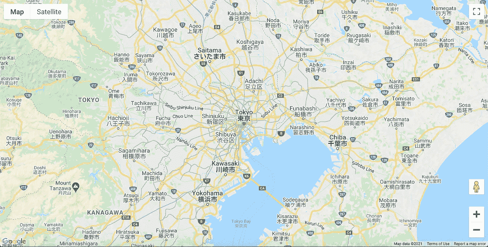
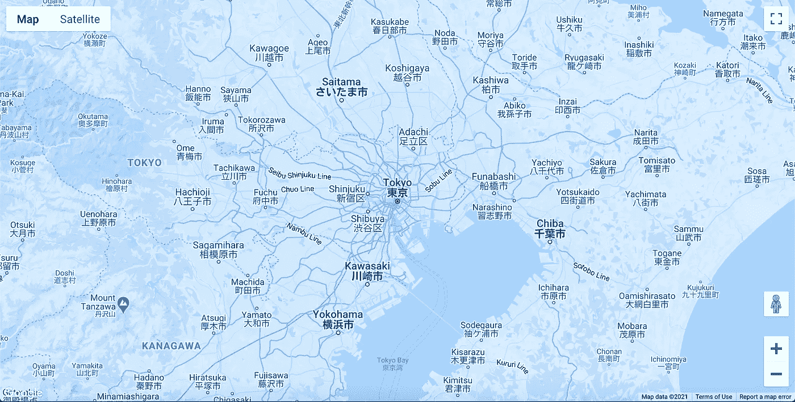

# 如何添加带有反应的自定义谷歌地图

> 原文：<https://javascript.plainenglish.io/how-to-add-a-custom-google-map-with-react-faf009e4d2b5?source=collection_archive---------1----------------------->

## 使用 create-react-app、react-google-maps-api 和时髦的地图


Photo by [Tabea Damm](https://unsplash.com/@tabeadamm?utm_source=medium&utm_medium=referral) on [Unsplash](https://unsplash.com?utm_source=medium&utm_medium=referral)

地图是许多应用程序和网站的重要组成部分。谷歌地图无疑是目前最受欢迎的地图应用。我相信你熟悉标准的谷歌地图配色方案，如下图所示。



在本文中，我将教您如何将谷歌地图集成到您的反应应用程序中。我们也将使用时髦的地图添加一个自定义的配色方案到我们的地图。让我们从简单到时髦！



在我们开始之前，您需要在谷歌云平台控制台中创建您自己的 API 密钥。如果您需要生成 API 密钥的帮助，请查看下面的视频。

请注意，您需要一个计费账户，但根据他们的[网站](https://cloud.google.com/maps-platform/pricing)、*“谷歌地图平台”提供地图、路线和地点每月 200 美元的免费积分(见*、[、*计费账户积分*、](https://developers.google.com/maps/billing-credits?_ga=2.85320218.2020879006.1611550665-659157027.1592904480)、*)。有了每月 200 美元的贷款，绝大多数客户发现他们的用例是完全免费的。除非您的每月用水量超过 200 美元，否则不会向您收费。”*

# 入门指南

一旦你有了 API 键，使用 create-react-app 生成一个新的 React 应用程序，并在你的文本编辑器中打开它。

```
npx create-react-app YOUR-APP-NAME
```

在根文件夹中，创建一个`.env.local`文件，并将您的应用编程接口密钥存储在那里。请记住，您的 API 密钥仍将嵌入到构建中并在客户端公开。请小心点。

为了使用`.env.local`文件中的 API 键，我们将变量命名如下。

```
REACT_APP_GOOGLE_MAPS_API_KEY="YOUR-API-KEY"
```

# 反应-谷歌-地图/应用编程接口

有一些不同的包，我们可以用来整合谷歌地图与反应；`google-map-react` `google-maps-react`和`react-google-maps`是 npm 上下载最多的几个。在我们的示例中，我们将使用`@react-google-maps/api`。这个[包](https://www.npmjs.com/package/@react-google-maps/api)是对 react-google-maps 库的重写。

 [## 反应谷歌地图应用编程接口风格指南

### 编辑描述

reactor-Google-maps-API-docs . netlify . app](https://react-google-maps-api-docs.netlify.app/) 

首先，在您的项目中安装软件包。

```
npm i @react-google-maps/api
```

我们将使用库中的`GoogleMap`组件和`useLoadScript`钩子，所以将它们导入到`App.js`文件中。

调用应用程序组件顶部的`useLoadScript`钩子，并将谷歌地图 API 键作为一个对象传递。要使用存储在`.env.local`文件中的 API 密钥，请使用`process.env.REACT_APP_GOOGLE_MAPS_API_KEY`。

这个钩子会给我们返回一个`isLoaded`和`loadError`变量。

```
const { isLoaded, loadError } = useLoadScript({
  googleMapsApiKey: process.env.REACT_APP_GOOGLE_MAPS_API_KEY
});
```

使用这两个变量，我们将进行检查，以确保地图已正确加载。

```
if (loadError) return 'Error loading maps';
if (!isLoaded) return 'Loading maps';
```

如果地图加载正确，我们将使用一些道具返回`GoogleMap`组件。首先，`mapContainerStyle`设置地图容器的高度和宽度。您需要设置此属性，否则地图将不会显示。其次，我们将添加一个`center`属性，传递一个具有`lat`和`lng`(纬度和经度)属性的对象。这将是最初的地图中心。我们将这些值设置为应用程序组件之外的变量。

```
const containerStyle = {
  width: '100vw',
  height: '100vh'
};const center = {
  lat: 35.6804,
  lng: 139.769
};
```

第三，我们将添加一个`zoom`属性，用于设置缩放级别。在我们的示例中，我们将它设置为 10。`GoogleMap`组件将如下所示。

```
<GoogleMap
  mapContainerStyle={containerStyle}
  center={center}
  zoom={10}
></GoogleMap>
```

此时，您应该会在应用程序中看到一个基本的谷歌地图。

# 添加时髦的地图配色方案

现在是有趣的部分！使用时髦的地图，我们可以为地图添加自定义配色方案。

时髦地图是谷歌地图不同风格的储存库。他们有数百种不同的配色方案供您选择，实施起来很容易。

首先，访问他们的网站，找到你想要使用的配色方案。

[](https://snazzymaps.com/) [## 时髦的地图——谷歌地图的免费样式

### 时髦地图是针对网页设计师和开发者的谷歌地图不同配色方案的储存库。

snazzymaps.com](https://snazzymaps.com/) 

找到所需的配色方案后，找到 JavaScript Style Array 并复制代码。在您的项目中，创建一个`mapStyles.js`文件并添加样式作为导出。

如果你想使用我的例子中的冰蓝色主题，你的`mapsStyles.js`文件会是这样的。

然后，将`mapStyles`导入到`App.js`文件中，并将其作为一个值添加到谷歌地图组件的选项属性中。

```
const options = {
  styles: mapStyles
};
```

最终的`App.js`文件应该是这样的。

# 包扎

谢谢你的阅读！你现在应该有一个谷歌地图显示在你的应用程序与你选择的颜色主题。享受配色方案，找到最适合您应用的方案。您也可以使用他们网站上的创建风格工具轻松创建您自己的时髦地图主题。

如果您想让这个应用程序更上一层楼，您可以实现地理位置 API 来获取用户当前的纬度和经度坐标，并将其显示在地图上。查看下面的文章，了解如何做到这一点。

[](https://medium.com/javascript-in-plain-english/how-to-use-the-geolocation-api-in-your-react-app-54e87c9c6c94) [## 如何在 React 应用中使用地理定位 API

### 获取用户的坐标，并在下一个 React 应用中使用它们

medium.com](https://medium.com/javascript-in-plain-english/how-to-use-the-geolocation-api-in-your-react-app-54e87c9c6c94)