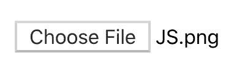
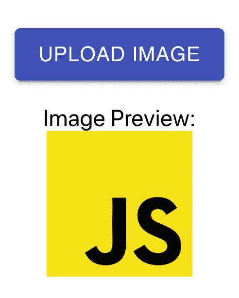
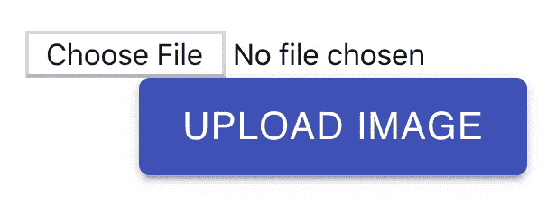
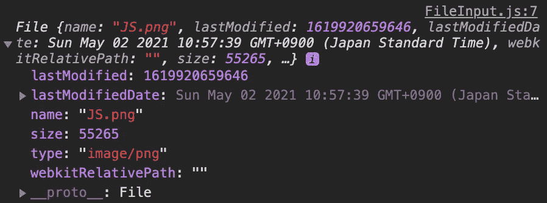

# 如何添加一个文件输入按钮并用 React 显示一个预览图像

> 原文：<https://javascript.plainenglish.io/how-to-add-a-file-input-button-and-display-a-preview-image-with-react-2568d9d849f5?source=collection_archive---------1----------------------->

## 使用材质用户界面库和 URL 对象


Photo by [Viktor Talashuk](https://unsplash.com/@viktortalashuk?utm_source=medium&utm_medium=referral) on [Unsplash](https://unsplash.com?utm_source=medium&utm_medium=referral)

您经常想要从设备上传图像、视频、pdf 或其他文档。我们可以通过设置`type="file"`使用 HTML `input`元素轻松实现这一点。这将导致屏幕上显示以下元素。



这是可行的，但在我看来不太好。难道你不想要一个更有风格的元素，可能还有上传图片的预览吗？像下面这样的怎么样？



在本文中，我们将了解如何使用 React 创建这个文件输入。在本文结束时，您应该对如何执行以下操作有所了解:

*   用 Material-UI 创建文件输入按钮
*   使用 React 存储文件数据
*   使用 URL 对象显示图像的预览

# 建立

对于这个例子，我们将在一个`create-react-app`项目中工作。我已经安装了 [Material-UI](https://www.npmjs.com/package/@material-ui/core) 核心包。如果您是使用 Material-UI 的新手，请查看下面的文章开始使用。

[](https://medium.com/swlh/create-a-customized-color-theme-in-material-ui-7205163e541f) [## 在材质界面中创建自定义的颜色主题

### 为下一个 React 项目定制颜色主题很容易

medium.com](https://medium.com/swlh/create-a-customized-color-theme-in-material-ui-7205163e541f) 

首先，我创建了一个组件，它将一个基本的输入元素呈现到屏幕上。我加了`type="file"`和`accept="image/*"`。这些属性将允许用户从他们的设备中选择任何图像文件。

```
const FileInput = () => {
  return <input *accept*="image/*" *type*="file" *id*="select-image" />;
};export default FileInput;
```

# 用 Material-UI 创建文件输入按钮

第一步是创建按钮。我们需要从 Material-UI 导入按钮组件。

```
import Button from '@material-ui/core/Button';
```

然后，我们将在输入的标签元素中呈现按钮组件。记住，标签上的`htmlFor`属性应该与输入的`id`相匹配。

```
<>
  <input *accept*="image/*" *type*="file" *id*="select-image" />
  **<label *htmlFor*="select-image">
    <*Button* *variant*="contained" *color*="primary">
      Upload Image
    </*Button*>
  </label>**
</>
```

如果我们检查输出，它将不是我们所希望的。我们将看到输入元素和按钮都呈现在屏幕上。此外，按钮不能按预期工作。



有两件事我们需要解决。

首先，我们需要隐藏输入元素。因此，访问输入的唯一方式是通过标签。我们可以通过向 input 元素添加一个内联样式`style={{ display: ‘none’ }}`来实现这一点。

其次，我们需要改变按钮的组件类型。目前，它是一个按钮元素，但我们需要将其更改为一个 span 元素。我们可以通过向按钮组件添加一个`component=”span”`道具来实现这一点。

```
<>
  <input 
    *accept*="image/*" 
    *type*="file" 
    *id*="select-image"
    ***style*={{ display: 'none' }}**
  />
  <label *htmlFor*="select-image">
    <*Button* *variant*="contained" *color*="primary" **component="span"**>
      Upload Image
    </*Button*>
  </label>
</>
```

现在，我们将只看到按钮。如果我们点击它，我们的文件选择屏幕将打开，并允许我们选择一个图像。


# 使用 React 存储文件数据

下一步将是处理文件数据。我们将使用 React 中的`useState`钩子并创建一个名为`selectedImage`的状态变量。

```
const [selectedImage, setSelectedImage] = useState(null);
```

然后，我们将向输入元素添加一个`onChange`监听器。每当输入文件改变时，我们都要将`selectedImage`变量设置为所选的文件。数据将以数组的形式出现，所以一定要使用`e.target.files[0]` **获取数组中的第一项。**

```
<input
  *accept*="image/*"
  *type*="file"
  *id*="select-image"
  *style*={{ display: 'none' }}
  ***onChange*={*e* => setSelectedImage(*e*.target.files[0])}**
/>
```

如果我们添加一个图像并将`selectedImage`变量记录到控制台，我们将会看到以下内容。



我们存储在`selectedImage`变量中的是一个文件对象。你可以在这里阅读更多关于文件对象[的信息。](https://developer.mozilla.org/en-US/docs/Web/API/File)

# 使用 URL 对象显示图像的预览

最后一步是显示我们上传的图片预览。我们可以使用 React 中的`useEffect`钩子和 URL 对象上的`createObjectURL`方法来实现这一点。

我们首先需要另一个状态变量，我们称之为`imageUrl`。

```
const [imageUrl, setImageUrl] = useState(null);
```

然后，我们将使用`useEffect`钩子并监听`selectedImage`变量的变化。如果有一个选定的图像，那么我们将希望创建一个图像的网址。

我们可以使用 URL 对象上的`createObjectURL`方法从文件对象创建一个 URL。这个函数接受一个文件、Blob 或 MediaSource 对象，并创建一个对象 URL。你可以在这里阅读更多关于这个[的内容](https://developer.mozilla.org/en-US/docs/Web/API/URL/createObjectURL)。

```
useEffect(() => {
  if (selectedImage) {
    setImageUrl(*URL*.createObjectURL(selectedImage));
  }
}, [selectedImage]);
```

最后，我们将使用`img`元素通过将我们创建的 URL 添加到源中来显示图像。为了让它看起来更好，我还使用了 Material-UI 中的 Box 组件来添加上边距并使文本居中。

```
{imageUrl && selectedImage && (
  <*Box* *mt*={2} *textAlign*="center">
    <div>Image Preview:</div>
    
  </*Box*>
)}
```

如果您想从 Material-UI 了解更多关于盒子组件的信息，请查看下面的文章。

[](https://levelup.gitconnected.com/using-the-box-component-in-material-ui-to-easily-style-your-project-532894edd205) [## 使用 Material-UI 中的 Box 组件轻松设置项目样式

### 不使用 CSS 文件、CSS-in-JS 或内联样式来设计您的应用程序

levelup.gitconnected.com](https://levelup.gitconnected.com/using-the-box-component-in-material-ui-to-easily-style-your-project-532894edd205) 

我们的组件现在完成了！当我们上传图像时，我们会在按钮下方看到图像的预览。


[Link to GitHub Gist](https://gist.github.com/chadmuro/e770ade905c27eb76f44559e6c4eb6be)

# 结论

您可以在下面查看该组件的完整源代码。

感谢阅读！我希望这篇文章对你用 Material-UI 创建一个文件输入按钮有所帮助。我认为让用户看到一个有风格的按钮，以及他们上传的图片预览是一种更好的体验。

如果你想继续学习 Material-UI，可以看看下面的文章。

[](https://medium.com/geekculture/what-really-happens-when-you-use-the-textfield-component-in-material-ui-1e62652196f) [## 在 Material-UI 中使用 TextField 组件时，实际会发生什么？

### 让我们更深入地调查一下

medium.com](https://medium.com/geekculture/what-really-happens-when-you-use-the-textfield-component-in-material-ui-1e62652196f) [](/the-easiest-way-to-style-your-material-ui-components-the-makestyles-function-a66ab7b9fe01) [## 样式化你的材质 UI 组件的最简单的方法:makeStyles 函数

### 如何在 Material-UI 中使用 makeStyles 函数

javascript.plainenglish.io](/the-easiest-way-to-style-your-material-ui-components-the-makestyles-function-a66ab7b9fe01) 

*更多内容看*[***plain English . io***](http://plainenglish.io/)