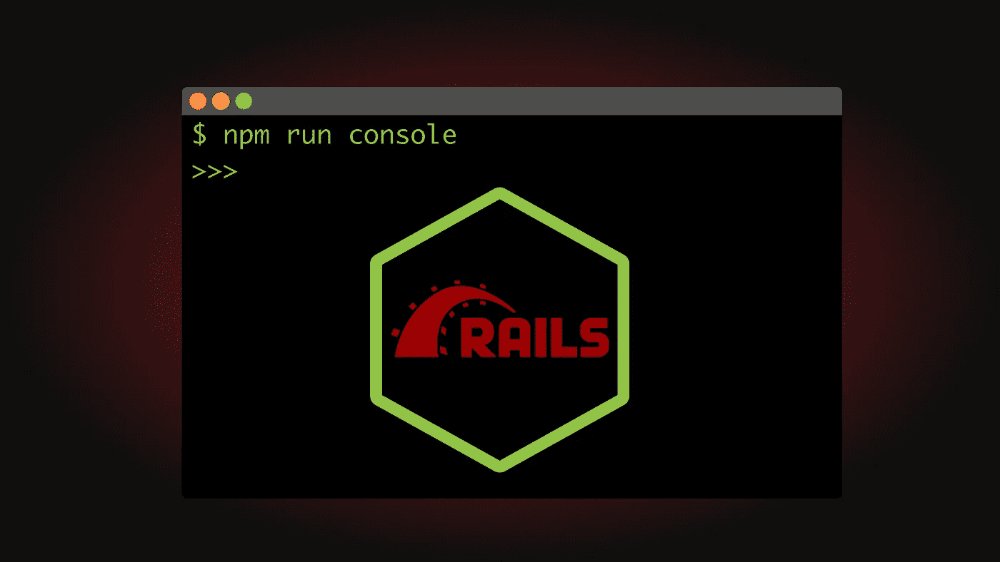
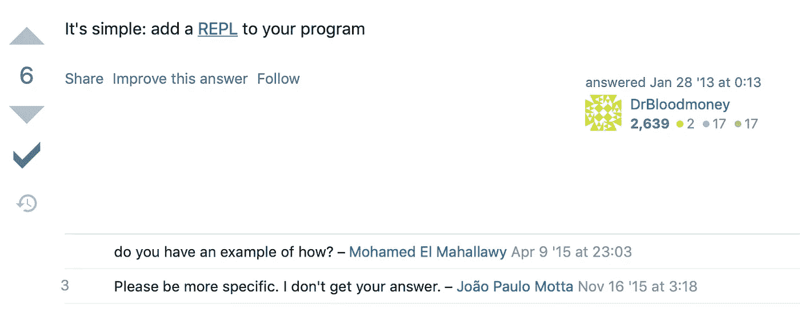

# 如何向 Node.js 添加 Rails 控制台

> 原文：<https://javascript.plainenglish.io/how-to-add-a-rails-console-to-node-b038d27a9379?source=collection_archive---------14----------------------->

## 从命令行访问模型



Rails 控制台是一个非凡的工具，也是我在转向 Node 时最怀念的。然而，当问及如何给 Node 添加一个类似 Rails 的控制台时，[答案可能是… *模糊的*](https://stackoverflow.com/questions/14549846/equivalence-of-rails-console-for-node-js) :



如果您不熟悉 Rails 控制台，它允许您在 REPL 中从命令行与模型进行交互。我的脚本将允许我们加载我们所有的模型，并重新加载它们以获得更改。这不像真实的东西那么强大，但是它仍然可以加速后端的原型制作。

# 设置

下面是相关的目录结构:

```
app/
  ∟> console.js
  ∟> src/ 
    ∟> models/
      ∟> knex.js 
      ∟> User.js 
      ∟> Note.js
```

应该注意的是，我的设置将每个单独的模型类从它们自己的文件中导出，目录中没有其他文件，比如测试或索引。如果您的设置不同，您可能需要修改下面的脚本。但是，差不了多少，所以不用担心。此外，它们连接到什么 DB，或者您为您的模型使用什么库都没有关系(我使用的是 [Knex.js，](https://knexjs.org)您不必这样做)。只要您能够以某种方式导出模型，这就很好。

# 控制台文件

如你所见，它不长，也没有外部依赖性。

```
*const* **fs** = *require*('*fs*');
*const* **path** = *require*('*path*');
*const* **repl** = *require*('*repl*')*const* **modelDir** = **path**.join(**__dirname**, '*src*', '*models*');*const* **loadModels** = (**context**) => {
  **Object**.keys(**require**.cache).forEach(**key** => {
    *delete* require.cache[**key**];
  }); **fs**.readdirSync(**modelDir**, '*utf8*').forEach(**name** => {
    *const* **filePath** = **path**.join(**modelDir**, **name**);
    **context**[**name**.slice(0,-3)] = *require*(**filePath**);
  });
}*const* **replServer** = **repl**.start('>>>');
**loadModels**(replServer.context);**replServer**.defineCommand('*re*', {
  help: '*Reload the models without resetting the environment*',
  action() {
    **loadModels**(replServer.context);
    **this**.displayPrompt();
  },
});
```

要运行此命令，请使用以下命令:

```
node --experimental-repl-await ./console.js
```

除非使用节点 16 ，否则`[--experimental-repl-await](https://nodejs.org/docs/latest-v14.x/api/repl.html#repl_await_keyword)` [是必需的，这也是我们使用顶级`await`的原因。有了所有这些设置，您就有了一个 Rails 控制台:](https://nodejs.org/docs/latest-v14.x/api/repl.html#repl_await_keyword)

```
$ node --experimental-repl-await ./console.js
>>> *await* **User**.getAll()
*[
  User { getNotes: [AsyncFunction: getNotes], id: 1, name: 'Tim' },
  User { getNotes: [AsyncFunction: getNotes], id: 2, name: 'Sara' },
  User { getNotes: [AsyncFunction: getNotes], id: 3, name: 'Bill' },
  User { getNotes: [AsyncFunction: getNotes], id: 4, name: 'tom' }
]*
>>> *const* **bill** = *await* **User.**get(3);
*undefined*
>>> **bill**
*User { getNotes: [AsyncFunction: getNotes], id: 3, name: 'Bill' }*
>>>
>>> .re // To reload the models and get changes
```

# 分解剧本

有 3 个主要部分:

1.  加载模型
2.  启动服务器
3.  将 reload 命令添加到 REPL

## 加载模型

让我们来看看`loadModels(context)`:

```
*const* **loadModels** = (**context**) => {
  **Object**.keys(**require**.cache).forEach(**key** => {
    *delete* require.cache[**key**];
  }); **fs**.readdirSync(**modelDir**, '*utf8*').forEach(**name** => {
    *const* **filePath** = **path**.join(**modelDir**, **name**);
    **context**[**name**.slice(0,-3)] = *require*(**filePath**);
  });
}
```

首先，那辆`context`是`replServer`的。你可以把它想象成另一辆`global`，`context`上的任何东西在 REPL 都是顶级的。我们希望我们的模型在那里，这样我们就可以只做`User`而不是类似`whatever.models.User`的事情。

你可能想知道我们在用`require.cache`做什么。通常，`require`只从磁盘加载一次，然后缓存结果。这对提高生产速度很有好处，但对我们的目的来说并不理想。为了让我们确保每次运行`require`时都得到一个包含最新变更的新加载，我们需要删除缓存。最简单的(只有？)方法是滚动键并删除它们。

现在，对于实际需要的位。目标是将所需的模块保存到`context[ModelName]`。我只是遍历指定目录中存在的任何文件，去掉名称中的`.js`，并将它们保存到`context`。这将允许我访问我的`[knex](https://knexjs.org)` [进行原始查询](https://knexjs.org)，以及我的`User`和`Note`类。上面的工作与我的设置，但如果你的出口不同于我的，修改你认为合适的。

## 启动我们的 REPL 服务器

这很简单，如果你想知道更多，我推荐你阅读官方的节点 REPL 文档。我们所做的就是启动服务器，将它保存到一个变量中，然后将我们的模型添加到`context`中。

```
*const* **replServer** = **repl**.start('>>>');
**loadModels**(replServer.context);
```

唯一值得注意的是，你可以用一个字符串[指定 REPL 提示](https://nodejs.org/docs/latest-v14.x/api/repl.html#repl_repl_start_options)，如果你传递一个带有属性的对象，你甚至可以做更多的事情。

## 将 reload 命令添加到 REPL

REPLs 有一些内置命令，您可以通过键入`.help`来查看它们:

```
>>> .help
.break    Sometimes you get stuck, this gets you out
.clear    Alias for .break
.editor   Enter editor mode
.exit     Exit the REPL
.help     Print this help message
.load     Load JS from a file into the REPL session
.save     Save all evaluated commands in this REPL session to a file
```

我们希望添加一个 reload 命令，以便在我们做出任何更改时可以快速更新我们的模型。你需要做的就是使用`defineCommand`。它接受一个字符串作为命令名，以及一个带有关键字`help`和`action`的对象。

```
**replServer**.defineCommand('*re*', {
  help: '*Reload the models without resetting the environment*',
  action() {
    **loadModels**(replServer.context);
    **this**.displayPrompt();
  },
});
```

请注意，字符串`re`(很短，因为您会经常键入它，但您可以称之为完整的`reloadModels`)在字符串中不需要`.`。你只需在控制台中输入`.re`。如果用户键入`.help`命令，就会列出`help`属性。当我们键入`.re`时，`action`属性实际上被调用。我们在函数中所做的就是调用`loadModels`，然后重新显示提示。如果不重新显示，在`.re`之后运行的命令将缺少`>>>`，看起来有点奇怪。*不要对属性使用箭头函数，我们需要* `*this*` *不要乱用。*

就是这样！这就够了。如果你遇到什么问题，请告诉我。

大家编码快乐，

麦克风

*更多内容请看*[***plain English . io***](http://plainenglish.io/)