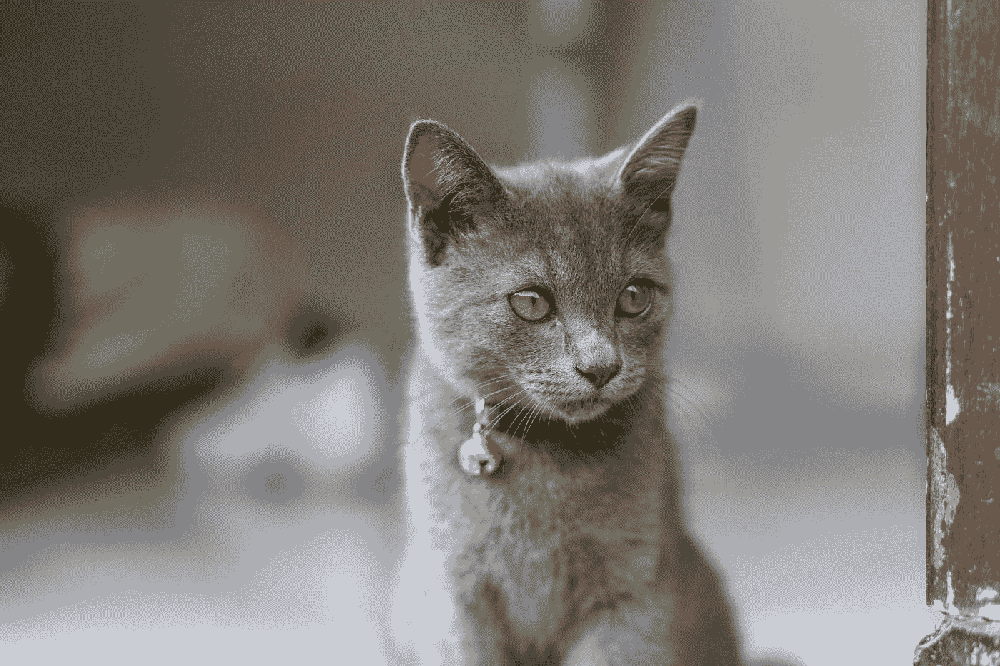

# 如何给网页添加右键菜单？

> 原文：<https://javascript.plainenglish.io/how-to-add-a-right-click-menu-to-a-webpage-6dd58e1935fa?source=collection_archive---------13----------------------->



Photo by [Heri Susilo](https://unsplash.com/@crocodileforest?utm_source=medium&utm_medium=referral) on [Unsplash](https://unsplash.com?utm_source=medium&utm_medium=referral)

有时，我们可能想在网页上添加右键菜单。

在本文中，我们将看看如何用 JavaScript 给网页添加右键菜单。

# 监听上下文菜单和点击事件

为了在右键单击时打开上下文菜单，我们将一个事件监听器附加到`contextmenu`事件，并调用`preventDefault`来阻止事件监听器中的默认操作。

默认操作是打开浏览器的上下文菜单。

之后，我们可以添加代码来打开菜单。

为了在页面上单击鼠标左键时关闭菜单，我们添加了一个`click`事件监听器，然后设置关闭菜单的样式。

为此，我们编写以下 HTML 来创建上下文菜单:

```
<ul id="ctxMenu">
  <li>Save</li>
  <li>Save As</li>
  <li>Open</li>
</ul>
```

然后我们通过编写添加一些 CSS 样式:

```
#ctxMenu {
  border: 1px solid black;
  padding: 10px;
  list-style-type: none;
  display: none;
  position: absolute;
  width: 200px;
}
```

我们添加了一个边框并设置了位置`absolute`，这样上下文菜单将显示我们右击鼠标的位置。

我们将`display`设置为`none`，这样我们最初就不会显示菜单。

接下来，我们通过编写以下 JavaScript 代码来添加事件侦听器:

```
const ctxMenu = document.getElementById("ctxMenu");window.addEventListener("contextmenu", (event) => {
  event.preventDefault();
  ctxMenu.style.display = "block";
  ctxMenu.style.left = (event.pageX - 10) + "px";
  ctxMenu.style.top = (event.pageY - 10) + "px";
});window.addEventListener("click", (event) => {
  ctxMenu.style.display = "";
  ctxMenu.style.left = "";
  ctxMenu.style.top = "";
});
```

我们调用`window.addEventListener`来监听整个页面上的事件。

在`contextmenu`事件处理程序中，我们调用`event.preventDefault`来阻止我们右击时的默认动作，即打开浏览器的上下文菜单。

然后我们将`display`设置为`'block'`以将`ul`显示为块级元素。

并且我们将`left`和`top`设置到鼠标指针被右击的位置。

在`click`事件监听器中，我们将`display`、`left`和`top`属性全部设置为空字符串，以移除所有样式并使用 CSS 中的样式。

现在，当我们右击页面时，我们看到的是上下文菜单，而不是浏览器的菜单。

# 结论

通过创建自己的 HTML、CSS 和 JavaScript 代码，我们可以在网页上创建自己的上下文菜单。

*更多内容请看*[***plain English . io***](http://plainenglish.io)