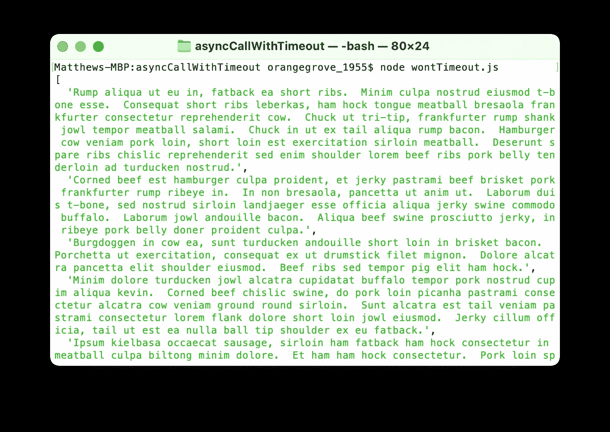
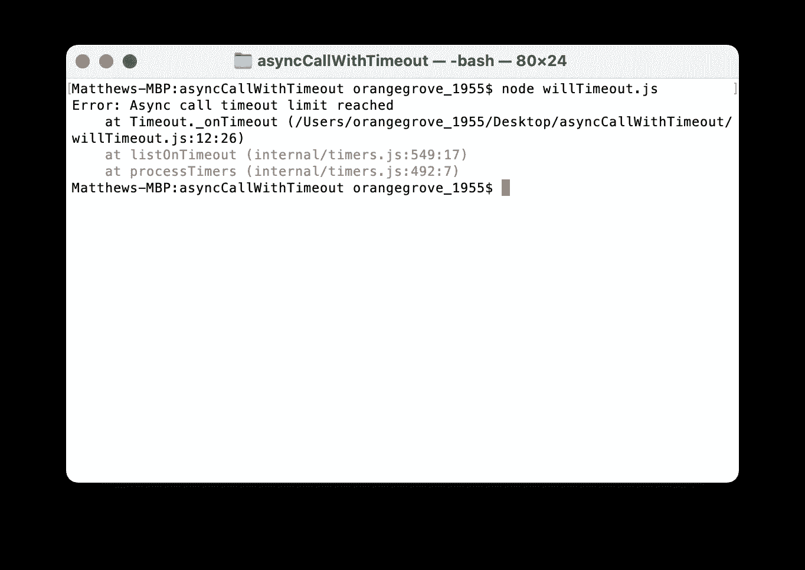

# 如何给异步 JavaScript 函数添加超时限制

> 原文：<https://javascript.plainenglish.io/how-to-add-a-timeout-limit-to-asynchronous-javascript-functions-3676d89c186d?source=collection_archive---------2----------------------->


Photo by [Markus Spiske](https://unsplash.com/@markusspiske?utm_source=medium&utm_medium=referral) on [Unsplash](https://unsplash.com?utm_source=medium&utm_medium=referral)

# 问题

当使用异步 JavaScript 时，很容易陷入试图记住如何正确使用`async/await`或承诺来获得您想要的数据的困境。开发人员经常忘记(或者甚至不知道)本地 JavaScript 在进行这些调用时没有超时机制的概念，所以如果您允许的话，这些异步操作将永远继续下去。

显然，如果你在等待永远不会到达的数据，这不是一个好的行为。无限的等待时间会导致各种问题，包括耗尽内存、霸占服务器上的资源，以及许多其他可能导致意外甚至危险结果的问题。

# 解决方案

对于异步 JavaScript 的这个突出问题，该怎么办呢？添加我们自己的暂停。实现函数运行时间的最大限制将允许开发人员安全地处理他们想要的数据既没有被解析也没有被拒绝的情况。

通过包含超时，我们可以在函数运行时间超过预期时间时提供我们自己的拒绝。这种拒绝可以被我们选择的错误捕捉方法优雅地处理，并把我们从上面提到的糟糕情况中拯救出来。

# 如何在 JavaScript 中创建超时

为了创建超时，我们将使用一个接受承诺和时间限制的异步函数。因为 JavaScript 的原生`setTimeout`函数使用毫秒作为参数，所以为了简单起见，我们将使用同样的方法。

```
const asyncCallWithTimeout = (asyncPromise, timeLimit) => {};
```

我们现在需要创建一个`timeoutPromise`来使用`timeLimit`值作为运行的最大时间。为此，如果达到时间限制，我们可以使用有错误的`setTimeout`和`reject`。

```
const timeoutPromise = new Promise((_resolve, reject) => {
    timeoutHandle = setTimeout(
        () => reject(new Error('Async call timeout limit reached')),
        timeLimit
    );
});
```

准备好之后，我们将使用`Promise.race()`来运行两个不同的承诺。这两个承诺将是我们传进去的`asyncPromise`，也是我们的`timeoutPromise`。此外，我们希望在`asyncPromise`成功的情况下移除超时，所以我们也将在这里添加清理。

```
return Promise.race([asyncPromise, timeoutPromise]).then(result => {
    clearTimeout(timeoutHandle);
    return result;
});
```

将所有这些部分放在一起(以及定义`timeoutHandle`以便可以在多个地方使用),我们的整体功能应该是这样的:

# asyncCallWithTimeout 的用法

为了理解`asyncCallWithTimeout`函数的响应，我们可以考虑两种情况。首先要考虑的情况是没有达到时间限制，而 asyncPromise 成功了。第二种情况是超过时间限制，函数返回错误。

为了演示其中的每一个，我们将使用`axios`调用一个外部 API`GET`， [Bacon Ipsum](https://baconipsum.com/json-api/) 。这种基于承诺的方法将需要几秒钟的时间来解决，这使它成为超时函数能力的一个有用的演示，接近真实世界的用例。

> **注意:**本文假设您已经熟悉了`npm`和安装包。如果没有，可以在 [axios npm 包](https://www.npmjs.com/package/axios)中找到安装说明。

## 异步承诺成功返回

为了成功地从 Bacon Ipsum 返回数据，我们可以使用下面的代码。`wontTimeout`函数将我们的`GET`调用作为`asyncPromise`传递，时限为 10 秒。这个时间限制应该足以成功返回数据，但是如果您继续遇到错误消息，您可能需要增加限制。

当我们运行这个`wontTimeout`函数时，我们看到数据被成功返回，因为我们没有超过时间限制。



The data has been successfully returned

## 达到时间限制

现在我们知道`asyncPromise`正在成功运行，让我们探索一个例子，其中时间限制比成功调用 API 所需的时间要短。我们将使用与上面几乎相同的代码，只是传递给我们函数的时间限制要短得多。

在 1 毫秒的时间限制下，肯定会超过允许的最大时间。因此，我们收到的不是来自 API 的数据，而是一个错误。



An error has been thrown

显然，1 毫秒短得令人难以置信，而且很可能是一个不合理的异步调用返回时间，所以在现实世界中使用这个函数时，请确保设置了实际的时间限制。

# 结论

超时是防止无限运行代码产生问题的一个重要工具。正确使用超时将允许您更快地失败，而不是让您的用户束手无策，等待您的代码崩溃或放弃。它还将节省您的资源，如果您在云中运行的是随用随付的情况，这是绝对重要的。

最终，使用超时来保护您的代码库是一个明智的想法，尤其是当您与您无法控制的第三方服务进行交互时。如果您是一名从事任何类型的异步项目的 JavaScript 开发人员，请查看一下您的代码库，看看您能从中受益的地方。

# 资源

*   [承诺— MDN 网络文档](https://developer.mozilla.org/en-US/docs/Web/JavaScript/Reference/Global_Objects/Promise)
*   [异步功能— MDN Web 文档](https://developer.mozilla.org/en-US/docs/Web/JavaScript/Reference/Statements/async_function)
*   [node . js 中的定时器— Node.js 文档](https://nodejs.org/en/docs/guides/timers-in-node/)
*   [axios 包— npm 存储库](https://www.npmjs.com/package/axios)

*更多内容请看*[***plain English . io***](http://plainenglish.io/)