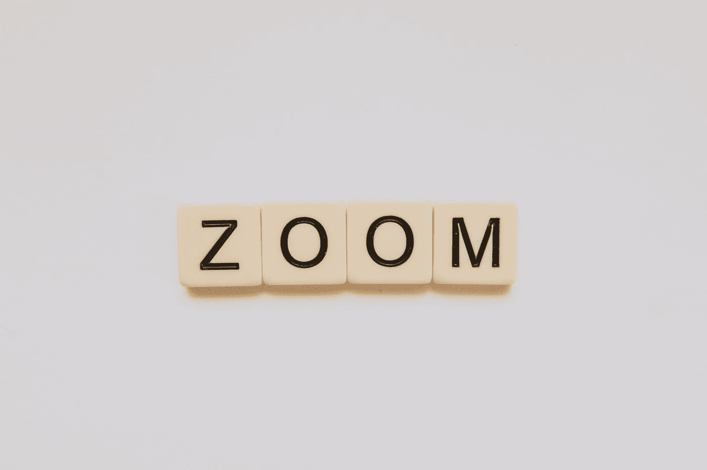

# 当我们像在谷歌地图上一样旋转鼠标滚轮时，如何添加一个小部件来放大和缩小网页

> 原文：<https://javascript.plainenglish.io/how-to-add-a-widget-that-we-can-zoom-in-and-out-on-a-web-page-when-we-spin-the-mouse-wheel-like-on-f1b83d6b82df?source=collection_archive---------8----------------------->



Photo by [Glen Carrie](https://unsplash.com/@glencarrie?utm_source=medium&utm_medium=referral) on [Unsplash](https://unsplash.com?utm_source=medium&utm_medium=referral)

有时，我们想在网页上创建一个小部件，在那里我们可以像在谷歌地图上一样放大和缩小某些东西。

在这篇文章中，我们将看看如何创建一个小部件，我们可以用鼠标滚轮放大和缩小，就像我们在谷歌地图上做的那样。

# 画出我们可以在画布上放大和缩小的图像

我们可以在画布上绘制我们想要放大和缩小的图像。

然后我们可以监听`wheel`事件，并在移动鼠标滚轮来放大和缩小图像时转换画布图像。

例如，我们可以编写以下 HTML:

```
<canvas id="canvas" width="600" height="200"></canvas>
```

然后，我们可以编写以下 JavaScript 代码，在画布上绘制图像，并在移动鼠标滚轮时放大和缩小图像:

```
const zoomIntensity = 0.2;const canvas = document.getElementById("canvas");
let context = canvas.getContext("2d");
const width = 600;
const height = 200;let scale = 1;
let originx = 0;
let originy = 0;
let visibleWidth = width;
let visibleHeight = height;const draw = () => {
  context.fillStyle = "white";
  context.fillRect(originx, originy, width / scale, height / scale);
  context.fillStyle = "black";
  context.fillRect(50, 50, 100, 100);
  window.requestAnimationFrame(draw);
}
draw();canvas.onwheel = (event) => {
  event.preventDefault();
  const mousex = event.clientX - canvas.offsetLeft;
  const mousey = event.clientY - canvas.offsetTop;
  const wheel = event.deltaY < 0 ? 1 : -1;
  const zoom = Math.exp(wheel * zoomIntensity);
  context.translate(originx, originy);
  originx -= mousex / (scale * zoom) - mousex / scale;
  originy -= mousey / (scale * zoom) - mousey / scale;
  context.scale(zoom, zoom);
  context.translate(-originx, -originy);
  scale *= zoom;
  visibleWidth = width / scale;
  visibleHeight = height / scale;
}
```

我们有`draw`功能，用第一行和第二行将屏幕清空为白色。

然后我们调用`fillStyle`和`fillRect`画一个黑色方块。

然后我们调用`window.requestAnimationFrame`来重画画布。

一旦我们定义了`draw`函数，我们就调用它来开始初始绘制。

接下来，我们将`canvas.onwheel`属性设置为当我们移动鼠标滚轮时放大和缩小图像的函数。

在函数中，我们首先调用`event.preventDefault()`来停止鼠标滚轮移动时的默认行为。

然后我们用以下公式得到鼠标偏移量:

```
const mousex = event.clientX - canvas.offsetLeft;
const mousey = event.clientY - canvas.offsetTop;
```

接下来，我们编写以下代码来规范鼠标移动，以避免不正常的跳跃:

```
const wheel = event.deltaY < 0 ? 1 : -1;
```

然后我们得到缩放系数:

```
const zoom = Math.exp(wheel * zoomIntensity);
```

然后我们平移可见原点，使其位于上下文的原点:

```
context.translate(originx, originy);
```

然后，我们计算缩放完成后的新原点:

```
originx -= mousex/(scale*zoom) - mousex/scale;
originy -= mousey/(scale*zoom) - mousey/scale;
```

接下来，我们调用`context.scale(zoom, zoom)`来围绕原点缩放图像。

然后我们平移图像以偏移可见原点，使其在缩放后处于正确的位置:

```
context.translate(-originx, -originy);
```

最后，我们使用以下内容更新缩放后的尺寸:

```
scale *= zoom;
visibleWidth = width / scale;
visibleHeight = height / scale;
```

现在，当我们移动鼠标滚轮时，黑色方块应该会放大和缩小。

# 结论

我们可以添加一个带有图像的小部件，我们可以通过在画布上绘制图像并在移动鼠标滚轮时平移和缩放图像来放大和缩小图像。

*更多内容请看*[***plain English . io***](http://plainenglish.io/)