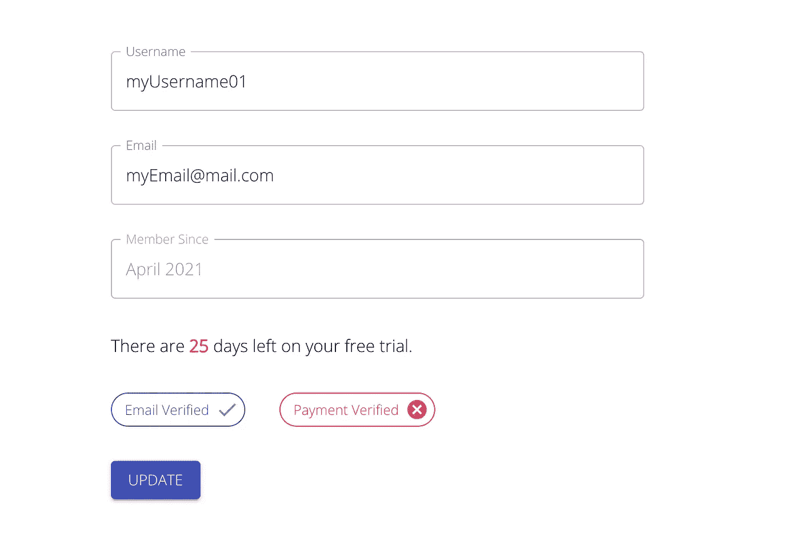

# 如何将反腐败层添加到您的 Web 应用程序中

> 原文：<https://javascript.plainenglish.io/how-to-add-anti-corruption-layers-to-your-web-application-892a29d86840?source=collection_archive---------18----------------------->

Photo by [Yancy Min](https://unsplash.com/@yancymin?utm_source=medium&utm_medium=referral) on [Unsplash](https://unsplash.com?utm_source=medium&utm_medium=referral)

我已经在我的 React + Redux 应用程序中使用反腐败层有一段时间了。当您接收的异步数据很难处理或者在进入应用程序状态之前需要一些清理时，这是一个很有帮助的设计模式。

## 什么是反腐败层？

> 反腐败层是不共享相同语义的不同子系统之间的层。

对我来说，这些层是在数据进入我的全局状态之前或离开之后增强或转换数据的功能。

我将展示一些简单的例子，说明我如何使用反腐败层来使全球状态管理对我自己来说更容易一些。

## 增强数据

假设您希望收到一条用户记录，其结构如下:

你需要建立一个类似这样的页面:

我喜欢我的组件做尽可能少的工作，所以我将创建一个新的接口，它带有一些扩展我的原始用户的辅助变量。我将把扩展版本保存到我的应用程序状态。

我将添加三个新值来简化 UI 的呈现。

现在我需要添加两个函数，一个接受一个 IUser 并返回我的 IUserState。

另一个获取 IUserState 并返回 IUser。

我将在用户进入我的应用程序之前和它被发送到我的后端之前使用这两个函数。

现在我有了一个反腐败层来帮助我更容易地构建界面。

## 转换数据

一个物体被分割成许多组件是很常见的。

在前面定义的用户对象中，有一个名为 billingInfo 的可选字段。在大多数情况下，我会将用户的账单信息分离到不同的组件中。在这种情况下，我将在我所在的州为 billing 分配它自己的部分。

这次我将创建两个函数，一个将 billingInfo 与用户分离，另一个将它添加回来。

这些是我将要使用的模型:

我需要两个函数来进行转换:

最后，我们在与之前相同的位置添加函数:

有了这个，我的状态更类似于我正在构建的 UI 视图。

*更多内容尽在*[*plain English . io*](http://plainenglish.io/)