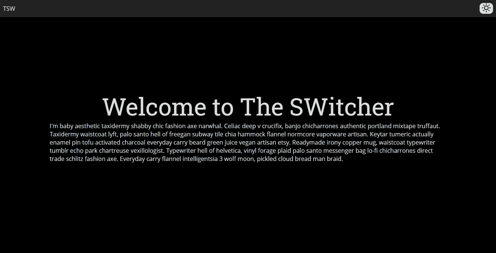
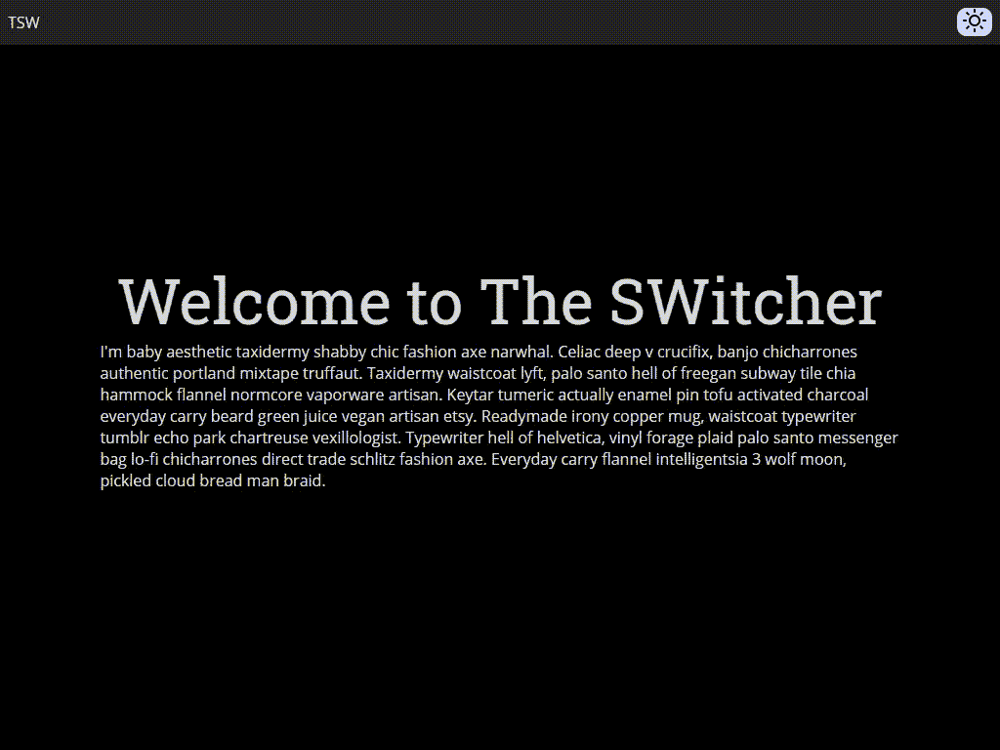

# 如何给盖茨比网站添加黑暗模式

> 原文：<https://javascript.plainenglish.io/how-to-add-dark-mode-in-a-gatsby-website-23df7289b220?source=collection_archive---------10----------------------->



网站(和应用)的最新趋势之一是**黑暗模式**，在黑暗模式下网站(和应用)看起来是黑暗的(！！！)，通常是深色背景，浅色文字，和一些强调色。许多公司现在要求在他们的界面中提供这一功能，因为黑暗模式可以减少电池消耗(特别是在有机发光二极管手机上)，可以在弱光下更好地阅读，据信可以帮助有视觉障碍的人更好地阅读，等等。

# 黑暗模式工作流(通常)如何工作

当您访问一个站点时，站点本身应该检查您是否有存储的首选项，并根据它显示正确的模式，如果您没有首选项，它应该检查您的操作系统是否支持黑暗模式，并且您已经启用了它，激活正确的模式(或默认模式)并将首选项保存在客户端上。它也应该给用户改变其偏好。

# 为什么黑暗模式对盖茨比来说很棘手

如果站点在 DOM 已经呈现(或正在呈现)时检查客户端，然后激活黑暗模式(如果需要)，屏幕将从默认模式闪烁到黑暗模式(是的，Youtube 从明亮模式闪烁到黑暗模式！).在身体开始渲染之前，我们需要用*阻塞脚本*实现检查。在 Gatsby 中(但通常在每个静态生成器中)，我们不能访问页面的这一部分，所以我们需要在编译时使用`gatsby-ssr.js`注入代码。我们还需要确保我们注入的脚本确实是高性能的，因为我们在读/写用户首选项时会阻塞渲染。

# 我们要实现什么

首先，我们正在编写一个脚本，它将在站点构建期间注入到我们的 header 中，它将负责从 *LocalStorage* 中读取用户首选项，或者如果需要的话，从 OS 颜色模式首选项中读取用户首选项，如果用户想要一个深色主题，它将在< html >级别添加类 *dark* ，然后该类可用于在 CSS 变量之间切换或用 CSS 框架实现深色主题(例如，Tailwind 使用[类策略](https://tailwindcss.com/docs/dark-mode#toggling-dark-mode-manually)支持深色主题)。在此之后，我们将实现一个组件，我们可以在我们的网站上使用，允许用户切换模式并保存首选项。



# 先决条件

要理解这篇文章，你至少需要掌握 React JS、Gatsby(及其文件结构和 SSR API)的基本知识，以及一点 CSS/SCSS。您还可以[克隆这个项目](https://github.com/popeating/dark-mode)的存储库。

# 盖茨比项目

设置新的 Gatsby 项目:

```
npm init gatsby
```

选择并安装您需要的插件和库，然后进入项目文件夹并运行:

```
gatsby develop
```

新创建的站点应该在`[http://localhost:8000](http://localhost:8000)`可用

正如我之前提到的，我们需要在所有生成的页面中注入一个*渲染阻塞*脚本，为此我们将创建`gatsby-ssr.js`文件，并使用函数 *onRenderBody* 将一个脚本放在带有 *setHeadComponents* 参数的头中:

该脚本将负责读取关于黑暗模式的用户偏好:它将首先检查用户是否在 *localStorage* 中保存了偏好

```
preferredTheme = localStorage.getItem('color-theme');
```

然后，它使用 [*首选颜色方案* CSS 媒体查询](https://dev.to/juwanpetty/prefers-color-scheme-2op1)来查询操作系统。我们现在可以将一个窗口范围的变量`window.__theme`设置为找到的主题值(稍后将从我们的组件中访问)，如果需要的话，在我们的 HTML 元素中放置一个“黑暗”类。

代码还定义了一个窗口范围的函数`window.__setPreferredTheme`，它可以从我们的站点访问，当用户手动选择一个主题时，它将更新主题并保存它的首选项。

# CSS 变量

在这一点上，我们的 HTML 标签可以有也可以没有深色类，我们可以用它来切换颜色:使用 [CSS 变量](https://www.w3schools.com/css/css3_variables.asp)的根选择器。为了在我们的 CSS 文件中实现这一点，我们需要以变量的形式声明颜色，包括亮主题和暗主题:

例如，您将背景颜色定义为白色，但是如果:root 元素(HTML 标记)有一个类 dark，那么背景将是黑色的。

然后在所有的 CSS 中，不像通常那样声明颜色，而是引用 CSS 变量:

```
body { background: var(--color-background); }
```

CSS 变量不需要页面刷新(这在用户切换主题时很有用)，一旦你改变了变量的值，页面就会自动改变。

请记住，对于需要根据主题进行更改的每个属性，您需要以亮暗模式“复制”所有的 var 声明，基本上，您可能只需要背景和文本颜色，但您可以进一步使用边框、阴影、强调颜色等。

# 切换主题

目前，我们的网站是黑暗的(或光明的)基于操作系统的偏好，但我们希望允许用户在导航期间改变主题。

为此，我们将编写一个“Toggler”(可以是一个按钮、一个链接、一个图像，或者是你在你的站点中使用或适合的东西)，它可以显示在导航栏或一个首选项页面中。

我们的基本 toggler 只能在访问 window(在浏览器中使用)时工作，Gatsby 在服务器端渲染时无法引用 *window* ，所以我们首先需要检查是否可以访问 *window* 来设置将被传递到*主题*状态的 websiteTheme 变量。*主题*状态用于显示组件右侧的按钮。被点击的按钮将执行窗口函数*_ _ setpreferedtheme，*我们的主函数，它将更新标题中的主题并将主题首选项存储在 *localStorage 中。*更新主题将改变 HTML 中的类，触发 CSS 变量更新并立即切换到所选主题。

现在只需要在某个地方包含这个 toggler，如果你有一个包含变量的基本 CSS，你可以切换主题。

# 下一步是什么

这个例子可以在很多方面改进，比如可以进一步优化和缩小头脚本(否则就按原样注入)；切换偏好可以有三种状态(暗、亮、自动)。您可以将首选项保存在*上下文*中，而不是放在标题中(但是请注意，如果处理不当，您可能会经历闪烁)。你可以扩展你的 CSS 来拥有一个完整的暗/亮主题，或者在一个框架中实现，比如 Bootstrap，或者 Tailwind，或者 Material。

*更多内容看* [***说白了. io***](https://plainenglish.io/)