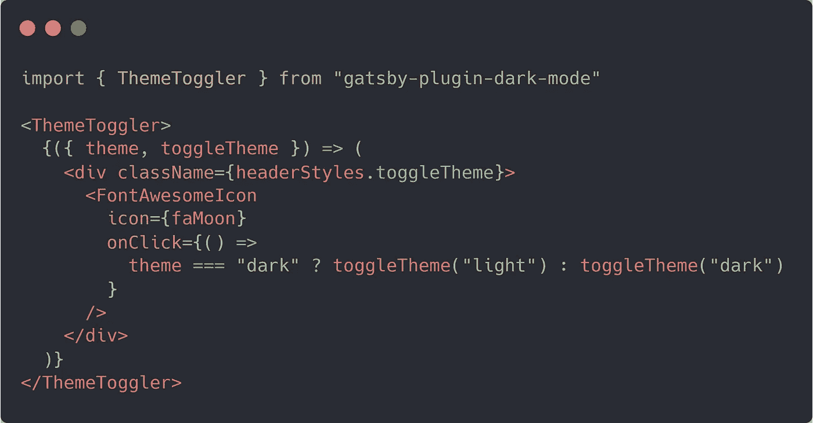

# 如何向盖茨比网站添加暗模式🌑

> 原文：<https://javascript.plainenglish.io/how-to-add-dark-mode-to-a-gatsby-site-2638fc841038?source=collection_archive---------8----------------------->


Photo by [Zan](https://unsplash.com/@zanilic?utm_source=medium&utm_medium=referral) on [Unsplash](https://unsplash.com?utm_source=medium&utm_medium=referral)

我刚刚给我的网站增加了一个黑暗模式，这非常简单！为了实现这一点，我使用了[盖茨比插件黑暗模式](https://www.gatsbyjs.com/plugins/gatsby-plugin-dark-mode/)。

是这样的…

## 第一步。安装插件

只需用`npm install gatsby-plugin-dark-mode`安装插件。

然后，您可以将其添加到您的 gatsby-config.js 文件中，如下所示:

```
plugins: [ 
  “gatsby-plugin-dark-mode”,
  …
]
```

这个插件为您提供了一个反应组件，用于在您的站点中实现主题切换。它为您处理了添加暗模式的许多困难部分。例如，它处理用于持久化主题的浏览器代码。因此，如果您将网站设置为暗模式，关闭浏览器，稍后再访问该网站，它会记住您选择的模式。它还会自动使用首选配色方案 CSS 媒体查询，所以如果您的系统配置为在可用时使用深色方案，网站将首先在深色模式下打开！

## 第二步。添加切换组件

我决定切换黑暗模式，在我网站的每个页面的右上角添加一个漂亮的小图标。因为我在每一页上都使用了 Header 组件，所以很容易在 Header 组件中添加这个切换:



正如你所看到的，我使用了一个漂亮的小字体图标。如果你想看看如何在你的反应项目中使用他们的图标，你可以在这里阅读更多关于它的[。](https://fontawesome.com/how-to-use/on-the-web/using-with/react)

主题生成器组件提供了对主题状态(“暗”或“亮”)的访问以及在这些状态之间切换的功能。当您在这些状态之间切换时，一类“暗”或“亮”会应用于您站点的主体。

## 第三步。应用相关样式

所以现在我们的网站主体上有一个“暗”或“亮”的类别，我们可以通过点击图标在不同状态之间切换。但是我们仍然需要一种方法来根据这个类应用不同的风格。

为此，我使用了主体范围内的 CSS 变量:

```
body {
  --bg: #fff;
  --primaryText: #000;
  --secondaryText: #777;
  ...
  background-color: var(--bg);
}body.dark {
  -webkit-font-smoothing: antialiased;
  --bg: #222831;
  --primaryText: #e8e8e8;
  --secondaryText: #9d9d9d;
  ...
}
```

因此，现在身体内的每个元素都可以访问 CSS 变量，例如“primaryText ”,这个变量的值将根据身体是否应用了一个“dark”类而改变。现在我可以在我的网站上的任何元素上使用这些变量，当主题切换时，它们会改变样式！

使用这个简单的概念，您可以做很多事情。我认为根据网站当前的主题改变光标的高亮颜色会很有趣😊

```
body *::selection {
  background: var(--link);
  color: #fff;
}
```

这就是全部！

我希望你喜欢这个教程。如果你想看更多这样的教程，请考虑成为[www.patreon.com/wilstaley](https://www.patreon.com/wilstaley)的赞助人

谢谢！