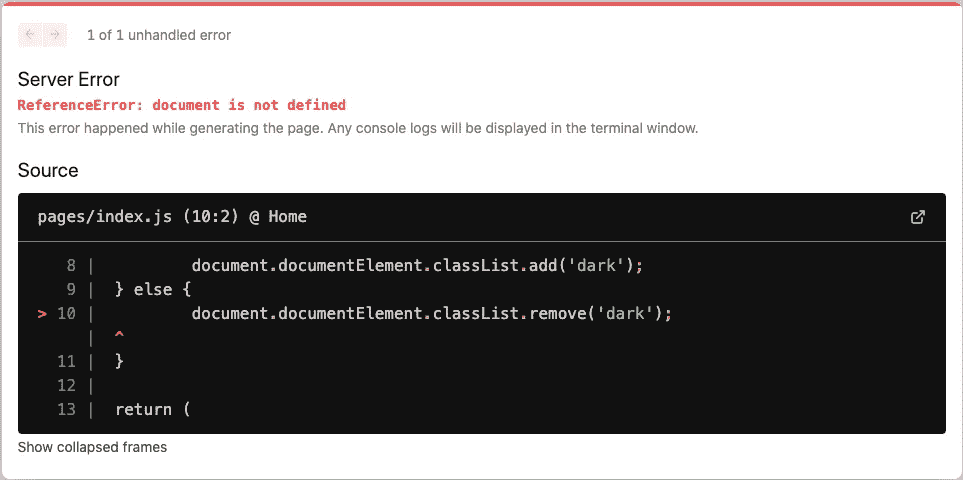
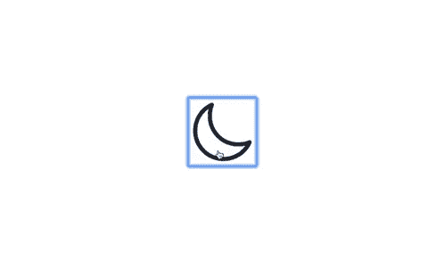

# 如何使用 Tailwind CSS 将黑暗模式添加到 Next.js 项目中

> 原文：<https://javascript.plainenglish.io/how-to-add-dark-mode-to-your-next-js-project-using-tailwind-css-3d460a768d1c?source=collection_archive---------10----------------------->

## 修复“文档未定义”错误的简单技巧。


Photo by [Harpal Singh](https://unsplash.com/@aquatium?utm_source=medium&utm_medium=referral) on [Unsplash](https://unsplash.com?utm_source=medium&utm_medium=referral)

早在 2020 年 11 月，Tailwind V2.0.0 就发布了黑暗模式支持。在这个版本中，使用顺风添加黑暗模式变得简单了。

在本文中，我们将了解如何使用 Tailwind 为 Next.js 项目添加黑暗模式。我们还将学习一个简单的错误修复方法，该错误可能在使用 Next.js 实现黑暗模式时出现。

本文将假设您已经创建了一个 Next.js 项目，并在其中设置了 Tailwind。如果您不熟悉 Tailwind 或者还没有建立项目，请查看下面的文章，了解如何创建包含 Tailwind 的新 Next.js 项目。

[](/introduction-to-using-tailwind-css-with-next-js-d609be5b6e91) [## 将 Tailwind CSS 用于 Next.js 的介绍

### 为什么应该在 Next.js 应用程序中使用 Tailwind CSS

javascript.plainenglish.io](/introduction-to-using-tailwind-css-with-next-js-d609be5b6e91) 

# 启用黑暗模式

第一步是启用`tailwind.config.js`文件中的`darkMode`选项。您可以将此选项设置为*‘类别’*或*‘媒体’*。

```
module.exports = {
  darkMode: 'class',
  // ...
}
```

*“媒体”*选项使用`prefers-color-scheme` CSS 功能来检测亮或暗模式。这将检查用户的操作系统或用户代理设置，以确定用户请求的是亮模式还是暗模式。你可以在这里阅读更多关于它的[。](https://developer.mozilla.org/en-US/docs/Web/CSS/@media/prefers-color-scheme)

如果您想手动切换黑暗模式，请将选项设置为*‘class’*。对于我们的例子，我们将手动切换黑暗模式，因此将选项设置为*‘class’。*

默认情况下，顺风中的黑暗模式变体对以下实用程序启用:

*   背景颜色
*   边框颜色
*   渐变颜色停止
*   占位符颜色
*   文本颜色

如果您想为其他实用程序添加黑暗模式变量，将*‘黑暗’*添加到`tailwind.config.js`文件的变量列表中。例如，您可以使用以下代码为文本不透明度添加黑暗模式支持:

```
module.exports = {
  // ...
  variants: {
    extend: {
      textOpacity: ['dark']
    }
  }
}
```

# 添加黑暗模式按钮

在我们的示例中，我们将显示一个带有太阳或月亮图标的按钮来表示亮模式和暗模式之间的切换。当我们点击按钮时，我们的应用程序将在亮暗模式之间切换。

我们将使用 [react-icons](https://react-icons.github.io/react-icons/) 包导入一个太阳图标和一个月亮图标。如果你不熟悉反应图标，看看下面的文章。

[](/tutorial-and-beginners-guide-to-using-react-icons-77c614696301) [## 使用 React 图标的初学者指南

### 在一个地方获得您需要的所有图标

javascript.plainenglish.io](/tutorial-and-beginners-guide-to-using-react-icons-77c614696301) 

安装软件包后，将以下图标作为导入添加到项目中:

```
import { IoSunnyOutline, IoMoonOutline } from 'react-icons/io5';
```

接下来，使用 React 的`useState`钩子创建一个`darkMode`状态变量。

```
const [darkMode, setDarkMode] = useState(false);
```

最后，将图标包装在一个`<button>`元素中，并添加一个`onClick`道具来切换`darkMode`变量状态。根据`darkMode`变量的值，我们将渲染太阳图标或月亮图标。

```
<div className="flex h-screen justify-center items-center">
  <button onClick={() => setDarkMode(!darkMode)}>
    {darkMode ? (
      <IoSunnyOutline size="4rem" />
    ) : (
      <IoMoonOutline size="4rem" />
    )}
  </button>
</div>
```

# 使用黑暗变体

为了使用黑暗模式变体，我们将把*‘dark:’*前缀添加到我们想要更改的任何实用程序中。

对于我们的例子，我们将改变应用程序的背景颜色和文本颜色。将下面的类添加到包装器`<div>`中，以添加黑暗模式的变化。

```
<div className="flex h-screen justify-center items-center **bg-white** **text-gray-800** **dark:bg-gray-800** **dark:text-white**">
```

# 手动切换黑暗模式

要在 Tailwind 中启用黑暗模式，您需要将*‘dark’*类添加到 HTML 树的`<html>`元素中。我们可以通过下面的代码实现这一点:

```
if (darkMode) {
 document.documentElement.classList.add('dark');
} else {
 document.documentElement.classList.remove('dark');
}
```

现在，如果`darkMode`变量设置为 true，*‘dark’*将作为一个类添加到`<html>`元素中。当`darkMode`设置为假时，*【暗】*将作为一个类别被删除。这将在顺风模式下切换黑暗模式设置。

# 修复文档未定义的错误

到目前为止一切看起来都很好，但是如果你刷新页面，你可能会遇到这个错误。



发生此错误是因为 Next.js 正在服务器中呈现；因此，该文档看起来是未定义的。为了解决这个问题，我们可以将之前编写的 if-else 子句放在一个`useEffect`钩子中。

```
useEffect(() => {
  if (darkMode) {
    document.documentElement.classList.add('dark');
  } else {
    document.documentElement.classList.remove('dark');
  }
}, [darkMode]);
```

现在，如果我们刷新页面，一切都将按预期运行。



# 结论

感谢阅读！我希望这篇文章对你使用 Tailwind CSS 在 Next.js 应用程序中设置黑暗模式有所帮助。

据说黑暗模式有助于减轻眼睛疲劳，甚至可以节省智能手机的电池寿命。如果你和我一样，你会在任何可能的地方开启黑暗模式。

如果你想了解如何用 Material-UI 实现黑暗模式，可以看看下面的文章。

[](https://blog.devgenius.io/how-to-apply-dark-mode-using-material-ui-18de9d095d9a) [## 如何使用 Material-UI 应用黑暗模式

### 只需一个开关，即可将 React 应用程序从亮模式切换到暗模式

blog.devgenius.io](https://blog.devgenius.io/how-to-apply-dark-mode-using-material-ui-18de9d095d9a) 

*更多内容请看*[*plain English . io*](http://plainenglish.io/)