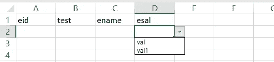

# 如何使用 Angular 在 Excel 中创建下拉列表

> 原文：<https://javascript.plainenglish.io/how-to-add-data-validations-in-excel-using-angular-46ee31e9a314?source=collection_archive---------6----------------------->

## 如何在 Angular 中将下拉列表(带选项)从 JSON 导出到 Excel


Photo by [Mika Baumeister](https://unsplash.com/@mbaumi?utm_source=medium&utm_medium=referral) on [Unsplash](https://unsplash.com?utm_source=medium&utm_medium=referral)

最近，当我们导出 JSON 数据时，我在寻找一些在 Excel 中添加下拉列表(数据验证)的解决方案。

我搜索了很多，然后在[扎克·雷姆](https://stackoverflow.com/users/8820824/zack-ream)和[欧文·凯尔文](https://stackoverflow.com/users/13680115/owen-kelvin)的帮助下，找到了如何在 Excel 中添加数据验证或下拉列表的解决方案。

有一个名为`exceljs`的库支持下拉导出。

[](https://www.npmjs.com/package/exceljs) [## exceljs

### 读取、操作和写入电子表格数据和样式到 XLSX 和 JSON。从 Excel 电子表格反向工程…

www.npmjs.com](https://www.npmjs.com/package/exceljs) 

他们支持，


让我们来看看这个例子，以便更好地理解。

如果我们有下面要导出的 JSON。

```
data1 = [{
    name: 'data1', //sheet1 with name data1
    values: [{
            header: 'eid',
            value: ''
        },
        {
            header: 'test',
            value: [{
                name: 'test1'
            }, {
                name: 'test2'
            }]
        },
        {
            header: 'ename',
            value: ''
        },
        {
            header: 'esal',
            value: [{
                name: 'val'
            }, {
                name: 'val1'
            }]
        }
    ]
}];data12 = [{
    name: 'data2', //sheet2 with name data2
    values: [{
            header: 'eid1',
            value: ''
        },
        {
            header: 'test1',
            value: [{
                name: 'test11'
            }, {
                name: 'test21'
            }]
        },
        {
            header: 'ename1',
            value: ''
        },
        {
            header: 'esal1',
            value: [{
                name: 'val1'
            }, {
                name: 'val11'
            }]
        }
    ]
}];
```

这里我们有两个工作表 data1 和 data2。

我们有头和值。

有些标题有一个值数组，定义它是否有一个下拉列表。

**在将 JSON 传递给 Exceljs 服务之前，让我们创建一个函数来转换它**

```
transform(data) {
    const noOfRowaToGenerate = 10;
    return data.map(({
        name,
        values
    }) => {
        const headers = values.reduce(
            (prev, next) => ({
                ...prev,
                [next.header]: Array.isArray(next.value) ?
                    next.value.map(({
                        name
                    }) => name) :
                    next.value
            }), {}
        );
        return {
            workSheet: name,
            rows: Array(noOfRowaToGenerate).fill(headers)
        };
    });
}
```

现在让我们创建一个保存 Excel 的服务。

我们可以使用文件保护程序 npm 库来保存文件。

[](https://www.npmjs.com/package/file-saver) [## 文件保护程序

### 如果你需要保存超过 blob 大小限制的非常大的文件，或者没有足够的内存，那么就用…

www.npmjs.com](https://www.npmjs.com/package/file-saver) 

单击导出后，我们可以看到下拉列表出现在 Excel 中。



让我们检查一下 Stackblitz 中的运行代码。

就这样，我们开始运行了！

*更多内容请看*[***plain English . io***](http://plainenglish.io)