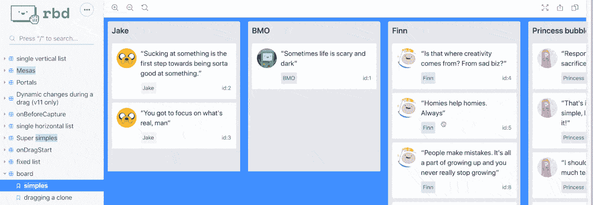

# 如何添加拖放在反应与反应美丽的 DnD

> 原文：<https://javascript.plainenglish.io/how-to-add-drag-and-drop-in-react-with-react-beautiful-dnd-2bed93b2b7f8?source=collection_archive---------1----------------------->



嘿，你好！这是一个使用拖放的简单例子，我们使用的是[***react-beautiful-dnd***](https://www.npmjs.com/package/react-beautiful-dnd)。

首先，我们用***react-beautiful-dnd***构建，所以我们需要在代码中安装它。您需要从它导入{ **DragDropContext，Droppable，Draggable** }，其中每个组件扮演不同的角色，正如您可以从它们的名称中理解的那样。

1.  **DragDropContext** 是一个包装器，帮助你在重新排列列表后替换并生成新的列表。
2.  **drop able**为您提供了将项目拖放到列表中的功能，在该列表中，项目的属性在 ref 的帮助下被继承，我们将它们传递给子项目。
3.  **可拖动**允许你用光标选择项目并将其拖动到列表中。

## 履行

> ***第一步:***
> *我们需要一个* ***的对象数组*** *在这里我们可以执行****【DnD】****。*

```
const Arr = [
  {
    name: "North",
    key: "12353",
  },
  {
    name: "South",
    key: "23463",
  },
  {
    name: "East",
    key: "54643",
  },
  {
    name: "West",
    key: "4435",
  },
]
```

> ***第二步:*** *我们需要初始化****arr****为状态以便我们可以使用执行 DnD 操作。*

```
const [project, setProject] = useState(Arr)
```

> ***第三步:***
> *我们将需要函数来执行 DnD，并在执行* *操作后生成* ***新的结果。***

```
// we'll pass this function into DragDropContext
// inside the component
const onDragEnd = (result) => {
    if (!result.destination) return;
    if (result.destination.index === result.source.index) return;
const projects = reorder(
      project, // project is state 
      result.source.index,
      result.destination.index
    );
    //store reordered state.
    setProject(projects)
  }
// outside the component 
const reorder = (list, startIndex, endIndex) => {
  const result = Array.from(list);
  const [removed] = result.splice(startIndex, 1);
  result.splice(endIndex, 0, removed);
return result;
};
```

> ***第四步:*** *我们将把组件扭曲成****JSX****并把状态映射到它上面，就像这样*

```
<DragDropContext onDragEnd={onDragEnd}>
  <Droppable droppableId="list">
    {(provided) => (
      <div
        ref={provided.innerRef}
        {...provided.droppableProps}
      >
        {project && project.map((item, index) =>
          // draggableId should be string, index is also require, key props should be unique to prevent from unnecassary re-rendering  
          <Draggable draggableId={item.key} key={item.key} index={index}>
            {(provided) => (
              <div
                ref={provided.innerRef}
                {...provided.draggableProps}
                {...provided.dragHandleProps}
              >
                <p style={{ color: "green" }}>{item.name}</p>
              </div>
            )}
          </Draggable>)}
        {provided.placeholder}
      </div>
    )}
  </Droppable>
</DragDropContext>
```

下面是完整的代码:

```
import React, { useState } from 'react'
import { DragDropContext, Droppable, Draggable } from "react-beautiful-dnd";
const reorder = (list, startIndex, endIndex) => {
  const result = Array.from(list);
  const [removed] = result.splice(startIndex, 1);
  result.splice(endIndex, 0, removed);
return result;
};
const Arr = [
  {
    name: "North",
    key: "12353",
  },
  {
    name: "South",
    key: "23463",
  },
  {
    name: "East",
    key: "54643",
  },
  {
    name: "West",
    key: "4435",
  },
]
const Projects = () => {
  const [project, setProject] = useState(Arr)
const onDragEnd = (result) => {
    if (!result.destination) return;
    if (result.destination.index === result.source.index) return;
const projects = reorder(
      project,
      result.source.index,
      result.destination.index
    );
    //store reordered state.
    setProject(projects)
  }
return (
    <DragDropContext onDragEnd={onDragEnd}>
      <Droppable droppableId="list">
        {(provided) => (
          <div
            ref={provided.innerRef}
            {...provided.droppableProps}
            style={{ border: "1px solid #242424", opacity: 0.5, borderRadius: "5px" }}
          >
            {project && project.map((item, index) =>
              <Draggable draggableId={item.key} key={item.key} index={index}>
                {(provided) => (
                  <div
                    ref={provided.innerRef}
                    {...provided.draggableProps}
                    {...provided.dragHandleProps}
                  >
                    <p style={{ color: "green" }}>{item.name}</p>
                  </div>
                )}
              </Draggable>)}
            {provided.placeholder}
          </div>
        )}
      </Droppable>
    </DragDropContext>
  )
}
export default Projects
```

现在把所有代码捆绑起来，看看之后的结果！

***快乐编码兄台*** ❤

*更多内容请看*[***plain English . io***](http://plainenglish.io/)*。报名参加我们的**[***免费每周简讯在这里***](http://newsletter.plainenglish.io/) *。**