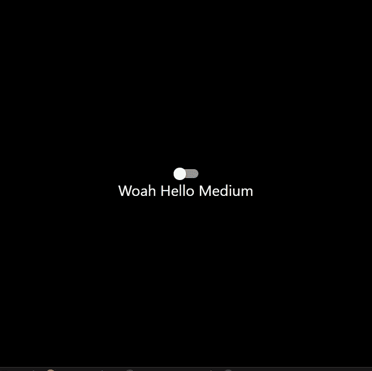

# 如何在 React 和 React Native 中添加动态样式

> 原文：<https://javascript.plainenglish.io/how-to-add-dynamic-styles-in-react-and-react-native-628280320ca4?source=collection_archive---------5----------------------->

## 让你的应用充满活力的初学者指南

Photo by [Pankaj Patel](https://unsplash.com/@pankajpatel?utm_source=medium&utm_medium=referral) on [Unsplash](https://unsplash.com?utm_source=medium&utm_medium=referral)

在 reacting 和 react-native 中有条件地应用样式的能力对于使您的应用程序更具动态性大有帮助。

这方面的一个例子是根据用户输入改变文本的不透明度。

我将在今天的帖子中展示这个确切的例子。

注意:我将使用 react-native，但同样的概念也适用于 react。

# **添加样板文件**

在开始之前，我们必须添加一些样板代码。

这方面的代码如下:

Boilerplate Code

您现在应该会看到这样一个屏幕:

What your apps screen should look like

我们的下一步将是根据开关组件的状态改变文本的可见性。

# **添加条件样式**

添加条件样式超级简单！

我们所要做的就是使用三元运算符来检查我们的 *isEnabled* 状态值是真还是假。

这方面的代码如下:

Full Code

如果你看第 12 行，你会注意到我们传递了一个数组作为样式属性。

数组的第一项, **styles.text** ,将是不管开关状态如何都要应用的样式。

数组的第二项是条件样式的条件部分。

通过使用[三元运算符](/how-to-create-if-statement-one-liners-using-javascript-e94a7bd96dcd)，我们可以根据 I 启用的值改变不透明度。

> 如果 *isEnabled* 为假，我们将文本不透明度设置为 0。如果 *isEnabled* 为真，我们将文本不透明度设置为 1。

这是可能的，因为在 react 和 react native 中，我们被允许传递一个对象**或一个对象数组**。

这允许我们设置保持不变的样式，而不管 isEnabled 的值，同时仍然有条件地添加和移除样式。这允许我们设置文本的字体和颜色，而不管设置了什么条件样式。

您的应用程序应该如下所示:

What your app should show

# 结论

感谢您阅读完我的文章**“如何在 React 和 React Native 中添加动态样式”**。如果你有任何问题，请随意提问，我会尽快回答。

我希望你有美好的一天。如果你刚接触媒体，你可以点击这里的[链接加入。](https://bookeraziz.medium.com/membership)

 [## 如何使用 JavaScript 创建 If 语句一行程序

### 为什么应该使用 JavaScript 三元运算符。

javascript.plainenglish.io](/how-to-create-if-statement-one-liners-using-javascript-e94a7bd96dcd)  [## 如何在 React Native 中获取设备的尺寸

### 如何让你的应用适应多种设备尺寸？

javascript.plainenglish.io](/how-to-get-a-devices-dimensions-in-react-native-bcc2a5c26663) 

*更多内容看* [***说白了. io***](http://plainenglish.io/) ***。*** *报名参加我们的* [***免费每周简讯点击这里***](http://newsletter.plainenglish.io/) ***。***