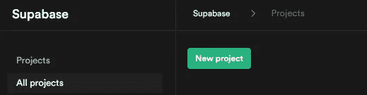
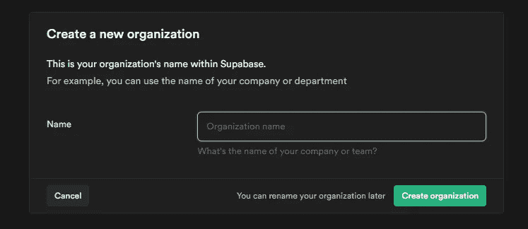
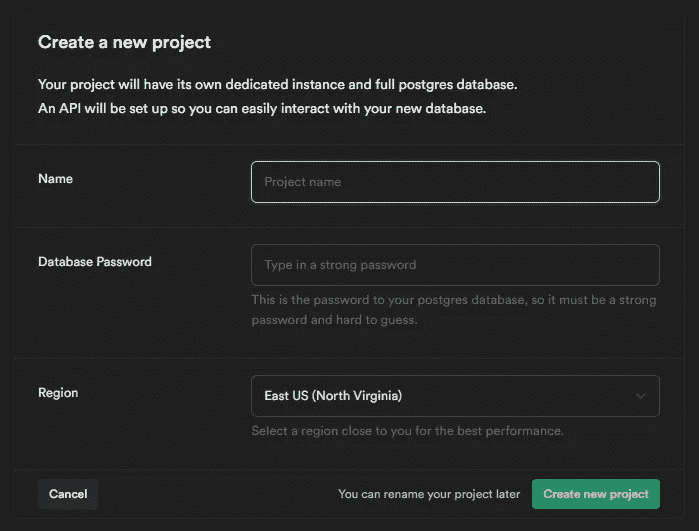
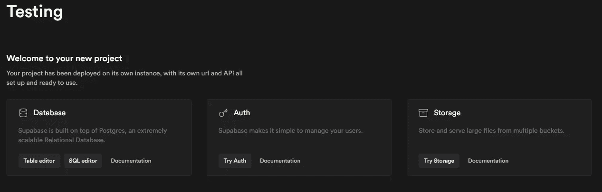
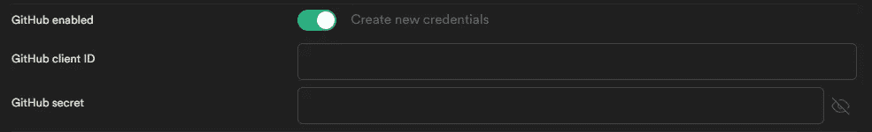
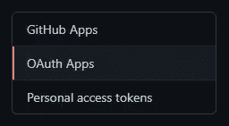
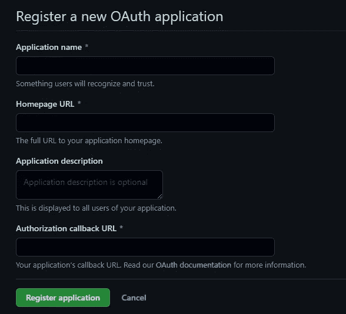

# 如何用 Supabase 添加 Github OAuth

> 原文：<https://javascript.plainenglish.io/how-to-add-github-oauth-to-your-application-dda5bdc2dc33?source=collection_archive---------8----------------------->


Photo by [FLY:D](https://unsplash.com/@flyd2069?utm_source=medium&utm_medium=referral) on [Unsplash](https://unsplash.com?utm_source=medium&utm_medium=referral)

经过几次反复试验，我终于能够使用 GitHub OAuth 为我的 web 应用程序添加另一个登录选项，在本教程中，我们将学习如何制作它。老实说，我真的不知道如何在普通的 JavaScript 或其他服务中实现它，因为我在 react 中使用了 [Supabase](https://supabase.io/) 来实现它。现在让我们开始吧！

# 1.创建项目

好的，首先进入 [supabase.io](https://supabase.io/) ，点击右上角的*‘开始你的项目’*，然后立即登录。完成后，单击新建项目，新建组织。



用您喜欢的任何名称填写组织名称。



之后你会看到另一个类似的提示页面。给出数据库的项目名称和密码，并选择离您最近的地区以获得更好的性能。



创建新项目后，它会加载一段时间，然后这个页面就会出来。



# 2.启用 GitHub 认证

在左侧面板中，选择验证和设置。在外部 OAuth 提供者部分，像这样在上将 GitHub enabled 转到*，它会询问您客户端 ID 和 GitHub secret。*



现在继续你的 GitHub 帐户，设置，并选择开发者设置。


然后选择 OAuth 应用程序



点击右侧的新建 OAuth App，会有一个表单提示。



填写所有必要的输入，对于授权回调 url，在 Supabase dashboard 中，转到 setting，API，在 Config 节中复制 URL，并将其粘贴到 GitHub 表单中，并在 URL 后添加`/auth/v1/callback`。所以会像`https://<project-ref>.supabase.co/auth/v1/callback`。

一旦成功，您将看到客户端 ID 并将其粘贴到 Supabase 中。要获取 GitHub 机密，请单击生成新的客户端机密。


一旦你得到了秘密令牌，马上粘贴到 Supabase 再次，并点击保存。

# 3.将 Supabase 代码添加到您的应用程序中

现在让我们通过将 Supabase 安装到 React 应用程序中来初始化它。在你的终端输入`npm i @supabase/supabase-js`。一旦完成，创建`config.js`文件并在其中输入。

```
import { createClient } from '[@supabase/supabase-js](http://twitter.com/supabase/supabase-js)'// Create a single supabase client for interacting with your database 
const supabase = createClient("PROJECT_URL", "PROJECT_ANON_KEY")export default supabase;
```

`PROJECT_URL`是来自 Supabase dashboard 中 config 部分的设置、API、url 的同一个 URL，而`PROJECT_ANON_KEY`还是同一个，来自设置、API、项目 API 键并选择 anon 键。

在 onclick 事件中，键入以下代码以使 GitHub 身份验证生效。

```
import supabase from "./config";const LoginWithGithub = async () => { const { user, session, error } = await supabase.auth.signIn({
      provider: 'github'
   })
}
```

我们做到了！你的应用程序现在有了一个新的 GitHub 登录选项。我希望这篇文章对你有所帮助。感谢您的阅读！

如果你喜欢这类文章，请支持我:

[](https://www.buymeacoffee.com/tulussibrahim)

*更多内容看*[***plain English . io***](http://plainenglish.io)