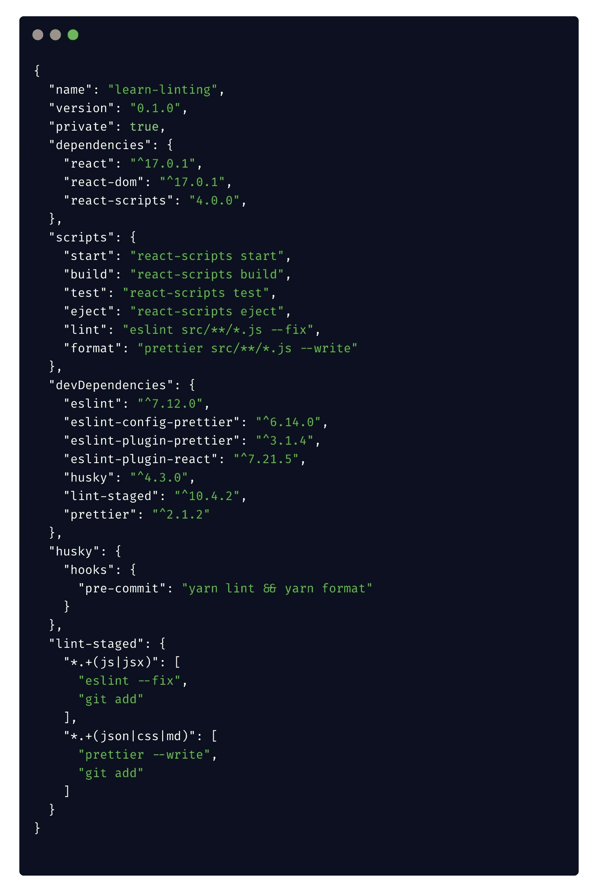

# 如何为你的 React 应用添加林挺和格式

> 原文：<https://javascript.plainenglish.io/how-to-add-linting-and-formatting-for-your-react-app-78227b328910?source=collection_archive---------6----------------------->

## 做好这一点，否则，你的代码会有问题


Photo by [Clément H](https://unsplash.com/@clemhlrdt?utm_source=unsplash&utm_medium=referral&utm_content=creditCopyText) on [Unsplash](https://unsplash.com/s/photos/code-programming?utm_source=unsplash&utm_medium=referral&utm_content=creditCopyText)

编程是一件艺术作品。但是当谈到编码时，并不是每个人都能欣赏你的作品。因为编码风格因人而异很多。所以你的作品对另一个人来说可能是垃圾:P

当我们在团队项目中工作时，这就成了一个大问题。其中每个成员都试图覆盖其他人的代码。因此，在这些场景中，建立编码标准是必须的。

有一些图书馆可以使我们的生活变得非常容易。他们是…

*   Linters 是你代码的静态检查器。它可以在编写代码时发现常见错误。
*   **格式化器**可以用某种方式格式化你的代码，这样其他人就可以理解了

今天我们将学习如何使用这两个库。

## [ESLint](https://eslint.org/docs/user-guide/getting-started)

ESLint 是一个工具，用于识别和报告 ECMAScript/JavaScript 代码中发现的模式，目标是使代码更加一致，并避免错误(来自文档)

## [更漂亮](https://prettier.io/docs/en/index.html)

它是一个固执己见的代码格式化程序。我们可以定制它来满足我们的需求。

## 第一步。安装

首先，我们需要安装 ESLint 和更漂亮。我们将把它们保存为开发依赖项，因为我们在生产中不需要它们。

如果你的应用是用 create-react-app 搭建的，你不需要单独安装`eslint`。已经有了。

```
npm install --save-dev eslint prettier
```

ESLint 和 beauty 可以有一些重叠的规则。因此，我们需要确保它们能够协同工作。我们还需要 2 包

```
npm install --save-dev eslint-config-prettier eslint-plugin-prettier
```

我们将安装另外两个依赖项来使用 react。它们包含`React`特定的风格指南。

```
npm install --save-dev eslint-plugin-react eslint-plugin-react-hooks
```

## 第二步。配置 ESLint

现在在项目的根文件夹中添加一个名为`.eslintrc.js`的文件。它将作为 ESLint 的配置文件。文件的内容可能会根据您的需要而有所不同。这是我使用的一个示例配置。

还可以添加一个`.eslintignore`文件。这就像`.gitignore`,因为我们不想格式化我们的构建文件或 node_modules。`.eslintignore`的内容与`.gitignore`几乎相同

## 第三步。配置更漂亮

```
npm install --save-dev prettier
```

在项目的根目录中添加一个. prettierrc 文件。它将包含漂亮工作所需的规则。内容可以根据你的需要而变化。你可以在这里得到更多的选项。

类似地，我们可以添加一个. prettierignore 文件来忽略我们不想格式化的文件。

## 第四步。添加到脚本

现在，我们将向 package.json 文件添加另外两个脚本

现在我们可以运行下面的命令来 Lint 并修复错误

```
npm run lint
```

或者要格式化项目，请运行以下命令

```
npm run format
```

现在，您的项目已准备好获得一致的外观。但是等等！您可以做一些额外的工作来自动化这个过程。以下是如何…

## 步骤 5(可选)。每次提交前运行 linter

作为开发人员，你很懒。您不希望每次想要提交时都运行这些命令。我们可以使用一个名为 husky 的附加库来自动化这个过程

```
npm install --save-dev husky -D
```

会帮助我们使用预提交 git-hook。所以每当我们犯了什么错误，它就会自动为我们运行。

为此，我们需要在 package.json 文件中添加以下配置

## 第六步。仅对暂存文件运行 linter

对于小项目来说，每次提交时在整个项目中运行 linter 是可以的。但是随着你的项目越来越大，你不想在每次提交前等待几分钟。为此，我们将添加另一个包来帮助我们。

```
npm install --save-dev lint-staged -D
```

在 package.json 文件中添加以下配置

现在，只有项目的暂存文件会受到 git 的预提交挂钩的影响。

最终的 package.json 应该是这样的



package.json

好了，现在你准备好摇滚了。您的项目现在是干净的，并且格式正确。此外，你是在强迫每个人在按下某个东西之前运行 linter。

在本文中，我们只关注 react to，但是这个过程对于任何类型的 nodejs/javascript 项目都是一样的。

今天到此为止。编码快乐！:D

**通过** [**LinkedIn**](https://www.linkedin.com/in/56faisal/) **或我的** [**个人网站**](https://www.mohammadfaisal.dev/) **与我取得联系。**