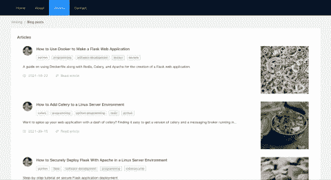

# 如何在 15 分钟内给你的网站添加中型文章

> 原文：<https://javascript.plainenglish.io/how-to-add-medium-posts-to-your-site-in-15-minutes-7880e75d16e0?source=collection_archive---------10----------------------->

Final blog page

最近，我用 React 制作了自己的[网站](https://www.alexanderdarby.com)。在这个过程中，我读了不少关于如何将文章从媒体添加到你的网站的博客部分的文章。虽然有很多非常好的东西，但我没有找到多少容易理解并能产生带有单元测试的模块化代码的东西。

所以这就是我在这里要尝试和做的事情——把这篇文章想象成满足您所有媒体提要嵌入需求的一站式商店。如果你像我一样懒，只是想得到一些代码，请直接跳到包含本文所有代码的 [GitHub repo](https://www.github.com/osintalex/mysite) 。

我认为将中型帖子放入 React 站点的最简单方法应该包括四个代码模块。这可能看起来很多，但请记住，它们非常小，只是有助于轻松分离程序逻辑。它们是:

1.  从媒体 API 检索数据后呈现博客的主要 React 组件。
2.  一个将这些数据解析成您需要的部分的函数。
3.  如果您是桌面用户，可以使用 React 组件来创建博客文章。
4.  一个 React 组件，用于在移动设备上创建博客文章。

当然，如果您不想针对移动和桌面进行优化，您可以只使用一个组件，而不是最后两个。但是如果你真的想优化，那么我认为两个组件是一个有用的方法，因为你可能想在每个博客条目中包含很多不同的东西，比如链接、标签、图片、描述和链接。

为了简单起见，让我们反向工作，从 3 号和 4 号组件开始。

## 桌面视图

下面是该组件的代码:

它使用 Ant Design 来制作包含博客文章的 HTML，作为道具，它接受一个包含我想要显示的相关项目的解析数据数组——文章标题、链接、日期、标签和描述。

## 移动视图

现在这基本上是完全相同的组件，但用于移动设备。我使用了 Ant Design mobile 库中的一些组件，以使最终输出在移动设备上更具响应性:

现在已经解决了这个问题，让我们继续往回走，完成解析媒体数据的函数。

## 中等馈送分析器

我们在 Medium API 上调用的端点返回一个 JSON 对象，该对象包含一个带有名为`items`的键的项目。这个键的值是包含我们想要的东西的所有博客文章的数组——链接、描述、标题等等。

在对 medium API 的 fetch 调用中，我已经只返回了响应中 items 键的值(如果这是一个令人困惑的句子，请向下滚动查看主博客组件函数的代码)。所以现在我只需要从数组中获取相关数据。

下面是我解析所有这些的函数:

现在，我们来看看主要的反应元件。

## 主要反应组分

我们的主要博客组件需要完成以下工作:

1.  从媒体 API 获取数据
2.  显示一个正在加载的图标
3.  完成后，呈现页面的桌面或移动版本

为了实现第 2 点，我们需要使用一个`useEffect`钩子和`useState`来管理何时显示加载图标。您可以在下面的代码中看到这一点:

你可能也注意到了，我在这里使用了一个名为 react device detect 的库。这非常有用！它可以让你看到用户是否在移动，然后你可以相应地调整他们得到的视图。

## 测试

现在一切都准备好了，是时候为我们的模块编写单元测试了！我把它保持得相当简单，因为它只是针对我的个人网站，而不是针对客户的任何更复杂的东西，但是如果你需要的话，你绝对可以把这种方法修改得更彻底。

在这里，我只是检查所有的组件在检索所有的博客文章后，是否呈现了应该在`h3`标题中的文章文本。我使用异步测试函数和 React 测试库中的`waitFor`,因为我需要等待主要的 React 组件调用 API 并加载所有的博客文章。

我还对我的解析器函数编写了另一个非常简单的测试，以检查它是否可以解析数据，同时还编写了其他单元测试，检查移动和桌面博客文章在传递虚拟道具数据时是否加载了正确的内容。

最后，在这个过程的这一点上，我确实考虑过将主 React 组件中的`fetchData`函数移到它自己的模块中并进行测试，但是我认为测试 fetch 是多余的，因为它是一个 JavaScript 内置函数。

*更多内容请看*[***plain English . io***](http://plainenglish.io/)