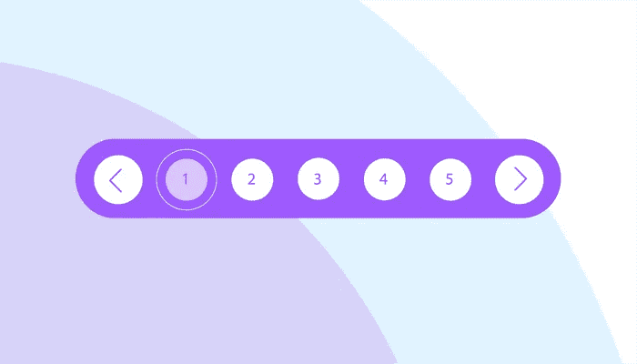

# 如何向 React 项目添加分页

> 原文：<https://javascript.plainenglish.io/how-to-add-pagination-to-your-react-project-1a3ded6971c9?source=collection_archive---------1----------------------->

## React 分页教程



分页是网站中必不可少的东西。您可以使用几个简单的步骤和第三方库来添加分页。在这个项目中，我们使用 React 分页功能组件，并且使用 React 分页钩子来计算逻辑。让我们讨论如何做那件事。

> 如果你愿意支持我成为一名作家，可以考虑加入[成为一名媒体成员](https://freelancingcult.medium.com/membership)。每月只需 5 美元，你就可以无限制地使用 Medium。

我也正在写一篇关于从头开始创建自定义分页栏的文章。保持联系，我很快会补充的。

在本教程中，我将把分页栏添加到我之前做的一个现有项目中。通过阅读下面的文章，您可以获得启动项目和代码。

启动代码在下面项目的 **Dynamic.js** 文件中。

[](https://replit.com/@Lahirutech/reactCards#src/App.js) [## 反应卡

### Lahirutech 的 Node.js repl

replit.com](https://replit.com/@Lahirutech/reactCards#src/App.js) 

下面是启动代码的解释。

[](/render-react-cards-and-images-dynamically-2387434e809d) [## 动态渲染反应卡和图像

### 使用 JavaScript map()

javascript.plainenglish.io](/render-react-cards-and-images-dynamically-2387434e809d) 

今天，我们将为上述项目添加分页。

对于分页，我使用一个名为 react-paginate 的 npm 包。

[](https://www.npmjs.com/package/react-paginate) [## 反应-分页

### 呈现分页的 ReactJS 组件。通过安装这个组件，只需编写一点点 CSS 就可以…

www.npmjs.com](https://www.npmjs.com/package/react-paginate) 

## 反应分页示例

通过浏览下面的实时项目，您可以在 **PaginationDynamic.js** 页面中获得完整的项目代码。

[](https://replit.com/join/zyudmjklsg-lahirutech) [## 邀请在 Replit 上合作

### 使用 Replit 多人游戏一起编码

replit.com](https://replit.com/join/zyudmjklsg-lahirutech) 

首先，安装 react-paginate 包:

```
npm i react-paginate
```

为了进行分页，我们需要初始化一些参数。让我们使用 useState 钩子来初始化它们。这些参数是:

*   **偏移量**——API 响应数组的起点。
*   **perPage** -单页显示的项目数。
*   **pagecount** -分页表格的总页数。

```
const [offset, setOffset] = useState(0);const [perPage] = useState(10);const [pageCount, setPageCount] = useState(0)
```

然后我们要修改我们的`fetchData` 函数。

然后在`fetchData` 函数中，我将设置一些值。我将使用`Math.Ceil`方法计算总页数。

为了得到总页数，我得到了 API 响应中的总项数，用它除以页面大小(页面上的项数)，并使用`Math.ceil`方法将它们四舍五入到下一个数字。完成舍入后，剩下的项目将有单独的一页。

我已经使用`setPlayerData`通过对响应数据集进行切片来设置当前的玩家值。因此，我们要做的是，根据用户在分页栏上点击的页码，我们将通过更改`offset`值，用相关值填充播放器数据数组。

我们将在一个 useEffect 钩子中包含上述所有逻辑。参见下面的代码:

每当有人点击分页栏中的页码，我们将改变偏移量，因此调用`useEffect`钩子。下面是`handlePageClick` 功能。我们在当前页面值上加 1，因为它是一个零索引值。然后我们把它乘以页数，得到起始限制。

让我们将分页添加到应用程序中。导入 React 分页，如下所示:

```
import ReactPaginate from 'react-paginate';
```

在显示列表下面添加代码片段`</Row>`标签。这将创建分页列表视图。这里我们已经传递了 react-paginate 包所请求的所有必要的属性。

之后，您可以将下面的 CSS 添加到 **app.css** :

完整代码:

直播项目:
[https://reactcards.lahirutech.repl.co/](https://reactcards.lahirutech.repl.co/)

> 我希望你喜欢读这篇文章。如果你愿意支持我成为一名作家，可以考虑注册[成为](https://freelancingcult.medium.com/membership)中的一员。每月只需 5 美元，你就可以无限制地使用 Medium。

[](https://levelup.gitconnected.com/react-context-api-step-by-step-f1ee25d90c55) [## 逐步反应上下文 API

### 用一个示例应用程序在 5 分钟内学会

levelup.gitconnected.com](https://levelup.gitconnected.com/react-context-api-step-by-step-f1ee25d90c55) [](https://betterprogramming.pub/how-next-js-can-solve-the-limitations-of-your-react-app-c3f69a796242) [## Next.js 如何解决 React 应用程序的局限性

### React 适合每个 web app 吗？

better 编程. pub](https://betterprogramming.pub/how-next-js-can-solve-the-limitations-of-your-react-app-c3f69a796242) [](https://medium.com/geekculture/learn-to-use-axios-with-react-ee92829d8ed6) [## 学习使用 Axios 和 React

### React axios 是最常用的 JS 库之一。Axios 是一个 npm 包，您可以开始安装。

medium.com](https://medium.com/geekculture/learn-to-use-axios-with-react-ee92829d8ed6) 

*更多内容请看*[***plain English . io***](http://plainenglish.io/)