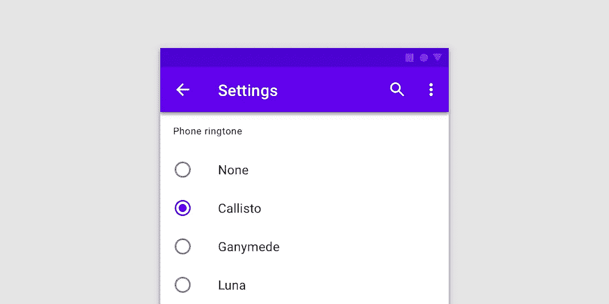

# 在 React Native with Formik 中添加单选按钮输入

> 原文：<https://javascript.plainenglish.io/how-to-add-radio-buttons-inputs-in-react-native-using-formik-266aa36adfd3?source=collection_archive---------7----------------------->

## 如何使用 Formik 在 React Native 中添加单选按钮输入



image from [material.io](https://material.io/develop/web/components/selection-controls/radio-buttons)

**单选按钮**在有两个或多个**互斥选项列表时使用。用户只能从众多选项中做出一个选择。本文是关于如何在 REACT-NATIVE 表单中实现单选按钮输入的完整指南。我们将使用一个名为 FORMIK 的库。**

**步骤 1:** 使用 expo 创建一个新的 react 本地项目。称之为 RadioButtonApp

```
expo init RadioButtonApp
```

**第二步:**然后给 app 安装 formik 库。点击阅读 Formik 文档

```
npm install formik --save
```

**步骤 3:** 安装 Axios

```
npm install formik --save
```

**步骤 4:** 安装 react-native-paper

```
npm install react-native-paper
```

**步骤 5:** 将 react 导入到您的 app.js 文件中

```
import React from 'react';
```

**第六步:**将 axios 导入到你的 app.js 文件中。

```
import axios from 'axios';
```

**第七步:**将 *react-native* 中的**视图**、**文本**和**预警**组件导入到您的 app.js 中

```
import { View, Text, Alert} from 'react-native';
```

**步骤 8:** 将 *react-native-paper* 中的**按钮**、**标题**、**文本输入**和**单选按钮**组件导入到您的 app.js 文件中

```
import { Button, Title, TextInput, RadioButton } from 'react-native-paper';
```

**第 9 步:**将 Formik 中的 useFormik 钩子导入到您的 app.js 文件中

```
import { useFormik } from 'formik';
```

这是所需进口的完整清单。

```
import React from 'react';
import axios from 'axios';
import { View, Text, Alert} from 'react-native';
import { Button, Title, TextInput, RadioButton } from 'react-native-paper';
import { useFormik } from 'formik'
```

**第十步:**创建一个名为 App 的常量变量来保存一个胖箭头函数。

```
const App = () => {

};

export default App;
```

**第十一步:**App 内。创建一个常量变量来保存 useFormik 钩子的返回值。

```
const formik = useFormik();
```

**第十二步:**将性别属性添加到 initialValues 属性中。

```
const formik = useFormik({
  initialValues: { gender: '' },
});
```

**步骤 13:** 对于 onSubmit 属性，使用 axios 发出 HTTP 请求，将数据发送到 API 端点。

```
const formik = useFormik({
  initialValues: { gender: '' },
  onSubmit: values => {
    axios({
      method: 'post',
      url: 'api end point url',
      data: {
        'gender': values.gender
      },

      })
      .then(response => {
        console.log(response);
      })
      .catch(err => {
        Alert.alert('An error occurred!', err.message, [{ text: 'Okay' }]);
      })
  }
});
```

在 return 语句中，添加单选按钮组

```
return (<View>
               <RadioButton.Group
                     onValueChange={formik.handleChange('gender')}
                     value={formik.values.gender}
                     >
                   <View>
                       <Text>Male</Text>
                       <RadioButton value='M'></RadioButton>
                   </View>
                   <View>
                       <Text>Female</Text>
                       <RadioButton value='F'></RadioButton>
                   </View>
               </RadioButton.Group></View>
)
```

**第 14 步:**接下来，在单选按钮组下面添加提交按钮。

```
return (<View>
<RadioButton.Group
                     onValueChange={formik.handleChange('gender')}
                     value={formik.values.gender}
                     >
                     <View>
                       <Text>Male</Text>
                       <RadioButton value='M'></RadioButton>
                     </View>
                     <View>
                       <Text>Female</Text>
                       <RadioButton value='F'></RadioButton>
                     </View>
                   </RadioButton.Group><Button mode="contained" title='submit' onPress={formik.handleSubmit} >Enter</Button></View>
)
```

最终的 *app.js* 文件应该是这样的。

```
import React, { useState, useEffect } from 'react';
import axios from 'axios';
import { StyleSheet, View, Text, Image, Alert} from 'react-native';
import { Card, Button, Title, Paragraph, TextInput, RadioButton, Divider } from 'react-native-paper';
import { useFormik } from 'formik';const App = () => {
    const formik = useFormik({
  initialValues: { gender: '' },
  onSubmit: values => {
    axios({
      method: 'post',
      url: 'api end point url',
      data: {
        'gender': values.gender
      },

      })
      .then(response => {
        console.log(response);
      })
      .catch(err => {
        Alert.alert('An error occurred!', err.message, [{ text: 'Okay' }]);
      })
  }
});return (<View>
<RadioButton.Group
                     onValueChange={formik.handleChange('gender')}
                     value={formik.values.gender}
                     >
                     <View>
                       <Text>Male</Text>
                       <RadioButton value='M'></RadioButton>
                     </View>
                     <View>
                       <Text>Female</Text>
                       <RadioButton value='F'></RadioButton>
                     </View>
                   </RadioButton.Group><Button mode="contained" title='submit' onPress={formik.handleSubmit} >Enter</Button></View>
)};

export default App;
```

最后测试应用程序。

现在我们有了。我希望你已经发现这是有用的。我会带着更多有趣的文章回来。感谢您的阅读。

*更多内容请看*[***plain English . io***](http://plainenglish.io)