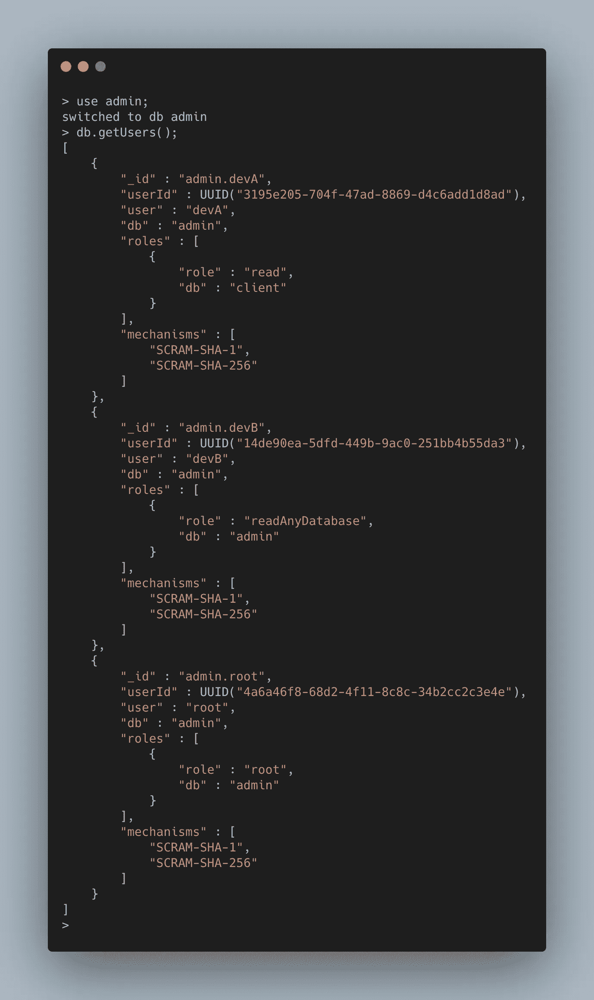

# 如何在 MongoDB 中向现有用户添加角色

> 原文：<https://javascript.plainenglish.io/how-to-add-roles-to-existing-user-in-mongodb-305551ccec86?source=collection_archive---------2----------------------->


# 方案

假设您是一名 DevOps 工程师，您负责授予对数据库的访问权限，这也可以称为数据库管理员。

然而，这是新的一年，你的公司管理层决定提升一些潜在的团队成员成为团队领导。🎉🎉🎉

众所周知:

> *责任越大，权力越大。—马克·曼森*

管理人员通知您更新他们的数据库权限，因为他们以前向**提供了对数据库的只读**访问权限。如果你对如何为 MongoDB 创建一个只读角色感兴趣，请在这里阅读帖子。管理层要求您授予他们对所有数据库的写访问权限，因为他们现在是团队领导。

姑且称之为“ **devA** ”和“ **devB** ”。在下一节中，我们将展示如何向两个用户授予 read & write 访问权限的分步指南。

# 逐步指南

在我们进入如何向现有用户授予额外角色的详细步骤之前。下面是这些步骤的简短版本。

1.  列出**管理**数据库中的所有用户(如果所有用户都是在管理数据库中创建的)。
2.  选择具有匹配值“ **devA** ”和“ **devB** ”的“用户”字段。
3.  使用`grantRolesToUser()`函数赋予 devA 和 devB 用户内置的角色- readWriteAnyDatabase。

# 第一步。列出管理数据库中的所有用户



# 第二步。查找“用户”字段值

查看名为 **user** 的字段名称，并找到值，因为我们将在下一步中需要它。参考下面的例子。

# 第三步。使用 grantRolesToUser 函数授予读写角色

使用下面的简单命令，您将能够允许两个用户对除了**本地** & **配置**之外的所有数据库进行读写访问。

```
use admin;
db.grantRolesToUser('devA', ['readWriteAnyDatabase']);
db.grantRolesToUser('devB', ['readWriteAnyDatabase']);
```

但是，如果您只想对特定数据库进行读写访问。例如，您希望只授予对**客户端**数据库的读写访问权限。你可以通过下面的代码来完成。

```
use admin;
db.grantRolesToUser('devB', [{ role: 'readWrite', db: 'client' }]);
```

# 结论

简而言之，这篇文章讨论了:

*   如何在 MongoDB 中不创建新角色的情况下向现有用户添加更多角色
*   如何向现有用户添加对所有数据库的读写访问权限。
*   如何仅向现有用户添加对单个数据库的读写访问权限。

感谢您的阅读，下一篇文章再见。

# 参考

*   MongoDB`grantRolesToUser`手动
*   MongoDB 内置角色[手册](https://docs.mongodb.com/manual/reference/built-in-roles/)