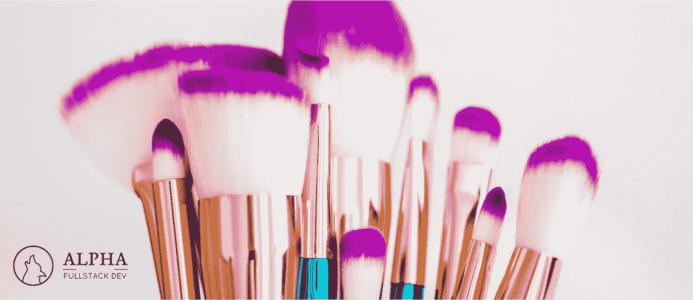

# 如何添加样式以使组件与样式化的组件反应

> 原文：<https://javascript.plainenglish.io/how-to-add-styles-to-react-components-with-styled-components-62a467c2a726?source=collection_archive---------12----------------------->

## JavaScript Alpha 指南

## 看看如何使用 styled-components 或@emotion/css 向 React 组件添加额外的样式。



作为 React 前端开发人员，您有时需要获取一个现有的 React 组件，并对其应用额外的样式。这可能是因为你想扩展一个第三方库组件，或者仅仅是因为你想在你的应用程序中制作一些组件的变体。

让我们看看如何使用`[styled-components](https://github.com/styled-components/styled-components)`或`[@emotion/styled](https://github.com/emotion-js/emotion)`来实现它。

# 结果呢

为了确保我们在同一页上，看看下面的 codesandbox。有两个按钮。蓝色按钮是基本按钮。它可以是来自第三方库的按钮，也可以是来自您的存储库的组件。红色按钮是它的替代版本。它通过应用额外的样式来扩展基本按钮。

# 将样式应用于 React 组件

这显示了`MyButton`组件如何向`Button`组件添加额外的样式。你得到`styled`函数，作为一个参数，你给它你想要扩展的组件。

```
const MyButton = styled(Button)`
  font-weight: bold;
  background: red;
  border-radius: 10px; &:hover {
    background: firebrick;
  } &:active {
    background: darkred;
  }
`;
```

为此，`Button`组件必须将`className`支架传递到内部的包装元件上。

下面的代码显示了基本组件的样子。

```
export const ButtonStyled = styled.button`
  padding: 20px 25px;
  ...
`;export function Button({ children, ...props }) {
  return (
    <ButtonStyled {...props}> // **(A)**
      {children}
    </ButtonStyled>
  );
}
```

> 一个好的做法是将任何未被析构的道具分散到包装元素上。

这里，在第`(A)`行，我将收到的`props`传递到包装元素上。

我们需要这样做，因为`styled(Button)`所做的是创建一个高阶函数，将`className`属性发送给`Button`组件。这个`className`属性的值是一个生成的 CSS 类名，它保存了我们的 CSS 样式的定义。

如果我们有一个这样定义的组件，它就不会工作。

```
export function Button({ children }) {
  return (
    <ButtonStyled>
      {children}
    </ButtonStyled>
  );
}
```

# 不使用样式组件扩展组件

您也可以扩展一个不基于`styled-components`的组件。

```
export function Button({ children, className, ...props }) {
  const cssClassName = ["my-old-button", className].join(" "); return (
    <button className={cssClassName} {...props}>
      {children}
    </button>
  );
}
```

对于这样的用例，我推荐使用像`[classnames](https://www.npmjs.com/package/classnames)`这样的 NPM 包。然后，我们可以将示例简化为:

```
import **cx** from 'classnames';export function Button({ children, className, ...props }) {
  return (
    <button className={**cx("my-old-button", className)**} {...props}>
      {children}
    </button>
  );
}
```

# 总是传播道具

为了能够扩展 React 组件的样式，我们只需要传递`className`属性。

但是我建议你**把组件收到的所有道具**都散开。

有无数的使用案例可以派上用场。从添加用于测试目的的`data-qa`属性这样的小事开始。或者给组件添加一个组件作者没有考虑到的**事件监听器**。

# 资源

[](https://styled-components.com/) [## 样式组件

### 组件时代的视觉原语。使用 ES6 和 CSS 的精华来设计你的应用，没有压力💅🏾

styled-components.com](https://styled-components.com/) [](https://emotion.sh/docs/introduction) [## 介绍

### 编辑描述

emotion.sh](https://emotion.sh/docs/introduction) [](https://www.npmjs.com/package/classnames) [## 类名

### 一个简单的实用程序，用于有条件地将类名连接在一起

www.npmjs.com](https://www.npmjs.com/package/classnames)