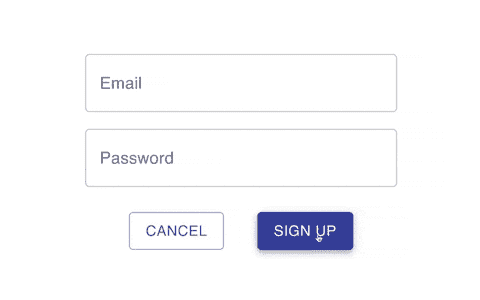

# 如何使用 React Hook 表单向输入添加验证

> 原文：<https://javascript.plainenglish.io/how-to-add-validation-to-your-inputs-using-react-hook-form-425ee6de4114?source=collection_archive---------4----------------------->

## 通过在客户端验证输入，创造更好的用户体验


Photo by [Usman Yousaf](https://unsplash.com/@usmanyousaf?utm_source=medium&utm_medium=referral) on [Unsplash](https://unsplash.com?utm_source=medium&utm_medium=referral)

处理表单时，验证发送的输入数据很重要。例如，如果我们需要用户的电子邮件地址，我们希望确保他们发送的数据是有效的电子邮件。

我们可以在服务器端和客户端验证这些数据。建议同时进行两种验证。在这个[堆栈溢出问题](https://stackoverflow.com/questions/162159/javascript-client-side-vs-server-side-validation)中，你可以阅读更多关于差异和为什么它们都很重要的内容。

在本文中，我们将了解如何使用 React Hook 表单库和 Material-UI 组件在客户端添加表单验证。

如果你是 React Hook Form 的新手，可以看看下面的文章。

[](https://blog.devgenius.io/the-easiest-way-to-deal-with-forms-in-react-ad6bc1250829) [## React 中处理表单的最简单方法

### 使用 React 钩子形式来提高应用程序的性能

blog.devgenius.io](https://blog.devgenius.io/the-easiest-way-to-deal-with-forms-in-react-ad6bc1250829) 

# 建立

对于这个例子，我们将在`create-react-app`中工作。我已经安装了 [Material-UI](https://www.npmjs.com/package/@material-ui/core) 核心包，还有 [React 钩子形式](https://www.npmjs.com/package/react-hook-form)。

我们将从一个没有验证的基本表单开始我们的项目。这个表单是使用 Material-UI TextField 和 Button 组件以及 React Hook 表单构建的。你可以在这里获得这个表单[的代码。](https://gist.github.com/chadmuro/5d03b52ebaea4e3c1b841ed9ec613837)

如果你想了解更多关于如何让 Material-UI 与 React Hook Form 一起工作，请查看下面的文章。

[](https://levelup.gitconnected.com/using-react-hook-form-with-material-ui-components-ba42ace9507a) [## 将 React 挂钩形式与材质 UI 组件一起使用

### 使用 Material-UI 时处理表单数据的更好方法

levelup.gitconnected.com](https://levelup.gitconnected.com/using-react-hook-form-with-material-ui-components-ba42ace9507a) 

如果我们开始我们的项目，我们的表单将看起来像这样。有两个输入的基本表单:一个输入电子邮件，一个输入密码。


[Link for GitHub Gist](https://gist.github.com/chadmuro/5d03b52ebaea4e3c1b841ed9ec613837)

# 默认验证

我们还没有在表单中添加任何验证。但是，您可能会注意到，如果我们尝试提交当前的表单，仍然会进行验证以检查电子邮件输入。这是因为我们在第一个输入中添加了`type=’email’`。这将添加一个默认的验证检查。在 Chrome 中，错误信息如下所示。


我们希望将整个表单中的错误消息标准化。因此，要删除这个默认的错误消息，需要在表单中添加`noValidate`属性。

```
<form className={classes.root} onSubmit={handleSubmit(onSubmit)} **noValidate**>
```

# 添加验证

我们现在可以添加我们自己的客户端验证检查和错误消息。

React 钩子形式使得各种验证检查变得容易。要查看我们可以添加的验证规则的完整列表，请查看它们的文档[这里](https://react-hook-form.com/api/useform/register)。

要使用 Material-UI 组件向输入添加验证规则，请将一个对象传递给`Controller`组件的`rules`属性。

让我们来看看我常用的 4 个验证规则。一旦您理解了如何使用这些规则，您也可以轻松地实现其他规则。

## 需要

顾名思义，必需的验证规则将指示输入必须有一个值才能提交表单。要添加所需的验证检查，请添加`required`键。您可以通过将字符串作为值传递来分配错误信息。

```
rules={{
  **required: 'Email required',**
}}
```


## 最小长度

另一个常见的验证是最小长度检查。要添加最小长度验证检查，添加`minLength`键。它接受一个对象，其中值键是表示长度的数字，消息键是表示错误消息的字符串。

```
rules={{
  **minLength: {
    value: 8,
    message: 'Password should be as least 8 characters',
  },**
}}
```


最大长度检查也很容易实现。只需将`minLength`改为`maxLength`。

## 模式

该验证将检查正则表达式模式。如果模式不匹配，表单将不会被提交，并且会出现一条错误消息。要添加该验证，请添加`pattern`键。它接受一个对象，该对象将值键作为正则表达式，将消息键作为表示错误消息的字符串。

我不太了解正则表达式，但是快速的谷歌搜索可以帮助你找到你需要的模式。下面是我用过的两种模式。

**检查输入是否是有效的电子邮件:**

```
rules={{
  **pattern: {
    value: /^(([^<>()\[\]\\.,;:\s@"]+(\.[^<>()\[\]\\.,;:\s@"]+)*)|(".+"))@((\[[0-9]{1,3}\.[0-9]{1,3}\.[0-9]{1,3}\.[0-9]{1,3}])|(([a-zA-Z\-0-9]+\.)+[a-zA-Z]{2,}))$/,
    message: 'Must use a valid email',
  },**
}}
```

**检查输入是否包含至少一个字母和一个数值:**

```
rules={{
  **pattern: {
    value: /^(?=.*[0-9])(?=.*[a-zA-Z])([a-zA-Z0-9]+)$/,
    message: 'Password should contain at least 1 alphabet and 1 numeric value',
  },**
}}
```


## 使生效

我们将看到的最后一个验证用于检查其他任何东西。例如，我们可以检查用户名是否已经被占用。或者对于这个例子，检查可能太不安全的无效密码，比如*‘password 123’*。要添加该验证检查，请添加`validate`键。这接受一个函数。

若要添加错误消息，请使用逻辑 or 运算符。因此，如果函数的结果为 false，将设置错误消息。

```
rules={{
  **validate: {
    equals: *password* =>
      *password* !== 'password123' || 'Choose a more secure password',
  },**
}}
```


如果我们返回表单并尝试提交，我们现在可以看到我们的验证检查正在运行。



# 结论

您可以在下面查看表单验证的完整源代码。

感谢阅读！我希望这篇文章对您使用 React Hook 表单向表单添加验证有所帮助。向表单添加客户端验证可以极大地帮助改善用户体验。我们可以在发送请求之前在客户端验证错误，而不是提交一个表单，然后从服务器得到一个错误。

如果你想了解更多关于如何使用 Material-UI 的知识，可以看看下面的文章。

[](/the-easiest-way-to-style-your-material-ui-components-the-makestyles-function-a66ab7b9fe01) [## 样式化你的材质 UI 组件的最简单的方法:makeStyles 函数

### 如何在 Material-UI 中使用 makeStyles 函数

javascript.plainenglish.io](/the-easiest-way-to-style-your-material-ui-components-the-makestyles-function-a66ab7b9fe01) 

*更多内容看*[***plain English . io***](http://plainenglish.io/)